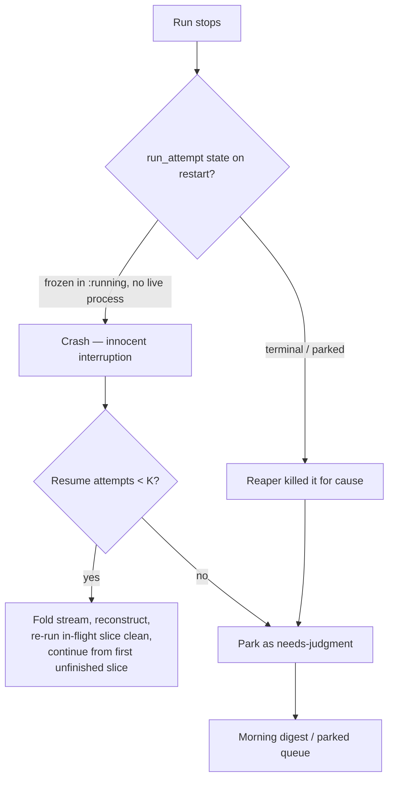

# Event-Sourced Run Ledger — Crash-Survivable Serial Runs

## Summary

Make a crashed serial run survivable. The run loop commits each slice's outcome
to the existing append-only ledger before advancing; on restart, a run that was
interrupted mid-flight reconstructs its state by folding that committed stream
and re-enters the loop at the first unfinished slice — re-running the in-flight
slice from a clean base. Innocent crashes auto-resume; runs the wall-clock
reaper deliberately killed park for judgment.

---

## Problem Frame

A run today is an in-memory `Enum.reduce` over the ordered slices in
`lib/conveyor/planning/serial_driver.ex`. It threads
`{events, blocked, agent_ran?}` through each step, builds a list of per-slice
outcome events as it goes, and returns that list when the run ends. Nothing in
the loop is durable: if the BEAM process dies — a deploy, an OOM kill, a host
reboot, the watchdog killing a hung agent's subprocess — the entire run vanishes
and restarts from slice 1. That is the exact failure STRATEGY.md names: the run
"can't survive its own length," because a single mid-run interruption discards
all prior progress.

The substrate to fix this already exists and is unused for run-scoped state. The
`ledger_events` table is append-only (enforced by a DB trigger), `Ledger.write!`
is a working API already used to persist `slice.transitioned` events from
`lib/conveyor/slice_lifecycle.ex`, and `run_attempts` carries a state machine
(`:running` plus terminal states) along with `base_commit` and
`head_tree_sha256`. What is missing is the wiring: the run loop never commits
its run-scoped event stream, so there is nothing durable to resume _from_. This
is a wiring-and-reconstruction problem, not the heavy schema-design effort the
idea was first framed as.

---

## Key Decisions

- **Wire the existing substrate, not a new ledger.** The append-only ledger, its
  `Ledger.write!` API, and the `run_attempt` state machine already exist and
  persist slice-level events today. This work commits the run-scoped stream the
  loop currently discards. The effort is wiring plus reconstruction logic, not
  schema design.

- **Minimal resume-only vocabulary.** Commit only what reconstruction needs. The
  replay-divergence base (M4), the eval dataset, and Oban activation are
  deferred until those consumers exist to validate the event shape. The
  `payload` attribute is a `:map`, so enriching the vocabulary later is not a
  migration.

- **Fold one stream, don't re-derive from projections.** Reconstruct from the
  single ordered run-scoped stream rather than re-deriving working state from
  scattered slice and `run_attempt` records. One source folds deterministically
  into `{passed, blocked, position}`, and it seeds the event log STRATEGY.md
  already names as the source of the headline autonomous-completion metric.

- **Slice is the atomic resume boundary.** The in-flight slice is re-run whole
  from a clean base rather than salvaged, matching the fresh-context-per-task
  isolation the architecture rests on. Gate-passed slices are durable and never
  re-run.

- **Crash resumes, reap parks.** A crash leaves a `run_attempt` frozen in
  `:running` with no live process. A reaped run instead completes the loop
  normally and carries a distinct reaped event
  (`gate_result: "reaped_wall_clock"`). Auto-resume fires only on runs frozen in
  `:running`, so reaped runs are excluded by their recorded outcome — not by a
  special case. A resume-attempt cap is the backstop for the rare race where the
  process dies before the reaped event is committed.

---

## Actors

- A1. Run loop (`SerialDriver`) — commits each slice outcome before advancing;
  on resume, folds the stream, reconstructs state, and re-enters the loop.
- A2. Startup reconciler (Conductor) — on boot, detects runs left frozen in
  `:running` with no live process and triggers resume; leaves terminal/parked
  runs untouched.
- A3. Wall-clock reaper — kills runaway slices/runs and records the kill by
  transitioning the run out of `:running` into a terminal/parked state.
- A4. Operator — reviews parked and cap-exhausted runs through the morning
  digest and decides their fate.

---

## Requirements

**Durable run-scoped stream**

- R1. During a run, the loop commits each slice's outcome (the per-slice event
  it already builds — slice id, sequence, status, gate verdict, findings) to the
  append-only ledger as a run-scoped event before advancing to the next slice.
- R2. The committed stream contains exactly what reconstruction needs; richer
  per-attempt or per-step detail is not emitted in this cut.
- R3. Commits use the existing synchronous `Ledger.write!` path within the
  in-process serial loop; the loop is not moved onto Oban.

**Resume and reconstruction**

- R4. On restart, the system detects runs left interrupted — a `run_attempt`
  still in `:running` with no live process — and resumes them automatically.
- R5. Resume reconstructs working state by folding the committed run-scoped
  stream into which slices passed, which are blocked, and the position in the
  order, then re-enters the loop at the first unfinished slice.
- R6. The in-flight slice is re-run whole from a clean base: the workspace is
  reset to that slice's base commit and no partial or sub-slice work is
  salvaged.
- R7. Gate-passed slices are the durable boundary and are never re-run.

**Crash-vs-reap routing and safety**

- R8. A run the reaper deliberately killed is not auto-resumed. The reaper
  already stamps a reaped slice with a distinct discriminator
  (`gate_result: "reaped_wall_clock"`, a `"reaped"` payload), and a reaped run
  completes the loop normally rather than freezing in `:running`. The reconciler
  keys off both: an interrupted run is one frozen in `:running`; a run whose
  last committed outcome is a reaped event is routed to the parked queue
  instead.
- R9. A resume-attempt counter bounds auto-resume; after K attempts on the same
  run (small, default 2–3), the run stops auto-resuming and is parked as a
  needs-judgment item in the morning digest.

**Correctness**

- R10. Resume applies each slice's external side effects exactly once:
  re-running the in-flight slice clean must not double-apply a slice whose merge
  landed before the crash recorded its pass. Reconciliation against the recorded
  durable boundary (`head_tree_sha256` on `run_attempt`) detects already-applied
  work.

---

## Key Flows

- F1. Commit-then-advance (happy path)
  - **Trigger:** A slice finishes and produces its outcome event.
  - **Actors:** A1
  - **Steps:** The loop writes the slice outcome to the ledger via
    `Ledger.write!`; only after the commit returns does it advance to the next
    slice.
  - **Covered by:** R1, R3

- F2. Crash to auto-resume
  - **Trigger:** The Conductor starts and finds a `run_attempt` frozen in
    `:running` with no live process.
  - **Actors:** A2, A1
  - **Steps:** Reconciler confirms resume attempts are under K; the loop folds
    the committed stream to rebuild `{passed, blocked, position}`, resets the
    workspace to the in-flight slice's base commit, and re-enters at the first
    unfinished slice.
  - **Covered by:** R4, R5, R6, R7, R9

- F3. Reaped to park
  - **Trigger:** Restart finds a run the reaper already transitioned to a
    terminal/parked state.
  - **Actors:** A2, A4
  - **Steps:** The run does not match resume-detection criteria; it surfaces in
    the parked queue / morning digest for the operator.
  - **Covered by:** R8

- F4. Resume-cap exhausted to park
  - **Trigger:** A run reaches its Kth auto-resume.
  - **Actors:** A2, A4
  - **Steps:** Auto-resume stops; the run is parked as a needs-judgment item so
    the operator decides whether it is a real defect or worth another push.
  - **Covered by:** R9

---

## Acceptance Examples

- AE1. Crash mid-slice resumes
  - **Covers R4, R5, R6.**
  - **Given** a 3–8 slice run with two slices gate-passed and the third
    in-flight, **when** the BEAM process is killed and restarted, **then** the
    run reconstructs the two passes, re-runs the third slice from its base
    commit, and continues to completion.

- AE2. Reaped run does not resume
  - **Covers R8.**
  - **Given** a run the wall-clock reaper killed (now in a terminal/parked
    state), **when** the Conductor restarts, **then** the run is not resumed and
    appears in the parked queue.

- AE3. Side effects apply exactly once
  - **Covers R10.**
  - **Given** a slice that merged to dev but crashed before its pass was
    recorded, **when** the run resumes, **then** reconciliation detects the
    already-applied tree and the slice is not merged a second time.

- AE4. Crash-loop is bounded
  - **Covers R9.**
  - **Given** a run that crashes again on each resume, **when** it reaches the
    Kth auto-resume, **then** it stops resuming and is parked as a
    needs-judgment item.

---

## Success Criteria

- An induced mid-slice kill during a 3–8 slice run (the M3 exit-evidence
  "survives an induced failure" bar) results, on restart, in the run completing
  to the same final state an uninterrupted run of the same plan would reach.
- No slice's external side effects (merge, commit) are applied more than once
  across any number of resumes.
- Reconstruction from the folded stream yields the same
  `{passed, blocked, position}` the loop held in memory at the moment of the
  crash.

---

## Scope Boundaries

Deferred for later (the keystone seeds these; they are not built here):

- The real replay-divergence producer and removing the hardcoded
  `"status" => "matched"` in `serial_driver.ex` (M4) — a downstream consumer of
  the committed stream.
- Eval-dataset queries and metrics computed over the stream (A4).
- Oban activation — making the durable commit the first real `Oban.insert` and
  the M7 parallel seam.
- Sub-slice or mid-slice event sourcing, and any salvage of partial in-flight
  work.
- Parked-queue triage UI and the decision-forcing morning digest (idea #7). This
  work only _feeds_ the parked queue new entries (reaped and cap-exhausted
  runs); it does not build the triage surface.

---

## Dependencies / Assumptions

- The append-only `ledger_events` table and `Ledger.write!` exist and are proven
  (already persisting `slice.transitioned`). Verified in source.
- `run_attempts` carries a state machine with `:running` and terminal states
  (`:failed`, `:needs_rework`) plus `base_commit` and `head_tree_sha256`.
  Verified in source.
- The work-graph slice order is deterministic across restarts, so a
  reconstructed position is stable.
- The wall-clock reaper marks reaped slices with a durable discriminator
  (`gate_result: "reaped_wall_clock"`, `findings: ["wall_clock_exceeded", ...]`,
  a `"reaped"` payload) and completes the loop normally rather than leaving the
  run frozen in `:running`. Verified in
  `lib/conveyor/planning/serial_driver.ex`. R8 keys off this discriminator; it
  does not require the reaper to transition `run_attempt` state.

---

## Outstanding Questions

**Deferred to planning**

- Whether the reconciler should _also_ transition `run_attempt` state when it
  parks a reaped or cap-exhausted run, or rely solely on the committed reaped
  event as the discriminator.

- The exact reconciliation mechanism for exactly-once side effects (compare
  `head_tree_sha256` against the live workspace tree vs. ledger event ordering).
- The precise set of run-scoped event types and their payload fields.
- The K value for the resume-attempt cap and where the counter lives (a
  `run_attempt` attribute vs. derived from a count of resume events).
- The commit transaction boundary relative to the merge side effect — whether
  the outcome is committed before or after the merge, and how the chosen order
  combines with R10's reconciliation.

---

## Sources / Research

Verified against source (fresh-context verifier, all confirmed):

- Run loop builds and discards the in-memory event list —
  `lib/conveyor/planning/serial_driver.ex` (reduce over `order` threading
  `{events, blocked, agent_ran?}`, returned in the result, never written to the
  ledger).
- Hardcoded replay-fidelity status `"status" => "matched"` with no comparison —
  `lib/conveyor/planning/serial_driver.ex` (`replay_report/2`).
- Append-only ledger trigger —
  `priv/repo/migrations/20260618004000_enforce_ledger_events_append_only.exs`.
- `Ledger.write!` API and existing `slice.transitioned` use —
  `lib/conveyor/ledger.ex`, `lib/conveyor/slice_lifecycle.ex`.
- `LedgerEvent` `payload` is a `:map` — `lib/conveyor/factory/ledger_event.ex`.
- `RunAttempt` state machine, `base_commit`, `head_tree_sha256` —
  `lib/conveyor/factory/run_attempt.ex`.
- Zero `Oban.insert` / `Oban.insert_all` under `lib/` (grep empty); Oban
  migrations present under `priv/repo/migrations/`.
