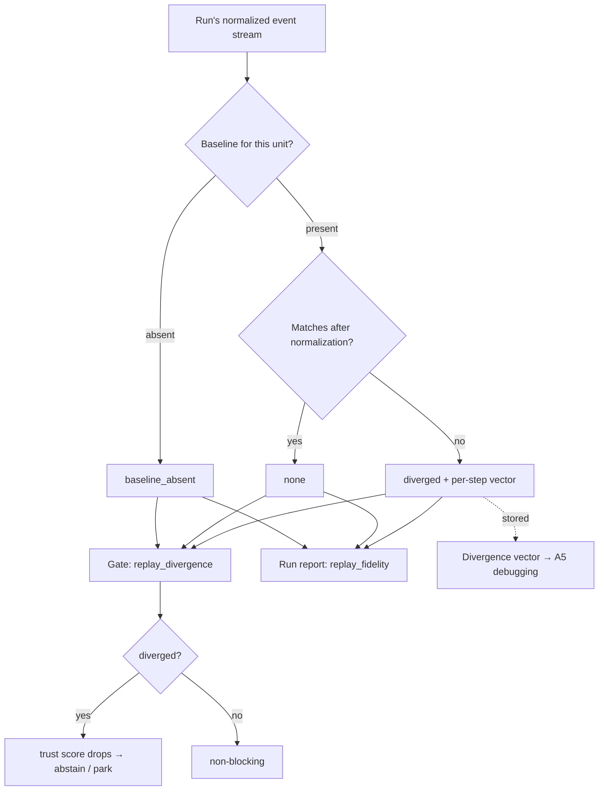

# Replay-Divergence Producer — An Earned Replay-Fidelity Signal

## Summary

Give the trust gate a real replay signal. A producer compares a run's normalized
event stream against a committed baseline and emits `:none` / `:diverged` /
`:baseline_absent` into the `replay_divergence` evidence the gate already reads
— letting the gate abstain when a run no longer reproduces. The same earned
verdict stamps the operator run report's `replay_fidelity`, replacing the
hardcoded `"status" => "matched"`.

---

## Problem Frame

Replay is supposed to be one dimension of M4's "gate honesty," but today it is
two disconnected half-truths, and neither is a real signal.

On the gate side, `lib/conveyor/gate/trust_evidence.ex:57` reads a
`replay_divergence` key out of each slice's output. Nothing in `lib/` ever
writes that key, so the un-laundered default at `trust_evidence.ex:130` fires
every run: `:baseline_absent`. The OD19 renormalization in `trust_score.ex:109`
then drops replay's weight to zero. The gate is honest here — it does not fake a
pass — but it is blind: replay has never once contributed to a trust decision.

On the operator side, the driver's `replay_report/2` stamps
`replay_fidelity.status = "matched"` unconditionally
(`lib/conveyor/planning/serial_driver.ex:241`), and that block flows straight to
the run report (`lib/mix/tasks/conveyor.run.ex:72`). This is the actual
hardcoded falsehood: every report certifies perfect replay fidelity whether or
not anything was ever compared.

The cost: a run that fails to reproduce cannot be caught — the gate has no
replay signal to abstain on — while the report reassures the operator that
fidelity held. STRATEGY.md's gate-escape-rate metric and its "trustworthy
completion" promise both quietly exclude replay.

Why now: PR #21's event-sourced ledger just created the missing ingredient — a
committed, normalized per-run event stream that can serve as the baseline to
diff against. The ledger brainstorm
(`docs/brainstorms/2026-06-23-event-sourced-run-ledger-requirements.md`)
explicitly deferred "the real replay-divergence producer and removing the
hardcoded `matched`" as a downstream consumer of that stream. The baseline now
exists; this is that consumer.

---

## Key Decisions

- **Factory determinism, not agent stability.** "Divergence" means: does
  re-deriving the run's verdict from its recorded state reproduce the same
  normalized event stream? It detects non-determinism in the factory —
  orchestration, gate logic, un-pinned inputs — which is exactly the case where
  `"matched"` is a factory-side lie. It does not re-run the agent live. This
  makes the gate honest now, costs zero LLM tokens, reuses proven machinery, and
  is the control arm a future agent-stability check needs to be interpretable.
  Live agent-stability replay is deferred (see Scope Boundaries).

- **One comparison feeds both surfaces.** The producer writes the verdict to the
  gate's `replay_divergence` evidence and derives the report's `replay_fidelity`
  from the same value. The operator report and the gate can never again disagree
  about whether replay held.

- **The trit drives the gate; a divergence vector rides along.** The gate
  consumes only `:none` / `:diverged` / `:baseline_absent`, and its abstain
  wiring is untouched. On `:diverged` the producer additionally records which
  steps differed and by how much — a per-step vector the stream diff already
  computes — stored for inspection, not fed to the gate. It is the substrate the
  later time-travel debugging idea (A5) consumes.

- **Honest `:baseline_absent`, never a laundered `:none`.** With no committed
  baseline (a plan's first run, cold start), the producer emits
  `:baseline_absent` — the existing non-blocking signal. A real `:none` is
  emitted only when a baseline existed and matched.

One comparison, three verdicts (`:none` / `:diverged` / `:baseline_absent`),
fanned out to the gate and the operator report; the divergence vector is stored
for later debugging.

---

## Actors

- A1. Producer (in `SerialDriver`) — computes the verdict by comparing the run's
  normalized stream against the baseline, and writes it to both surfaces.
- A2. Trust gate (`TrustEvidence` / `TrustScore`) — consumes `replay_divergence`
  unchanged; abstains on `:diverged`, non-blocking on `:none` /
  `:baseline_absent`.
- A3. Operator — reads the run report, which now reflects the earned verdict
  rather than a constant `"matched"`.

---

## Requirements

**Earned verdict**

- R1. The producer computes the replay verdict by comparing the run's normalized
  event stream against a committed baseline for the same logical unit, yielding
  `:none` (baseline existed and matched), `:diverged` (baseline existed and
  differed), or `:baseline_absent` (no baseline to compare).
- R2. The verdict is derived from a real comparison on every run; no code path
  emits a constant or unconditional replay status. The hardcoded
  `"status" => "matched"` is removed.
- R3. With no committed baseline, the producer emits `:baseline_absent`, never
  `:none`.

**Both surfaces, one truth**

- R4. The producer writes the verdict under the `replay_divergence` key the gate
  already consumes (`trust_evidence.ex:57`), upgrading the gate's perpetual
  `:baseline_absent` to a live signal.
- R5. The driver derives `replay_fidelity.status` (the operator report surface)
  from the same verdict — reporting matched only when the verdict is `:none`.
- R6. A `:diverged` verdict drives abstain through the existing trust-score path
  with no new gate wiring; the producer's sole job is to emit a truthful value
  into the slot the score already reads.

**Divergence detail**

- R7. On `:diverged`, the producer records a per-step divergence vector — which
  steps differed and a magnitude per step — derived from the same stream diff.
  The gate consumes only the trit; the vector is stored for inspection.
- R8. Normalization determines what counts as real divergence versus replay
  noise, so that only meaningful differences register as `:diverged`. The exact
  excluded field set is deferred to planning (see Outstanding Questions).

**Baseline**

- R9. The verdict compares against a baseline keyed to a stable logical-unit
  identity, so that two runs are compared only when they represent the same
  work. Absent such a baseline, R3 applies. The baseline mechanism is an open
  fork (see Outstanding Questions).

---

## Key Flows

- F1. Reproducing run
  - **Trigger:** A run completes and a baseline exists for its unit.
  - **Actors:** A1, A2
  - **Steps:** The producer normalizes the run's event stream, compares it to
    the baseline, finds a match, emits `:none` to `replay_divergence`, and
    stamps the report as matched — now earned.
  - **Covered by:** R1, R4, R5

- F2. Non-reproducing run
  - **Trigger:** A run completes, a baseline exists, and the normalized streams
    differ.
  - **Actors:** A1, A2
  - **Steps:** The producer emits `:diverged` plus a per-step divergence vector;
    the trust score drops below auto-accept and the slice abstains and parks;
    the report reflects the divergence rather than matched.
  - **Covered by:** R2, R6, R7

- F3. Cold start
  - **Trigger:** A run completes with no committed baseline for its unit.
  - **Actors:** A1, A2
  - **Steps:** The producer emits `:baseline_absent`; OD19 renormalizes replay's
    weight to zero so the slice is not penalized for the system lacking a
    baseline.
  - **Covered by:** R3, R4

---

## Acceptance Examples

- AE1. Reproducing run reads matched, honestly
  - **Covers R1, R5.**
  - **Given** a baseline exists and the run's normalized stream matches it,
    **when** the producer runs, **then** it emits `:none` and the report's
    `replay_fidelity.status` is matched — earned by comparison, not stamped.

- AE2. Non-reproducing run abstains
  - **Covers R2, R6, R7.**
  - **Given** a baseline exists and the run's normalized stream differs at one
    or more steps, **when** the producer runs, **then** it emits `:diverged`
    with a per-step divergence vector and the slice abstains and parks instead
    of passing.

- AE3. Cold start is not penalized
  - **Covers R3, R4.**
  - **Given** no committed baseline for the unit, **when** the producer runs,
    **then** it emits `:baseline_absent` and the trust decision is unchanged
    from today (replay non-blocking).

- AE4. The report cannot lie
  - **Covers R5.**
  - **Given** any run, **when** the report is generated, **then**
    `replay_fidelity.status` is matched if and only if the verdict is `:none`,
    and never unconditionally.

---

## Success Criteria

- No code path emits a replay status without a comparison: a search for a
  constant replay status returns nothing, and the hardcoded `"matched"` is gone.
- A run perturbed to be non-reproducible (injected orchestration
  non-determinism) produces `:diverged` and an abstain, where today it produces
  `"matched"` and a pass.
- For a genuinely reproducing run, the gate's replay component and the operator
  report agree (both reflect `:none`), and the trust decision is unchanged from
  today.
- The signal is falsifiable: there exists a real run condition under which it
  reads `:diverged`. A producer that can only ever read `:none` fails this
  criterion — it would be a computed restatement of the lie it replaced.

---

## Scope Boundaries

Deferred for later:

- Agent-stability replay (Approach B): re-running the agent live and
  thresholding a semantic "acceptable divergence" for a stochastic agent.
  Separate and token-costly, gated on a divergence metric worth thresholding;
  this producer is the control arm that makes it interpretable.
- Consuming the divergence vector for time-travel debugging (A5). The vector is
  produced and stored here; the debugging surface is not built.
- Corpus-wide replay fidelity. The eval flywheel already scores the sealed
  cassette corpus (`lib/mix/tasks/conveyor.eval.replay.ex`); this work is the
  per-run driver path, not the corpus metric.

---

## Dependencies / Assumptions

- The committed per-run event stream from the ledger (PR #21) exists and is the
  baseline source. Verified: the loop commits each slice outcome via
  `Ledger.write!` in `lib/conveyor/planning/serial_driver.ex`, and
  `replay_report/2` already computes a normalized `replay_digest` over that
  stream (`serial_driver.ex:229-257`).
- The gate already consumes `replay_divergence` as
  `:none / :diverged / :baseline_absent` and abstains on `:diverged` with no
  change needed. Verified: `lib/conveyor/gate/trust_evidence.ex:57,121-130`;
  `lib/conveyor/gate/trust_score.ex:80,109-118,129`.
- The deterministic-replay substrate (virtual clock / id / env reads,
  `lib/conveyor/cassettes/nondeterminism.ex`, ADR-12) and the eval
  replay-plus-digest pattern (`lib/conveyor/eval/cassette_bridge.ex:114-148`,
  `lib/conveyor/cassettes/replay_engine.ex`) exist and are reusable. Verified in
  source.
- Assumption (unverified): a live run's recorded state is enough to re-derive a
  comparable normalized stream without re-invoking the agent. If it is not — if
  re-derivation needs recorded agent I/O the live path does not capture — the
  baseline mechanism shifts toward cross-run digest comparison (see Outstanding
  Questions). This is the one feasibility risk in the feature.

---

## Outstanding Questions

The product decisions are settled; what remains is resolvable during planning by
codebase exploration or a planning-time design call. None block planning.

**Deferred to planning**

- Baseline mechanism, the load-bearing fork: (a) re-execute the run's recorded
  inputs through the deterministic `ReplayEngine` and diff the result — needs a
  replayable cassette in the live run path; or (b) compare the run's committed
  `replay_digest` against a stored baseline digest for the same unit across runs
  — needs no cassette and additionally catches across-run drift. Planning
  resolves it by first checking whether the live path records a replayable
  cassette (the unverified feasibility assumption above); that fact, with cost
  and coverage, picks the arm.
- The logical-unit identity a baseline is keyed to (per-slice, per-plan, or
  otherwise) — what makes two runs "the same" for comparison.
- The normalization set: which fields are virtualized or excluded so only
  meaningful differences register, building on the existing `replay_digest`
  normalization (`serial_driver.ex:248-257`) and the `Nondeterminism` policies.
- The divergence-vector shape and where it is stored (alongside the ledger event
  versus the run report).
- The per-step magnitude metric — exact equality versus a distance — and whether
  any sub-threshold difference is tolerated as `:none`.

---

## Sources / Research

Verified against source at HEAD `f9004c8`:

- Hardcoded `replay_fidelity.status = "matched"` with no comparison —
  `lib/conveyor/planning/serial_driver.ex:239-245` (`replay_report/2`); reaches
  the operator report at `lib/mix/tasks/conveyor.run.ex:72`.
- Gate consumes `replay_divergence`, which nothing writes (so it is perpetually
  `:baseline_absent`) — `lib/conveyor/gate/trust_evidence.ex:57,79,121-130`;
  consumed and abstained on in
  `lib/conveyor/gate/trust_score.ex:38,80,109-118,129`.
- Existing normalized `replay_digest` over the event stream —
  `lib/conveyor/planning/serial_driver.ex:229-257`.
- Deterministic replay-plus-digest pattern (eval flywheel, the reuse model) —
  `lib/conveyor/eval/cassette_bridge.ex:114-148` (`result_digest/1`,
  `replay_corpus/0`); `lib/conveyor/cassettes/replay_engine.ex:9`.
- Deterministic virtual clock / id / env substrate (ADR-12) —
  `lib/conveyor/cassettes/nondeterminism.ex`.
- Predecessor brainstorm deferring this exact work —
  `docs/brainstorms/2026-06-23-event-sourced-run-ledger-requirements.md` (Scope
  Boundaries).
