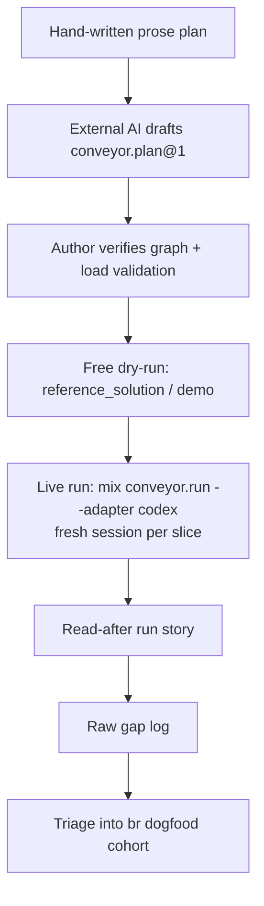

# Conveyor — First Dogfooding Loop

## Summary

A first dogfooding loop that lets the author drive Conveyor on real greenfield
plans and capture where it breaks. The author hand-writes a plan; an external AI
drafts a human-verified `conveyor.plan@1` task-graph; Conveyor runs it serially
(a fresh agent session per slice); and a run-level read-after view makes each run
legible. One thing is built before the first live run — that run-level view — and
the rest is repeatable practice the author can start now.

---

## Problem Frame

Conveyor has a large substrate — 383 `lib` modules, a 14-stage trust gate, an
event-sourced ledger — but its author has never driven it on real work. Features
were added with AI assistance, and the cockpit (the experience of starting,
watching, and reading a run) is the least-built part because no one has sat in
the driver's seat. The first wall the author hits is not "the agent can't build
my app" — it is "I can't easily run it, watch it, or read what it did."

The ROADMAP defers dogfooding to M6 (advisory-only, sterile targets), but that
gate is about safety on real repos and autonomous decomposition — not about
whether the author can exercise the serial loop. The loop already runs
end-to-end with a real agent on small greenfield plans (`gx`: 7/7 happy path,
4/7 under an induced failure that skipped rather than halted). The missing piece
for real use is not engine capability; it is a drivable on-ramp, a run-level
view, and a practice for surfacing gaps.

Pointing Conveyor autonomously at an existing valuable repo now is premature —
there is no blast-radius container until M6 — and would mostly re-confirm known
M4/M5/M6 gaps. Greenfield targets sidestep the safety problem and surface the
gaps that real use, not more building, reveals.

---

## Key Decisions

- **External-AI decomposition for now.** The author hand-writes the plan; an
  external AI drafts the `conveyor.plan@1` task-graph, which the author verifies
  before any run. Building decomposition into Conveyor is a later, use-driven
  milestone — not a precondition to first use. This is the shortest path from "I
  keep building" to "I'm using it."

- **Build a minimal cockpit before the first run.** A run that breaks mid-way
  must be diagnosable, or it teaches nothing. The one build that precedes
  dogfooding is a run-level read-after view; everything else is practice.

- **Read-after over watch-live.** Legibility means reconstructing what a finished
  or failed run did — where it stopped, which gate stage failed, rework attempts,
  spend — not streaming progress. Runs are event-sourced, so a fold over the
  ledger gives the story; a live tail is deferred.

- **Dogfood the loop now; treat the gate as provisional.** The trust gate runs 7
  of 14 stages, so "green" does not yet certify a slice. Early dogfooding tests
  the loop and the driving experience, not the verdict — the author judges slice
  correctness by eye for now. Finishing M4 stays a separate track that these
  findings can reprioritize.

- **Decomposition quality is what medium plans test.** Each slice runs in a fresh
  agent session, so the long-horizon failure mode is not context-rot inside a
  session but whether a cold slice-N session builds correctly on slices 1..N-1
  given only its contract and its dependencies' frozen interfaces. That seam is
  set by decomposition quality, which makes the hand-written-plan → drafted-graph
  contracts the load-bearing artifact.

- **Start at the small end of medium and climb.** First plans run ~10–20 slices,
  climbing as the cockpit matures, rather than opening on medium-to-large. Larger
  plans break in less legible ways while the cockpit is immature; size climbs as
  legibility catches up.

---

## Requirements

### The minimal build (precedes the first live run)

- R1. A run-level read-after view reconstructs a finished or failed run's
  narrative: per-slice outcome, the slice it stopped on, the failing gate stage
  and its reason, rework attempts, and token spend. It extends the existing
  slice-scoped inspection (`mix conveyor.show`, `RunViewerLive`), which today
  report a single slice rather than a whole run.
- R2. A getting-started on-ramp documents clone-to-run: prerequisites (Postgres,
  env vars, `codex` auth), the run commands, and where outputs land — building on
  `mix conveyor.doctor` and the hermetic `mix conveyor.demo`.
- R3. A repeatable decomposition aid — a prompt plus a verification checklist —
  takes a prose plan to a valid `conveyor.plan@1` and the author's sign-off.
- R4. A gap-capture format — a raw per-run log, triaged afterward into `br` as a
  `dogfood` cohort — turns findings into tracked, prioritizable work.

### Operating discipline

- R5. First targets are greenfield only; no brownfield or existing-repo targets
  until a sandbox exists.
- R6. Plans start at ~10–20 slices and climb as the cockpit matures.
- R7. "Green" is treated as provisional; the author judges slice correctness by
  eye until the gate is finished on its own track.
- R8. Every plan is dry-run on a free deterministic adapter (`reference_solution`
  or `demo`) before any live `codex` run, to separate harness and decomposition
  gaps from agent gaps.
- R9. The task-graph is drafted by an external AI and verified by the author
  before execution; load-time semantic validation (unknown-reference, self-loop,
  cycle) backs that verification.

---

## Key Flows

F1. A single dogfooding run (greenfield, serial)

- **Trigger:** The author has a hand-written prose plan for a greenfield app.
- **Steps:** External AI drafts the `conveyor.plan@1` graph → author verifies
  (by eye, backed by load validation) → free deterministic dry-run clears harness
  and decomposition gaps → live `mix conveyor.run --adapter codex` runs serially,
  a fresh session per slice → author reads the run-level story → raw-logs gaps →
  triages findings into `br`.
- **Outcome:** A completed or legibly-failed run, plus tracked findings; a
  failure is attributable to a category — decomposition, harness, cockpit, or
  agent.
- **Covered by:** R1–R9.

---

## Success Criteria

- The author can go from a prose plan to a completed or legibly-failed serial run
  on a real greenfield app unaided, and read exactly what the run did.
- A run's failure can be classified into decomposition / harness / cockpit /
  agent without reading source.
- Dogfooding produces a prioritized gap backlog in `br` (the `dogfood` cohort)
  that informs what to build or finish next.
- Nothing speculative is built first: only the run-level view, the on-ramp, the
  decomposition aid, and the gap-capture format precede the first live run.

---

## Scope Boundaries

### Deferred to later milestones

- Autonomous / in-Conveyor decomposition (M5) — external AI drafts the graph for
  now.
- Parallelism, Oban orchestration, and the cross-slice fleet — the BEAM end-game.
- Container / blast-radius isolation (M6) — greenfield-only avoids needing it now.
- Brownfield / existing-repo targets — until a sandbox exists.
- A live-watch cockpit or dashboard — read-after only for the first loop.

### Separate track, not this effort

- Finishing M4's trust gate — the 6 unwired static stages, `corpus_pass_rate`,
  and the real replay-divergence producer. "Green" is provisional here; gate
  weaknesses observed during dogfooding can reprioritize that track.

---

## Dependencies / Assumptions

- The local dev environment runs (Postgres reachable, migrations applied) and
  `codex` is authenticated to the author's subscription. Both are assumed and
  surfaced because the on-ramp must document them.
- An external AI can draft a valid `conveyor.plan@1` from a prose plan. The
  quality of that draft is the load-bearing variable and an explicit thing to
  observe per run.
- The serial loop, the 7 live gate stages, and fresh-session-per-slice behavior
  run as observed in the M2/M3/M4 landings. Whether each slice truly gets a clean
  session is itself a first-run check.

---

## Outstanding Questions

### Deferred to planning

- The shape and surface of the run-level view: extend slice-scoped
  `mix conveyor.show` to a run scope, finish or repurpose `RunViewerLive` (already
  routed at `/runs`), or fold the ledger via a new command — and whether it reads
  the ledger or aggregates live Ash resources.
- The on-ramp's form (README section, a `docs/` quickstart, or `mix conveyor.doctor`
  output) and how much it automates versus documents.
- The gap-log location and format, and the `br` triage label/cohort convention.
- The first concrete greenfield app and its plan size within the ~10–20 band.

---

## Sources / Research

Verified against the codebase (fresh-context pass):

- **Work-graph + load validation:** `lib/conveyor/factory/plan.ex`,
  `lib/conveyor/factory/epic.ex`, `lib/conveyor/factory/slice.ex` (Ash/Postgres
  resources); `lib/conveyor/plan_contract.ex:210-275` (`validate_work_dependencies`
  — unknown-ref, self-loop, cycle), invoked at
  `lib/conveyor/planning/plan_runner.ex:38`.
- **Entry point + adapters:** `lib/mix/tasks/conveyor.run.ex:18,49-54,84`
  (default `codex`; accepts `codex|reference_solution`).
- **Existing inspection (prior art for R1):** `lib/mix/tasks/conveyor.show.ex`
  (slice-scoped status + trust verdict); `lib/conveyor_web/live/run_viewer_live.ex`
  and `parked_queue_live.ex` (routed `/runs`, `/parked` in
  `lib/conveyor_web/router.ex:20-21`, undocumented); also `mix conveyor.replay`,
  `conveyor.report`, `conveyor.diff_artifacts`.
- **On-ramp leverage (R2):** `lib/mix/tasks/conveyor.demo.ex` +
  `lib/conveyor/demo.ex:1-46` (hermetic, `credentials_required: false`);
  `lib/mix/tasks/conveyor.doctor.ex`. No `.env.example`; `README.md:1-30` is
  conceptual only, with no run/setup instructions.
- **Fresh session per slice:** `lib/conveyor/run_slice.ex:39-65` (station
  orchestrator); `lib/conveyor/agent_runner/codex.ex:3-16,68` (`codex exec
  --ephemeral`, fresh `session_id` per run, `--sandbox workspace-write` — a
  per-process sandbox, not the M6 container).
- **Gate state:** `lib/conveyor/planning/serial_driver.ex:48` (7 live
  `@default_gate_stages`), `serial_driver.ex:241` (`replay_fidelity.status`
  hardcoded `"matched"`); `corpus_pass_rate` is consumed-only at
  `lib/conveyor/verification/trust_score.ex:39,87` and
  `lib/conveyor/verification/trust_evidence.ex:58,80` (no producer).
- **Samples (greenfield targets):** `samples/tasks_service/`,
  `samples/beads_insight/`, `samples/gx/` — each with `conveyor.plan.yml` +
  `plan.md`.
- **Status context:** `ROADMAP.md`, `HANDOFF.md`, `M4-PROGRESS.md`.
