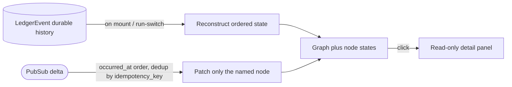

# Conveyor Cockpit — Living-Graph Spine (C1→C3)

## Summary

Build the foundational surface of the Conveyor cockpit: a live, horizontal
task-dependency graph for one run at a time. Slices are nodes; the
`TaskDependency` edges Conveyor already stores (but the web layer never draws)
become the wiring; execution state folds onto the nodes in real time with honest
*blocked / ready-idle / skipped / stalled* states; clicking a node opens a
read-only detail panel. The spine is **observe-only** — it is the substrate every
later cockpit instrument (controls, gate card, forecast) rides on.

---

## Problem Frame

The cockpit's locked centerpiece — a living task-dependency graph — does not
exist. Today `/runs` (`lib/conveyor_web/live/run_viewer_live.ex`) renders a
nested-`
` Project→Plan→Epic→Slice hierarchy and dumps each ledger event as
pretty-printed JSON. It loads ~17 resources and re-renders the whole page on
every event. The dependency edges that make the work a graph are persisted but
never read by the web layer, so the structure the operator most needs to see —
what blocks what — is invisible.

This is dormant capability, not missing capability. The realtime substrate
(transactional outbox → `Conveyor.PubSub`), the rich per-slice data model, and
the ledger-reconstruction machinery already exist. What is missing is the
projection. For the solo operator the cost is concrete: no way to see at a glance
which slice is running, which are starved waiting on it, which silently skipped
because an upstream parked, or which is stalled on a dead worker — and no way to
inspect a node without reading raw JSON. The spine turns the append-only
recording into a legible, live picture, and it is the prerequisite for trusting
the factory to run while no one watches.

---

## Key Decisions

- **Scope is the C1→C3 spine, observe-only.** C1 (render the stored edges), C2
  (event-fold engine), and C3 (honest node-state taxonomy) together. All three
  are observation; no mutation lives in this surface. The on-node controls,
  gate card, and every other instrument are later layers on top.

- **One run's graph at a time, with a run switcher.** The graph shows a single
  run/plan's DAG, matching the width-1 driver's "one live token." A lightweight
  switcher selects the run when more than one exists. A whole-factory overview is
  deferred — it is a separate cockpit layer, not part of the spine.

- **Minimal node-detail panel, not graph-only.** A graph you cannot click into is
  a poster, not a cockpit. Clicking a node reveals a read-only panel (state,
  station/agent, elapsed, recent events, blocked/stalled reason). The richer
  prose narration and the gate cascade are explicitly out — this is the leanest
  detail that makes the graph inspectable.

- **Live-fold now; replay/scrub later.** C2's real win is replacing the
  per-event 17-resource refetch with a targeted fold-and-patch. That is in. The
  time-travel scrubber, replay-debug freeze, and diff-since-last-seen — which the
  same fold architecture enables — are deferred. v1 is live (fold-to-head) only.

- **Horizontal, left-to-right, layered layout.** Execution reads like the
  single-train timeline the width-1 driver actually is; long dependency chains
  pan sideways rather than scrolling off the bottom. Layered (Sugiyama) is the
  prior-art-correct choice for a hard-dependency DAG; force-directed is rejected.

- **Render via LiveView + a JS graph hook (Cytoscape.js + elkjs).** LiveView
  stays source of truth and realtime transport; a `phx-hook` mounts the graph on
  a canvas (`phx-update="ignore"` + `push_event`/`pushEvent` as the seam). Not a
  separate React SPA + new API. This is a locked architectural pick carried from
  ideation.

### The live-fold pipeline (replacing the refetch)

Reconstruct-then-subscribe (ADR-09): seed once from the durable ledger, then
apply each delta as a bounded node patch. No full re-fetch, no relayout on a
status change.

---

## Requirements

### Graph substrate (C1)

- R1. The run view renders one run's plan as a directed graph: slices are nodes
  and the stored `TaskDependency` edges (`from_slice → to_slice`,
  `:execution_hard`) are drawn.
- R2. Layout is layered, horizontal left-to-right, computed by the graph hook;
  the server does not hand-place nodes.
- R3. Epics render as compound parent containers grouping their slices, so the
  graph reads Plan → Epic → Slice with dependency edges between slices.
- R4. Layout recomputes only on a structural change (node or edge added/removed),
  never on a state change.
- R5. A run switcher selects which run's graph is shown when more than one
  exists; the default is the active or most-recent run.

### Live event-fold (C2)

- R6. On mount and on run-switch, the view reconstructs ordered state from the
  durable `LedgerEvent` history for that run, then subscribes to PubSub for
  deltas.
- R7. A ledger event updates only the node(s) it names, via a targeted patch —
  no full re-fetch of the run's resources and no whole-page re-render.
- R8. Delta application is idempotent and ordered by `occurred_at`; duplicates
  (deduped by `idempotency_key`) and out-of-order messages do not corrupt node
  state, and a reconnect re-seeds without double-applying.
- R9. State transitions animate as attribute diffs (color/label/badge), not
  relayout; any edge-flow animation is limited to edges leaving the active node.

### Node-state taxonomy (C3)

- R10. Each node shows exactly one computed state. The taxonomy this spine adds
  is below; existing terminal/known slice states (done, failed, parked) keep
  their meaning.
- R11. Blocked is computed from the dependency edges plus the ready-set and names
  its blocker ("blocked by SLICE-003"); when the blocker is a parked upstream
  awaiting a human, it reads as such.
- R12. Ready-idle marks a slice whose dependencies are met but which is not
  running because the driver is width-1; the view surfaces a serial-tax count
  ("N could run now").
- R13. Skipped marks a slice the driver skipped because an upstream parked; when a
  slice parks, the count of starved downstream dependents is surfaced.
- R14. Stalled marks a running slice whose worker `heartbeat_at` has gone cold or
  which has passed its wall-clock cap — driven only from real heartbeat/cap data,
  never inferred.

| State | Meaning | Computed from |
|---|---|---|
| Running | the single active slice | the live token |
| Ready-idle | deps met, waiting only on width-1 | ready-set minus the running node |
| Blocked | an upstream dependency is incomplete | `TaskDependency` + ready-set |
| Skipped | an upstream parked, driver skipped this branch | `SerialDriver` `:partial` skip event |
| Stalled | running worker's heartbeat cold / past cap | `StationRun.heartbeat_at` + caps |

### Node detail panel

- R15. Clicking a node opens a read-only side panel for that slice: current state,
  current station and agent role, elapsed time, the most recent events in compact
  form, and the computed blocked/stalled reason.
- R16. The raw event payload stays reachable one level deeper for forensic
  inspection but is not the default presentation.

### Projection parity (cross-cutting)

- R17. The graph and detail panel are projections only: they hold no UI-only
  authority or state, and what a node reports as blocked/parked/authoritative
  matches the CLI and static-report projections for the same run.
- R18. The spine performs no mutations — no decide-gate, retry, pause, or any
  write action originates from this surface.

---

## Acceptance Examples

- AE1. Targeted patch, not refetch. **Covers R7, R9.** Given S3 is Running, When
  a `gate.failed` event arrives for S3, Then only S3's node updates (recolors,
  detail reflects it) — no other node re-fetches and no node moves.
- AE2. Blocked names its blocker. **Covers R11.** Given S5 depends on S3 and S3 is
  Running, When the graph renders, Then S5 shows Blocked with "blocked by
  SLICE-003".
- AE3. Park triggers skip + starvation count. **Covers R13.** Given S5 depends on
  S3, When S3 parks and the driver skips its dependents, Then S5 shows Skipped
  ("upstream SLICE-003 parked") and the park surfaces the count of starved
  dependents.
- AE4. No faked stall. **Covers R14.** Given S3 is Running, When its `heartbeat_at`
  passes the stall threshold (or it exceeds its cap), Then S3 shows Stalled; When
  heartbeats continue within threshold, Then S3 stays Running.
- AE5. Idempotent, ordered deltas. **Covers R8.** Given the view is live, When a
  duplicate `idempotency_key` delta or an out-of-order delta arrives, Then node
  state does not double-apply or regress.
- AE6. Reconnect / switch re-seeds. **Covers R6.** Given a reconnect or a
  run-switch, When the view re-seeds from the ledger, Then it shows the state
  continuous live viewing would have produced, then resumes live.

---

## Success Criteria

- Parity holds: the LiveView graph, the CLI, and the static report agree on each
  slice's authority and blocked status for the same run (ADR-21).
- No full-page refetch: a single ledger event produces a bounded node patch; the
  17-resource reload path is gone from the live-update flow.
- No faked liveness: every displayed state traces to real data (edges,
  parked-causality, heartbeat/cap); a Stalled node never appears for a slice with
  a fresh heartbeat.
- Legible at real plan size (dozens of slices) horizontally, with no manual
  layout fiddling.
- Inspectable: a node's "why" (blocked/stalled reason, current station) is one
  click away.

---

## Scope Boundaries

### Deferred — later layers on this substrate

- Time-travel scrubber, replay-debug freeze, and diff-since-last-seen (the C2
  fold enables them; the playhead UI is not v1).
- On-node light controls: decide-a-gate, retry (direction C10).
- Prose run-narration (C4), non-vacuous gate card (C5), gate self-audit / vacuity
  radar (C6), walk-away meter (C7), forecast / flight-plan (C8), failure
  fingerprinting (C9).
- Whole-factory / multi-run overview canvas.
- Latent-conflict "ghost" edges (shared `conflict_domains`, no hard dependency) —
  a reasoned overlay, deferred to avoid reading as committed structure.
- Semantic / level-of-detail zoom and a status-colored minimap — add when node
  counts demand it.

### Hard non-goals — locked out of the whole UI

- Authoring or editing the task graph, re-prioritizing, kicking off runs, or
  injecting mid-run guidance. Authority stays in the domain and CLI, never the UI.
- Pause / resume: no pause domain action exists (`SerialDriver.run!` is
  synchronous; `resume!` is crash-recovery). Backend-gated, explicitly out.
- A separate React SPA + new REST API. Rendering stays LiveView + a JS hook.

---

## Dependencies / Assumptions

- **Net-new frontend asset pipeline.** No esbuild, JS, hook, or graph library
  exists today; the spine stands up the first build (esbuild + a `phx-hook` +
  Cytoscape.js + elkjs). This is the one genuinely new infrastructure cost — the
  rest of the spine is activation of existing data.
- **Reuses the existing realtime substrate.** `Conveyor.EventOutboxRelay` →
  `Conveyor.PubSub` for deltas, and `Conveyor.Replay` /
  `Conveyor.Planning.RunReconstruction` for the fold. Assumes these behave as
  documented (verified at commit `7036e6e`).
- **Runs are effectively serial for now.** One live token; concurrent multi-run
  is deferred, and the run switcher (R5) is the seam where it later attaches.
- **Blocked/Ready-idle are derived, not stored.** `Slice.state` has no blocked
  encoding; the projection computes these from `TaskDependency` + the ready-set.
- **Stall threshold is a tunable** with a conservative default; if mis-set it
  risks a false Stalled on a slow-but-alive station, which erodes trust.

---

## Outstanding Questions

### Deferred to Planning

- The exact stall threshold default (a multiple of the heartbeat interval? a
  fraction of the 1h cap?) and where it is configured.
- Run-switcher behavior at scale (list / most-recent-N / search) — trivial now
  with few runs; revisit when volume grows.
- Whether epics-as-compound-parents need collapse/expand at current plan sizes,
  or stay always-expanded until node counts justify level-of-detail zoom.
- Detail-panel "recent events" depth (last N, or since the node started).

---

## Sources / Research

- Ideation: `docs/ideation/2026-06-25-conveyor-cockpit-ui-ideation.html` —
  directions C1–C3 are this spine; C4–C10 are the deferred layers and the
  rejection table records what was cut (e.g., pause/resume, ghost-edges).
- ADR-09 (PubSub is best-effort notification, not durable history;
  reconstruct-then-subscribe):
  `docs/adrs/adr-09-causal-events-trace-propagation-pubsub-and-artifactstore-boundary.md`.
- ADR-21 (projections are not authority; UI controls map to typed domain
  actions): `docs/adrs/adr-21-static-ui-parity-and-process-exit-error-key-conventions.md`.
- Current-state code this spine replaces or reuses (verified at `7036e6e`):
  - `lib/conveyor_web/live/run_viewer_live.ex` — nested-div hierarchy,
    17-resource refetch on every event, raw-JSON event dump (what the spine
    replaces).
  - `lib/conveyor/factory/task_dependency.ex` — the stored edge
    (`from_slice → to_slice`, `:execution_hard`).
  - `lib/conveyor/replay.ex`, `lib/conveyor/planning/run_reconstruction.ex` — the
    fold / reconstruction to reuse.
  - `lib/conveyor/event_outbox_relay.ex` — the PubSub broadcast the view
    subscribes to.
  - `lib/conveyor/planning/serial_driver.ex` — width-1 walk and `:partial`
    skip-and-continue (the Skipped state and its blockers).
  - `lib/conveyor/factory/ledger_event.ex` — `occurred_at` ordering and
    `idempotency_key` dedup.
  - `lib/conveyor/factory/station_run.ex` — `heartbeat_at` and wall-clock caps
    (the Stalled state).
