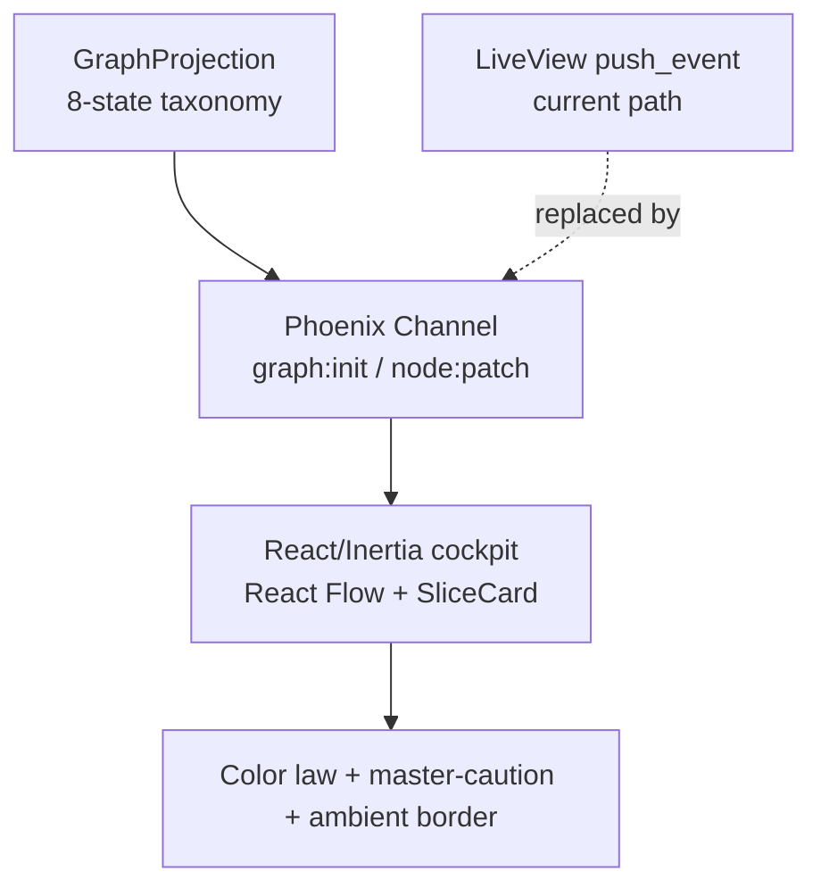

# Cockpit Foundation — React/Inertia/React Flow Stack + Observe-Only Port

## Summary

Stand up the locked React + Inertia + React Flow + shadcn/Tailwind/Motion stack
and port the observe-only run cockpit (`/runs`) onto it at functional parity.
Carry the cheap, high-impact wins — nodes as status cards, the dark-cockpit
color law, and dark-mode tokens — so the screen reads as a credible premium
cockpit the day it lands. Live deltas move to a net-new Phoenix Channel, and the
design system is extracted from this one real screen rather than built ahead of
it.

---

## Problem Frame

The Conveyor cockpit is `/runs` → a live work-DAG drawn with Cytoscape + ELK
(`assets/js/hooks/dag.js`), shipped observe-only in commit #33. The founder's
verdict is "looks awful," and the gap to a Stripe-level operator app is not the
graph library — it is the absence of a design system, an app shell, real node
craft, and motion.

A ten-idea ideation (`docs/ideation/2026-06-26-cockpit-frontend-redesign-ideation.html`)
maps the way forward, but every one of those ideas assumes a React + Inertia +
React Flow + shadcn stack — and that stack is **not installed**. Today's app is
Phoenix LiveView with three Cytoscape-related npm deps and no React, Inertia,
Tailwind, or Motion. So the real first move is not an identity feature; it is the
foundation those features ride on. Without it, the cockpit keeps rendering
circles and keeps looking awful, and none of the identity ideas can be built as
designed.

---

## Key Decisions

- **Foundation before identity.** All ten ranked ideas assume a stack that isn't
  installed. Stand up that stack and port the cockpit first, so the identity
  ideas (edges, motion, folding) have a real surface to ride on. The migration
  is greenfield, not a refactor.

- **Carry the cheap wins; extract the design system.** The foundation includes
  node-craft (`SliceCard`) + the dark-cockpit color law + dark-mode tokens so
  `/runs` stops looking awful when it lands. The full design-system spine
  (idea #4: 3-scale card genome, reusable `LiveRail`, ⌘K palette) is **not**
  built ahead — it is extracted from this one real screen to avoid committing to
  wrong primitives before 2–3 screens exist.

- **Pure Inertia + a net-new Phoenix Channel.** The live cockpit becomes a
  first-class React/Inertia page rather than a LiveView island; its real-time
  deltas move from LiveView `push_event` to a Phoenix Channel. One consistent
  app model, at the cost of building the Channel in this slice.

- **Stay observe-only.** No control actions (approve/reject gate, retry, park) in
  this slice. The dossier + non-vacuous gate (idea #6) is where "act" lands,
  sequenced after the observe-only redesign.

---

## Requirements

**Stack and app shell**

- R1. Install and configure the locked frontend stack — Inertia.js on Phoenix,
  React, React Flow v12, shadcn/ui + Radix, Tailwind, Motion, Lucide — with the
  server staying authoritative (controllers return props to React pages).
- R2. A dark-mode-first root app shell hosts the cockpit, with navigation
  affordances sized for future entity screens (evidence, reviews, agents); those
  screens are not built in this slice.

**Cockpit port**

- R3. Port `/runs` to a React/Inertia page that renders the run DAG in React
  Flow v12, replacing the Cytoscape/ELK hook, at functional parity with the
  observe-only behavior shipped in #33.
- R4. Reuse the existing server-side `GraphProjection`, its 8-state taxonomy
  (`stalled`, `running`, `skipped`, `blocked`, `ready_idle`, `done`, `failed`,
  `parked`), and node fields (`epic_id`, `blocked_by`, `starved_dependents`)
  unchanged — no graph data-model changes in this slice.

**Live data transport**

- R5. Live deltas flow over a net-new Phoenix Channel carrying the existing
  `graph:init` (full seed) and `node:patch` (incremental) messages, replacing
  the LiveView `push_event` path.
- R6. On connect the client subscribes, then receives the seed; subsequent
  `node:patch` messages update only the affected nodes without a full reload.

**Node craft and color law**

- R7. Render graph nodes as `SliceCard` status cards (not circles) at DAG/nano
  scale, with the slice title, state, and key fields legible on the card.
- R8. Apply the dark-cockpit color law: nominal states (`running`, `ready_idle`,
  `done`, `skipped`, `parked`) render in restrained monochrome; saturated color
  appears only for exceptions, ranked by severity — `failed` = warning,
  `blocked` with high `starved_dependents` = caution, `stalled` = advisory.
- R9. A persistent master-caution strip pins the single top-ranked exception with
  a jump affordance, and a thin ambient viewport border encodes overall run
  health pre-attentively.
- R10. Pair color with shape/icon so state is never conveyed by color alone
  (colorblind-safe).

**Design tokens**

- R11. Define a dark-mode-first semantic token set — one token group per state
  (hue / saturation / luminance) — consumed by the cockpit and extracted from
  this screen rather than designed as a speculative full system.

---

## Key Flow

- F1. Observe a live run
  - **Trigger:** Operator opens `/runs` for a run.
  - **Actors:** Operator (reads, does not act); server (authority, projects and
    pushes state).
  - **Steps:** Server returns the React/Inertia page props → client subscribes to
    the run's Channel → server sends `graph:init` → React Flow renders the DAG of
    `SliceCard`s under the color law → as the run progresses, `node:patch` deltas
    update affected nodes in place → the master-caution strip and ambient border
    reflect the current top exception and overall health.
  - **Outcome:** The operator reads run state and where work is piling up at a
    glance, observe-only.
  - **Covered by:** R3, R5, R6, R7, R8, R9.

### Live data path

---

## Acceptance Examples

- AE1. Live delta updates one node in place
  - **Covers R6.**
  - **Given** the cockpit is open and seeded, **When** a `node:patch` arrives
    moving a slice from `running` to `failed`, **Then** only that node re-renders
    to the failed treatment, with no page reload.
- AE2. A nominal run is calm
  - **Covers R8.**
  - **Given** a run where every slice is in a nominal state, **Then** the canvas
    is calm monochrome with no saturated color.
- AE3. Severity ranking surfaces the top exception
  - **Covers R8, R9.**
  - **Given** one slice is `failed` and another is `blocked` with high
    starvation, **Then** the `failed` slice is pinned as the top-ranked exception
    in the master-caution strip and the ambient border reflects degraded health.
- AE4. State survives color blindness
  - **Covers R10.**
  - **Given** a `failed` node, **Then** its state is distinguishable by icon or
    shape, not color alone.

---

## Success Criteria

- Opening `/runs` reads as a credible, premium dark cockpit — cards not circles,
  calm-until-exception color — clearing the founder's "looks awful" bar.
- Functional parity: every observe behavior shipped in #33 works on the new
  stack — seed, live deltas, and the full state taxonomy.
- Live deltas update the affected nodes in place, with no full reload and no
  perceptible jank.
- ce-plan can produce an implementation plan from this doc without inventing
  scope — the stack, the transport shape, and the visual scope are pinned here.

---

## Scope Boundaries

**Deferred for later (follow-on slices on this foundation)**

- Identity follow-ons: edges-as-conveyor (#1), motion grammar (#3), live frontier
  + epic folding (#5).
- Act / control: the slice dossier + non-vacuous gate (#6) and all inline actions
  (approve/reject, retry, park, requeue) — the cockpit stays observe-only.
- Full design-system spine (#4): the `SliceCard` compact/full scales, reusable
  `LiveRail`, and ⌘K command palette.
- The reframes: run wall / flight-strip board (#7), walk-away HUD (#9), time
  transport (#10).
- Additional entity screens (evidence, reviews, agents) beyond nav affordances.

**Open fork — decide before building, not by default**

- The Needs-Me Inbox (#8) makes the inbox the app's spine and demotes the DAG to
  an evidence surface — in direct tension with the DAG-as-flagship thesis this
  foundation invests in. Treat flagship-DAG vs inbox-as-spine as a deliberate
  product decision, not a both-and.

---

## Dependencies / Assumptions

- Reuses `GraphProjection` (`lib/conveyor_web/live/cockpit/graph_projection.ex`)
  and its 8-state taxonomy and node fields unchanged — assumed stable and
  sufficient for the port.
- The net-new Phoenix Channel is a backend deliverable in this slice. Today's
  transport is LiveView `push_event` (`lib/conveyor_web/live/cockpit_live.ex`),
  not a Channel — the ideation doc's "Phoenix Channel" description was
  aspirational, not current state.
- Going pure-Inertia retires the current no-JS server-rendered node list; React
  becomes required to view `/runs`. Accepted for an operator tool.
- Pause-control remains absent (flagged in the prior cockpit ideation as needing
  new backend) — not required here because this slice is observe-only.

---

## Outstanding Questions

**Resolve before planning**

- None blocking — the directional decisions are pinned above.

**Deferred to planning**

- Migration cutover: run the new cockpit in parallel behind a route/flag vs. a
  hard cutover of `/runs`.
- How much of the app-shell navigation to scaffold now (nav slots only vs.
  routed-but-empty screens).
- Whether any thin SSR / no-JS fallback is worth retaining for initial paint.
- Exact React Flow custom-node implementation and the minimal mount/enter motion
  budget (the full motion grammar is deferred, but some enter/seed transition is
  unavoidable).

---

## Sources / Research

- `docs/ideation/2026-06-26-cockpit-frontend-redesign-ideation.html` — the
  ten-idea ranking. This slice is the foundation plus idea #2 (color law) and the
  node-craft half of idea #4.
- `lib/conveyor_web/live/cockpit/graph_projection.ex` — 8-state taxonomy and node
  fields, reused.
- `lib/conveyor_web/live/cockpit_live.ex` — current LiveView cockpit and
  `push_event` seed/patch path, being replaced.
- `assets/js/hooks/dag.js` — current Cytoscape/ELK renderer, being replaced.
- `assets/package.json` — current frontend deps (Cytoscape only); the new stack
  is added here.
- Commits #32 (`8685ffa`, ideation + spine requirements/plan) and #33 (`69806ef`,
  observe-only C1→C3 spine).
