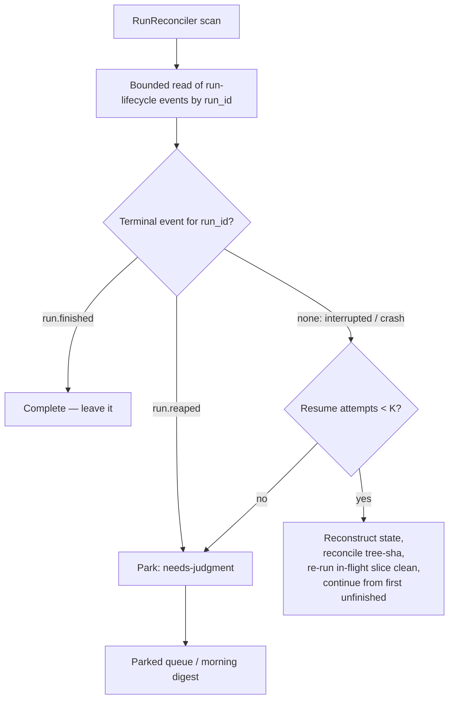
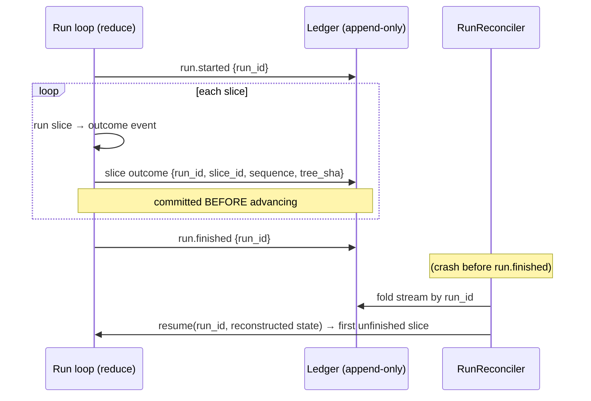

# feat: Event-Sourced Run Ledger — Crash-Survivable Serial Runs

## Summary

Make a crashed serial run survivable. The run loop in `lib/conveyor/planning/serial_driver.ex`
commits each slice's outcome to the existing append-only `ledger_events` table before advancing.
On restart, a new supervised reconciler finds runs whose event stream started but never reached a
terminal event, folds that stream to rebuild run state, and re-enters the loop at the first
unfinished slice — re-running the in-flight slice from a clean base. Innocent crashes auto-resume;
reaper-killed runs and runs past a resume-attempt cap park for judgment.

---

## Problem Frame

A run is an in-process `Enum.reduce` over ordered slices (`serial_driver.ex` ~115-130). It threads
`{events, blocked, agent_ran?}`, builds a list of per-slice outcome event maps, and returns them in
a `Result` struct. Nothing run-scoped is durable: if the BEAM process dies mid-run, the whole run is
lost and restarts from the first slice. That is the survivability gap STRATEGY.md names — a run
"can't survive its own length."

The substrate exists and is unused for run-scoped state. `Conveyor.Ledger.write!/2` is an idempotent,
transaction-wrapped writer already persisting `slice.transitioned` events; `ledger_events` is
append-only (DB trigger); `Conveyor.Effects.Reconciler` (driven by an Oban maintenance job) is the
existing exactly-once compare-recorded-vs-live precedent to mirror. What is missing is the wiring: the
loop never commits its run-scoped stream, and nothing detects or resumes an interrupted run.

---

## Key Technical Decisions

- **KTD1 — Run identity is a minted `run_id` carried in event payload; the event stream is the run
  registry.** Research found `RunAttempt`s are created *per slice* (`serial_driver.ex` `create_run_attempt!`),
  so there is no run-level row and the origin's "a `run_attempt` frozen in `:running`" detection
  (origin R4) does not map. Instead, `SerialDriver.run!` mints a `run_id` at start, emits a
  `run.started` event, and stamps `run_id` into every committed event's `payload` (the `:map`
  attribute needs no migration). A run is interrupted iff its stream has `run.started` with no
  terminal `run.finished` / `run.reaped` event. (see origin: `docs/brainstorms/2026-06-23-event-sourced-run-ledger-requirements.md`)

- **KTD2 — Deterministic idempotency keys give ledger-row idempotency for reconstruction — not
  side-effect exactly-once.** `Ledger.write/2` looks up by `idempotency_key` and dedups on
  unique-index conflict. Keying each slice-outcome event on `run_id` + `slice_id` + `sequence` means a
  resume re-emits the identical key and the second write is a no-op, so the folded stream stays clean
  across resumes. This does **not** make the side effect exactly-once: the side effect is a
  non-idempotent `git commit`, so re-running a slice produces a fresh commit even though its ledger row
  dedups. Side-effect exactly-once is owned solely by KTD6/U5.

- **KTD3 — Commit synchronously inside the reduce; no Oban.** The single insertion point is where the
  per-slice event map is produced (`serial_driver.ex` ~115-130). The loop stays synchronous and
  in-process (origin R3). Oban remains unused by the run path; EventOutbox fanout is already handled
  inside `Ledger`'s transaction.

- **KTD4 — Fold via `Ash.read!` + in-memory filter; bound the boot scan.** The codebase has zero
  `Ash.Query` usage; the convention is `Resource |> Ash.read!(domain: Factory) |> Enum.filter(...)`.
  Per-run reconstruction (one `run_id`) tolerates the O(n) read. The **boot scan**, however, must not
  fold the entire append-only audit log on every restart — it uses a bounded read (filter to lifecycle
  types `run.started` / `run.finished` / `run.reaped`, or an `occurred_at` window) so restart cost
  tracks open/recent runs, not total ledger size. A dedicated filtered read action is a U6 dependency,
  not deferred.

- **KTD5 — A new `Conveyor.Planning.RunReconciler` owns detect-and-resume; its trigger is an explicit
  decision, not an inherited one.** `Conveyor.Effects.Reconciler` is the structural precedent for
  compare-recorded-vs-live reconciliation, but it is driven by an Oban maintenance job
  (`lib/conveyor/jobs/reconcile_stale_effects.ex`) — *not* a boot scan; its supervised child is a
  skeleton GenServer. So the reconciler's trigger must be chosen: a startup hook (Application start /
  `handle_continue`) or an Oban maintenance job mirroring `reconcile_stale_effects` (see Open
  Questions). KTD3's "no Oban" applies to the synchronous *slice-commit*, not the reconciler — an
  Oban-driven reconciler is consistent with the existing pattern. No GenServer owns run lifecycle
  today, so the reconciler is the natural new owner.

- **KTD6 — Side-effect exactly-once via post-commit `HEAD` tree-sha reconciliation.** This is the
  *sole* guard against re-applying a slice (KTD2 does not provide it). The slice side effect is an
  in-place accept-commit on the shared workspace (`git add -A; git commit`; HEAD advances) — there is
  no merge or push. For each *passed* slice, U2 records the **post-commit** `HEAD^{tree}` sha (not the
  gate-time pre-commit digest, which cannot tell whether the commit landed). On resume, the reconciler
  derives the live workspace's `HEAD^{tree}` with the *same* staging method and compares: a match means
  the accept-commit already landed (skip the slice); a mismatch means reset to base and re-run. This
  refines origin R10's `head_tree_sha256`-on-`run_attempt` anchor (whose producer is never called in
  the production loop) and mirrors `Effects.Reconciler`'s recorded-vs-live shape.

- **KTD7 — Always reload `RunAttempt` via `Ash.get!` in the reconciler.** The repo enforces
  "transition from persisted truth, not in-memory" (`run_attempt_lifecycle.ex:17-25`, born from a real
  M1 bug). The resume path must reload, never trust a stale struct.

- **KTD8 — Run-lifecycle events source `project_id` via the slice→…→project walk.** `LedgerEvent`
  requires a non-nil `project_id`, but `RunAttempt` has no `:project` relationship and `SerialDriver`
  receives no project in its opts. Run-scoped writes resolve `project_id` the way `slice_lifecycle.ex`
  does (run_attempt → slice → epic → plan → project), or by threading project context into the driver
  opts from `PlanRunner` (which already has it). U1, U2, and U6 depend on this.

---

## High-Level Technical Design

Boot-time reconciliation — how an interrupted run is detected and routed:

Routing keys on the **run-level terminal**, not per-slice outcomes: a `run.reaped` terminal (the
run-budget deadline halted the whole run) parks; a per-slice `reaped_wall_clock` outcome is a normal
parked slice the run continues past and never by itself suppresses resume.

Commit-then-advance and resume re-entry — the durable boundary:

---

## Implementation Units

### U1. Mint run identity and emit run-lifecycle events

- **Goal:** Give every run a durable identity and bracket its event stream so interruption is detectable.
- **Requirements:** Advances origin R4 (detection substrate); enables R1, R5.
- **Dependencies:** none
- **Files:** `lib/conveyor/planning/serial_driver.ex`, `test/conveyor/planning/run_ledger_test.exs` (new)
- **Approach:** In `SerialDriver.run!/2`, mint a `run_id` (UUID) at entry. Emit a `run.started`
  ledger event (type `"run.started"`, payload `{"run_id", "plan_id"/work-graph id, "slice_ids",
  "started_at"}`) via `Ledger.write!`. At the end of the reduce, emit a terminal event: `"run.finished"`
  on normal completion (carry final `status`), or `"run.reaped"` when the run-budget reaper halted it.
  Thread `run_id` through the reduce so U2 can stamp it on slice events. Use `return_notifications?: true`
  and follow the `slice_lifecycle.ex` call shape.
- **Patterns to follow:** `lib/conveyor/slice_lifecycle.ex` `write_transition_event!`; dotted past-tense
  `type` strings; deterministic colon-delimited `idempotency_key` (`"run:#{run_id}:started"`).
- **Test scenarios:**
  - Happy path: a completed run writes exactly one `run.started` and one `run.finished` event for its
    `run_id`, in order.
  - Run-budget reap: a run halted by the run-level deadline writes `run.reaped`, not `run.finished`.
  - Idempotency: calling `run!` semantics that re-emit `run.started` for the same `run_id` produce one
    persisted event (dedup via key).
  - `Covers AE1.` (start/terminal bracketing is what makes interruption detectable).

### U2. Commit per-slice outcome events during the reduce

- **Goal:** Persist the run-scoped stream the loop currently discards, durably and before advancing.
- **Requirements:** R1, R2, R3.
- **Dependencies:** U1
- **Files:** `lib/conveyor/planning/serial_driver.ex`, `test/conveyor/planning/run_ledger_test.exs`
- **Approach:** At the reduce point where each slice `event` map is produced (incl. `skipped_event` and
  `reaped_event`), commit it via `Ledger.write!` *before* returning to the next iteration. Event `type`
  `"run.slice_outcome"`; `idempotency_key` = `"run:#{run_id}:slice:#{slice_id}:#{sequence}"` (KTD2);
  payload carries the minimal resume vocabulary only (R2): `run_id`, `slice_id`, `sequence`, `status`,
  `gate_result`, `run_attempt_outcome`, `findings`, `base_commit`, and — for a *passed* slice — the
  **post-commit** `HEAD^{tree}` sha captured after the accept-commit (`git add -A; git commit`, HEAD
  advances in place; there is no merge), for U5's reconciliation (KTD6). Pass `run_attempt_id` as a
  top-level attr when present, and source the required non-nil `project_id` via the slice→…→project
  walk (KTD8). A write failure must surface (fail the run), not silently drop — the in-memory list is no
  longer the source of truth. **Invariant:** no accept-commit may occur before `run.started` is durably
  committed, so an interrupted run is never invisible to the reconciler (U1).
- **Patterns to follow:** `Ledger.write!` transaction + outbox shape; string-keyed payload maps; do not
  route through Oban (KTD3).
- **Test scenarios:**
  - Happy path: a 3-slice run persists 3 `run.slice_outcome` events with correct `sequence`/`status`.
  - Reaped slice: a wall-clock-reaped slice persists an outcome event with `gate_result =
    "reaped_wall_clock"` and the `reaped` payload.
  - Ordering: each slice's outcome is committed before the next slice's event is written (assert
    persisted order matches `sequence`).
  - Resume dedup: re-committing the same `(run_id, slice_id, sequence)` writes no second row.
  - Crash before `run.started`: no accept-commit has occurred, so the workspace is at its pre-run base
    (no orphaned commit, no invisible run).
  - `Covers AE3.` (post-commit `HEAD^{tree}` is recorded for later exactly-once reconciliation).

### U3. Stream-fold reconstruction

- **Goal:** Rebuild a run's in-memory loop state purely from its committed stream.
- **Requirements:** R5, R7.
- **Dependencies:** U2
- **Files:** `lib/conveyor/planning/run_reconstruction.ex` (new), `test/conveyor/planning/run_reconstruction_test.exs` (new)
- **Approach:** A pure module that reads `LedgerEvent`, filters to a `run_id` (payload field), sorts by
  `sequence`, and folds into a named `ResumeState` struct — `{passed_slice_ids, blocked, start_index,
  in_flight_slice, committed_events}`. "Passed" slices (status `"passed"`) are the durable boundary and
  are excluded from re-run (R7); the first slice with no committed outcome (or the last in-flight one)
  is the resume point. The module stays pure (no git/workspace I/O — reconciliation lives in U5's
  separate module). U4 maps the `ResumeState` into the loop accumulator.
- **Patterns to follow:** `Ash.read!(domain: Factory) |> Enum.filter(...)` (KTD4); no `Ash.Query`.
- **Test scenarios:**
  - Full reconstruction: a stream of N slice outcomes folds to the correct passed-set and blocked-set.
  - Position: given 2 passed + 1 in-flight (no terminal), the resume point is the in-flight slice.
  - Blocked derivation: a parked slice's dependents are reconstructed as blocked.
  - Empty/started-only: a stream with `run.started` and no slice outcomes resumes at slice 1.
  - `Covers AE1.`

### U4. Resume entry path into SerialDriver

- **Goal:** Let the driver start from a reconstructed position instead of only slice 1.
- **Requirements:** R5, R6, R7.
- **Dependencies:** U3
- **Files:** `lib/conveyor/planning/serial_driver.ex`, `test/conveyor/planning/run_ledger_test.exs`
- **Approach:** Add a resume variant (e.g. `SerialDriver.resume!/3` taking `run_id`, the U3
  `ResumeState`, and opts) that maps the `ResumeState` into the reduce accumulator `{events, blocked,
  agent_ran?}` — `events` rebuilt from `committed_events`, `blocked` and the start index from the fold —
  skips already-passed slices, reconciles the in-flight slice's side effect (U5) before resetting to a
  clean base, and continues the existing loop. Preserve the `replay_fidelity` digest behavior in the
  returned `Result`. Reload any `RunAttempt` via `Ash.get!` (KTD7). Keep the happy-path `run!/2`
  unchanged; resume is an additive entry point.
- **Patterns to follow:** existing `run_one!/5` clean-base reset (`reset_workspace_to_base!` →
  `git reset --hard HEAD` + `git clean -fdq`); `Result` assembly.
- **Test scenarios:**
  - Happy resume: given a reconstructed 2-passed/1-in-flight state, resume runs only the in-flight +
    remaining slices and returns a `Result` covering all slices.
  - Skip durable: passed slices are not re-executed (assert their agent is not invoked).
  - Clean base: the in-flight slice's workspace is reset before re-run (no salvaged partial work, R6).
  - Digest: resumed `Result.report["replay_fidelity"]` preserves the matched-digest shape.
  - `Covers AE1.`

### U5. Exactly-once side-effect reconciliation

- **Goal:** Never double-apply a slice whose accept-commit landed before the crash recorded its pass.
- **Requirements:** R10.
- **Dependencies:** U2, U4
- **Files:** `lib/conveyor/planning/run_reconciliation.ex` (new), `lib/conveyor/planning/serial_driver.ex`, `test/conveyor/planning/run_reconciliation_test.exs` (new)
- **Approach:** Before re-running the in-flight slice (U4), compare the **post-commit** `HEAD^{tree}` sha
  recorded for the last passed slice (U2) against the live workspace's `HEAD^{tree}`, derived with the
  *same* staging method so `.gitignore`'d paths (which survive `git clean -fdq`) don't spuriously
  diverge the digests. A match means the accept-commit already landed — advance past the slice; a
  mismatch means reset to base and re-run. The side effect is an in-place `git commit` (HEAD advances),
  **not** a merge or push. Keep this in a dedicated `run_reconciliation.ex` so U3's fold module stays
  pure. Mirror `Effects.Reconciler`'s compare-recorded-vs-live structure.
- **Execution note:** Start with a failing test for the committed-then-crashed-before-record case — it
  is the correctness crux and easy to regress.
- **Patterns to follow:** `lib/conveyor/effects/reconciler.ex`; the post-patch tree-sha staging the
  WorkspaceIntegrity producer uses (throwaway index + `git add -A`).
- **Test scenarios:**
  - Committed-before-record: a slice whose accept-commit landed (HEAD advanced) but whose outcome event
    was never written is detected via post-commit tree-sha match and not re-applied.
  - Clean in-flight: an in-flight slice with no landed accept-commit resets to base and re-runs.
  - Staging parity: a recorded sha and a live sha derived by different staging methods must not be
    compared — assert the reconciler uses the identical method.
  - `Covers AE3.`

### U6. RunReconciler supervised child — boot detect, crash-vs-reap routing, resume-attempt cap

- **Goal:** At boot, find interrupted runs and route each to resume or park.
- **Requirements:** R4, R8, R9.
- **Dependencies:** U3, U4, U5
- **Files:** `lib/conveyor/planning/run_reconciler.ex` (new), `lib/conveyor/conductor/supervisor.ex`, `test/conveyor/planning/run_reconciler_test.exs` (new)
- **Approach:** A new `RunReconciler` registered in `conductor/supervisor.ex`, triggered per KTD5 (a
  startup hook or an Oban maintenance job — decide in Open Questions; the structural precedent is
  `Effects.Reconciler`, which runs via an Oban job, not at boot). It does a **bounded** read over
  run-lifecycle events (KTD4) and classifies each `run_id`: **complete** (`run.finished` terminal →
  skip), **reaped** (`run.reaped` terminal → park, R8), or **interrupted** (`run.started`, no terminal →
  crash). Per-slice `reaped_wall_clock` outcomes do **not** trigger park — they are normal parked slices
  the run continued past; only the run-level `run.reaped` terminal suppresses resume. For an interrupted
  run, count prior `run.resumed` events; if `< K` (config `resume_attempt_cap`, default 2), emit
  `run.resumed` and invoke `SerialDriver.resume!` via U3/U5; if `>= K`, emit `run.parked`
  (needs-judgment) so the parked queue surfaces it (R9). Reload `RunAttempt`s via `Ash.get!` (KTD7) and
  mark any left in `:running` stale so orphaned rows don't accumulate. Source `project_id` per KTD8.
- **Patterns to follow:** `lib/conveyor/effects/reconciler.ex` + `lib/conveyor/jobs/reconcile_stale_effects.ex`
  (reconcile-via-job shape); `lib/conveyor/conductor/child.ex` for the supervised-child skeleton.
- **Test scenarios:**
  - Detect: a run with `run.started` + slice outcomes + no terminal is selected for resume.
  - Ignore complete: a run with a `run.finished` terminal is left untouched.
  - Run-reaped parks: a run with a `run.reaped` terminal is parked, not resumed.
  - Slice-reap does not park: a crashed run whose *last* outcome is a per-slice `reaped_wall_clock`
    (an earlier independent slice) is still treated as a crash and resumed, not parked.
  - Cap: after K `run.resumed` events for the same `run_id`, the run is parked as needs-judgment, not
    resumed again.
  - Orphaned `:running`: a `RunAttempt` left in `:running` by the crash is marked stale on resume.
  - `Covers AE2, AE4.`

### U7. Induced-failure end-to-end survivability test

- **Goal:** Prove the headline success criterion: a killed run resumes to the correct final state with
  no duplicated work.
- **Requirements:** Success criteria; integrates R1–R10.
- **Dependencies:** U1–U6
- **Files:** `test/conveyor/planning/run_survivability_test.exs` (new)
- **Approach:** Drive a 3–8 slice run, interrupt it mid-slice (simulate crash by abandoning the
  in-process run after some slices have committed outcomes — do not emit a terminal event), then invoke
  the reconciler/resume path and assert the run completes. Compare the resumed final state against an
  uninterrupted run of the same plan. Assert no slice's side effect was applied twice (ledger row count
  per `(run_id, slice_id, sequence)` is 1; workspace history shows no duplicate accepted commit).
- **Execution note:** Integration-level; uses real Postgres (DataCase, `async: false`). This is the M3
  exit-evidence "survives an induced failure" bar.
- **Patterns to follow:** `test/conveyor/first_light_serial_driver_test.exs` driving patterns;
  `Conveyor.DataCase`; `Conveyor.FactoryFixtures`.
- **Test scenarios:**
  - Resume-equals-uninterrupted: resumed final `Result`/persisted state matches a clean run of the same
    plan.
  - Exactly-once: per-slice outcome rows and accepted commits are not duplicated across the interruption.
  - In-flight clean: the slice that was in-flight at interruption is re-run from a clean base.
  - `Covers AE1, AE3.`

---

## Scope Boundaries

### Deferred for later (carried from origin)

- The real replay-divergence producer and removing the hardcoded `"status" => "matched"` in
  `serial_driver.ex` (M4) — a downstream consumer of the committed stream.
- Eval-dataset queries and metrics over the stream (A4).
- Oban activation / making the durable commit the first `Oban.insert` (M7 seam).
- Sub-slice / mid-slice event sourcing and salvage of partial in-flight work.
- Parked-queue triage UI and the decision-forcing morning digest (idea #7). This plan only *feeds* the
  parked queue new entries (reaped and cap-exhausted runs).

### Deferred to follow-up work

- A dedicated Ash filtered read action for `LedgerEvent` by `run_id` if event volume makes the
  read-all-then-filter fold (KTD4) too costly.
- Promoting `run_id` from a payload field to a first-class `Run` entity / column if downstream
  consumers need to query or relate runs directly.

---

## Risks & Dependencies

- **Run-budget reaper must persist a `run.reaped` terminal.** The reaper today builds an in-memory
  `reaped_event` and persists nothing (`SerialDriver` makes zero ledger writes). U1 must add the
  run-level `run.reaped` write; without it the reconciler can't distinguish a deliberate reap from a
  crash. The resume-attempt cap (R9) is the backstop if the distinction is ever lost.
- **Tree-sha staging parity (U5).** The recorded sha and the live sha must be derived by the *same*
  method (throwaway index + `git add -A`). `git clean -fdq` keeps `.gitignore`'d paths (venvs), so a
  mismatched staging method would spuriously diverge the digests and either re-apply or skip wrongly.
- **Synchronous commit makes DB hiccups run-fatal.** U2 commits each outcome via `Ledger.write!`
  (a `Repo.transaction` + outbox insert) before advancing, and a write failure now fails the run —
  previously the in-memory list never blocked. This trades a silent failure for a durable-but-fatal
  one; the failure surface is new and not load-tested in this plan.
- **Concurrent boot resume on a shared workspace.** If two interrupted runs target the same
  `workspace_path`, resuming both does `git reset --hard` on the same tree and can corrupt each other.
  The reconciler needs per-workspace serialization (no locking exists today).
- **Double O(n) reads per resumed slice.** `Ledger.write`'s dedup is itself a read-all-then-`Enum.find`
  over `ledger_events`; combined with the fold (KTD4) that's two O(n) scans per resumed slice over an
  append-only table. Acceptable now; the bounded boot read (KTD4) caps the worst case.
- **Test infra.** Requires Docker Postgres on port 55432; `async: false` for all DB-touching tests.

---

## Open Questions

### Deferred to planning — resolved here

- Run identity mechanism → KTD1 (minted `run_id` in payload; event stream as registry).
- Resume-attempt cap K → config `resume_attempt_cap`, default 2.
- `project_id` sourcing for run-lifecycle events → KTD8 (slice→…→project walk, or thread from
  `PlanRunner`).
- Reap-vs-crash discriminator → run-level `run.reaped` terminal only, never a per-slice
  `reaped_wall_clock` outcome (U6).

### Resolve before implementation

- **Reconciler trigger.** Startup hook (Application start / `handle_continue`) vs an Oban maintenance
  job mirroring `reconcile_stale_effects` (KTD5). This is the first thing U6 needs and shapes its
  supervision/registration.
- **Commit-vs-ledger-write ordering.** If the outcome row is written *before* the accept-commit, a
  crash in the gap leaves a recorded outcome whose commit never landed (the inverse of AE3). Pin the
  order — commit first, then record the post-commit `HEAD^{tree}` — or make U5 reconcile both
  directions.

### Deferred to implementation

- Exact event `type` names and payload field names (directional values given in U1/U2).
- Whether the rework path (`AttemptLoop.run_to_done!`, up to 3 attempts) performs per-attempt workspace
  side effects or only a final accept-commit. If intermediate attempts mutate the workspace, the
  single-tree-sha-per-slice model and the clean-base reset must account for them.
- Precise live-workspace tree-sha command for U5 (`git write-tree` on a throwaway index vs
  `rev-parse HEAD^{tree}`), matched to the WorkspaceIntegrity producer's staging.

---

## Sources & Research

- Origin requirements: `docs/brainstorms/2026-06-23-event-sourced-run-ledger-requirements.md`.
- Ledger write pattern + idempotent dedup: `lib/conveyor/ledger.ex`, canonical call site
  `lib/conveyor/slice_lifecycle.ex`.
- Run loop, reaper, workspace reset, per-slice `RunAttempt` creation:
  `lib/conveyor/planning/serial_driver.ex`; caller `lib/conveyor/planning/plan_runner.ex`.
- RunAttempt state machine + transition-from-persisted-truth rule: `lib/conveyor/factory/run_attempt.ex`,
  `lib/conveyor/run_attempt_lifecycle.ex`; `:running` set in `lib/conveyor/run_slice.ex`.
- Reconciler precedent + supervision: `lib/conveyor/effects/reconciler.ex`,
  `lib/conveyor/conductor/supervisor.ex`.
- Ash domain/registry + query convention (no `Ash.Query`): `lib/conveyor/factory.ex`.
- Append-only enforcement: `priv/repo/migrations/20260618004000_enforce_ledger_events_append_only.exs`.
- Testing conventions: `test/conveyor/first_light_serial_driver_test.exs`, `test/support/data_case.ex`,
  `test/support/factory_fixtures.ex`.
- No `docs/solutions/` or `CONCEPTS.md` exist — no prior learnings; this work is a candidate to seed
  `docs/solutions/` after it ships. External research intentionally skipped (established local stack).
