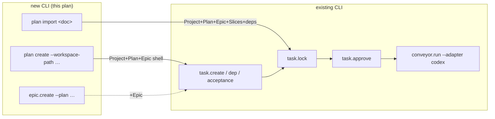

# feat: Fix task.dep direction + add Plan/Epic authoring CLI

## Summary

Close the two operator-surface gaps the dogfood surfaced: correct the inverted
`mix conveyor.task.dep` direction so the documented and intuitive reading
matches what actually runs (F5), and add the missing `Plan`/`Epic` authoring
commands so a plan can go from nothing to runnable entirely through
`mix conveyor.*` (F2). After this, the author→run loop needs no hand-seeding.

---

## Problem Frame

The 2026-06-25 dogfood drove the DB-native author→run loop end-to-end and left
two findings (see origin:
`docs/brainstorms/2026-06-25-conveyor-dogfood-loop-requirements.md`):

- **F5 (bead `rk0c`):** `mix conveyor.task.dep` help says "`from` depends on
  `to`", but the implementation does the opposite — `from` is the prerequisite
  and `to` depends on it. The execution/topo logic is correct; the **CLI surface
  is inverted** relative to its own help and the natural reading, so a user
  following the documented example authors the edge backwards.
- **F2 (bead `g2iu`):** there is no operator CLI to create an `Epic` or `Plan`.
  The dogfood had to seed `Project`+`Plan`+`Epic` with a hand-written Ash script
  before the real `task.*` CLI could be used — the single non-CLI step in the
  loop.

---

## Requirements

**Dependency direction**

R1. `mix conveyor.task.dep add --from X --to Y` makes **X depend on Y** (Y runs
first, X runs after) — matching the help text and `br`'s
`dep add <issue> <depends-on>` convention.

R2. The `task.dep` help text and example are consistent with the implemented
direction.

R3. A CLI-level test pins the direction contract so the inversion cannot
silently regress.

**Plan-authoring CLI**

R4. An operator can create a runnable `Plan`+`Epic` shell (and its backing
`Project`) with one `mix conveyor.*` command and no hand-seeding.

R5. An operator can import a whole plan document
(`Project`+`Plan`+`Epic`+`Slices`+deps) with one command, reusing the existing
importer.

R6. An operator can add an additional `Epic` to an existing `Plan`.

R7. All new commands emit machine-readable JSON and use the shared CLI error and
exit-code conventions.

R8. A shell `Plan` created via R4 is immediately authorable
(`task.create`/`dep`/ `acceptance`/`lock`/`approve`) and runnable (it carries
`verification_commands`).

---

## Key Technical Decisions

**KTD1 — F5 is a CLI-boundary flip, not a docs-only patch.** The internal model
is correct and standard: a `TaskDependency` edge `from → to` means `to` depends
on `from` (`task_graph.ex:80-85`), and both `ready_tasks` and
`SerialDriver.ready?` honor it. The fix swaps the arg→edge mapping **only at the
`task.dep` CLI boundary** so `--from` is the dependent — aligning the command
with its own help, the natural reading, and `br`'s convention. The internal
`TaskDependency`/topo semantics are untouched. Rejected alternative: reword the
help to "`--to` depends on `--from`" (zero code change, but keeps a convention
that contradicts `br` and that already misled the dogfood).

**KTD2 — `plan import` wraps the existing `PlanImporter`, not a
reimplementation.** `Conveyor.Planning.PlanImporter.import!/2` already creates
`Project`+`Plan`+`Epic`+ `Slices`+`TaskDependency` edges from a plan doc and
validates the DAG (no dangling refs, no self-loops, acyclic) before insert. The
CLI is a thin wrapper over tested machinery.

**KTD3 — `plan create` builds a minimal valid contract skeleton.** A shell plan
needs a non-nil `normalized_contract` + `contract_sha256` (`plan.ex`). The
command builds a minimal `conveyor.plan@1` skeleton (goal from `--intent`, empty
slices/criteria, `verification_commands` from `--verification-command`, default
`["pytest","-q"]`) and computes the digest with `PlanContract.contract_sha256`.
Carrying `verification_commands` at create time is what makes the shell runnable
later (R8) — `task.acceptance` fills in criteria incrementally, but never the
verification commands.

**KTD4 — Fold `Project` find-or-create into plan creation; no separate
`project.create`.** `plan create` and `plan import` find-or-create the `Project`
by `--workspace-path` (mirroring `PlanImporter`'s existing reuse-by-`local_path`
behavior). A standalone project command is YAGNI for the loop.

**KTD5 — All new commands mirror the `conveyor.task.*` structure.**
`use Mix.Task` → `Mix.Task.run("app.start")` → `OptionParser` strict switches →
`Conveyor.CLI.TaskCommand.guard/1`

- `emit!/1`, for consistent JSON output, error rescue, and exit codes
  (`cli/task_command.ex`, `cli/exit_codes.ex`).

---

## High-Level Technical Design

Two authoring paths feed the existing (unchanged) run loop. The new commands are
the left column; everything from `lock` rightward already exists.

`task.dep` (inside `task.create / dep / acceptance`) is the F5 fix — direction
corrected at the CLI boundary; the topo it feeds is unchanged.

---

## Implementation Units

### U1. Correct `task.dep` dependency direction (F5)

**Goal:** Make `--from` the dependent task so `dep add --from X --to Y` means "X
depends on Y", and pin it with a test.

**Requirements:** R1, R2, R3.

**Dependencies:** none.

**Files:**

- `lib/mix/tasks/conveyor.task.dep.ex` — swap the two stable keys when calling
  `TaskGraph.add_dependency`/`remove_dependency` so `--from` resolves to the
  dependent and `--to` to the prerequisite; correct the `@moduledoc` direction
  sentence and the example; make the emitted JSON state the relationship
  unambiguously.
- `test/mix/tasks/conveyor_operator_tasks_test.exs` — add the direction test
  (extend the existing dep coverage if present; check for a current dep CLI test
  that encodes the old mapping and update it).

**Approach:** Internal `TaskGraph.add_dependency(from, to)` keeps its meaning
(`to` depends on `from`). The CLI inverts at the boundary: to express "`--from`
depends on `--to`" it calls
`add_dependency(prereq = --to slice, dependent = --from slice)`. `PlanImporter`
builds edges directly (not via this CLI) and is unaffected.

**Patterns to follow:** `lib/conveyor/task_graph.ex:80-85` (edge semantics);
`test/conveyor/task_graph_test.exs:143-159` (ready semantics, already correct).

**Test scenarios:**

- After `dep add --from SLICE-002 --to SLICE-001`, `task.ready` returns
  SLICE-001 (prerequisite) and **not** SLICE-002 — the inverse of today's
  behavior.
- `dep remove` with the same flags removes that same edge (add/remove symmetry).
- The emitted JSON identifies which task depends on which in the new
  orientation.
- Unknown stable key or missing `--from`/`--to` → clean non-zero exit via
  `guard` (mirror existing error behavior; no crash).

**Verification:** Re-running the dogfood's `--from SLICE-002 --to SLICE-001` now
executes SLICE-001 before SLICE-002.

### U2. `mix conveyor.plan.import <doc>` — whole-plan front door

**Goal:** One command to turn a plan document into a full DB graph via
`PlanImporter`.

**Requirements:** R5, R7.

**Dependencies:** none.

**Files:**

- `lib/mix/tasks/conveyor.plan.import.ex` (new).
- `test/mix/tasks/conveyor_operator_tasks_test.exs` (or a new
  `conveyor_plan_cli_test.exs`).

**Approach:** Positional `<doc>` path + optional `--workspace-path`; inside
`TaskCommand.guard`, call `PlanImporter.import!/2`; `emit!`
`{project_id, plan_id, epic_id, slice_count, contract_sha256}`. Schema-invalid
docs, cyclic deps, and dangling refs surface as a non-zero exit with an error
payload (the importer already raises; `guard` formats it).

**Patterns to follow:** `lib/mix/tasks/conveyor.task.create.ex` (task
structure); `lib/conveyor/planning/plan_importer.ex:19-21`
(`import!/import_result!`);
`test/mix/tasks/conveyor_operator_tasks_test.exs:105` and
`test/conveyor/plan_importer_test.exs:109` (existing `import!` call sites + the
`samples/beads_insight/conveyor.plan.yml` fixture to reuse).

**Test scenarios:**

- Importing a valid sample plan doc emits the IDs and a `slice_count`, and the
  slices + dependency edges exist in the DB.
- Importing a doc with a cyclic or dangling `work_dependencies` graph → non-zero
  exit + error JSON, nothing partially persisted.
- Missing/unreadable path → clean usage error.

**Verification:** `plan import samples/beads_insight/conveyor.plan.yml` yields a
runnable plan id with all slices and edges present (the fixture the existing
importer tests use).

### U3. `mix conveyor.plan.create` — runnable shell for incremental authoring

**Goal:** Create `Project` (find-or-create) + `Plan` + first `Epic` in one
command so an operator (or external AI) can author slices into it — replacing
the dogfood's hand seed.

**Requirements:** R4, R7, R8.

**Dependencies:** none.

**Files:**

- `lib/mix/tasks/conveyor.plan.create.ex` (new).
- `test/mix/tasks/conveyor_operator_tasks_test.exs` (or the new plan CLI test
  file).

**Approach:** Flags `--workspace-path` (project `local_path`), `--title`,
`--intent`, optional repeatable `--verification-command` (default `pytest -q`),
optional `--epic-title`, optional `--project-name`. Find-or-create `Project` by
`local_path`; build the minimal `normalized_contract` skeleton (KTD3) +
`contract_sha256`; `Ash.create!` the `Plan` and the first `Epic`; `emit!`
`{project_id, plan_id, epic_id, contract_sha256}`. Confirm the `Plan` `status`
value the run path expects (`handoff_ready` per `PlanImporter`) at
implementation — `conveyor.run` gates on approved _slices_, not plan status.

**Required-field derivations (mirror `PlanImporter`, do not invent):**
`Project.name` ← `--project-name` else `PlanImporter`'s `"conveyor-plan"`
default (basename of `--workspace-path` is an acceptable alternative);
`Plan.title`/`intent` ← `--title`/ `--intent`; `Epic.title` ← `--epic-title`
else `--title`; `Epic.description` is **required and non-nullable** — derive
from `--intent`/`--title` (mirror `PlanImporter`'s
`"Imported Conveyor plan for …"`) rather than leaving it nil.

**Patterns to follow:** `lib/mix/tasks/conveyor.task.create.ex`;
`lib/conveyor/planning/plan_importer.ex:43-119`
(`create_project!`/`create_plan!`/ `create_epic!` — the exact required-field
defaults to mirror); `PlanContract.contract_sha256`.

**Test scenarios:**

- `plan create --workspace-path P --title T --intent I` emits the three IDs; the
  `Plan.normalized_contract` carries the `verification_commands`.
- Running it twice with the same `--workspace-path` reuses the `Project`
  (find-or-create), creating a second `Plan` but not a duplicate `Project`.
- A `task.create --epic <returned epic_id>` succeeds against the created shell
  (the shell is authorable — R8).
- Missing a required flag (`--workspace-path`/`--title`/`--intent`) → usage
  error, non-zero exit.

**Verification:** `plan create … → task.create → lock → approve` runs with no
Ash seed script.

### U4. `mix conveyor.epic.create --plan <UUID>` — additional epics

**Goal:** Add another `Epic` to an existing `Plan` (plans may hold several
epics; `plan create` only makes the first).

**Requirements:** R6, R7.

**Dependencies:** U3 conceptually (shares the plan), but independently landable.

**Files:**

- `lib/mix/tasks/conveyor.epic.create.ex` (new).
- `test/mix/tasks/conveyor_operator_tasks_test.exs` (or the plan CLI test file).

**Approach:** Flags `--plan` (UUID), `--title`, `--description`, optional
`--risk`; direct `Ash.create!(Epic)`; `emit!` `{epic_id, plan_id, status}`.

**Patterns to follow:** `lib/conveyor/factory/epic.ex` (required fields:
`plan_id`, `title`, `description`); `conveyor.task.create.ex`.

**Test scenarios:**

- `epic.create --plan <id> --title T --description D` emits the epic id under
  that plan.
- Unknown `--plan` UUID → clean non-zero error.

**Verification:** The created epic appears under the plan and accepts
`task.create`.

---

## Scope Boundaries

**Deferred to follow-up work:**

- A standalone `conveyor.project.create` (folded into plan creation per KTD4).
- `integration_order` dependencies in `task.dep` (the CLI handles
  `execution_hard` only; unchanged here).
- Updating the origin run-book's F5/F2 status and closing beads `rk0c`/`g2iu` —
  handled at ship time, not as plan units.

**Outside this work:**

- Auto-decomposition (the in-factory `Decomposer` that turns intent into slices)
  — that is the M5 effort. This plan delivers the _manual / external-AI_
  authoring surface, not automatic slicing.
- Any change to the execution scheduler, topo sort, or `TaskDependency` internal
  model — F5 is a CLI-surface fix only.

---

## Risks & Dependencies

- **`PlanImporter` input contract.** `import!/2` takes a doc path;
  `PlanContract.load` accepts JSON/YAML/fenced `conveyor.plan@1`. Confirm the
  accepted extensions and the `--workspace-path` override semantics at
  implementation.
- **Minimal-contract acceptance.** The dogfood proved a minimal
  `normalized_contract` is accepted by `Plan` create and by the downstream
  lock/run path; re-confirm the required keys and `schema_version` when building
  the skeleton (KTD3).
- **Pre-existing suite failures.** `main` carries ~18 unrelated red tests
  (sample `AGENTS.md` rot, F1, plus python-env-dependent adapters). New work
  must not add to that set; compare against the known baseline, not against
  all-green. F1 is a separate finding, out of scope for this plan.

---

## Sources / Research

- Origin: `docs/brainstorms/2026-06-25-conveyor-dogfood-loop-requirements.md`
  (F5, F2).
- F5 root cause: `lib/mix/tasks/conveyor.task.dep.ex:2-7` (inverted help) +
  `:33` (the `add_dependency(from, to)` call to swap) vs
  `lib/conveyor/task_graph.ex:80-85` (correct semantics);
  `lib/conveyor/task_graph.ex:124` (`ready_tasks`);
  `lib/conveyor/planning/serial_driver.ex:919` (`ready?`).
- CLI conventions: `lib/conveyor/cli/task_command.ex` (`guard`/`emit!`/`fail!`),
  `lib/conveyor/cli/exit_codes.ex`.
- Resources: `lib/conveyor/factory/{project,plan,epic}.ex` (required fields).
- Reuse: `lib/conveyor/planning/plan_importer.ex` (`import!`),
  `lib/conveyor/plan_contract.ex` (`load`, `contract_sha256`).
- Test pattern: `test/mix/tasks/conveyor_operator_tasks_test.exs`
  (`capture_io` + `Mix.Task.reenable` + `Jason.decode!` +
  `:conveyor_task_exit_fun`).
