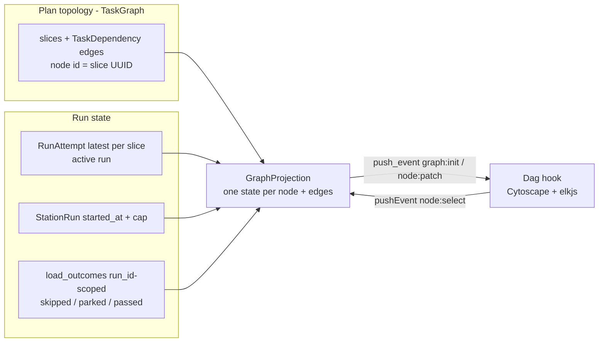

# feat: Cockpit living-graph spine (C1→C3)

## Summary

Build the foundational surface of the Conveyor cockpit: a Phoenix LiveView that
renders one run's task-dependency graph horizontally — Slices as nodes, the
stored `TaskDependency` edges drawn, execution state folded onto the nodes in
real time, with honest *blocked / idle / skipped / stalled* states and a
read-only node-detail panel. It is observe-only and replaces the current
nested-`<div>` `/runs` view. This is the Observability track's "LiveView
dashboard" made real (see `STRATEGY.md`).

---

## Problem Frame

The cockpit's centerpiece — a living dependency graph — does not exist. `/runs`
(`lib/conveyor_web/live/run_viewer_live.ex`) renders a 943-line nested-`<div>`
hierarchy, dumps each event as pretty JSON, and on every ledger event re-reads 17
tables and re-renders the whole page. The dependency edges that make the work a
graph are stored but never loaded by the web layer.

Research surfaced a deeper gap the ideation did not: **the browser runtime does
not exist.** There is no asset pipeline — no `assets/`, no `package.json`, no
esbuild, no `app.js`, and no layout emitting a `<script>`. The `"/live"` socket
is declared (`lib/conveyor_web/endpoint.ex:19`) and `/assets` is already served
(`endpoint.ex:27`), but with no client bundle the LiveView JS never loads, so
`connected?(socket)` is always false in a browser and the PubSub→refresh loop has
only ever run inside `LiveViewTest`. Standing up that runtime is therefore
prerequisite work, and a side benefit is that the existing realtime loop lights
up in a browser for the first time.

The cost of the gap is concrete for the solo operator: no glance-level read of
what is running, what is starved behind it, what silently skipped because an
upstream parked, or what is over its budget on a dead worker — and no way to
inspect a node without reading raw JSON. The spine turns the append-only ledger
into a legible, live picture, which is the prerequisite for trusting the factory
to run unattended.

---

## Requirements

Carried from origin (`docs/brainstorms/2026-06-25-conveyor-cockpit-spine-requirements.md`);
R-IDs match the origin. Acceptance examples AE1–AE6 referenced in unit test
scenarios are defined in the origin — see it for full text.

**Graph substrate**

- R1. Render one run's plan as a directed graph: Slices are nodes, stored
  `TaskDependency` edges (`from_slice → to_slice`) are drawn.
- R2. Layered layout, horizontal left-to-right, computed client-side.
- R3. Epics render as compound parent containers grouping their slices.
- R4. Layout recomputes only on structural change, never on a state change.
- R5. A run switcher selects which run's graph is shown; default is the
  active/most-recent run.

**Live event-fold**

- R6. On mount and on run-switch, reconstruct ordered state from the durable
  ledger, then keep applying deltas (ADR-09).
- R7. A ledger event updates only the node(s) it names — no full re-fetch, no
  whole-page re-render.
- R8. Delta application is idempotent and `occurred_at`-ordered; duplicates and
  out-of-order messages do not corrupt state; reconnect re-seeds without
  double-applying.
- R9. State transitions animate as attribute diffs, not relayout; edge-flow
  animation is limited to edges leaving the active node.

**Node-state taxonomy**

- R10. Each node shows exactly one computed state.
- R11. Blocked is computed from edges + ready-set and names its blocker; a parked
  upstream awaiting a human reads as such.
- R12. Ready-idle marks deps-met-but-not-running (width-1); surface a serial-tax
  count ("N could run now").
- R13. Skipped marks a slice skipped because an upstream parked; surface the count
  of starved downstream dependents.
- R14. Stalled marks a running slice past its wall-clock cap (per-slice 1h /
  per-run 8h) — a real, stored, event-free signal. Note: `StationRun.heartbeat_at`
  is **not** usable as a liveness signal (see KTD4); agent-session heartbeat-event
  recency is an optional later refinement.

**Node detail + parity**

- R15. Clicking a node opens a read-only panel: state, station/agent role,
  elapsed, recent events (compact), computed blocked/stalled reason.
- R16. Raw event payload reachable one level deeper, not the default.
- R17. Graph and panel are projections only and match the CLI/static-report
  authority for the same run (ADR-21).
- R18. The spine performs no mutations — observe-only.

---

## Key Technical Decisions

- KTD1. **New `CockpitLive`, not an in-place rewrite of `RunViewerLive`.** Build
  the cockpit as a fresh LiveView and swap it onto `/runs` at cutover, deleting
  the 943-line view and its test. Greenfield — no parallel legacy view, no
  compatibility shim.

- KTD2. **Scope the graph by a Plan's topology; overlay one run's state. Node id
  is the slice UUID.** `Slice`/`TaskDependency` carry no `run_id`, and
  `RunAttempt`/`StationRun` carry none either — `RunAttempt` identity is
  `[:slice_id, :attempt_no]` (`run_attempt.ex:222`). So live attempt/heartbeat/
  station state is **not** queryable by an arbitrary historical run. v1 resolves
  this by overlaying the **active / most-recent run** for live attempt state;
  historical runs selected via the switcher render only their `run_id`-scoped
  outcome fold (passed/skipped/parked — which `load_outcomes/1` does scope by
  `run_id`), with no live attempt state, since a finished run is not running.
  Load static topology from `Conveyor.TaskGraph` Ash queries and use the **slice
  UUID** as the Cytoscape node id throughout (not `WorkGraphBuilder`'s
  `stable_key`, which is for the driver) so live pings — whose `slice_id` is a
  UUID — match nodes with no secondary lookup. Epic compound-parent nodes use the
  epic UUID.

- KTD3. **Live overlay = fold the structured broadcast message, with a scoped
  re-read as the idempotency backstop** — not a 17-table refetch and not a
  full-ledger scan. The broadcast message is **structured**, not opaque: it
  carries `type`, `payload`, `slice_id`, `run_attempt_id`, `station_run_id`
  (`lib/conveyor/ledger.ex:50-53, 119-122`). On each `{:ledger_event, msg}` ping,
  fold the message's typed fields to patch the named slice's primary state — cheap,
  no DB round-trip, and it honors `occurred_at` order and renders intermediate
  states (R8, R9). Then recompute the affected slice plus its direct dependents'
  *derived* states (Blocked / Ready-idle) via a **scoped** projection query, and
  re-read the single slice's durable state as a reconciliation backstop so the
  overlay converges (idempotent). **Subscribe before seeding** (the existing view
  subscribes at `run_viewer_live.ex:30-31` before loading): a ping that arrives
  during the mount reconstruction then triggers an idempotent re-read rather than
  being dropped.

- KTD4. **Node states reuse existing logic where it exists; Stalled is cap-based.**
  Ready-idle and Blocked are computed from the `TaskDependency` edges + the
  ready-set. `Conveyor.TaskGraph.predecessors_satisfied?/3` is **private** (`defp`,
  `task_graph.ex:248`), so reimplement the small predecessor check inside the
  projection (or promote it to `def`). Skipped/parked/passed come from
  `Conveyor.Planning.RunReconstruction.load_outcomes/1` — but that function reads
  the **whole** ledger then `Enum.filter`s (`run_reconstruction.ex:69-76`); push
  the `run_id`/`type` filter into the Ash query instead (`Ash.Query.filter`
  precedent at `work_graph_builder.ex:41`) so per-ping and tick recomputes stay
  bounded. **Stalled = running past the wall-clock cap** (`StationRun.started_at`
  + per-slice 1h / per-run 8h vs now) — real, stored, event-free. Do **not** use
  `StationRun.heartbeat_at`: it is stamped once at lease-acquire (`station.ex:298`)
  and never refreshed in production (`Station.heartbeat!/2` has no `lib/` caller),
  so "heartbeat older than threshold" would mark every long-running station
  Stalled — the producer-vacuous trap. Because Stalled is time-based, a periodic
  LiveView tick re-evaluates it.

- KTD5. **Stand up the asset pipeline from zero as the first unit.** esbuild +
  `assets/js/app.js` connecting `LiveSocket` + a root layout emitting the bundle +
  the missing `ConveyorWeb.Layouts` module. This is the real net-new
  infrastructure; everything live depends on it, and it lights up the existing
  realtime loop in-browser.

- KTD6. **Cytoscape.js + elkjs in a `phx-hook`.** Canvas renderer; elkjs layered
  layout, direction RIGHT, via the `cytoscape-elk` adapter (Cytoscape has no
  built-in ELK binding; `elkjs` is the solver and `cytoscape-elk` bridges them).
  The seam is `phx-update="ignore"` + server `push_event` / client `handleEvent`
  for patches and client `pushEvent` for node selection. Relayout only on a
  structural delta (R4); state changes are attribute diffs on nodes (R9). Layered
  Sugiyama is correct for a hard-dependency DAG; force-directed is rejected.

- KTD7. **Subscribe to the existing global `"ledger_events"` topic; filter pings
  to the active run's plan slice-set** — no new per-run topic, no write-time
  backend change. `EventOutboxRelay` broadcasts `{:ledger_event, message}` on a
  single global topic (`event_outbox_relay.ex:21`). Because v1 overlays a single
  live run (KTD2), filtering by the displayed plan's slice-ids is sufficient;
  concurrent runs of the *same* plan would cross-contaminate the overlay and are a
  deferred limitation (see Scope Boundaries).

- KTD8. **No faked liveness.** Every state producer is driven by real, stored data
  and must actually fire — honoring the producer-vacuous learning
  (`docs/solutions/architecture-patterns/replay-fidelity-producer-vacuous-on-serial-driver.md`).
  The cap-based Stalled signal is real and fires on real over-budget runs; U6's
  anti-vacuity test exercises a production-representative over-cap station, not a
  hand-set fixture column.

---

## High-Level Technical Design

**Projection: one run's graph is an app-side join.** No single query returns it.
Static topology comes from the Plan; live state is joined from per-slice run rows
(active run) and the run-scoped outcome fold.



**Live overlay: subscribe, seed, then fold each ping's typed message.**

```mermaid
sequenceDiagram
  participant B as Browser (Dag hook)
  participant LV as CockpitLive
  participant L as Ledger (durable)
  participant P as PubSub "ledger_events"
  LV->>P: subscribe (before seeding)
  LV->>L: reconstruct ordered state (ADR-09)
  LV->>B: push_event graph:init (nodes+edges+states)
  P-->>LV: {:ledger_event, msg} (structured)
  LV->>LV: fold msg typed fields; recompute affected + dependents (scoped)
  LV->>B: push_event node:patch (named node + changed dependents)
  Note over LV: periodic tick re-evaluates Stalled from started_at + cap
```

**Node-state precedence** (each node resolves to exactly one, R10):

| State | Source | Rule |
|---|---|---|
| Stalled | `StationRun.started_at` + cap | running past per-slice/per-run cap |
| Running | slice `in_progress` / active StationRun | the live token |
| Skipped | `run.slice_outcome` fold (run-scoped) | upstream parked → driver skipped |
| Blocked | edges + ready-set | upstream incomplete (predecessor check) |
| Ready-idle | edges + ready-set | deps met, not running (serial-tax) |
| Done / Failed / Parked | `slice.state` / run outcome | terminal/known |

---

## Implementation Units

### U1. Stand up the browser asset pipeline + LiveView runtime

- **Goal:** Make LiveView connect in a real browser for the first time, and light
  up the existing `/runs` realtime loop as the proof.
- **Requirements:** Prerequisite for R6–R9 (no live overlay without a browser
  client).
- **Dependencies:** none.
- **Files:** `mix.exs` (add `:esbuild`), `config/config.exs` (esbuild profile +
  `assets.deploy`/`setup` aliases), `config/dev.exs` (esbuild watcher),
  `assets/js/app.js`, `assets/package.json`,
  `lib/conveyor_web/components/layouts.ex` (new — the missing module + root
  layout), `lib/conveyor_web.ex` (layout wiring), `lib/conveyor_web/router.ex`
  (`put_root_layout` → new root layout).
- **Approach:** Standard Phoenix 1.8 esbuild setup. `app.js` imports `phoenix` +
  `phoenix_live_view` and calls `new LiveSocket(...).connect()`. Create a minimal
  root layout whose `<head>` loads `~p"/assets/app.js"`; create
  `ConveyorWeb.Layouts` (referenced at `lib/conveyor_web.ex:43` but absent today);
  flip `plug :put_root_layout, false` (`router.ex:12`) to the new root layout.
  Because U3 adds npm libraries (Cytoscape/elkjs) that esbuild bundles from
  `assets/node_modules`, add an `npm ci --prefix assets` (or `npm install`) step to
  the `setup` and `assets.deploy` aliases now — the Elixir esbuild wrapper ships a
  binary that bundles from `node_modules` but does **not** create it. Keep existing
  inline CSS — Tailwind is out of scope. `/assets` static serving already exists
  (`endpoint.ex:27`).
- **Patterns:** Phoenix 1.8 default asset/layout structure; static plug already
  configured.
- **Execution note:** Net-new infra, zero local patterns — confirm a real browser
  reaches `connected?` true before moving on.
- **Test scenarios:** Smoke test that the root layout renders a
  `<script ... src="/assets/app.js">`. Existing `run_viewer_live_test.exs` and
  `parked_queue_live_test.exs` stay green. `Test expectation: none` for the
  esbuild/config wiring itself (build scaffolding).
- **Verification:** `mix setup && mix assets.build` populates `assets/node_modules`
  and emits `priv/static/assets/app.js`; in a browser `/runs` mounts connected and
  live-updates on a new ledger event.

### U2. Server-side graph projection (nodes + edges + computed states)

- **Goal:** A pure module that, given a plan and its selected run, returns the
  graph model — nodes (each with one computed state, keyed by slice UUID) + edges —
  by joining static topology with run state. Exposes both a full-graph build and a
  single-slice recompute (the entry point U4 calls per ping). Fully unit-testable
  without a browser.
- **Requirements:** R1, R10, R11, R12, R13, R14.
- **Dependencies:** none (can proceed parallel to U1).
- **Files:** `lib/conveyor_web/live/cockpit/graph_projection.ex`,
  `test/conveyor_web/live/cockpit/graph_projection_test.exs`.
- **Approach:** Load plan topology via `Conveyor.TaskGraph` (slices +
  `TaskDependency` edges), keyed by slice UUID. Join run state: latest `RunAttempt`
  per slice (highest `attempt_no`, pattern at `run_viewer_live.ex:824`) for the
  active run, its `StationRun`(s), and run outcomes via a **run-scoped** query
  (push the `run_id` filter into Ash; do not reuse `load_outcomes/1`'s full-ledger
  read verbatim). Compute one state per node per the precedence table. Reimplement
  the predecessor check locally — `TaskGraph.predecessors_satisfied?/3` is private —
  for Ready-idle/Blocked; plan-scope the ready-set (union epics, since
  `ready_tasks/1` is epic-scoped). **Stalled = `started_at` + cap < now** for a
  running StationRun (not `heartbeat_at`). Provide the serial-tax count (R12) and
  starved-dependent count (R13).
- **Patterns:** `task_graph.ex:124,248` (predecessor logic to mirror);
  `run_reconstruction.ex:69` (outcome shape — but scope the query);
  `Ash.Query.filter` precedent at `work_graph_builder.ex:41`.
- **Execution note:** Test-first — the taxonomy is the spine's correctness core.
- **Test scenarios:**
  - Ready-idle vs Blocked from edges + states (R11, R12).
  - Covers AE2. Blocked names the unmet upstream ("blocked by SLICE-003").
  - Covers AE3. Upstream parks → dependent is Skipped, with starved-dependent
    count.
  - Covers AE4. Running slice past its cap → Stalled; within cap → stays Running.
  - One-state-per-node precedence (Stalled over Running over Skipped, etc.).
  - Plan with no run yet → all Ready/idle (no run rows).
  - Empty graph and single-node graph.

### U3. CockpitLive shell + Cytoscape/elkjs graph hook (static topology)

- **Goal:** A new LiveView renders the graph model (U2) via a `phx-hook` mounting
  Cytoscape.js + elkjs, horizontal layered. Static render first — no live updates.
- **Requirements:** R1, R2, R3, R4.
- **Dependencies:** U1, U2.
- **Files:** `lib/conveyor_web/live/cockpit_live.ex`, `assets/js/hooks/dag.js`,
  `assets/package.json` (add `cytoscape`, `elkjs`, **`cytoscape-elk`**),
  `lib/conveyor_web/router.ex` (temporary `live "/cockpit"` route during build),
  `test/conveyor_web/live/cockpit_live_test.exs`.
- **Approach:** Container with `phx-hook="Dag"` + `phx-update="ignore"`. Hook
  `mounted()` registers the ELK adapter (`import elk from 'cytoscape-elk';
  cytoscape.use(elk)`) and inits Cytoscape with `layout: {name: 'elk', elk:
  {algorithm: 'layered', 'elk.direction': 'RIGHT'}}`. `mount/3` loads the model
  (U2) and `push_event("graph:init", %{nodes, edges})`; nodes carry `{id (slice
  UUID), label, state, epic_id}`; epics are Cytoscape compound parents keyed by
  epic UUID (R3). Layout recompute only on structural delta (R4).
- **Patterns:** `phx-update="ignore"` + `push_event` seam; LiveView test via
  `live/2` + `render`.
- **Test scenarios:**
  - Mount renders the hook container.
  - `graph:init` payload contains the plan's nodes + `TaskDependency` edges (R1).
  - Epics present as compound parents (R3).
  - `Test expectation:` layout/orientation is client-side (elkjs) — assert the
    server pushes a well-formed nodes/edges payload; verify orientation manually.

### U4. Live overlay — subscribe-then-seed, fold each ping, targeted patch

- **Goal:** Subscribe to `"ledger_events"`, seed from reconstruction, and on each
  structured ping fold its typed fields to patch the named node + recompute its
  dependents' derived states. A periodic tick re-evaluates Stalled from the cap.
- **Requirements:** R6, R7, R8, R9, R14.
- **Dependencies:** U2, U3.
- **Files:** `lib/conveyor_web/live/cockpit_live.ex` (mount, handle_info, tick),
  `assets/js/hooks/dag.js` (`handleEvent("node:patch")`),
  `test/conveyor_web/live/cockpit_live_test.exs`.
- **Approach:** `mount/3` **subscribes first** (`subscribe(Conveyor.PubSub,
  "ledger_events")`, the safe order at `run_viewer_live.ex:30-31`), then seeds the
  full model (U2). On `handle_info({:ledger_event, msg}, socket)`, filter to the
  active run's plan slice-set (KTD7), fold `msg`'s typed fields to set the named
  slice's primary state, recompute that slice + its direct dependents' derived
  states via U2's single-slice path, and `push_event("node:patch", %{...})` for the
  changed nodes only. A re-read of the named slice's durable state reconciles
  (idempotent). No relayout on a state patch (R9). A `Process.send_after` tick
  (~15–30s) recomputes Stalled (cap) for running nodes.
- **Patterns:** outbox-drain realtime test pattern —
  `EventOutboxRelay.publish_pending!()` then `render` (`run_viewer_live_test.exs:129`).
- **Execution note:** Exercise the realtime path with the outbox-drain pattern.
- **Test scenarios:**
  - Covers AE1. A `gate.failed` event patches only that node (and any dependent
    whose Blocked/Ready-idle flips); no full refetch; no relayout (R7, R9).
  - Covers AE5. Duplicate (`idempotency_key`) or out-of-order delta does not
    double-apply or regress (R8).
  - Covers AE6. Reconnect / run-switch re-seeds to the equivalent state, then
    resumes live (R6); a ping arriving during seed is not lost (subscribe-first).
  - Covers AE4. Stalled tick flips a running node past its cap (R14).
  - A ping for a slice outside the displayed plan is ignored.

### U5. Node-detail panel (read-only) + run switcher

- **Goal:** Clicking a node opens a read-only side panel; a lightweight switcher
  picks which run the graph shows.
- **Requirements:** R5, R11, R15, R16.
- **Dependencies:** U3 (panel); U3 + U4 (switcher — it re-seeds via U4's path).
- **Files:** `lib/conveyor_web/live/cockpit_live.ex` (handle_event
  `"node:select"`, panel + switcher render), `assets/js/hooks/dag.js` (node tap →
  `pushEvent("node:select")`), `test/conveyor_web/live/cockpit_live_test.exs`.
- **Approach:** Hook node-tap `pushEvent("node:select", %{id})`; server loads that
  slice's detail (latest attempt, station/agent role, elapsed, recent ledger
  events compact, blocked/stalled reason from U2) and assigns the panel; raw
  payload behind a disclosure, not default (R16). The compact event render
  replaces today's `format_payload` JSON dump. Switcher = a simple select of
  recent runs/plans → re-seed the graph (U4 path) for the chosen run (R5); for a
  historical run it shows the run-scoped outcome fold without live attempt state
  (KTD2). No mutation handlers — read-only.
- **Patterns:** `render_hook` for tests (first in the suite); compact event render
  vs `run_viewer_live.ex:739` JSON dump.
- **Test scenarios:**
  - `node:select` renders the panel with state, station, elapsed, reason
    (Covers R15).
  - Raw payload reachable but not the default view (R16).
  - A Blocked node's panel shows "blocked by SLICE-x" (R11).
  - Switching runs re-seeds the graph (R5).
  - Panel exposes no write action (R18 carried).

### U6. Cutover, projection parity & observe-only verification

- **Goal:** Make CockpitLive the `/runs` view, remove the old view, and prove
  parity + observe-only.
- **Requirements:** R17, R18; success criteria (parity, no faked liveness, no
  full refetch).
- **Dependencies:** U1, U2, U3, U4, U5.
- **Files:** `lib/conveyor_web/router.ex` (point `/runs` at CockpitLive, drop the
  temporary route); new `test/conveyor_web/live/cockpit_live_parity_test.exs`;
  remove `lib/conveyor_web/live/run_viewer_live.ex` and
  `test/conveyor_web/live/run_viewer_live_test.exs`.
- **Approach:** Swap the `/runs` route to CockpitLive; delete RunViewerLive and its
  test (greenfield, no legacy). Parity test: for a seeded run, assert CockpitLive's
  projection of blocked/parked authority matches the reconstruction / static-report
  authority for the same run (R17, ADR-21). Assert CockpitLive defines no
  domain-mutating `handle_event` (R18). No-faked-liveness: assert a running station
  **past its cap** shows Stalled and one **within** cap does not, via a
  production-representative path (KTD8) — not a hand-set column.
- **Patterns:** existing `mark_external` typed-action pattern is the parity
  reference for what observe-only excludes (`run_viewer_live.ex:42`).
- **Test scenarios:**
  - Covers R17. Graph projection authority == reconstruction authority for the same
    run.
  - R18. CockpitLive exposes no mutating `handle_event`.
  - No faked liveness: over-cap running slice → Stalled; within-cap → not Stalled.
  - `/parked` (`ParkedQueueLive`) is unaffected by the `/runs` swap.

---

## Scope Boundaries

### Deferred to later layers (origin)

- Time-travel scrubber, replay-debug freeze, diff-since-last-seen — the seed/fold
  enables them; the playhead UI is not v1.
- On-node controls (decide-a-gate, retry) — direction C10, the next layer on top.
- Prose run-narration (C4), gate card (C5), vacuity radar (C6), walk-away meter
  (C7), forecast (C8), failure fingerprinting (C9).
- Whole-factory / multi-run overview canvas.
- Latent-conflict "ghost" edges; semantic/LOD zoom and minimap.

### Hard non-goals (locked)

- Authoring/editing the graph, re-prioritizing, launching runs, mid-run guidance.
- Pause/resume (no pause domain action exists; backend-gated).
- A separate React SPA + new REST API.

### Deferred to follow-up work (plan-local)

- Tailwind/daisyUI styling — U1 keeps existing inline CSS; a styling pass is
  separate.
- A per-run PubSub topic and run-scoped live state (a `run_id` on
  `RunAttempt`/`StationRun`, or a `Run` resource). Until then, the live
  attempt/heartbeat overlay is the active run only, and concurrent runs of one
  plan would cross-contaminate the overlay (KTD2, KTD7).
- The `mark_external` write action: cutover removes `RunViewerLive`, the only UI
  exposing it. The observe-only spine has no replacement; the capability returns
  with the C10 on-node controls. Confirm this gap is acceptable for the interim.

---

## System-Wide Impact

- **First asset pipeline.** Adds esbuild, `assets/`, an `npm install` step, a root
  layout, and the `ConveyorWeb.Layouts` module. Changes how every page is served
  (root layout applies app-wide); `/parked` must be re-checked under the new
  layout.
- **Realtime loop goes live in-browser** for the first time (U1) — behavior that
  previously only ran in tests now runs in production browsers.
- **Replaces `/runs`.** The 943-line `RunViewerLive` is removed; its `mark_external`
  control goes with it (see Scope Boundaries).
- **ADR-09 / ADR-21 compliance** is load-bearing: subscribe-then-reconstruct, and
  projection parity with the CLI/static report.

---

## Risks & Dependencies

- **Asset pipeline from zero (highest risk).** No local pattern exists; esbuild +
  npm install + LiveSocket + layout wiring is the novel part, and the npm step is
  easy to miss (the esbuild wrapper bundles from `node_modules` but does not create
  it). Mitigation: U1 is isolated, ends at a verifiable "browser connects"
  milestone, adds the npm step up front, and reuses the standard Phoenix 1.8 setup.
- **Stalled signal correctness.** `heartbeat_at` is not refreshed in production, so
  the plan uses the wall-clock cap instead — real and event-free, but coarser (it
  catches over-budget, not a worker that died early within budget). Mitigation:
  cap is the honest v1 signal; agent-session heartbeat-event recency is the later
  refinement; U6 asserts no false Stalled (KTD8).
- **Run identity is not on the run rows.** `RunAttempt`/`StationRun` lack `run_id`,
  so live attempt state is the active run only; historical runs show outcome-fold
  state. If the operating model ever runs two plans concurrently, or shows a
  historical run's live detail, this needs a persisted run identity (deferred).
- **Per-ping read cost.** Folding the structured message avoids a DB read for most
  patches; the reconciliation re-read and outcome query must be Ash-scoped (not the
  full-ledger `Enum.filter` `load_outcomes/1` uses today), or per-ping cost grows
  with ledger size.
- **Single live token assumption.** The spine assumes runs are effectively serial;
  concurrent runs are deferred, with the switcher (R5) as the later seam.

---

## Sources / Research

- Origin requirements: `docs/brainstorms/2026-06-25-conveyor-cockpit-spine-requirements.md`.
- Strategy anchor: `STRATEGY.md` — Observability & Learning track ("the LiveView
  dashboard … makes the overnight promise legible when you wake up").
- ADR-09 (reconstruct then keep applying deltas): `docs/adrs/adr-09-causal-events-trace-propagation-pubsub-and-artifactstore-boundary.md`.
- ADR-21 (projection parity; UI controls = typed actions): `docs/adrs/adr-21-static-ui-parity-and-process-exit-error-key-conventions.md`.
- Producer-vacuous learning (no faked liveness): `docs/solutions/architecture-patterns/replay-fidelity-producer-vacuous-on-serial-driver.md`.
- Integration seams (verified this plan):
  - Ledger fold: `lib/conveyor/replay.ex`, `lib/conveyor/planning/run_reconstruction.ex` (`load_outcomes/1` reads the full ledger then filters — scope it).
  - Structured broadcast message: `lib/conveyor/ledger.ex:50-53, 119-122` (`type`, `payload`, `slice_id`, `run_attempt_id`, `station_run_id`); relay at `lib/conveyor/event_outbox_relay.ex:21` (`{:ledger_event, message}` on `"ledger_events"`).
  - Current view to replace: `lib/conveyor_web/live/run_viewer_live.ex` (subscribe `:30-31`, ledger handler `:37`, 17-table `load_projects/0` `:750`, JSON dump `:739`, `mark_external` `:42`).
  - Topology + states: `lib/conveyor/task_graph.ex` (`ready_tasks/1` `:124`, **private** `predecessors_satisfied?/3` `:248`), `lib/conveyor/planning/serial_driver.ex` (skip/`run.slice_outcome` emission), `lib/conveyor/factory/run_attempt.ex:222` (identity `[:slice_id, :attempt_no]` — no `run_id`).
  - Stalled signal: `lib/conveyor/station.ex:298` (`heartbeat_at` stamped at acquire), `:155` (`heartbeat!/2`, no `lib/` caller); use `StationRun.started_at` + caps instead.
  - Web wiring: `lib/conveyor_web/endpoint.ex` (`socket "/live"` `:19`, `Plug.Static` `:27`), `lib/conveyor_web/router.ex`, `lib/conveyor_web.ex`.
  - Test conventions: `test/conveyor_web/live/run_viewer_live_test.exs` (outbox-drain realtime pattern `:129`, `Ash.create!` seeding).
- Stack: Phoenix 1.8.8, phoenix_live_view 1.2, Elixir 1.20.1, Erlang 29.0.2. No
  existing asset pipeline (verified). Cytoscape ELK layout requires the
  `cytoscape-elk` adapter in addition to `elkjs`.
