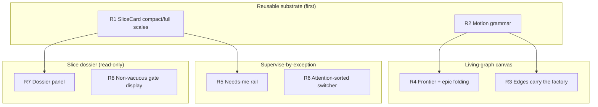
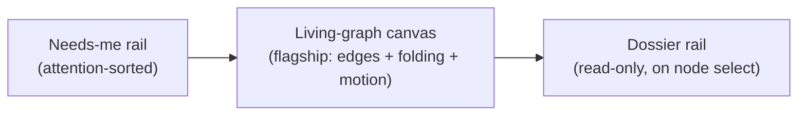
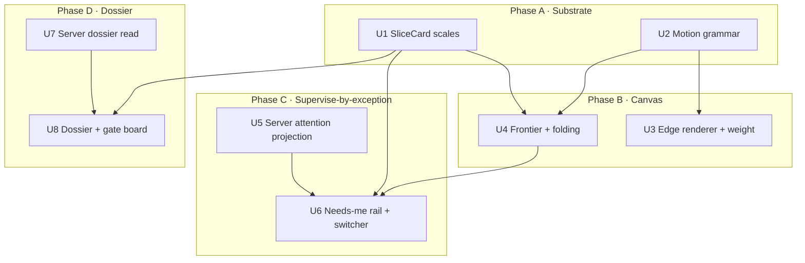
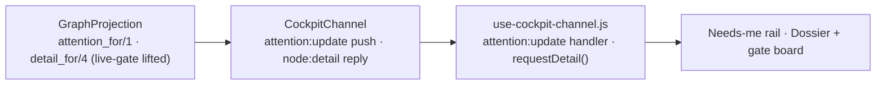

# Cockpit Living-Graph Identity - Plan

## Goal Capsule

- **Objective:** Build the distinctive living-graph identity and an observe/triage-by-exception surface onto the already-shipped observe-only React cockpit, sequenced so an executor can land it unit by unit.
- **Product authority:** The founder. DAG-stays-flagship, the run-wall-vs-inbox reconciliation, and build-the-whole-set are settled in the brainstorm.
- **Authority hierarchy:** Product Contract (WHAT) is authoritative over Planning Contract (HOW); the institutional learnings in Sources override convenience (state stays server-computed; gate verdicts are reflected, never upgraded).
- **Stop conditions:** Surface a blocker instead of guessing when implementation would change product scope, add an inbound mutation path, or re-derive node state on the client. Observe-only is a hard invariant.
- **Open blockers:** None blocking implementation. Three non-blocking implementation-time questions are in Open Questions.
- **Product Contract preservation:** changed — added AE8–AE11 for R1/R2/R6/R7 coverage; no product-scope change. All R-IDs and Requirements text preserved.

---

## Product Contract

### Summary

Add the identity and supervision craft the foundation deferred: edges that visualize flow and back-pressure, a state-change motion grammar, frontier-plus-epic-folding for large runs, a read-only slice dossier with a non-vacuous gate display, and a needs-me rail that surfaces the few items needing a human. The graph stays the flagship; the needs-me insight rides as a rail and an attention-sorted run switcher, not an inbox reframe. The work is mostly frontend craft on the shipped wire payload, plus two observe-only server read projections (the dossier detail, the needs-me attention signal).

### Problem Frame

The foundation (#33, #34) ported `/runs` to React + Inertia + React Flow over a Phoenix Channel and shipped the dark-cockpit color law, the nano `SliceCard`, the master-caution strip, and the ambient border. It is correct but plain: dependency edges are inert pass-through lines (`graph_serializer.ex:21`), `blocked_by` is sent to the client but never read, there is no motion beyond a fade on socket drop, and a large run renders every node at equal weight. The founder's driver is craft-debt — getting the identity language right before more screens land — not a demo deadline. So the priority is the reusable substrate and the distinctive node/edge/motion language the ideation argued must carry the identity, since the mono-plus-whitespace chrome reads as the generic dev-tool default.

### Key Decisions

- KD1. The DAG stays the flagship. The needs-me insight (#8) is absorbed as a rail plus an attention-sorted switcher; full inbox-as-spine and a full fleet/flight-strip wall (#7) are rejected for now. Building both a run-wall and an inbox is the trap the ideation warned against.
- KD2. The set is mostly frontend craft on the shipped wire payload and the observe-only protocol. Two observe-only server touches are needed: the dossier read extension (KD7) and a needs-me/attention projection for R5/R6 (KD8). Both are reads — no schema change and no inbound mutation path.
- KD3. Edge visuals derive client-side from the wired `edges` graph plus per-node `state` and `blocked_by`; no edge-payload enrichment is assumed. They do not use `starved_dependents` for live weighting — that field is populated only on `:skipped` nodes (`graph_projection.ex:390`) and is a skip-blast-radius count, not live back-pressure.
- KD4. R3 does not block on R4. The edge renderer ships first treating epic boundaries as pass-through (edges between visible nodes); collapsed-endpoint handling (edges into a folded epic chip) lands with R4.
- KD5. The motion grammar and the `SliceCard` compact/full scales are built first as the reusable substrate, extracted from the cockpit, so later screens inherit them.
- KD6. The ⌘K command palette and a generic `LiveRail` extraction are out of scope — speculative until a second screen or event-stream consumer exists.
- KD7. R7/R8 add an observe-only extension to `node:detail`: eager-load the already-modeled `gate_results`, `reviews`, and `evidence_records` from the run attempt and project them into the reply. `detail_for` currently overlays attempt data only when `live?` (`graph_projection.ex:167`), so a finished run gets `attempt=nil` and the dossier would be empty; the extension must lift that gating and select the correct attempt for finished slices. A read projection — no schema change, no mutation.
- KD8. The needs-me rail and attention sort need an observe-only server projection. The 8-state taxonomy and wire payload carry no `gate waiting` or `decision fork` signal, and `color-law.js` is a severity lookup, not a comparator — so R5/R6 require a server projection that surfaces the needs-a-human items plus an explicit attention-rank comparator.

### Requirements

**Reusable substrate**

- R1. `SliceCard` renders at compact (list) and full (detail-rail) scales beyond the shipped nano scale, from one primitive — the graph node, the list row, and the dossier header are the same component at different scales.
- R2. One motion-grammar object keyed by state change drives node and edge transitions: sub-300ms ease-out, animating only the elements a `node:patch` touched, held to a fixed budget, and disabled under `prefers-reduced-motion`. The same object is consumable by non-graph surfaces.

**Living-graph canvas**

- R3. Dependency edges encode flow and back-pressure: flow animates only on active paths, a source node's outgoing edges thicken and glow in proportion to how much live downstream work waits on it, and `blocked_by` edges render as dim tension that releases when satisfied. Live waiting-work is derived client-side by walking the wired `edges` and counting downstream dependents in waiting states — not from `starved_dependents`, which the server populates only on `:skipped` nodes. Edge motion is off by default.
- R4. The canvas renders the execution frontier (`running` + `ready_idle`) at full fidelity, folds the completed past into collapsed epic chips showing a "done / total · failed" rollup, and dims the foreshadowed future. Epics are foldable containers and zoom is the overview-vs-detail toggle; a pin keeps a chosen node from being auto-folded away.

**Supervise-by-exception**

- R5. A persistent needs-me rail in the shell lists only items needing a human (gate waiting, slice failed, decision fork), attention-sorted, each linking to its node or run. The rail navigates; it does not act.
- R6. The run switcher orders runs by attention (exception count and severity), and the selected run survives a page reload.

**Slice dossier (read-only)**

- R7. Selecting a node opens a read-only dossier — the slice's contract, the evidence it produced, and a failure fingerprint (state-transition sparkline plus the `blocked_by` chain) — using the existing `node:detail` channel read, with `SliceCard` full scale as its header. The sparkline is built from client-side `node:patch` accumulation (session-scoped; clears on reconnect), not from event-history seek (#10, deferred).
- R8. The gate renders as a go/no-go board: each verification check appears as a named controller reporting GO / NO-GO / STANDBY / Abstain with its evidence inline, so an opaque aggregate pass/fail cannot be shown. The board reflects the gate's own verdict vocabulary (Trust gate, Abstain, baseline_absent) and never upgrades an uncomputed dimension to pass. Display only — no approve/reject controls.

The new shell regions R5 and R7 add to the existing canvas without displacing it:

### Acceptance Examples

- AE1. Bottleneck reads off the wire
  - **Covers R3.** Given a node with many live downstream dependents in waiting states, its outgoing edges are the thickest and brightest on the canvas, identifiable without selecting any node.
- AE2. Tension releases on satisfy
  - **Covers R3.** Given a `blocked_by` edge, when its upstream dependency reaches `done`, the edge's tension styling releases to normal.
- AE3. A large run stays legible
  - **Covers R4.** Given a ~300-node run, the frontier band renders at full fidelity while completed epics show as collapsed chips, and zooming into an epic expands it with no mode switch.
- AE4. Pin survives auto-fold
  - **Covers R4.** Given a pinned node in a completing epic, when that epic would auto-fold, the pinned node stays visible.
- AE5. Needs-me rail is observe-only
  - **Covers R5.** Given an item in the needs-me rail, selecting it navigates to its node or run and the channel receives no mutation message.
- AE6. Non-vacuous gate
  - **Covers R8.** Given a gate with one failing check and one that abstained, the board shows the failing check as NO-GO with its evidence and the abstaining check as Abstain, and no single aggregate checkmark can render the gate as passed.
- AE7. Observe-only invariant holds
  - **Covers KD2.** Any inbound channel message other than `node:detail` is rejected.
- AE8. SliceCard scales are one primitive
  - **Covers R1.** Given the same node, the nano (DAG), compact (rail/list), and full (dossier header) renders apply the same color-law treatment and differ only in fields shown.
- AE9. Motion is calm and reduced-motion-safe
  - **Covers R2.** Given a `node:patch` that changes one node's state, only that node animates; given `prefers-reduced-motion`, no transition animates.
- AE10. Selected run survives reload
  - **Covers R6.** Given a selected run, when the page reloads, the same run is selected (read from the URL).
- AE11. Dossier handles a finished slice
  - **Covers R7.** Given a node in a finished (non-live) run, selecting it shows its committed gate verdict (from the run-scoped outcome payload) rather than an empty panel; the live run shows the fuller attempt-loaded gate/review/evidence detail.

### Success Criteria

- A healthy run is calm: no flowing edges and no saturated color; motion appears only where a delta lands.
- The single worst bottleneck is identifiable in roughly a glance from edge weight alone, without clicking a node.
- A several-hundred-node run is readable from across the room because the past is folded and the future is dimmed.
- The motion grammar and `SliceCard` scales are consumed by at least two cockpit surfaces (canvas plus dossier or rail), proving the substrate is reusable rather than one-screen.
- The needs-a-human items are correctly surfaced and reachable from the rail.
- The observe-only invariant is intact and no schema change ships; no node state, liveness, or attention is derived on the client.

### Scope Boundaries

**Deferred for later**

- Gate actions (approve / reject / retry / park / requeue) and the inbound mutation path and authority model they require (the rest of #6).
- The walk-away forecast / verdict (#9) — needs a pace-vs-plan model the server does not produce. The "since you last looked" re-entry recap is a cheaper follow-on frontend slice.
- Time transport / replay (#10) — needs event-history retention with a seek API; the ledger exists but has no seek (`event_outbox_relay.ex`).
- The ⌘K command palette and a generic reusable `LiveRail` extraction (the rest of #4) — until a second screen or event-stream consumer exists.
- The full needs-me-inbox-as-spine reframe (#8) and a full fleet/flight-strip wall (#7) — until concurrent overnight runs prove the need.

**Outside this product's identity (for now)**

- Inbox-as-spine that demotes the DAG to an evidence surface — explicitly rejected; the graph stays the flagship.
- Light mode / multi-theme — the cockpit is dark-mode-first only.

### Dependencies / Assumptions

- The node fields needed for the canvas are on the wire: `[:id, :label, :state, :epic_id, :title, :blocked_by, :starved_dependents]` (`lib/conveyor_web/live/cockpit/graph_serializer.ex:14`), plus the full `edges` list. R3 edge weight derives from a client-side downstream walk over `edges` + node `state` — not `starved_dependents`, which is skip-only (KD3).
- The `node:detail` channel read exists (`lib/conveyor_web/channels/cockpit_channel.ex:74`) and the client hook already has `requestDetail()` with no UI consuming it. Today it returns basic node fields only (`graph_projection.ex:166`); the per-check gate verdicts and evidence R7/R8 render are already modeled (`GateResult.stages` in `lib/conveyor/factory/gate_result.ex:31`, `Review.checks`/`findings` in `lib/conveyor/factory/review.ex:54`, `Evidence` arrays in `lib/conveyor/factory/evidence.ex:31`) and reachable via `RunAttempt has_many :gate_results, :reviews, :evidence_records` (`lib/conveyor/factory/run_attempt.ex:172`).
- Observe-only is a hard invariant: the channel rejects every inbound message except `node:detail` (`cockpit_channel.ex:83`). None of these slices add a mutation path.
- Attention ranking for R5/R6 cannot reuse `color-law.js` (a severity lookup, not a comparator), and `gate waiting` / `decision fork` are absent from the 8-state taxonomy and wire payload. R5/R6 need a new observe-only server projection plus an explicit attention-rank comparator (KD8).

---

## Planning Contract

### Key Technical Decisions

- KTD1. **Motion library.** Add `motion` (the Framer Motion successor, React 19 compatible) to `assets/package.json` — no animation dep is installed today. R2's grammar is one shared variants object keyed by state-change in a new `assets/js/lib/motion-grammar.js`, consumed by `slice-node.jsx` and edges. Honor `prefers-reduced-motion`.
- KTD2. **Edge weight is a client-side graph aggregation, not a server field.** Derive it by walking the wired `edges` from each source and counting downstream dependents whose `state` is in the waiting set; memoize in `CockpitCanvas` keyed on the graph. Register a custom edge component in a module-scope `edgeTypes` map in `Cockpit.jsx` (mirror the existing module-scope `nodeTypes` at `assets/js/pages/Cockpit.jsx:13`). This is aggregation of server-emitted states, not client re-derivation of state — consistent with the server-computed-state learning.
- KTD3. **Epic folding uses React Flow v12 sub-flows.** Inject epic parent nodes and assign member `parentId` in `assets/js/lib/flow.js` (`toFlowNodes`); collapse completed epics to a chip, expand on zoom-in (semantic zoom), and pass `onlyRenderVisibleElements` to keep node counts in React Flow's comfortable range. Frontier = `running` + `ready_idle`.
- KTD4. **Attention is server-computed and pushed observe-only.** Add `GraphProjection.attention_for/1` (mirror `list_runs` at `graph_projection.ex:262`) surfacing needs-a-human items: failed slices (state), and gate-waiting from verdicts that route to a human (`Review.recommendation :ask_human`, `Review.decision :needs_rework`/`:rejected`, `RunAttempt.outcome :needs_rework`/`:abstained`/`:policy_blocked`) — there is no live "paused awaiting human" hold state, only these verdicts. Per-run attention rollups for the switcher derive from run-scoped ledger outcomes for non-active runs (the same run-scoping limit as KTD5), not attempt rows. Push `attention:update` from the channel in `apply_recompute` and `after_join`, stamped with `next_seq`, mirroring `maybe_push_runs` (`cockpit_channel.ex:145`). The client only paints — no client-side state, liveness, or attention math (institutional learning).
- KTD5. **Dossier read reflects, never upgrades, gate verdicts — two sources by run liveness.** `RunAttempt`/`GateResult` carry no `run_id` (it lives only in `LedgerEvent` payloads), and a finished slice's latest attempt belongs to a *later* run — which is exactly why `detail_for`'s `live?` gate exists (`graph_projection.ex:167`). So branch by liveness: for the **live** run, `Ash.load(latest_attempt_row, [:gate_results, :reviews, :evidence_records], domain: Factory)` and project gate `stages`/`passed`/`trust_score`, review `decision`/`recommendation`/`findings`, evidence `acceptance_results`/`risks`. For a **finished** run, project the committed verdict from the run-scoped `run.slice_outcome` ledger payload's `gate_result` field (mirror `load_outcomes_scoped` at `graph_projection.ex:491`) — the payload-level verdict, since attempt-associated reviews/evidence cannot be tied to a past run. Render Abstain / baseline_absent as themselves; never paint an uncomputed dimension green (two-surface split). Read `lib/conveyor/gate/trust_evidence.ex` and `trust_score.ex` for verdict semantics; use CONCEPTS vocabulary (Trust gate, Abstain).
- KTD6. **SliceCard scales via `class-variance-authority`** (already installed). Keep the inline `var(--color-${token})` approach (`slice-card.jsx:20`) so colors stay off the Tailwind purge path; do not switch to dynamic Tailwind classes.
- KTD7. **Sparkline is session-scoped.** Build the R7 failure-fingerprint sparkline from client-side `node:patch` accumulation that clears on reconnect; do not reach for the deferred event-history seek (#10).
- KTD8. **XSS-safe rendering for new surfaces.** Agent/repo-derived fields (review `findings`, `recommendation`, contract/summary text, slice `title`/`label`) render via JSX text interpolation only — no `dangerouslySetInnerHTML` in the dossier, gate board, or rail — consistent with the foundation's posture for node text.

### High-Level Technical Design

Unit dependency and phase structure:

Server reads (U5, U7) are independent of the frontend phases and can land in parallel with Phase A/B. Both extend existing read paths and push/reply over the existing observe-only channel:

### Assumptions

- `motion` is the chosen animation dependency (R2 named none); selected for React 19 compatibility and the variants-object API the grammar needs.
- Interaction-state resolutions adopted as planning decisions (from the document review): pin = hover pin-icon on the node header, click to pin/unpin, component-local state; dossier dismiss = Escape or canvas-background click, second-node-select replaces in place; rail empty = stays visible with an "all clear" calm marker; rail item targeting a node in a folded epic auto-expands that epic before centering; the dossier occupies a fixed/always-present column so the canvas does not reflow on open; R6 persistence = URL parameter.
- R4 ships folding unconditionally and degrades gracefully on small runs (the brainstorm scoped it in; the "defer if runs are small" review note is resolved toward building it).
- `attention_for/1` surfaces the needs-a-human categories that exist in the model today (failed slices, gate-waiting). A `decision fork` signal is surfaced only if a server-side concept exists; otherwise it is deferred (see Open Questions).

---

## Implementation Units

### U1. SliceCard compact + full scales

- **Goal:** One `SliceCard` primitive renders at compact and full scales in addition to the shipped nano scale.
- **Requirements:** R1
- **Dependencies:** none
- **Files:** `assets/js/components/slice-card.jsx`, `assets/js/components/slice-card.test.jsx`, `assets/js/components/slice-node.jsx`
- **Approach:** Add a `scale` prop (`nano` | `compact` | `full`) driving a `class-variance-authority` variant map for layout/density; keep the `colorLaw`-driven `var(--color-${token})` treatment and `data-state`/`data-severity` attributes identical across scales. Nano stays the DAG node; compact adds title + elapsed + epic + starved badge for list/rail rows; full adds the field block for the dossier header. `slice-node.jsx` passes `scale="nano"`.
- **Patterns to follow:** the deferred-scales comment at `slice-card.jsx:7`; CVA usage already in the dep set; `colorLaw` call shape at `slice-card.jsx:20`.
- **Execution note:** Test-first on the props→rendered-treatment contract.
- **Test scenarios:**
  - Covers AE8. The same node at nano, compact, and full applies the same color-law token/icon and severity, differing only in fields shown.
  - A `failed` node renders the warning treatment and failed icon at each scale.
  - Compact shows `starved_dependents` badge when present; full shows the `blocked_by` field.
- **Verification:** `slice-card.test.jsx` passes; nano render is unchanged from current behavior.

### U2. Motion grammar

- **Goal:** A shared, reduced-motion-safe state-change motion grammar consumed by the canvas.
- **Requirements:** R2
- **Dependencies:** none
- **Files:** `assets/package.json` (add `motion`), `assets/js/lib/motion-grammar.js`, `assets/js/lib/motion-grammar.test.js`, `assets/js/components/slice-node.jsx`
- **Approach:** One variants object keyed by state-change (e.g. `running→done`, `*→failed`, `blocked→ready_idle`) with sub-300ms ease-out and a fixed budget; a selector maps an old→new state pair to its variant. `slice-node.jsx` animates only on a state change in its `data`. Gate all motion on `prefers-reduced-motion`.
- **Patterns to follow:** memoized `slice-node.jsx` wrapper; the `motion` library's variants API.
- **Execution note:** Test-first — the variant selection is a pure mapping.
- **Test scenarios:**
  - Covers AE9. A state-changing pair selects its variant; an unchanged node selects none.
  - Under `prefers-reduced-motion`, the selector yields a no-animation variant.
  - An unknown state pair falls back to a safe default rather than throwing.
- **Verification:** `motion-grammar.test.js` passes; a node patch animates only the changed node in the running app.

### U3. Custom edge renderer + client-side weight

- **Goal:** Dependency edges show flow and back-pressure derived from the wired graph.
- **Requirements:** R3
- **Dependencies:** U2
- **Files:** `assets/js/components/flow-edge.jsx`, `assets/js/lib/edge-weight.js`, `assets/js/lib/edge-weight.test.js`, `assets/js/lib/flow.js`, `assets/js/pages/Cockpit.jsx`
- **Approach:** `edge-weight.js` walks `edges` from each source and counts downstream dependents whose `state` is in the waiting set, with a normalization/scale function so a high-waiter node does not dominate. `flow.js` `toFlowEdges` adds `type` and `data: { weight, tension }` (tension when the target's `blocked_by` includes the source). `flow-edge.jsx` renders thickness/glow from weight and dim-dashed tension that releases when the block clears; flow animation (via U2) is off by default and active-path-only. Register `edgeTypes` at module scope in `Cockpit.jsx` (mirror `nodeTypes` at line 13) and pass `edgeTypes` to `<ReactFlow>`; compute weights in `CockpitCanvas`, memoized on the graph.
- **Patterns to follow:** `toFlowEdges` at `flow.js:5`; module-scope `nodeTypes` and the `CockpitCanvas` memo at `Cockpit.jsx:13,18-28`.
- **Execution note:** Test-first on `edge-weight.js` (pure).
- **Test scenarios:**
  - Covers AE1. A source with N downstream dependents in waiting states gets proportionally higher weight than one with fewer; weight ignores `starved_dependents`.
  - Covers AE2. An edge whose target `blocked_by` includes the source renders tension; when the source reaches `done`, tension clears.
  - The scale function caps a very-high-waiter node so it does not dominate; zero-waiter edges render at base weight.
- **Verification:** `edge-weight.test.js` passes; the canvas shows the heaviest edge on the real bottleneck.

### U4. Frontier + epic folding

- **Goal:** The canvas folds completed epics, renders the frontier at full fidelity, and supports pin + semantic zoom.
- **Requirements:** R4
- **Dependencies:** U1, U2
- **Files:** `assets/js/lib/folding.js`, `assets/js/lib/folding.test.js`, `assets/js/components/epic-chip.jsx`, `assets/js/lib/flow.js`, `assets/js/pages/Cockpit.jsx`
- **Approach:** `folding.js` classifies the frontier (`running` + `ready_idle`), the foldable past (epics with no frontier members), and the dimmed future, and computes per-epic rollups (`done/total · failed`). `flow.js` `toFlowNodes` injects epic parent nodes and assigns member `parentId`; a folded epic renders as `epic-chip.jsx` (a compact `SliceCard`-styled rollup); zoom-in expands it (semantic zoom) and `onlyRenderVisibleElements` is enabled. A pinned node (hover pin-icon, component-local set) is excluded from auto-fold. A `node:patch` to a member of a folded epic updates the chip rollup and pulses the chip once (U2); it does not auto-expand.
- **Patterns to follow:** `toFlowNodes`/`topologyKey` at `flow.js:16,33`; `@xyflow/react` v12 `parentId` sub-flows and `onlyRenderVisibleElements`.
- **Test scenarios:**
  - Covers AE3. Frontier members render full-fidelity; a completed epic folds to a chip with the correct `done/total · failed` rollup; zoom-in expands it.
  - Covers AE4. A pinned node in an otherwise-completed epic stays visible when the epic folds.
  - A `node:patch` to a folded member updates the chip rollup and does not auto-expand the epic.
  - `folding.js` classification is correct for an all-done run, an all-frontier run, and a mixed run.
- **Verification:** `folding.test.js` passes; a large run renders folded with the frontier legible.

### U5. Server attention projection

- **Goal:** A server-computed needs-me/attention signal pushed observe-only.
- **Requirements:** R5, R6
- **Dependencies:** none
- **Files:** `lib/conveyor_web/live/cockpit/graph_projection.ex`, `lib/conveyor_web/channels/cockpit_channel.ex`, `test/conveyor_web/channels/cockpit_channel_test.exs`
- **Approach:** Add `GraphProjection.attention_for/1` (mirror `list_runs` at `graph_projection.ex:262`) returning needs-a-human items (failed slices; gate-waiting from human-routing verdicts per KTD4) with a server-computed attention rank, plus per-run attention rollups derived from run-scoped ledger outcomes for non-active runs (the KTD5 run-scoping limit). Push `attention:update` from `cockpit_channel.ex` in `handle_info(:after_join, …)` and `apply_recompute` (line 106), stamped with `next_seq` (line 183), mirroring `maybe_push_runs` (line 145). Derive "stalled/over-time" from `started_at` + per-station cap, never `heartbeat_at` (institutional learning). Leave the observe-only reject clause (line 83) intact.
- **Patterns to follow:** `list_runs` (`graph_projection.ex:262`); `maybe_push_runs` + `next_seq` (`cockpit_channel.ex:145,183`).
- **Execution note:** Test-first — port the `runs:update` channel assertion to `attention:update`.
- **Test scenarios:**
  - `attention:update` is pushed on `after_join` and on a recompute that changes attention, each with a monotonic `seq`.
  - A failed slice and a gate-waiting attempt both appear, server-ranked; a fully-nominal run yields an empty attention set.
  - Covers AE7. Any inbound message other than `node:detail` is still rejected.
- **Verification:** channel tests pass; attention items match server-computed state, not client inference.

### U6. Needs-me rail + attention-sorted switcher

- **Goal:** The shell surfaces the needs-me rail and an attention-sorted, reload-stable run switcher.
- **Requirements:** R5, R6
- **Dependencies:** U5, U4, U1
- **Files:** `assets/js/components/needs-me-rail.jsx`, `assets/js/components/needs-me-rail.test.jsx`, `assets/js/hooks/use-cockpit-channel.js`, `assets/js/lib/color-law.js`, `assets/js/pages/Cockpit.jsx`, `assets/js/pages/Cockpit.test.jsx`
- **Approach:** Add an `attention:update` handler (4th `channel.on`, registered before `join()` near `use-cockpit-channel.js:56`) with matching state, returned from the hook. `needs-me-rail.jsx` lists items as compact `SliceCard`s, sorted by the server rank; empty → a visible "all clear" calm marker (never hidden). Clicking an item centers/selects its node (`setCenter`, mirror the master-caution jump at `Cockpit.jsx:31-34`); if the target is in a folded epic, expand first (U4). Add a `byAttention(nodes)` comparator beside `topException` in `color-law.js:80` for any client-side tie-ordering of equal server ranks. Mount the rail in the `flex-1 p-2` region (`Cockpit.jsx:94`). `RunSwitcher` (`Cockpit.jsx:90`) orders by the per-run attention rollup and reads/writes the selected run as a URL parameter so reload restores it.
- **Patterns to follow:** handler-before-join registration (`use-cockpit-channel.js:46-66`); `topException`/`overallSeverity` (`color-law.js:80,94`); master-caution jump (`Cockpit.jsx:31-38`).
- **Test scenarios:**
  - Covers AE5. Selecting a rail item navigates to its node and pushes no mutation message.
  - The rail lists only needs-a-human items in server-rank order; empty state shows the "all clear" marker and the rail stays visible.
  - A rail item whose node is in a folded epic expands the epic before centering.
  - Covers AE10. The switcher orders runs by attention; the selected run is read from the URL on reload.
- **Verification:** `needs-me-rail.test.jsx` and the `Cockpit` test pass; reload restores the selected run.

### U7. Server dossier read extension

- **Goal:** `node:detail` returns gate/review/evidence detail for live and finished slices.
- **Requirements:** R7, R8
- **Dependencies:** none
- **Files:** `lib/conveyor_web/live/cockpit/graph_projection.ex`, `test/conveyor_web/live/cockpit/graph_projection_test.exs`, `test/conveyor_web/channels/cockpit_channel_test.exs`
- **Approach:** In `detail_for` (`graph_projection.ex:166`), branch by run liveness (KTD5). Live run: `Ash.load(latest_attempt_row, [:gate_results, :reviews, :evidence_records], domain: Factory)` and project gate `passed`/`stages`/`trust_score`, review `decision`/`recommendation`/`findings`/`checks`, evidence `acceptance_results`/`risks`/`summary`. Finished run: project the committed verdict from the run-scoped `run.slice_outcome` payload's `gate_result` field (mirror `load_outcomes_scoped` at line 491) — `RunAttempt`/`GateResult` carry no `run_id` to tie to a past run. Reflect Abstain / baseline_absent verbatim — never synthesize a verdict for an uncomputed dimension. The `node:detail` reply already wraps `node_detail/2` (`cockpit_channel.ex:74`); only the projected map grows. Read `lib/conveyor/gate/trust_evidence.ex` and `trust_score.ex` for verdict field semantics.
- **Patterns to follow:** run-scoped loading `load_outcomes_scoped` (`graph_projection.ex:491`); attempt-row selection (`graph_projection.ex:197`); the `node:detail` reply test (`cockpit_channel_test.exs:139-152`).
- **Execution note:** Test-first; extend the existing `node:detail` reply assertion to cover the new keys and the finished-run case.
- **Test scenarios:**
  - Covers AE11. `node:detail` for a slice in a finished run returns the committed gate verdict from its run-scoped outcome payload (not nil); a slice in the live run returns the fuller attempt-loaded gate/review/evidence.
  - A gate with an abstaining dimension projects `Abstain` / `baseline_absent` rather than a pass.
  - Covers AE7. A mutation message is still rejected (`observe-only`); `node:detail` replies `:ok`.
- **Verification:** projection and channel tests pass; a finished-slice dossier query returns real verdicts.

### U8. Slice dossier + non-vacuous gate board

- **Goal:** Selecting a node opens a read-only dossier with a non-vacuous gate board.
- **Requirements:** R7, R8
- **Dependencies:** U7, U1
- **Files:** `assets/js/components/dossier-panel.jsx`, `assets/js/components/dossier-panel.test.jsx`, `assets/js/components/gate-board.jsx`, `assets/js/components/gate-board.test.jsx`, `assets/js/lib/state-sparkline.js`, `assets/js/lib/state-sparkline.test.js`, `assets/js/pages/Cockpit.jsx`
- **Approach:** Wire `requestDetail` (already destructured-unused at `Cockpit.jsx:79`) to lift selection state; mount `dossier-panel.jsx` in a fixed right column (`Cockpit.jsx:94`) that is always in the DOM so the canvas does not reflow on open. The panel shows the contract, evidence, and a failure fingerprint: a `state-sparkline.js` built from session-scoped `node:patch` accumulation (cleared on reconnect) plus the `blocked_by` chain, with a full-scale `SliceCard` header (U1). `gate-board.jsx` renders one named-controller row per check (GO / NO-GO / STANDBY / Abstain) with evidence inline and no aggregate checkmark; all agent-derived text renders via JSX interpolation (no `dangerouslySetInnerHTML`). In-flight → skeleton; channel error/timeout → inline retry banner; Escape or canvas-background click dismisses; selecting another node replaces content in place.
- **Patterns to follow:** `requestDetail` promise (`use-cockpit-channel.js:76-81`); `SliceCard` full scale (U1); `colorLaw` tokens for verdict coloring; CONCEPTS vocab (Trust gate, Abstain).
- **Execution note:** Test-first on the gate-board props→render contract and the sparkline accumulation.
- **Test scenarios:**
  - Covers AE6. With a failing check and an abstaining check, the board shows NO-GO with evidence and Abstain respectively, and renders no single aggregate pass checkmark.
  - The dossier shows a loading skeleton while `node:detail` is in flight and an inline retry on error; Escape and canvas-click both dismiss.
  - `state-sparkline.js` accumulates `node:patch` state changes for a node and resets on reconnect.
  - Agent-derived `findings` text is rendered as text (no HTML injection); a `<script>`-bearing finding does not execute.
- **Verification:** dossier and gate-board tests pass; selecting a node opens the dossier with a non-vacuous gate; no canvas reflow on open.

---

## Verification Contract

- **Client tests:** `cd assets && npx vitest run` — all new `*.test.{js,jsx}` pass (co-located with source; jsdom, `phoenix` aliased to the test stub).
- **Server tests:** `MIX_ENV=test mix test test/conveyor_web/channels/cockpit_channel_test.exs test/conveyor_web/live/cockpit/graph_projection_test.exs` — channel and projection suites pass. DB-backed tests require a Postgres instance per the project setup.
- **Quality gates:** `mix format --check-formatted`, `mix compile --warnings-as-errors`, and `mix credo --strict` are clean for changed files.
- **Observe-only gate:** the channel still replies `{:error, %{reason: "observe-only"}}` to any inbound message other than `node:detail` (AE7) — no unit may add an inbound mutation handler.
- **Server-computed-state gate:** no client module derives node state, liveness, attention, or "stalled" from raw timestamps; the client renders server-emitted state/attention tokens only.
- **Per-unit:** each unit's enumerated test scenarios pass.

---

## Definition of Done

- All eight units' test scenarios pass; the Verification Contract gates are green for changed files.
- The Acceptance Examples (AE1–AE11) are demonstrably satisfied.
- Observe-only invariant intact (no inbound mutation path); no schema change shipped; the two server touches (U5 attention, U7 dossier) are reads only.
- The gate board renders Abstain / baseline_absent honestly and never upgrades an uncomputed dimension to pass.
- No client-side derivation of node state, liveness, or attention.
- New agent-derived rendered text is XSS-safe (no `dangerouslySetInnerHTML` on the new surfaces).
- Abandoned-attempt and dead-end code from the run is removed; the diff contains only the shipped design.

---

## Open Questions

**Deferred to implementation (non-blocking)**

- Whether a server-side `decision fork` signal exists for `attention_for/1`. If the model has no such concept, R5 ships with `slice failed` + `gate waiting` and decision-fork is deferred (U5).
- The exact field subset of `gate_results` / `reviews` / `evidence_records` the dossier projects. Some fields (raw `findings` prose, `tool_invocation_refs`) are more sensitive over the unauthenticated cockpit socket than status enums; project the minimum the gate board needs (U7).
- The precise membership of the "waiting" state set used for edge-weight counting (which of `ready_idle` / `blocked` / `stalled` count as live downstream waiters) (U3).

---

## System-Wide Impact

- **New observe-only channel message.** `attention:update` joins `graph:init` / `node:patch` / `runs:update` as a server→client push; it carries no new inbound path. The `node:detail` reply payload grows but stays a read.
- **Data exposure on the unauthenticated socket.** The foundation accepts an unauthenticated cockpit socket under a trusted-network assumption (foundation plan KD10), which previously exposed only DAG topology. U7 widens the `node:detail` reply to include gate verdicts, review findings, and evidence over that same socket. This is accepted within the existing trusted-network boundary; the U7 field-subset question above bounds how much sensitive detail is surfaced.
- **New frontend dependency.** `motion` is added to `assets/package.json` (KTD1); no other runtime deps change.

---

## Sources / Research

- Ideation: `docs/ideation/2026-06-26-cockpit-frontend-redesign-ideation.html` — 10 ranked ideas; this plan is the Tier-A (frontend-on-existing-data) subset plus the #7/#8 reconciliation.
- Shipped foundation and its scope boundaries: `docs/plans/2026-06-26-001-feat-cockpit-foundation-plan.md` (#33, #34).
- Institutional learnings (carry forward): node state must stay server-computed — never re-derive liveness/attention on the client from raw timestamps (`docs/solutions/architecture-patterns/liveness-producer-vacuous-on-heartbeat-at.md`); a gate/evidence display must be non-vacuous — reflect the gate's own verdicts including Abstain/baseline_absent, never certify an uncomputed signal, keep display fields independent of gate-decision fields (`docs/solutions/architecture-patterns/replay-fidelity-producer-vacuous-on-serial-driver.md`).
- Domain vocabulary: `CONCEPTS.md` (Trust gate, Abstain, Replay fidelity/divergence, Run/Slice).
- Frontend hook points: `assets/js/pages/Cockpit.jsx:13,18,79,90,94`, `assets/js/components/slice-card.jsx:7,11,20`, `assets/js/lib/color-law.js:61,80,94`, `assets/js/lib/flow.js:5,16,33`, `assets/js/hooks/use-cockpit-channel.js:46-66,76-81`. Stack: React 19, `@xyflow/react ^12.11`, `class-variance-authority`, `lucide-react` (`assets/package.json`); no motion lib installed.
- Server hook points: `lib/conveyor_web/channels/cockpit_channel.ex:74,83,106,145,183`, `lib/conveyor_web/live/cockpit/graph_projection.ex:156,166,167,197,262,390,491`, gate field semantics in `lib/conveyor/gate/trust_evidence.ex` and `trust_score.ex`.
- Dossier/gate data model: `lib/conveyor/factory/gate_result.ex:31`, `review.ex:54`, `evidence.ex:31`, associations in `run_attempt.ex:172`.
- Test patterns: `assets/vitest.config.js` (jsdom, `phoenix` stub alias), co-located `*.test.jsx`; `test/conveyor_web/channels/cockpit_channel_test.exs:139-152` (`node:detail` reply + observe-only reject), `test/support/channel_case.ex`.
- Product rationale for supervise-by-exception: `STRATEGY.md` (the unattended walk-away thesis behind R5/R6).
