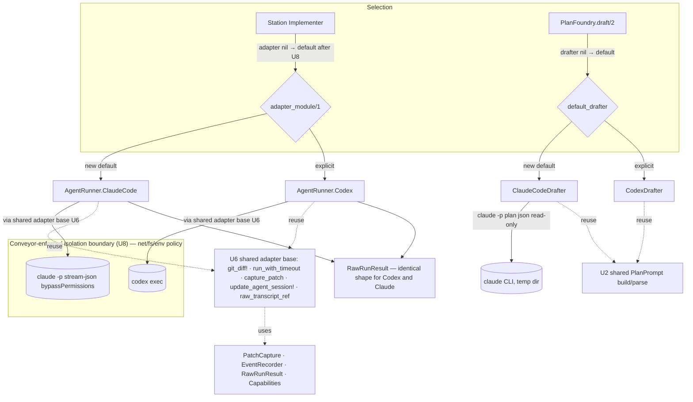

# Claude Code Agent Backend - Plan

## Goal Capsule

- **Objective:** Make Conveyor run end-to-end on Claude Code at both agent touchpoints — station execution and Plan Foundry drafting — while keeping Codex selectable, so the runtime can be dogfooded with only a Claude Code subscription. Document review surfaced that Conveyor does not actually contain the agent subprocess (it relied on Codex's `--sandbox` flag), so closing that containment gap is now in scope.
- **Product authority:** Robert Guss (owner, dogfooder).
- **Authority hierarchy:** Product Contract governs WHAT; the Planning Contract governs HOW. Repo conventions and `CLAUDE.md`/`AGENTS.md` override plan defaults where they conflict.
- **Execution profile:** Strict TDD. Spike-first (U7) to pin CLI/runtime unknowns; containment (U8) is the load-bearing safety unit; feature units are test-first via the injectable subprocess seam.
- **Open blockers:** None blocking. The agent-containment mechanism (U8) is decided: pull ROADMAP M6's blast-radius isolation forward by wiring existing infra (`DockerRunner` + `ToolchainRunner` hermetic backend + `Sandbox.Reaper`), with `unshare -n` + egress policy as the D1-sanctioned no-Docker host path — no new runtime dependency. The only residual is which host-path variant to ship (Docker vs `unshare -n`), pinned by the U7 spike. The default flip (U4) is gated behind U8; U1–U3, U6, U7, U2 proceed in parallel.
- **Tail ownership:** Implementer runs the Verification Contract gates and the `:live_agent` smoke before declaring done.
- **Product Contract preservation:** changed — R2 (containment premise corrected: Conveyor's isolation is not currently enforced for the agent, so the plan builds it) and added R11 (Conveyor-owned agent containment). All other R-IDs carried verbatim. The requirements-only Outstanding Questions are resolved or moved to the Planning Contract's Open Questions.

---

## Product Contract

### Summary

Add Claude Code as a first-class Conveyor agent backend at both touchpoints — the station runner (`Conveyor.AgentRunner`) and the Plan Foundry drafter (`Conveyor.Planning.PlanFoundry.Drafter`) — driven by the headless `claude` CLI the same way Codex's CLI is driven today, authenticated through the operator's existing Claude subscription.
Claude Code becomes the new default backend so a full intent → plan → station → gate run completes with no Codex subscription, while Codex stays a selectable second implementation.
Because the default agent now runs with `bypassPermissions`, and because Conveyor was found to rely on the agent CLI's own sandbox flag rather than containing the agent itself, this work also makes containment a Conveyor-owned property: the agent subprocess runs inside a Conveyor-enforced isolation boundary.

### Problem Frame

Conveyor's two live agent paths — station execution and plan drafting — both default to driving the OpenAI Codex CLI as a subprocess, so running either requires a paid Codex subscription.
The owner pays for Claude Code, not Codex, so today the runtime cannot be exercised at all, blocking the dogfood goal on the `docs/dogfood-readiness` track at the first agent call.
The backend abstraction already exists, so the integration gap is a missing implementation, not a missing seam.
A second problem surfaced during planning: Conveyor never actually contained the agent subprocess. The agent runs on the host with only `cd: workspace_path`; the declared `%Policy{}` (including `network_policy: none`) is ignored by the adapter, and filesystem-write confinement came solely from Codex's `--sandbox workspace-write` flag. Network egress was never contained for either backend. Defaulting to Claude Code's `bypassPermissions` removes even that filesystem confinement, so containment must move to where it belongs — Conveyor.

### Key Decisions

- **Pluggable alongside Codex, not a replacement.** A second backend is added at both touchpoints; nothing about Codex is removed. The existing `AgentRunner` and `Drafter` behaviours already support per-invocation substitution.
- **Containment is Conveyor's responsibility, not the agent's or the CLI flag's.** The agent subprocess runs inside a Conveyor-enforced isolation boundary (filesystem scoped to the workspace, network per `%Policy{}`, env scrubbed). `bypassPermissions` only disables Claude Code's in-CLI approval prompts — it is not the containment. This corrects the current architecture, where the policy is declared but unenforced for the agent and confinement was delegated to the Codex CLI flag.
- **Drive the headless `claude` CLI, not the Anthropic API or Agent SDK.** Keeps subprocess parity with Codex, preserves the agentic file-editing loop, and inherits CLI auth. API/SDK path is out of scope.
- **Claude Code is the default backend — but only once the agent is contained.** With Codex unrunnable, defaulting to Claude Code removes a per-run flag. The default flip (U4) is gated behind containment (U8) so the default never ships less-contained than Codex was.
- **Default model with per-station override.** The adapter uses a default model (opus) that a station/run can override per invocation.

### Requirements

**Station execution backend**

- R1. A new adapter implements the `Conveyor.AgentRunner` behaviour (`run/4`, `capabilities/0`, `cancel/1`) and drives Claude Code as the coding agent for station runs.
- R2. The adapter runs non-interactively, editing files and running commands freely **inside a Conveyor-enforced isolation boundary** — autonomy is bounded by Conveyor's containment (R11), not by the agent CLI's own flags.
- R3. The adapter returns the same `RawRunResult` shape Codex returns (diff reference, token/cost reporting, final message, executed commands) so evidence capture, gates, and run projections work unchanged.

**Plan drafting backend**

- R4. A new drafter implements the `Conveyor.Planning.PlanFoundry.Drafter` behaviour and produces a structured `conveyor.plan@1` from an intent using Claude Code.
- R5. Drafting runs as a read-only, non-workspace, one-shot completion (no file edits — only the model's text), mirroring `CodexDrafter`'s mode.

**Backend selection and configuration**

- R6. Claude Code is the default at both touchpoints: a station run with no `adapter` in its input, and `PlanFoundry.draft/2` with no `:drafter` opt, both resolve to Claude Code.
- R7. Codex stays selectable at both touchpoints; no Codex code path is removed.
- R8. The Claude Code adapter uses a default model overridable per station/run; the drafter likewise accepts a configurable model.

**Containment**

- R11. Conveyor enforces the declared `%Policy{}` (network egress, filesystem write scope, env allowlist) at the OS level around the agent subprocess — for the Claude Code adapter and, on the same path, the Codex adapter — closing the current gap where the policy is ignored and containment was delegated to the agent CLI flag. The agent must not see host secrets (e.g. `ANTHROPIC_API_KEY`) it does not need, and must not reach the network or filesystem beyond what policy allows.

**Capability declaration and auth**

- R9. The adapter declares its own `capabilities()` honestly, reflecting that Claude Code supports MCP and slash commands (unlike Codex's `mcp_support: false`). Declaring a capability does not wire it into behavior this pass.
- R10. Both touchpoints authenticate through the operator's already-logged-in `claude` CLI; the dogfood path requires no Codex subscription and no separate API key.

### Key Flows

- F1. Station run on Claude Code
  - **Trigger:** A station dispatches with no `adapter`, or with the Claude Code adapter named explicitly.
  - **Steps:** The station resolves the adapter to Claude Code → `AgentRunner.run/5` invokes the `claude` CLI **inside Conveyor's isolation boundary** with the resolved model → the agent edits files and runs commands unattended, contained by Conveyor → output is parsed into a `RawRunResult` (diff captured via git against the base commit).
  - **Outcome:** `{:ok, RawRunResult}` identical in shape to a Codex run; evidence and gates proceed unchanged.
  - **Covered by:** R1, R2, R3, R6, R8, R10, R11

- F2. Intent → plan draft on Claude Code
  - **Trigger:** `PlanFoundry.draft/2` is called with no `:drafter` opt, or with the Claude Code drafter named explicitly.
  - **Steps:** The foundry resolves the drafter to Claude Code → a read-only, one-shot `claude` completion turns the intent prose into a structured `conveyor.plan@1` → the structured plan is returned.
  - **Outcome:** A valid `conveyor.plan@1` produced without workspace writes or a Codex subscription.
  - **Covered by:** R4, R5, R6, R10

### Acceptance Examples

- AE1. Default selection
  - **Covers R6.**
  - **Given** a station run input with no `adapter` key, **when** the station dispatches, **then** the Claude Code adapter runs (not Codex).

- AE2. Codex still selectable
  - **Covers R7.**
  - **Given** a station run input naming the Codex adapter (atom or string), **when** the station dispatches, **then** Codex runs unchanged.

- AE3. Per-station model override
  - **Covers R8.**
  - **Given** a station run that specifies a non-default model, **when** the Claude Code adapter invokes the CLI, **then** that model is passed to `claude`.

- AE4. Evidence parity
  - **Covers R3.**
  - **Given** a completed Claude Code station run, **when** the result reaches gates and run projections, **then** they consume it with no changes — the `RawRunResult` shape matches a Codex run.

- AE5. Containment enforced
  - **Covers R11.**
  - **Given** a station run with `network_policy: none`, **when** the agent attempts an outbound network call, **then** Conveyor blocks it; **and** the agent's writes outside the workspace are prevented; **and** `ANTHROPIC_API_KEY` and unrelated host env are not visible to the agent subprocess.

### Scope Boundaries

**In scope (added during planning)**

- Conveyor-owned containment of the agent subprocess (R11, U8). The mechanism is selected by research (U7 + the owner's references) under a no-new-runtime-dependency constraint.

**Deferred for later**

- Leveraging Claude Code's MCP and slash-command support inside station runs — declared in capabilities, not wired into behavior.
- Per-command policy interception (`pre_exec_command_policy`) and session resume (`session_resume`) — Codex declares both; the first-pass Claude Code adapter does not.
- Async / `Oban`-backed orchestration — stays the synchronous, human-invoked mix task it is today.

**Outside this pass**

- Removing or deprecating Codex — it stays as the selectable second backend.
- Integrating Claude Code via the Anthropic API or Agent SDK instead of the CLI.
- Adding a new runtime dependency for containment — the mechanism must reuse existing Conveyor infrastructure or a borrowed, dependency-free approach.
- Adopting crabbox or Cloudflare Sandboxes (or remote microVM providers — E2B, Modal, Firecracker) as the isolation backend. These are a future pluggable-backend direction (aligns with M7 per-worker containers / scaled or higher-assurance remote execution), borrowed as an abstraction idea only; not adopted this pass.

### Dependencies / Assumptions

- The `claude` CLI is installed and authenticated on the host running Conveyor (true in the current dogfood environment).
- Claude Code refuses `bypassPermissions` when running as root; the agent subprocess must run as a non-root user.
- Conveyor's existing isolation infrastructure (`DockerRunner`, `DockerProfile`, `Conveyor.Sandbox.NetworkPolicy`) currently wraps tool/verification execution, not the agent. R11/U8 extend a Conveyor-owned boundary to the agent subprocess; the exact mechanism is the open blocker.
- Claude Code's stream-json output maps onto `RawRunResult` fields: diff via git against the base commit, tokens/cost from the result event, final message and executed commands from the stream.

### Sources / Research

- `lib/conveyor/agent_runner.ex` — `AgentRunner` behaviour and `run/5` dispatch.
- `lib/conveyor/agent_runner/codex.ex` — Codex adapter: CLI subprocess via `System.cmd` (`:222`), capabilities (`mcp_support: false`), model args, JSONL parsing, diff capture, watchdog; `run/4` ignores `%Policy{}` (`:66`).
- `lib/conveyor/agent_runner/raw_run_result.ex`, `capabilities.ex` (autonomy ceiling `:59`), `agent_profile.ex`.
- `lib/conveyor/stations/implementer.ex` — `adapter_module/1` default and dispatch; default policy `autonomy_ceiling: 2` (`:124-126`).
- `lib/conveyor/planning/plan_foundry.ex`, `plan_foundry/codex_drafter.ex`, `plan_foundry/drafter.ex`.
- `lib/conveyor/planning/run_spec_assembler.ex:52` — workspace defaults to `context.project.local_path` (host dir).
- `lib/conveyor/sandbox/network_policy.ex` — generates `--network none` docker args, used only by tool execution (DockerProfile/DockerRunner), not the agent.
- Claude Code headless docs: `code.claude.com/docs/en/headless`, `/permission-modes`, `/sandboxing`, `/authentication`, `/model-config`, `/costs`, `/cli-reference`. Flag set confirmed in-env via `claude --help`.
- `ROADMAP.md` D1 (≈ lines 521-545) — agent isolation DECIDED/staged: M6 contained agent by wiring existing `DockerRunner` + `ToolchainRunner` hermetic backend + `Sandbox.Reaper`, one pinned image shared by agent + gate; `unshare -n`/egress as the non-Docker alternative; "dogfooding starts no earlier than M6." Bead `r6c5` — per-slice worktree isolation (M7).
- crabbox — `github.com/openclaw/crabbox` (remote execution control plane; pluggable provider abstraction; evaluated as a future isolation-backend direction, not adopted).
- Cloudflare Sandboxes — `cloudflare.com/products/sandboxes` (hosted per-container secure code execution; future remote-isolation option, not adopted).

---

## Planning Contract

### Key Technical Decisions

- KTD1. **Station adapter parses `--output-format stream-json` (JSONL), not single `json`.** Mirrors Codex's line-by-line parsing and preserves executed-command and streaming-event capture for `tool_calls` / `attempted_commands`. `stream-json` is confirmed in `-p` mode (`claude --help` in-env); keep `--verbose` alongside it (Claude Code requires it for stream-json print mode). Do **not** set `stderr_to_stdout: true` on the station exec — the Codex station path does not redirect, and merged stderr can splice into the `result` line and silently zero usage/cost.
- KTD2. **Autonomy via `--permission-mode bypassPermissions`, contained by Conveyor.** `bypassPermissions` disables Claude Code's in-CLI prompts so the agent runs unattended; it is **not** the containment. Containment is Conveyor's job (R11/U8): the subprocess runs inside a Conveyor-enforced filesystem + network + env boundary. Operational caveat: Claude Code refuses `bypassPermissions` as root, so the agent runs non-root (preflight in U8/U1).
- KTD3. **Capabilities declared honestly, not copied from Codex.** First pass: `streaming_events: true`, `diff_capture: :git_diff`, `cost_reporting: :estimated`, `structured_output: true`, `mcp_support: true`, `slash_commands_enabled: true`, `pre_exec_command_policy: false`, `session_resume: false`. The `pre_exec_command_policy: false` makes `autonomy_ceiling` **code-certain `L1`** (`capabilities.ex:59`), below the Implementer default policy's `autonomy_ceiling: 2` (`implementer.ex:126`). The synchronous `Implementer.run/2` path does **not** gate on capability at dispatch (`CapabilityPolicy.max_autonomy` has no run-path callers), so L1 does not block the synchronous dogfood path — but the run-spec/qualification/gate path is not yet verified (Open Questions; U7 spike). Contingency if it does gate: lower the station policy `autonomy_ceiling` for the Claude path, or honestly raise `pre_exec_command_policy` by wiring Claude Code `PreToolUse` hooks.
- KTD4. **Shared adapter base, not "call Codex's privates."** The orchestration that makes R3 parity hold — `git_diff!`, `run_with_timeout`, `capture_patch`, `update_agent_session!`, `raw_transcript_ref` — are **private `defp`s inside `Conveyor.AgentRunner.Codex`**, not shared modules. Only `PatchCapture`, `EventRecorder`, `RawRunResult`, and `Capabilities` are genuinely shared. U6 extracts the private orchestration into a shared adapter-base module both adapters call, so the Claude Code adapter reuses (not duplicates) it.
- KTD5. **Injectable subprocess seam for testability.** The station adapter takes `opts[:claude_code_exec]` (default: real invocation); the drafter takes `opts[:completion]` / `opts[:claude_exec]` — mirroring Codex's seams. The station also threads the exec seam from station input so the default-path acceptance test (AE1) injects a fake without shelling out to `claude`.
- KTD6. **Default model `opus`, overridable via `opts[:claude_code_model]`.** The station threads the model from station input (`input["model"]`); the drafter reads the same key. `--fallback-model` is available (confirmed) and should be set to a cheaper model so a throttled subscription run degrades rather than fails.
- KTD7. **Drafter runs read-only via `--permission-mode plan --output-format json`.** A one-shot, non-workspace completion in a temp dir; parse the `.result` field, then the shared parser. `plan` is a confirmed `--permission-mode` choice. The outer envelope decode is guarded: on auth failure / root-refusal / any CLI error, `claude` writes non-JSON, so `default_completion` returns a structured `{:error, ...}` (mirroring `CodexDrafter`) rather than letting `Jason.decode` raise. If plan mode emits an interactive approval gate in headless, fall back to `--permission-mode default` with `--disallowedTools` forbidding edit tools.
- KTD8. **Extract shared pure plan-prompt logic.** Move `build_prompt/1` and `parse_plan/1` out of `CodexDrafter` into a shared module both drafters call, preventing `conveyor.plan@1` divergence between backends.
- KTD9. **Containment = pull ROADMAP M6's blast-radius isolation forward, wiring existing infra.** ROADMAP D1 already decides agent isolation (staged); the contained agent is M6 work done by "wiring existing `DockerRunner` + `ToolchainRunner` hermetic backend + `Sandbox.Reaper`, one pinned image shared by agent + gate." Docker is explicitly not required — "`unshare -n` / an egress policy is an alternative." Because the Claude Code default removes the Codex CLI flag's filesystem confinement, blast-radius isolation becomes load-bearing now (D1 anticipates "real/valuable → blast-radius pulls the container earlier"). U8 routes the agent exec through that existing hermetic backend (Docker path) or `unshare -n` + egress policy (host path) and enforces the previously-ignored `%Policy{}`. **No new runtime dependency.** Note the distinction from D1's hermeticity item: that is a gate-side verification property; U8 is the agent-side blast-radius/egress containment (D1 #1 and #5).
- KTD11. **crabbox / Cloudflare Sandboxes are a deferred pluggable-backend direction, not a now-dependency.** crabbox is a Go remote-execution control plane that leases cloud/microVM providers (E2B, Modal, Freestyle, Firecracker, Cloudflare Containers, Docker Sandbox) over SSH; Cloudflare Sandboxes is a hosted per-container service on Cloudflare's platform. Both add an external system or remote platform and do not fit the no-new-dependency local-dogfood constraint. Borrow crabbox's pluggable-provider abstraction as a future isolation-backend seam (aligns with M7 per-worker containers / scaled or higher-assurance remote execution); defer adoption.
- KTD10. **Invocation specifics.** Binary is `claude`. Working directory via `System.cmd(..., cd: ws_path)` (or the container's mount under U8). Keep the Codex `/bin/sh -c 'exec "$0" "$@" </dev/null'` stdin-closing wrapper. No git-repo-check flag exists or is needed.

### High-Level Technical Design

New modules: `AgentRunner.ClaudeCode`, `ClaudeCodeDrafter`, shared `PlanPrompt` (U2), shared adapter base (U6), the containment path (U8). The drafter path stays outside the workspace boundary (read-only, temp dir).

### Assumptions / Constraints

- No new runtime dependency for containment.
- Conveyor runs the agent subprocess as a non-root user.
- Strict TDD; never weaken tests, locked contracts, policy files, or generated evidence to make a gate pass.

### Sequencing

U7 (spike) runs first — it pins the stream-json schema, confirms plan-mode headless behavior, verifies the autonomy-gating path, and scouts the containment mechanism. U2 (shared plan-prompt) and U6 (shared adapter base) are independent extractions. U1 (station adapter) depends on U6 and U7. U3 (drafter) depends on U2. U8 (containment) depends on U7 and reuses existing isolation infra. U4 (default flip) depends on U1, U3, and U8 — the default is not flipped until the agent is contained. U5 (operator docs) depends on U4.

### Open Questions

- Containment mechanism is decided (ROADMAP M6/D1 — wire existing `DockerRunner` + `ToolchainRunner` hermetic backend + `Sandbox.Reaper`; or `unshare -n` + egress on non-Docker hosts). Residual for U7 to pin: which host-path variant ships for the dogfood environment, and the exact wiring points where the adapter exec routes into `ToolchainRunner`/`Sandbox.Reaper`.
- Confirm the stream-json schema: final `result` event field names (`result`, `total_cost_usd`, `usage.*`, `num_turns`, `session_id`, `is_error`/`subtype`) and the assistant-event shape used to extract executed commands; map Claude usage (`cache_read`/`cache_creation`) onto `RawRunResult` metadata `usage`. (U7 captures a real transcript.)
- Confirm whether the run-spec/qualification/gate path enforces `autonomy_ceiling ≥ 2` (which an L1 Claude adapter would fail); the synchronous `Implementer.run/2` path is verified not to gate. (U7.)
- Confirm `--permission-mode plan` returns clean text in headless without an interactive approval gate; documented fallback is `--permission-mode default` + `--disallowedTools`.
- Confirm whether `total_cost_usd` under subscription is an estimate (keep `cost_reporting: :estimated`) or actual spend (then `:provider_reported`).

---

## Implementation Units

### U7. Pre-implementation spike

- **Goal:** Resolve the load-bearing unknowns cheaply before building the parser or adapter: capture a real `claude -p --output-format stream-json --verbose` transcript and pin the `result`/assistant event field names; confirm `--permission-mode plan` returns clean headless text; trace whether the run-spec/qualification/gate path enforces `autonomy_ceiling`; and scout the containment mechanism options against the owner's references.
- **Requirements:** De-risks R1, R3, R11; resolves Open Questions.
- **Dependencies:** none.
- **Files:** no production code; capture transcripts/notes into the plan's Open Questions resolution and U1/U8 fixtures (e.g. a checked-in stream-json fixture under `test/support/` for U1).
- **Approach:** Run a throwaway `claude -p` in a scratch dir; save the JSONL. Grep the run-spec assembler / qualification / gate modules for `max_autonomy` / `autonomy_ceiling` consumption. Read the owner-provided sandbox references and Conveyor's `DockerRunner`/`DockerProfile`/`NetworkPolicy` to shortlist the containment mechanism.
- **Test expectation:** none — investigation; output is captured fixtures + resolved Open Questions feeding U1 and U8.
- **Verification:** Stream-json field names pinned; autonomy-gating path answered; containment mechanism chosen.

### U6. Extract shared agent-adapter base

- **Goal:** Lift the agent-orchestration logic currently private to `Conveyor.AgentRunner.Codex` (`git_diff!`, `run_with_timeout`, `capture_patch`, `update_agent_session!`, `raw_transcript_ref`) into a shared module both adapters call, with no behavior change.
- **Requirements:** Enables R3 parity without duplication (KTD4).
- **Dependencies:** none.
- **Files:**
  - `lib/conveyor/agent_runner/adapter_base.ex` (new — shared orchestration)
  - `lib/conveyor/agent_runner/codex.ex` (modify — delegate to the shared base)
  - `test/conveyor/agent_runner/adapter_base_test.exs` (new) and existing Codex tests stay green
- **Approach:** Move the private functions verbatim into the shared module (keeping their use of `PatchCapture`/`EventRecorder`/`RawRunResult`); `Codex` calls the shared base. Characterization-first — the Codex conformance suite pins behavior through the move.
- **Execution note:** Characterization-first; keep the Codex adapter green throughout.
- **Patterns to follow:** the existing private `defp`s in `codex.ex`.
- **Test scenarios:** Codex conformance suite passes unchanged; the shared base's diff capture, watchdog (exit 124), session persistence, and transcript-ref behaviors are exercised directly.
- **Verification:** No Codex behavior change; shared base covered.

### U1. Claude Code station adapter

- **Goal:** Implement `Conveyor.AgentRunner.ClaudeCode` — the `AgentRunner` behaviour driving `claude -p` as a subprocess (via the U8 containment path), parsing stream-json into a `RawRunResult`, declaring honest capabilities, supporting cancel, and reusing the U6 shared base.
- **Requirements:** R1, R2, R3, R8, R9, R10.
- **Dependencies:** U6, U7.
- **Files:**
  - `lib/conveyor/agent_runner/claude_code.ex` (new)
  - `test/conveyor/agent_runner/claude_code_test.exs` (new)
  - Reference: `lib/conveyor/agent_runner/codex.ex`, `adapter_base.ex` (U6), `raw_run_result.ex`, `capabilities.ex`
- **Approach:**
  - `@behaviour Conveyor.AgentRunner`. `run/4` resolves `exec = opts[:claude_code_exec] || &default_exec/3`.
  - `default_exec/3`: `System.cmd("/bin/sh", ["-c", ~s(exec "$0" "$@" </dev/null), "claude" | args], cd: ws_path)` (no `stderr_to_stdout`) with `args = ["-p", "--output-format", "stream-json", "--verbose", "--permission-mode", "bypassPermissions"] ++ model_args(opts) ++ [prompt]`. Under U8 the exec runs through the containment path; pass an **allowlisted env** so the agent never sees `ANTHROPIC_API_KEY` or unrelated host secrets (the CLI uses its own saved login). Preflight: refuse to run as root with a clear error.
  - `model_args/1`: `["--model", opts[:claude_code_model] || "opus", "--fallback-model", <cheaper>]`.
  - Parse stream-json via the shared parser approach: decode each line, skip bad lines, extract the final `result` event (summary, `total_cost_usd`, `usage`, `is_error`/exit) and assistant tool-use/command events (→ `tool_calls`, `attempted_commands`).
  - Build `RawRunResult` and reuse U6 base for diff capture, `AgentSession` persistence, `EventRecorder`, and the timeout watchdog (exit 124). Redact known secret patterns before writing `raw_transcript_ref`.
  - `capabilities/0` per KTD3; `cancel/1` records `cancel_requested`/`cancel_acknowledged`, returns `:ok`.
- **Execution note:** Test-first against the injected `claude_code_exec` seam with the U7 captured stream-json fixture.
- **Patterns to follow:** `codex.ex` (arg building, JSONL parse, cancel) and the U6 shared base.
- **Test scenarios:**
  - Covers R1, R3 / AE4. Conformance: `assert_adapter_conforms!(ClaudeCode, fixture, claude_code_exec: fake_exec)` returns a `RawRunResult` with `summary`, `diff_ref`, `metadata.adapter == "claude_code"`, usage persisted to `AgentSession`.
  - Usage/cost from the result event; command capture from assistant events.
  - Covers AE3. Model arg: `claude_code_model: "sonnet"` → `["--model", "sonnet", ...]`; default → `"opus"`.
  - Empty/garbled stdout → `summary` falls back to `run_prompt.body_sha256`; no crash.
  - Timeout: slow fake exec → watchdog returns exit 124; `RawRunResult` records it.
  - Env: the exec receives an allowlisted env without `ANTHROPIC_API_KEY`.
  - Transcript redaction: a secret-shaped string in stdout is redacted before the blob write.
  - `capabilities/0` returns the honest struct; `cancel/1` records and returns `:ok`.
  - `:live_agent`-tagged: a real `claude -p` run completes a station run end to end against the workspace (excluded by default), mirroring U3.
- **Verification:** New adapter test green; conformance passes; no warnings.

### U2. Extract shared plan-prompt build/parse

- **Goal:** Move the pure `build_prompt/1` and `parse_plan/1` out of `CodexDrafter` into a shared module both drafters use, with no behavior change.
- **Requirements:** Enables R4/R5 without backend divergence (KTD8).
- **Dependencies:** none.
- **Files:**
  - `lib/conveyor/planning/plan_foundry/plan_prompt.ex` (new)
  - `lib/conveyor/planning/plan_foundry/codex_drafter.ex` (modify — delegate)
  - `test/conveyor/planning/plan_foundry/plan_prompt_test.exs` (new); `codex_drafter_test.exs` (modify — keep orchestration cases)
- **Approach:** Lift the two pure functions verbatim into `PlanPrompt`; `CodexDrafter` delegates. No prompt/parse behavior change.
- **Execution note:** Characterization-first.
- **Test scenarios:** `build_prompt/1` versioned + embeds intent and the `conveyor.plan@1` contract shape; `parse_plan/1` raw JSON → map, fenced JSON → map, non-map → `:plan_not_a_map`, invalid JSON → `:invalid_plan_json`; `CodexDrafter` `draft_plan/2` cases stay green.
- **Verification:** Planning suite green; `CodexDrafter` unchanged.

### U3. Claude Code plan drafter

- **Goal:** Implement `Conveyor.Planning.PlanFoundry.ClaudeCodeDrafter` — the `Drafter` behaviour producing a `conveyor.plan@1` from an intent via a read-only one-shot `claude` completion, using the shared `PlanPrompt`, with a guarded outer-envelope decode.
- **Requirements:** R4, R5, R8, R10.
- **Dependencies:** U2.
- **Files:**
  - `lib/conveyor/planning/plan_foundry/claude_code_drafter.ex` (new)
  - `test/conveyor/planning/plan_foundry/claude_code_drafter_test.exs` (new)
  - Reference: `lib/conveyor/planning/plan_foundry/codex_drafter.ex`
- **Approach:**
  - `@behaviour ...Drafter`; `draft_plan(intent, opts)`: `with {:ok, text} <- completion.(PlanPrompt.build_prompt(intent), opts), {:ok, plan} <- PlanPrompt.parse_plan(text)`.
  - `completion = opts[:completion] || &default_completion/2`; `default_completion` resolves `exec = opts[:claude_exec] || &claude_exec/2`.
  - `claude_exec(prompt, opts)`: `cd = opts[:claude_cd] || System.tmp_dir!()`; `args = ["-p", "--permission-mode", "plan", "--output-format", "json"] ++ model_args(opts) ++ [prompt]`. **Guard the outer decode:** non-binary/non-zero-exit/non-JSON stdout → `{:error, :claude_empty_response}` or `{:error, {:claude_exec_failed, ...}}` (mirror `CodexDrafter`), never let `Jason.decode` raise. On success read `.result`.
  - `model_args/1` default `"opus"`.
- **Execution note:** Test-first with injected `completion` / `claude_exec`.
- **Patterns to follow:** `codex_drafter.ex` three-part shape.
- **Test scenarios:**
  - `draft_plan/2` success via injected `completion` → parsed plan map.
  - Parse error (non-JSON) → `:invalid_plan_json`; non-map → `:plan_not_a_map`; completion error propagates; empty `.result` → `:claude_empty_response`.
  - **Outer-envelope failure**: `claude_exec` returns non-JSON / non-zero-exit stdout → structured `{:error, ...}`, no raise.
  - `default_completion` via injected `claude_exec` returning a `json` object → `.result` extracted.
  - Model arg default `"opus"`; override honored.
  - `:live_agent`-tagged: real `claude` drafts a `conveyor.plan@1` (excluded by default).
- **Verification:** Drafter test green; pure tests `async: true`.

### U8. Conveyor-owned agent containment

- **Goal:** Pull ROADMAP M6's blast-radius isolation (D1 #1, #5) forward and wire it around the agent exec, so the agent subprocess runs inside a Conveyor-enforced boundary applying the declared `%Policy{}` at the OS level — network egress per policy, filesystem writes scoped to the workspace, env scrubbed — for the Claude Code adapter and, on the same path, the Codex adapter. Close the gap where the policy is ignored and containment was delegated to the agent CLI flag.
- **Requirements:** R11; protects R2.
- **Dependencies:** U7 (host-path mechanism pinned: Docker vs `unshare -n`).
- **Files:** route the agent exec through Conveyor's existing isolation rather than calling `System.cmd` on the host — the adapter exec seam, `lib/conveyor/sandbox/`, `DockerRunner`/`DockerProfile`/`NetworkPolicy`, the `ToolchainRunner` hermetic backend, and `Sandbox.Reaper` — so both adapters share one contained-exec path. No new runtime dependency.
- **Approach:** Per ROADMAP D1's decided plan: wire the existing `DockerRunner` + `ToolchainRunner` hermetic backend + `Sandbox.Reaper`, with **one pinned image shared by agent and gate** (avoids "passes here, fails there"). Enforce `network_policy`, workspace write-scoping, and an env allowlist on the agent subprocess. For hosts without Docker, the D1-sanctioned lighter path is `unshare -n` + an egress policy. Add a non-root preflight with a clear operator error. Wire the Claude Code and Codex adapter exec seams (via the U6 shared base) through this contained path. This is the M6 blast-radius container, pulled earlier because the Claude default makes it load-bearing.
- **Execution note:** Test-first where the boundary is observable; an enforcement integration check is required (not mocked).
- **Patterns to follow:** `DockerRunner` (`docker exec`), `DockerProfile.create_args` (`--network none`), `Conveyor.Sandbox.NetworkPolicy`, `ToolchainRunner` hermetic backend, `Sandbox.Reaper`; ROADMAP D1/M6.
- **Test scenarios:**
  - Covers AE5. With `network_policy: none`, an agent outbound network attempt is blocked (integration check against the real boundary, not a mock).
  - Writes outside the workspace are prevented.
  - The agent env does not contain `ANTHROPIC_API_KEY` or unrelated host secrets.
  - Non-root preflight: running as root yields a clear operator error, not a confusing empty-diff gate failure.
  - Both adapters route through the contained exec path.
- **Verification:** Egress actually blocked and writes confined under the real mechanism; both adapters contained.

### U4. Flip defaults + thread model/exec + update tests

- **Goal:** Make Claude Code the default at both touchpoints, thread the per-station model override and the test exec seam from station input into adapter opts, and update tests that assumed a Codex default. Gated on containment being in place.
- **Requirements:** R6, R7, R8.
- **Dependencies:** U1, U3, U8.
- **Files:**
  - `lib/conveyor/stations/implementer.ex` (modify — `adapter_module/1` nil → `ClaudeCode`; add `claude_code_model: get(input, "model")` and `claude_code_exec: get(input, "claude_code_exec")` to opts)
  - `lib/conveyor/planning/plan_foundry.ex` (modify — `@default_drafter` → `ClaudeCodeDrafter`)
  - Affected tests (locate via `rg -n "Codex" test/` and the station/foundry default tests)
- **Approach:** Change the two default sites; thread both opts in the station. Run the suite; update default-assuming tests by intent (expect Claude Code, or pin Codex where the test targets Codex). Codex's own unit tests inject explicitly and are unaffected.
- **Execution note:** Characterization-first — treat default-flip breakage as expected, fix by intent.
- **Test scenarios:**
  - Covers AE1. Station input without `"adapter"`, with `claude_code_exec` injected through input → ClaudeCode runs, no real CLI call.
  - Covers AE2. Station input naming the Codex adapter (atom and string) → Codex.
  - Covers AE3. Station input `"model" => "sonnet"` → opts carry `claude_code_model: "sonnet"` to the adapter.
  - `PlanFoundry.draft/2` with no `:drafter` → `ClaudeCodeDrafter`; with `:drafter => CodexDrafter` → Codex.
  - Previously Codex-default-assuming tests updated and green.
- **Verification:** Full suite green; no implicit-Codex-default assumption remains in tests.

### U5. Operator docs + prerequisite

- **Goal:** Document that Claude Code is the default backend; the `claude` CLI must be installed and authenticated via the operator's subscription (no separate API key required for the dogfood path — `ANTHROPIC_API_KEY` is an optional alternative, not the expected path); the agent must run non-root; the agent runs inside Conveyor's containment; and how to select Codex and override the model.
- **Requirements:** R6, R7, R10, R11.
- **Dependencies:** U4.
- **Files:** the operator-facing doc the implementer locates (`AGENTS.md` / `README.md` / a `docs/` operator note); do not edit `priv/conveyor/templates/`.
- **Test expectation:** none — documentation; verified by review.
- **Verification:** Doc matches the shipped defaults and the containment/auth model.

---

## Verification Contract

| Gate | Command | Applies to |
|---|---|---|
| Format | `mix format --check-formatted` | all units |
| Compile | `mix compile --warnings-as-errors` | all units |
| Tests | `MIX_ENV=test mix test` | all units (excludes `live_agent` by default) |
| Lint | `mix credo --strict` | all units |
| Types | `mix dialyzer` | U1–U4, U6, U8 |
| Containment | integration check that egress is blocked and writes confined under the real boundary | U8 |
| Live smoke | `MIX_ENV=test mix test --include live_agent` | U1, U3 (requires authenticated `claude`, non-root) |

Unit-specific proof: U7 → fixtures + resolved Open Questions; U6 → shared base covered, Codex conformance unchanged; U1 → `claude_code_test` conformance + parsing + env/redaction + watchdog; U2 → relocated `plan_prompt_test` + unchanged `codex_drafter_test`; U3 → `claude_code_drafter_test` incl. outer-envelope failure; U8 → real-boundary enforcement (AE5); U4 → default-path tests (AE1–AE3) + updated Codex-default tests.

---

## Definition of Done

**Global**

- All units' tests pass; the full suite is green after the default flip.
- Claude Code is the default at both touchpoints; Codex is still selectable; no Codex code path was removed.
- The agent subprocess runs inside Conveyor's containment: egress blocked per policy, writes confined to the workspace, env scrubbed of unneeded host secrets — proven by a real-boundary integration check, not a mock.
- `mix format`, `mix compile --warnings-as-errors`, `mix credo --strict`, and `mix dialyzer` are clean.
- The adapter's `capabilities/0` is honest; `known_limitations` records the first-pass gaps.
- A real `claude -p` smoke run completes a station run and a plan draft under `--include live_agent`.
- Every Open Question is resolved (containment mechanism chosen and implemented; stream-json schema pinned; autonomy-gating path confirmed) or recorded as a residual assumption with its consequence.
- Abandoned/experimental code from approaches that did not pan out is removed from the diff.

**Per unit**

- U7: stream-json schema pinned, autonomy-gating path answered, containment mechanism chosen.
- U6: Codex behavior unchanged; shared base covered.
- U1: `RawRunResult` parity proven; env scrubbed; transcript redacted; tokens/cost persisted.
- U2: `CodexDrafter` unchanged; pure build/parse pass from the shared module.
- U3: valid `conveyor.plan@1`; outer-envelope and parse errors return documented reasons.
- U8: egress blocked + writes confined under the real mechanism; both adapters contained; non-root preflight.
- U4: AE1–AE3 covered; no test assumes an implicit Codex default.
- U5: operator doc states default, prerequisites, non-root, containment, and Codex-selection.
