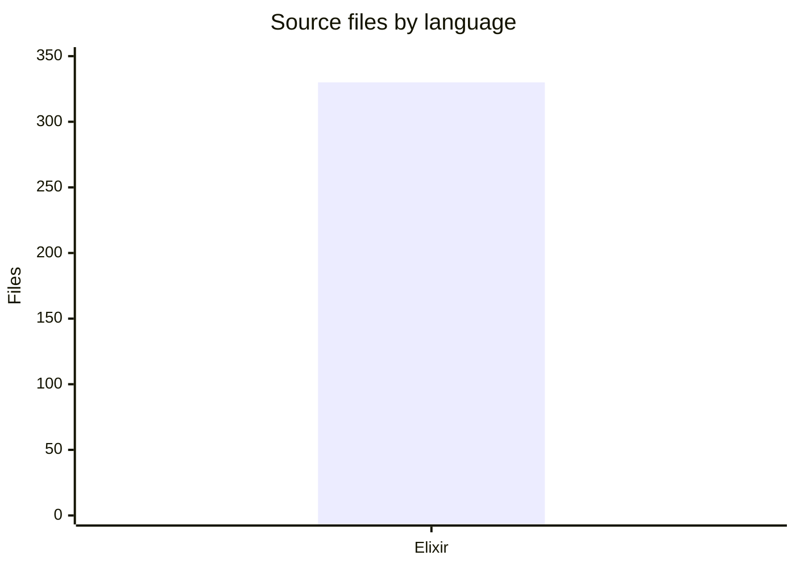
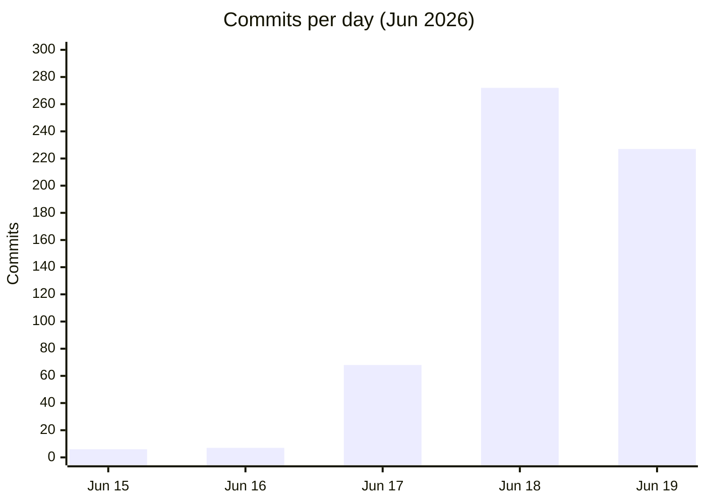

# By the numbers

A codebase statistics snapshot for Conveyor, collected on 2026-06-19. The
project is four days old and almost entirely Elixir, with a heavy test surface
and a contract-first documentation layer of 273 JSON schemas.

## Headline figures

| Metric                                 | Value            |
| -------------------------------------- | ---------------- |
| Commits (all branches)                 | 580              |
| Source files (`lib/**/*.ex`)           | 330              |
| Test files (`test/**/*.ex` and `.exs`) | 272              |
| Source lines of code                   | 41,062           |
| Modules (`defmodule` declarations)     | 382              |
| Database migrations                    | 31               |
| JSON schemas (`docs/schemas`)          | 273              |
| Documentation files (`docs/**/*.md`)   | 71               |
| TODO/FIXME markers                     | 2                |
| Tags / releases                        | 0                |
| Test-to-code ratio                     | 0.82 (272 / 330) |

## Language breakdown

Elixir is essentially 100% of the source code. Every file under `lib/` is `.ex`,
and the runtime is a single-language BEAM application.

## Commit timeline

The entire 580-commit history falls inside a four-day window, Jun 15-19, 2026.
Commit volume ramped up sharply on Jun 18 and stayed high through Jun 19 as the
planning compiler and Phase 2 features landed.

All commits are from a single contributor, Robert Guss (547 commits from one
machine, 33 from another). There are no bot commits.

## Churn hotspots

The most frequently changed files over the project's short life. The issue
tracker state file dominates, which is expected for a solo project driving work
through `br`.

| File                         | Changes |
| ---------------------------- | ------- |
| `.beads/issues.jsonl`        | 499     |
| `docs/schemas/registry.json` | 32      |
| `lib/conveyor/factory.ex`    | 26      |

## Largest source files

| File                                       | Lines |
| ------------------------------------------ | ----- |
| `lib/conveyor_web/live/run_viewer_live.ex` | 943   |
| `lib/conveyor/station.ex`                  | 662   |
| `lib/conveyor/planning/pi.ex`              | 563   |
| `lib/conveyor/gate/verification.ex`        | 541   |
| `lib/conveyor/doctor.ex`                   | 519   |

The largest file is the LiveView run dashboard, followed by the station
execution coordinator and the planning compiler's PI (plan intermediate) module.

## TODO/FIXME markers

Only 2 TODO/FIXME markers exist in the source, and both are inside the local
Python code quality adapter at
`lib/conveyor/code_quality_adapter/local_python.ex`. They are not pending work
items; they are the strings the adapter searches for when detecting TODO/FIXME
markers in other people's code.

## Tags and releases

There are no tags and no releases yet. The project is still in active initial
construction.

## Related pages

- [Lore](lore.md) — timeline and history of the codebase
- [Fun facts](fun-facts.md) — quirky details about the project
- [Architecture](overview/architecture.md) — system topology
- [Primitives](primitives/index.md) — foundational domain objects
