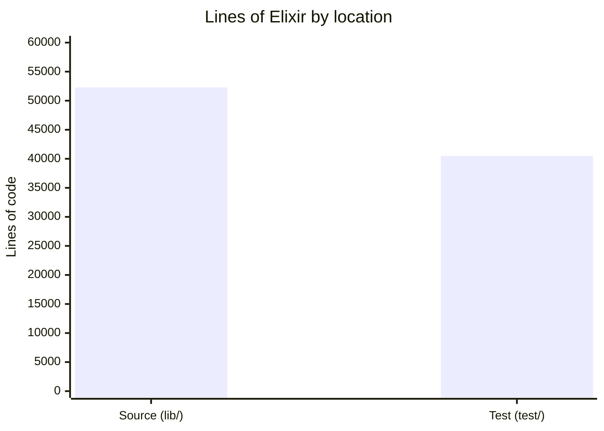

# By the numbers

Data collected on 2026-06-24.

A snapshot of the Conveyor codebase at commit `d9c68a1` on the `main` branch. Every figure below comes from `git log`, `cloc`-style line counts, and the file tree under `lib/` and `test/`. Nothing here is projected or extrapolated.

## Size

The codebase is a single language: Elixir. There is no JavaScript or TypeScript in `lib/` (the Phoenix assets pipeline is not yet populated), no Rust, no Go. The numbers below count `.ex` and `.exs` files under `lib/` and `test/`.

| Metric | Value |
| --- | --- |
| Source lines (`.ex` in `lib/`) | 52,270 |
| Source files (`lib/`) | 405 |
| Test lines (`.exs` in `test/`) | 40,495 |
| Test files (`test/`) | 335 |
| Database migrations (`priv/repo/migrations/`) | 41 |
| JSON schemas (`docs/schemas/`) | 100 |
| Architecture decision records (`docs/adrs/`) | 27 |
| Total git commits | 749 |

### Language breakdown

All source is Elixir. The chart below splits the BEAM-side code into its source and test halves so the relative weight is visible.

## Activity

Conveyor is nine days old. Every commit landed between June 15 and June 24, 2026. The project has no tags and a single release line on `main`.

### Commits per day

| Date | Commits |
| --- | --- |
| 2026-06-15 | 6 |
| 2026-06-16 | 7 |
| 2026-06-17 | 68 |
| 2026-06-18 | 272 |
| 2026-06-19 | 250 |
| 2026-06-20 | 47 |
| 2026-06-21 | 21 |
| 2026-06-22 | 37 |
| 2026-06-23 | 35 |
| 2026-06-24 | 6 |
| **Total** | **749** |

The June 18 and 19 spikes are the eval program and the first-light M0/M1 push (see [lore](lore.md)). After June 20 the commit cadence settles into review, fix, and exit-review work as the M-phases close out.

### Commit prefixes

Conventional-commit prefixes dominate. The `feat` prefix alone accounts for just over half of all commits.

| Prefix | Count |
| --- | --- |
| feat | 378 |
| docs | 122 |
| chore | 100 |
| fix | 46 |
| test | 31 |
| other | 72 |

### Churn hotspots

These files changed most often over the project's life (the project is nine days old, so this is also the all-time churn list). The count is the number of commits that touched the file.

| File | Commits touched |
| --- | --- |
| `test/conveyor/factory/evidence_kernel_resources_test.exs` | 17 |
| `lib/conveyor/factory.ex` | 16 |
| `lib/conveyor/serial_driver.ex` | 15 |
| `lib/conveyor/station.ex` | 10 |
| `mix.exs` | 9 |
| `lib/conveyor/planning/run_spec_assembler.ex` | 9 |
| `lib/conveyor/slice.ex` | 9 |
| `lib/conveyor/factory/run_attempt.ex` | 9 |

The two leaders tell a story. `lib/conveyor/factory.ex` is the Ash domain boundary and gets touched whenever a resource is added or reshaped. `lib/conveyor/serial_driver.ex` is the width-1 execution driver and has been rewritten in pieces as the run loop gained crash recovery (M6) and honest replay. `evidence_kernel_resources_test.exs` sits at the top because the evidence kernel is where the gate's trust signals are pinned down, and every gate-hardening commit re-pins it.

## Bot-attributed commits

205 of 749 commits (27.4%) carry a `Co-Authored-By` trailer pointing at Claude or Cursor. The breakdown:

| Co-author trailer | Commits |
| --- | --- |
| Claude Opus 4.8 (1M context) | 173 |
| Cursor | 8 |
| Claude Opus 4.8 (no context tag) | 24 |

This is a lower bound. Inline AI tools (completions, suggestions inside an editor) leave no trace in the commit body, so the real AI-assisted share is higher than the trailer count suggests. The trailer only appears when an agent or the operator explicitly adds it.

## Complexity

### File size

Average source file size across the 405 files in `lib/` is about 129 lines. The distribution is long-tailed: most files are small resource or policy modules, and a handful of runtime files carry the bulk of the logic.

### Largest source files

| File | Lines |
| --- | --- |
| `lib/conveyor/serial_driver.ex` | 1177 |
| `lib/conveyor_web/live/run_viewer_live.ex` | 943 |
| `lib/conveyor/planning/run_spec_assembler.ex` | 840 |
| `lib/conveyor/station.ex` | 683 |
| `lib/conveyor/pi.ex` | 563 |
| `lib/conveyor/verification.ex` | 544 |
| `lib/conveyor/doctor.ex` | 542 |
| `lib/conveyor/structural_audit.ex` | 532 |

The largest file, `serial_driver.ex`, is also the most-churned runtime file. It owns the width-1 run loop: slice dispatch, rework cycling, and the event-sourced ledger that makes runs crash-survivable. Its size reflects the number of failure modes the loop has to handle rather than feature sprawl.

### Deepest import chains

Import depth in this codebase is shallow by design. The Ash resources under `lib/conveyor/factory/` sit at the bottom and are depended on by the runtime (`station.ex`, `serial_driver.ex`), the planning compiler (`lib/conveyor/planning/`), and the web projection (`lib/conveyor_web/`). The web layer never reaches back into the runtime. The longest call chain runs from `serial_driver.ex` through `station.ex` into the factory resources and the evidence kernel, which is also where the churn is concentrated.

## Test-to-code ratio

40,495 test lines against 52,270 source lines gives a ratio of 0.77. Tests are ExUnit and run against a real Postgres instance; `test/test_helper.exs` excludes the `live_agent: true` tagged tests by default so the suite runs without an agent on the host. The evidence kernel and gate tests are the densest, consistent with the churn hotspots above.

## Source hygiene

There are no `TODO`, `FIXME`, or `HACK` comments anywhere in `lib/`. The only matches for those strings in the repo are inside the local Python code-quality adapter, which scans for them as its job. CI runs `mix format --check-formatted`, `mix compile --warnings-as-errors`, `mix credo --strict`, and `mix dialyzer`, so warnings and formatting drift do not accumulate.
