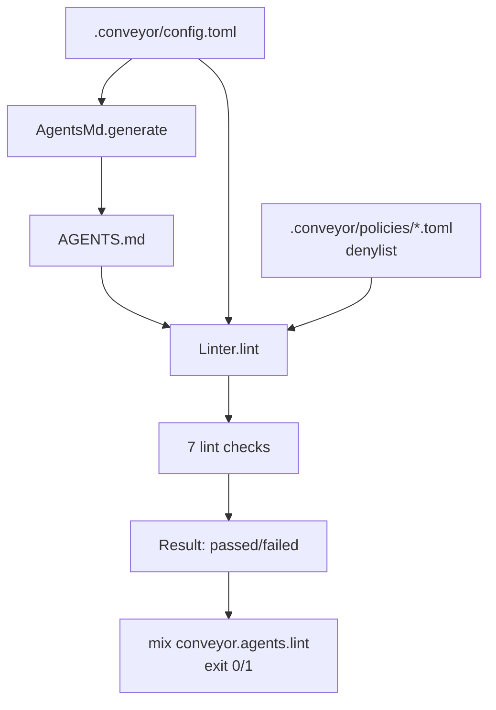

# Agents.md generation

Conveyor generates the repo-local `AGENTS.md` contract from the project's `.conveyor/config.toml` so the instructions an AI coding agent reads are a deterministic projection of the project's configured commands, policies, and verification surface. The generator produces a fixed set of required sections with the project's real command slots filled in, and the linter checks the generated or hand-edited `AGENTS.md` against the same config and policy files so drift is caught before a run.

## Directory layout

```text
lib/conveyor/
├── agents_md.ex          # generator: config -> AGENTS.md
└── agents_md/
    └── linter.ex         # linter: AGENTS.md vs config + policy
```

```text
lib/mix/tasks/
├── conveyor.agents.ex       # mix conveyor.agents PATH
└── conveyor.agents.lint.ex  # mix conveyor.agents.lint PATH
```

## Key abstractions

| Abstraction | Location | Role |
| ----------- | -------- | ---- |
| `Conveyor.AgentsMd` | `lib/conveyor/agents_md.ex` | Generator. `generate/1` turns a `ProjectConfig` into the `AGENTS.md` string; `generate_from_path/1` loads config and generates; `write!/2` writes the file. |
| `Conveyor.AgentsMd.Linter` | `lib/conveyor/agents_md/linter.ex` | Linter. `lint/1` loads config, reads `AGENTS.md`, loads the policy denylist, and returns a `Result`. `lint_content/3` is the pure core. `format/1` renders the result. |
| `Conveyor.AgentsMd.Linter.Finding` | `lib/conveyor/agents_md/linter.ex` | One lint finding: `severity` (`:error` / `:warning`), `code` atom, `message`, optional `section`. |
| `Conveyor.AgentsMd.Linter.Result` | `lib/conveyor/agents_md/linter.ex` | Lint result: `status` (`:passed` / `:failed`) and `findings`. |
| Required command slots | `lib/conveyor/agents_md.ex` (`@required_command_slots`) | The six labeled slots the generator fills from configured commands: Install, Build, Test, Typecheck, Lint, Run app. Each slot has a list of keys to match against. |
| Required sections | `lib/conveyor/agents_md.ex` (`@required_sections`) | The 13 section headings the generator emits and the linter requires: Project Overview, Architecture Map, Commands, Coding Rules, Testing Rules, Security Rules, Git Rules, Task Rules, Done Criteria, Forbidden Actions, How to Use Conveyor Evidence, How to Use CodeScent Context, How to Report Blockers. |
| `Mix.Tasks.Conveyor.Agents` | `lib/mix/tasks/conveyor.agents.ex` | CLI: `mix conveyor.agents PATH` overwrites `AGENTS.md` from config. |
| `Mix.Tasks.Conveyor.Agents.Lint` | `lib/mix/tasks/conveyor.agents.lint.ex` | CLI: `mix conveyor.agents.lint PATH` lints `AGENTS.md` and exits non-zero on failure. |

## How it works

### Generation

`AgentsMd.generate/1` takes a `ProjectConfig` and emits a markdown string with the 13 required sections. The Commands section is the only one that varies by config: `render_command_slots/1` walks the six required slots (Install, Build, Test, Typecheck, Lint, Run app) and for each, searches the configured `command_specs` for a command whose key contains one of the slot's match keys. A matched command is rendered as `- Label: \`key\` -> \`argv\``; an unmatched slot is rendered as `- Label: not configured in \`.conveyor/config.toml\`.` Below the slots, `render_command_specs/1` lists every configured command spec with its profile, required flag, and network mode.

The remaining sections are fixed prose that encodes the Conveyor contract: keep changes scoped to the current [Slice](../primitives/slice.md), run configured verification, do not weaken locked tests, do not use production secrets or deploy in Phase 1, do not rewrite unrelated user work, work only from the approved slice and brief, done requires mapped evidence and a passing gate, and the forbidden actions (merge, deploy, edit locked contracts, change policy, access production secrets, run denied commands without human approval). The evidence and blocker sections tell the agent how to read Conveyor run artifacts and how to report a blocked acceptance criterion.

`write!/2` writes the file to `AGENTS.md` under the project path, with `overwrite?` defaulting to `true`. `generate_from_path/1` loads config via `Conveyor.Config.load/1` and generates.

### Linting

`Linter.lint/1` loads config, reads `AGENTS.md`, and loads the policy denylist from every `*.toml` under the project's `policies_dir`. It then calls the pure `lint_content/3` which runs seven checks:

1. **Required sections** — every section in `AgentsMd.required_sections()` must appear as a level-1 heading. Missing sections are `:error` findings.
2. **Configured commands** — every configured command key and its rendered argv must appear in the Commands section. A missing key or a key whose argv is absent are both `:error` findings.
3. **Done criteria** — the Done Criteria section must mention "evidence" and "independent verification". Missing mentions are `:error` findings.
4. **Security rules** — the Security Rules section must forbid production secrets and deploys in Phase 1. Missing forbiddances are `:error` findings.
5. **Forbidden actions** — if the policy denylist is non-empty, the Forbidden Actions section must include every denied command (case-insensitive). A missing denylist item is an `:error` finding. If the section already says "denied commands", the check passes.
6. **Command contradictions** — the file must not contain "do not run `key`" or "do not run `argv`" for any configured command. A contradiction is an `:error` finding.
7. **Ambiguous phrases** — the file must not contain phrases like "make it good" or "mobile-friendly". A match is a `:warning` finding.

The result status is `:failed` if any finding has severity `:error`, otherwise `:passed`. `format/1` renders the result as a single line on pass or a bulleted list on fail.



## Integration points

- **Project config** — the generator and linter read `.conveyor/config.toml` via `Conveyor.Config.load/1`. The config carries `name`, `repo_path`, `default_branch`, optional `dev_branch`, `quality_adapter`, `command_specs`, and `policies_dir`. See [CLI tools](cli-tools.md) for the init and agents tasks.
- **Policy profiles** — the linter loads the policy denylist from `*.toml` files under the project's `policies_dir` (default `.conveyor/policies/`). Each policy file may declare a `[policy] denylist = [...]` list of denied commands. See [Policy](../primitives/contract-lock.md) for the policy profile concept.
- **Init scaffold** — `mix conveyor.init` copies policy templates and generates the first `AGENTS.md` via `AgentsMd.write!/2` with `overwrite?: false`, so it does not clobber an existing file.
- **Run path** — the agent reads `AGENTS.md` as the repo-local contract before working on a [Slice](../primitives/slice.md). The generated content encodes the done criteria and forbidden actions the [Trust gate](../systems/gate.md) later verifies.
- **CI** — `mix conveyor.agents.lint` can run in CI to catch drift between config and `AGENTS.md` before a run.

## Entry points for modification

| Change | Where to start |
| ------ | -------------- |
| Add a required section | Add the heading to `@required_sections` in `lib/conveyor/agents_md.ex` and emit it in `generate/1`. |
| Add a required command slot | Add the `{label, keys}` tuple to `@required_command_slots` in `lib/conveyor/agents_md.ex`. |
| Change the generated prose for a section | Edit the corresponding block in `generate/1` in `lib/conveyor/agents_md.ex`. |
| Add a lint check | Add a check function and append it to the findings pipeline in `lint_content/3` in `lib/conveyor/agents_md/linter.ex`. |
| Change an ambiguous phrase | Edit `@ambiguous_phrases` in `lib/conveyor/agents_md/linter.ex`. |
| Change the wire output | `format/1` in `lib/conveyor/agents_md/linter.ex`. |
| Change the CLI behavior | `lib/mix/tasks/conveyor.agents.ex` or `lib/mix/tasks/conveyor.agents.lint.ex`. |

## Key source files

| File | Role |
| ---- | ---- |
| `lib/conveyor/agents_md.ex` | Generator: config to `AGENTS.md`. |
| `lib/conveyor/agents_md/linter.ex` | Linter: `AGENTS.md` vs config and policy denylist. |
| `lib/mix/tasks/conveyor.agents.ex` | `mix conveyor.agents PATH` regeneration CLI. |
| `lib/mix/tasks/conveyor.agents.lint.ex` | `mix conveyor.agents.lint PATH` validation CLI. |

See also: [CLI tools](cli-tools.md), [Trust gate](../systems/gate.md), [Planning compiler](../systems/planning-compiler.md), [Slice](../primitives/slice.md), [Contract lock](../primitives/contract-lock.md).
