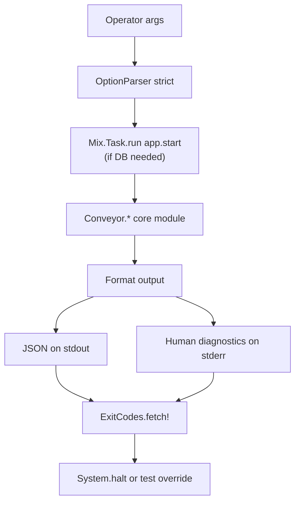

# CLI tools

The mix CLI is the operator command surface for Conveyor. Every verb is a thin Mix task that parses args, calls a `Conveyor.*` module, formats output, and exits through a stable exit-code table so downstream automation can parse the result. The CLI is the primary interface for scaffolding a project, authoring and running plans, inspecting runs, and diagnosing the factory. Tasks keep no business logic: planning, policy, and gate logic lives in the core modules, and the tasks only parse, call, format, and exit.

## Directory layout

```text
lib/mix/tasks/
├── conveyor.init.ex                        # scaffold .conveyor/* and AGENTS.md
├── conveyor.agents.ex                      # regenerate AGENTS.md
├── conveyor.agents.lint.ex                 # lint AGENTS.md
├── conveyor.author.ex                      # draft a plan from intent (ADR-27)
├── conveyor.run.ex                         # run an approved plan
├── conveyor.run_view.ex                    # show a run's story (read-after)
├── conveyor.run_slice.ex                   # run a single slice
├── conveyor.doctor.ex                      # prerequisite checks
├── conveyor.demo.ex                        # hermetic Phase-1 demo
├── conveyor.show.ex                        # show a slice's status
├── conveyor.parked.ex                      # list abstained (needs-human) runs
├── conveyor.plan_audit.ex                  # audit a plan contract
├── conveyor.plan_lint.ex                   # non-authorizing plan lint
├── conveyor.plan_prepare.ex                # plan preparation
├── conveyor.task.create.ex                 # create a task
├── conveyor.task.list.ex                   # list tasks in an epic
├── conveyor.task.show.ex                   # show one task
├── conveyor.task.update.ex                 # update a task
├── conveyor.task.dep.ex                    # add/remove a dependency edge
├── conveyor.task.ready.ex                  # list ready tasks
├── conveyor.task.lock.ex                   # lock a task's contract
├── conveyor.task.approve.ex                # approve a task
├── conveyor.task.acceptance.ex             # author an acceptance criterion
└── ...                                     # eval, replay, report, verify, ci, etc.
```

```text
lib/conveyor/cli/
├── exit_codes.ex     # stable exit-code table
├── next_action.ex    # actionable remediation hint struct
└── task_command.ex   # shared output/exit/error helpers for conveyor.task.*
```

## Key abstractions

| Abstraction | Location | Role |
| ----------- | -------- | ---- |
| `Conveyor.CLI.ExitCodes` | `lib/conveyor/cli/exit_codes.ex` | Stable exit-code table. Eight codes: `success` (0), `deterministic_gate_failed` (1), `plan_or_readiness_blocked` (2), `policy_or_secret_safety_violation` (3), `infrastructure_or_doctor_failure` (4), `adapter_failure` (5), `canary_or_eval_false_negative` (6), `malformed_artifact_or_schema_failure` (7). |
| `Conveyor.CLI.NextAction` | `lib/conveyor/cli/next_action.ex` | Actionable remediation hint attached to blocking findings: `label` and `command`. |
| `Conveyor.CLI.TaskCommand` | `lib/conveyor/cli/task_command.ex` | Shared output/exit/error helpers for the `conveyor.task.*` CLI. `guard/1` maps user/validation errors to a clean non-zero exit, `emit!/1` emits JSON on stdout and exits success, `fail!/2` prints on stderr and exits with a code, `csv/1` splits comma-separated options. |
| Exit seam | per task (`exit_fun/0`) | Each task reads `Process.get(:conveyor_<task>_exit_fun, &System.halt/1)` so tests can override the exit without a real halt. |
| `Mix.Tasks.Conveyor.Run` | `lib/mix/tasks/conveyor.run.ex` | Runs a persisted, approved plan through the serial production loop. Refuses unless every task is approved. Isolates the workspace by default. |
| `Mix.Tasks.Conveyor.RunView` | `lib/mix/tasks/conveyor.run_view.ex` | Folds a run's ledger stream into a run story via `RunReadModel.summarize/1`. Human text by default, `--json` for the `conveyor.run_view@1` envelope. Read-only. |
| `Mix.Tasks.Conveyor.Doctor` | `lib/mix/tasks/conveyor.doctor.ex` | Runs prerequisite checks via `Conveyor.Doctor.run/1` and formats the result. Exit code from `Doctor.exit_code/1`. |
| `Mix.Tasks.Conveyor.Demo` | `lib/mix/tasks/conveyor.demo.ex` | Runs the hermetic Phase-1 tracer demo via `Conveyor.Demo.run!/1`. |
| `Mix.Tasks.Conveyor.Init` | `lib/mix/tasks/conveyor.init.ex` | Scaffolds `.conveyor/*` (config, policies, prompts, artifact dirs) and generates `AGENTS.md`. Idempotent: existing files are left in place. |
| `Mix.Tasks.Conveyor.Author` | `lib/mix/tasks/conveyor.author.ex` | ADR-27 plan-authoring front door. Drives `Conveyor.Planning.Author.author/2` to draft a plan from a paragraph of intent. |
| `Mix.Tasks.Conveyor.PlanAudit` | `lib/mix/tasks/conveyor.plan_audit.ex` | Audits a normalized plan contract. Loads via `PlanContract`, persists project and plan rows, imports requirements, and runs `PlanAuditor.audit_plan!/1`. |
| `Mix.Tasks.Conveyor.PlanLint` | `lib/mix/tasks/conveyor.plan_lint.ex` | Non-authorizing plan lint via `Conveyor.Planning.PlanLint.lint/1`. Renders as human, JSON, or SARIF. |
| `Mix.Tasks.Conveyor.Show` | `lib/mix/tasks/conveyor.show.ex` | Shows a compact machine-readable [Slice](../primitives/slice.md) status: state, latest run attempt status and outcome, trust verdict, and station runs. |
| `Mix.Tasks.Conveyor.Parked` | `lib/mix/tasks/conveyor.parked.ex` | Lists the human-triage queue: runs that passed the gate but abstained (calibrated trust score not confident), least-trusted first. Emits `conveyor.parked_queue@1` JSON. |

## How it works

Every task follows the same shape: parse args (with `OptionParser` strict switches), call `Mix.Task.run("app.start")` if the database is needed, call the core module, format the result (JSON on stdout for machine consumption, human diagnostics on stderr), and exit through the stable exit-code table. The exit seam is a process dictionary key per task (`:conveyor_run_exit_fun`, `:conveyor_run_view_exit_fun`, etc.) defaulting to `System.halt/1`, so tests can inject a no-op exit and assert on the code.



### Stable exit codes

`Conveyor.CLI.ExitCodes` defines eight exit codes that downstream automation can parse:

| Code | Value | Meaning |
| ---- | ----- | ------- |
| `:success` | 0 | The command succeeded. |
| `:deterministic_gate_failed` | 1 | A gate failed or a run was partial. |
| `:plan_or_readiness_blocked` | 2 | A plan or readiness check blocked the operation. |
| `:policy_or_secret_safety_violation` | 3 | A policy or secret-safety check failed. |
| `:infrastructure_or_doctor_failure` | 4 | An infrastructure or doctor check failed. |
| `:adapter_failure` | 5 | An agent adapter failed. |
| `:canary_or_eval_false_negative` | 6 | A canary or eval false negative. |
| `:malformed_artifact_or_schema_failure` | 7 | A malformed artifact or schema failure. |

### Task command helpers

The `conveyor.task.*` verbs share `Conveyor.CLI.TaskCommand`. `guard/1` wraps the task body and rescues `ArgumentError` and `Ash.Error.Invalid` (bad refs, cycles, illegal state transitions, constraint violations), mapping them to a clean non-zero exit with the message on stderr rather than a crash. `emit!/1` encodes data as JSON on stdout and exits success. `fail!/2` prints on stderr and exits with a code (default `:plan_or_readiness_blocked`). `csv/1` splits a comma-separated option value into a trimmed list.

### Workspace isolation

`mix conveyor.run` isolates the run from the operator's directory by default. The serial loop resets and commits the workspace as it goes, so it must never mutate a directory the operator cares about. `resolve_workspace!/1` copies `--workspace` to a throwaway location under the system temp dir and runs there, leaving the source untouched. `--in-place` opts out for a throwaway directory the operator has already staged. The isolated copy's path is printed on stderr so stdout stays pure JSON.

### Output contracts

Machine-readable tasks emit pure JSON on stdout so consumers can `Jason.decode!` it. Human diagnostics (workspace isolation path, unapproved-plan message, lint errors) go on stderr. The JSON envelopes carry schema versions: `conveyor.run_view@1` (`RunView`), `conveyor.parked_queue@1` (`Parked`), `conveyor.run_view@1` (`Run`). Read-only tasks (`run_view`, `show`, `parked`, `doctor`) exit success even when the underlying run failed or the run id is unknown, because the report ran and the run's outcome is data in the output, not the exit code.

## Key tasks

### Scaffolding and config

| Task | Usage | Role |
| ---- | ----- | ---- |
| `mix conveyor.init PATH` | `mix conveyor.init my-project` | Scaffolds `.conveyor/config.toml`, policy profiles, prompts, artifact dirs, and `AGENTS.md`. Idempotent. |
| `mix conveyor.agents PATH` | `mix conveyor.agents my-project` | Regenerates `AGENTS.md` from config (overwrites). See [Agents.md generation](agents-md-generation.md). |
| `mix conveyor.agents.lint PATH` | `mix conveyor.agents.lint my-project` | Lints `AGENTS.md` against config and policy. Exits non-zero on failure. |
| `mix conveyor.doctor [PATH]` | `mix conveyor.doctor` | Checks prerequisites. Exit code from `Doctor.exit_code/1`. |

### Plan authoring and linting

| Task | Usage | Role |
| ---- | ----- | ---- |
| `mix conveyor.author "INTENT" [--out PATH]` | `mix conveyor.author "Add a loader"` | Drafts a plan from a paragraph of intent (ADR-27). Prints questions and exits non-zero when the audit needs clarification. |
| `mix conveyor.plan_audit PLAN.md` | `mix conveyor.plan_audit plan.yml` | Audits a normalized plan contract. Persists rows and runs the auditor. |
| `mix conveyor.plan_lint PLAN.md --format human\|json\|sarif` | `mix conveyor.plan_lint plan.md --format sarif` | Non-authorizing plan lint. See [Planning compiler](../systems/planning-compiler.md). |

### Task graph authoring

The `conveyor.task.*` verbs author the DB-native task graph. See [Task graph](task-graph.md) for the full graph operations.

| Task | Usage | Role |
| ---- | ----- | ---- |
| `mix conveyor.task.create --epic ID --title T [...]` | create a task | Creates a [Slice](../primitives/slice.md) under an epic, auto-assigning `stable_key` (`SLICE-NNN`). |
| `mix conveyor.task.list --epic ID` | list tasks | Lists an epic's tasks in position order. |
| `mix conveyor.task.show --epic ID --key SLICE-001` | show a task | Shows one task by stable key. |
| `mix conveyor.task.update --epic ID --key SLICE-001 [...]` | update a task | Updates a task's authoring attributes. |
| `mix conveyor.task.dep add\|remove --epic ID --from KEY --to KEY` | dependency edge | Adds or removes an `execution_hard` edge. |
| `mix conveyor.task.ready --epic ID` | ready tasks | Lists tasks whose predecessors are all satisfied. |
| `mix conveyor.task.acceptance add --epic ID --key SLICE-001 [...]` | acceptance | Appends an acceptance criterion to a task. |
| `mix conveyor.task.lock --epic ID --key SLICE-001` | lock a task | Compiles the plan contract and materializes the gate-valid brief/test pack/contract lock. |
| `mix conveyor.task.approve --epic ID --key SLICE-001` | approve a task | The human go-signal: `:drafted -> :approved`. |

### Running and inspecting

| Task | Usage | Role |
| ---- | ----- | ---- |
| `mix conveyor.run PLAN_ID [--adapter codex\|reference_solution] [--workspace PATH] [--in-place]` | run a plan | Runs an approved plan through the serial production loop. Isolates the workspace by default. |
| `mix conveyor.run_view RUN_ID [--json]` | show a run story | Folds the ledger into a run story. Read-only. See [Event sourcing](event-sourcing.md). |
| `mix conveyor.show SLICE_ID` | show a slice | Shows a slice's state, latest run attempt, trust verdict, and station runs. |
| `mix conveyor.parked` | parked queue | Lists abstained (needs-human) runs, least-trusted first. See [Trust gate](../systems/gate.md). |
| `mix conveyor.demo [--blob-root PATH] [--projection-root PATH]` | demo | Runs the hermetic Phase-1 tracer demo. |

## Integration points

- **Planning compiler** — `conveyor.author`, `conveyor.plan_audit`, `conveyor.plan_lint`, and `conveyor.run` are the CLI front doors to the planning compiler. See [Planning compiler](../systems/planning-compiler.md).
- **Task graph** — the `conveyor.task.*` verbs are thin wrappers over `Conveyor.TaskGraph`. See [Task graph](task-graph.md).
- **Event sourcing** — `conveyor.run_view` and `conveyor.parked` fold the ledger. See [Event sourcing](event-sourcing.md).
- **Trust gate** — `conveyor.show` and `conveyor.parked` surface the calibrated trust verdict. `conveyor.run` exits `:deterministic_gate_failed` on a partial run. See [Trust gate](../systems/gate.md).
- **Agents.md generation** — `conveyor.init`, `conveyor.agents`, and `conveyor.agents.lint` manage the repo-local agent contract. See [Agents.md generation](agents-md-generation.md).
- **Factory domain** — every task that needs the database calls `Mix.Task.run("app.start")` and reads/writes through the `Conveyor.Factory` Ash domain.

## Entry points for modification

| Change | Where to start |
| ------ | -------------- |
| Add a new exit code | `lib/conveyor/cli/exit_codes.ex` (`@codes`). |
| Add a new `conveyor.task.*` verb | Add a Mix task in `lib/mix/tasks/`, call `TaskGraph` through `TaskCommand.guard/1`, and emit JSON via `TaskCommand.emit!/1`. |
| Change a task's output shape | The task's `summary/1` or render function. Keep JSON on stdout, human diagnostics on stderr. |
| Change a task's exit mapping | The task's `exit_code/1` or the `ExitCodes.fetch!` call. |
| Change shared task helpers | `lib/conveyor/cli/task_command.ex`. |
| Change the workspace isolation default | `resolve_workspace!/1` in `lib/mix/tasks/conveyor.run.ex`. |
| Add a remediation hint to a finding | `lib/conveyor/cli/next_action.ex` and the producing module. |

## Key source files

| File | Role |
| ---- | ---- |
| `lib/conveyor/cli/exit_codes.ex` | Stable eight-entry exit-code table. |
| `lib/conveyor/cli/next_action.ex` | Actionable remediation hint struct. |
| `lib/conveyor/cli/task_command.ex` | Shared output/exit/error helpers for `conveyor.task.*`. |
| `lib/mix/tasks/conveyor.run.ex` | Run an approved plan through the serial loop. |
| `lib/mix/tasks/conveyor.run_view.ex` | Fold a run's ledger into a run story. |
| `lib/mix/tasks/conveyor.doctor.ex` | Prerequisite checks. |
| `lib/mix/tasks/conveyor.demo.ex` | Hermetic Phase-1 demo. |
| `lib/mix/tasks/conveyor.init.ex` | Scaffold `.conveyor/*` and `AGENTS.md`. |
| `lib/mix/tasks/conveyor.author.ex` | ADR-27 plan-authoring front door. |
| `lib/mix/tasks/conveyor.show.ex` | Show a slice's status. |
| `lib/mix/tasks/conveyor.parked.ex` | List abstained (needs-human) runs. |
| `lib/mix/tasks/conveyor.plan_audit.ex` | Audit a plan contract. |
| `lib/mix/tasks/conveyor.plan_lint.ex` | Non-authorizing plan lint. |
| `lib/mix/tasks/conveyor.agents.ex` | Regenerate `AGENTS.md`. |
| `lib/mix/tasks/conveyor.agents.lint.ex` | Lint `AGENTS.md`. |
| `lib/mix/tasks/conveyor.task.*.ex` | Task graph authoring verbs. |

See also: [Task graph](task-graph.md), [Agents.md generation](agents-md-generation.md), [Event sourcing](event-sourcing.md), [Trust gate](../systems/gate.md), [Planning compiler](../systems/planning-compiler.md), [Slice](../primitives/slice.md), [Run attempt](../primitives/run-attempt.md).
