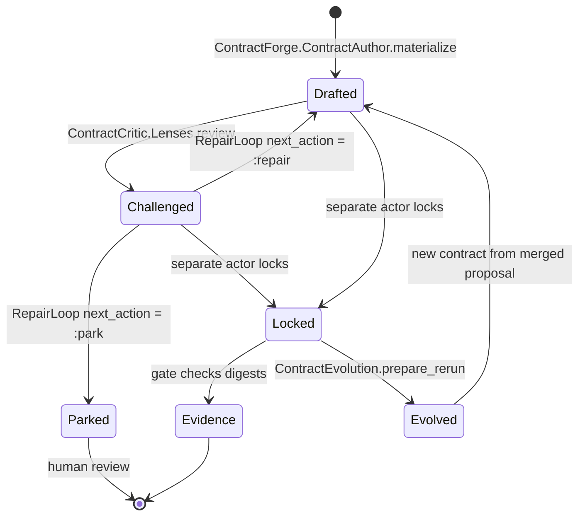

# Contract management

Contracts are the immutable acceptance surface that makes evidence meaningful.
Conveyor drafts contracts, challenges them through an independent critic, locks
them into a digest set, and evolves them into new locks when requirements
change. The same actor never both authors and approves a contract.

## ContractLock resource

`Conveyor.Factory.ContractLock` (`lib/conveyor/factory/contract_lock.ex`) is an
immutable Ash resource that freezes a slice contract for future evidence. It
stores a set of SHA-256 digests rather than the contract text itself:

- `plan_contract_sha256`, `brief_sha256`, `acceptance_criteria_sha256`,
  `required_tests_sha256`, `test_pack_sha256`, `verification_commands_sha256`,
  `agents_md_sha256`, `policy_sha256`
- `protected_path_globs` — the paths the contract forbids the implementer from
  touching
- `locked_at` and `locked_by`

A `ContractLock` belongs to one `Slice` and one `AgentBrief`. It has no update
action beyond the Ash defaults; the only way to change a contract is to create a
new lock. This is what makes old evidence trustworthy: a gate can prove that the
acceptance criteria it checked match the criteria the lock froze.

## ContractForge (drafting)

`lib/conveyor/contract_forge/` is the drafting subsystem. It materializes draft
contracts from contract-author RoleViews without granting implementation
authority.

- `contract_author.ex` — `ContractAuthor.materialize/1` builds a
  `conveyor.agent_brief_contract@1` from a RoleView, archetype, acceptance
  criteria, and authorized scope. It derives verification obligations and
  falsifier seeds, partitioning the bounded context into `requirements` (REQ-_),
  `decisions` (DEC-_), `constraints`, and `claims`.
- `archetype_templates.ex` — `ArchetypeTemplates` holds deterministic
  minimum-obligation floors per change archetype (`bugfix_regression`,
  `crud_endpoint`, `pure_refactor`, `schema_migration`). These are obligation
  floors, not prompt folklore. Authors may add stricter obligations, but
  downstream tools rely on the stable keys.
- `interface_policy.ex` — `InterfacePolicy.validate/1` and
  `validate_migration/1` enforce interface lock strength, compatibility,
  rollout, and migration safety for public or cross-slice interfaces.
- `falsifier_seed_deriver.ex` — derives falsifier seed families from the
  contract so the critic and test architect have concrete attack families to
  work with.
- `verification_obligation_deriver.ex` — derives the verification obligations
  the implementer must satisfy, returning them or blocking findings when the
  contract is incomplete.

Drafting is non-authorizing. A drafted contract has `authority_effect: :none`
until it is locked by a separate actor.

## ContractCritic (criticism and repair)

`lib/conveyor/contract_critic/` is the independent challenge layer. Critic
lenses may challenge contracts and preserve disagreement, but they never
approve, lock, or grant implementation authority.

- `lenses.ex` — `Lenses.review/1` runs ten required lenses (`intent_fidelity`,
  `scope_delta`, `principal_engineering`, `interface_compatibility`,
  `test_loopholes`, `reliability_observability`, `security`,
  `cost_simplification`, `hidden_decision`, `approval_cognitive_load`). Each
  lens returns a status and findings; the overall status is `:challenged` if any
  lens fails. The result carries `can_approve?: false` and `can_lock?: false`
  explicitly.
- `independence_profile.ex` — `IndependenceProfile` records and enforces
  challenge-role independence. High-risk change classes (`security`,
  `irreversible_migration`, `public_compat`, `autonomy_increasing`) require a
  `model_diverse` or `human_or_deterministic` profile, or the enforcement
  blocks.
- `cheapest_wrong.ex` — `CheapestWrong.challenge!/1` projects cheapest-wrong
  implementation attacks into `ContractChallengeCase` records, each carrying the
  written contract that would be satisfied, the approved intent that would be
  violated, materiality, and a repair proposal.
- `repair_loop.ex` — `RepairLoop` is the bounded automatic repair policy.
  `next_action/1` returns `:repair` or `:park` based on completed rounds
  (default max 2). `evaluate/1` parks on oscillation or non-progress.
  `route_change/1` blocks repairs that weaken policy or acceptance without
  authority, and routes material or breaking changes to amendment.
- `repair_diff.ex` — `RepairDiff.compare/1` is the typed repair comparison. It
  enforces that only rejected-artifact scope may change during repair; any
  expansion is a blocking finding.

## ContractEvolution

`lib/conveyor/contract_evolution.ex` classifies contract changes and
materializes rerun state when a contract changes. This is the mechanism that
turns a contract change into a new attempt without invalidating old evidence.

`diff/2` compares an old and new contract and produces a `Diff` with
classifications drawn from a fixed order:

- `acceptance_weakened`, `acceptance_strengthened`
- `policy_weakened`, `policy_strengthened`
- `scope_added`, `scope_removed`
- `test_pack_changed`, `clarification_only`

Weakening classifications (`acceptance_weakened`, `policy_weakened`) block
automatic reruns and require a human approval reason. `automatic_rerun_allowed?`
is false when any weakening is present; `requires_human_decision?` is true
whenever the contract changed at all.

`prepare_rerun!/3` materializes the rerun: it loads the old contract lock and
brief, merges the proposed contract, classifies the diff, creates a new
`ContractLock`, creates a new `RunSpec` pointing at the new lock, creates a new
`RunAttempt` with an incremented attempt number, and records a `HumanDecision`
capturing the reason. The new attempt is `:planned` and ready for a fresh
station run. The old evidence remains valid against the old lock.

## Contract diff and lint CLI

Two mix tasks expose contract operations to operators:

- `mix conveyor.contract_diff --old OLD.json --new NEW.json`
  (`lib/mix/tasks/conveyor.contract_diff.ex`) prints a classified
  `conveyor.contract_diff@1` JSON document with classifications, changed flag,
  automatic rerun allowance, and human decision requirement.
- `mix conveyor.contract_lint agent_brief.json --format human|json|sarif`
  (`lib/mix/tasks/conveyor.contract_lint.ex`) runs deterministic,
  non-authorizing lint on a compiler contract or agent brief through
  `Conveyor.Planning.PlanLint`. It never invokes agents or execution authority.

Both tasks preserve stable exit codes for downstream automation.

## Contract lifecycle

## Key source files

| File                                                             | Purpose                                                      |
| ---------------------------------------------------------------- | ------------------------------------------------------------ |
| `lib/conveyor/factory/contract_lock.ex`                          | Immutable digest-set resource freezing a slice contract      |
| `lib/conveyor/contract_forge/contract_author.ex`                 | Materializes draft contracts from RoleViews                  |
| `lib/conveyor/contract_forge/archetype_templates.ex`             | Deterministic minimum-obligation floors per archetype        |
| `lib/conveyor/contract_forge/interface_policy.ex`                | Interface lock, compatibility, rollout, and migration checks |
| `lib/conveyor/contract_forge/falsifier_seed_deriver.ex`          | Derives falsifier seed families from a contract              |
| `lib/conveyor/contract_forge/verification_obligation_deriver.ex` | Derives verification obligations or blocks                   |
| `lib/conveyor/contract_critic/lenses.ex`                         | Ten required non-approving critic lenses                     |
| `lib/conveyor/contract_critic/independence_profile.ex`           | Records and enforces challenge-role independence             |
| `lib/conveyor/contract_critic/cheapest_wrong.ex`                 | Projects cheapest-wrong attacks into challenge cases         |
| `lib/conveyor/contract_critic/repair_loop.ex`                    | Bounded automatic repair policy                              |
| `lib/conveyor/contract_critic/repair_diff.ex`                    | Typed repair comparison with scope enforcement               |
| `lib/conveyor/contract_evolution.ex`                             | Classifies changes and materializes rerun state              |
| `lib/mix/tasks/conveyor.contract_diff.ex`                        | CLI for classified contract diffs                            |
| `lib/mix/tasks/conveyor.contract_lint.ex`                        | CLI for non-authorizing contract lint                        |

## Related pages

- [Contract lock resource model](../primitives/contract-lock.md) — the
  ContractLock primitive
- [Slice domain model](../primitives/slice.md) — the slice a contract locks
- [Planning compiler pass architecture](../systems/planning-compiler.md) — how
  plans become contracts
- [Gate stage composition](../systems/gate.md) — how the gate validates contract
  digests
- [Station pipeline](station-pipeline.md) — where locked contracts gate
  execution
- [CLI tools](cli-tools.md) — operator commands including contract diff and lint
