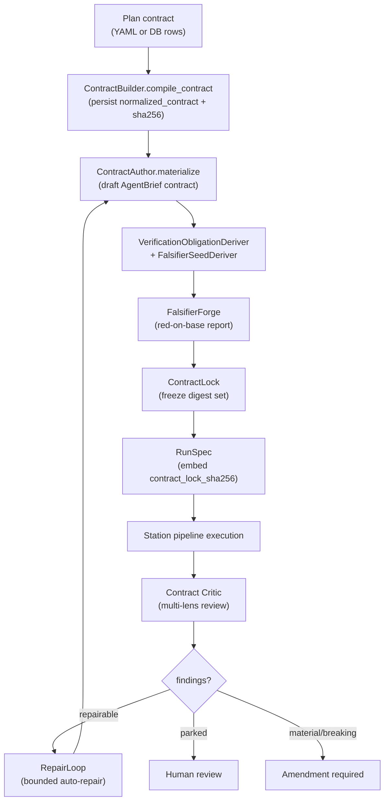

# Contract management

Contract management covers the full lifecycle of the contract-bearing work
graph: authoring draft agent brief contracts, lowering plan contracts from
database rows, locking them as immutable digest sets, evolving them between
attempts, and criticizing them with multi-lens review. Contracts are the
authority for what a [Slice](../primitives/slice.md) must achieve; the gate
verifies runs against the locked contract, and the implementer follows the
locked brief.

## Directory layout

```text
lib/conveyor/
├── plan_contract.ex                      # Loads & validates conveyor.plan@1 contracts
├── contract_evolution.ex                 # Classifies contract changes, materializes rerun state
├── contract_forge/                       # Contract authoring and derivation
│   ├── contract_author.ex                # Materializes draft AgentBrief contracts from RoleViews
│   ├── archetype_templates.ex            # Deterministic archetype obligation floors
│   ├── interface_policy.ex               # Interface lock, compatibility, rollout, migration checks
│   ├── verification_obligation_deriver.ex # Derives VerificationObligation projections
│   ├── falsifier_seed_deriver.ex         # Derives compiler-owned falsifier seeds
│   └── falsifier_forge.ex                # Builds pre-agent red-on-base falsifier report
├── contract_critic/                      # Multi-lens contract criticism (never approves)
│   ├── lenses.ex                         # Pure multi-lens Contract Critic projection
│   ├── cheapest_wrong.ex                 # Projects cheapest-wrong implementation attacks
│   ├── independence_profile.ex           # Records & enforces independence profiles for critics
│   ├── repair_diff.ex                    # Typed repair comparison with partial pass-output reuse
│   └── repair_loop.ex                    # Bounded automatic repair policy for critic findings
├── planning/
│   └── contract_builder.ex               # Compiles DB-native task-graph rows -> Plan.normalized_contract
└── factory/
    └── contract_lock.ex                  # Ash resource: immutable digest set that freezes a slice contract
```

## Key abstractions

| Abstraction | Location | Role |
| --- | --- | --- |
| `Conveyor.PlanContract` | `lib/conveyor/plan_contract.ex` | Loads and validates a `conveyor.plan@1` contract from a sidecar file or a fenced markdown block. Returns a `Result` with the contract map and `contract_sha256`. |
| `Conveyor.PlanContract.Result` | `lib/conveyor/plan_contract.ex` | Validated normalized plan contract: `source_path`, `contract`, `contract_sha256`. |
| `Conveyor.PlanContract.Error` | `lib/conveyor/plan_contract.ex` | Typed load/validation error: `code`, `message`, `source_path`, `details`. |
| `Conveyor.Planning.ContractBuilder` | `lib/conveyor/planning/contract_builder.ex` | Compiles DB-native task-graph rows (Project, Plan, Epic, Slice) into the `conveyor.plan@1` `normalized_contract` map and persists it on the Plan. |
| `Conveyor.ContractForge.ContractAuthor` | `lib/conveyor/contract_forge/contract_author.ex` | Materializes draft AgentBrief contracts from contract-author RoleViews, deriving verification obligations and falsifier seeds. |
| `Conveyor.ContractForge.ArchetypeTemplates` | `lib/conveyor/contract_forge/archetype_templates.ex` | Deterministic archetype obligation floors (bugfix, CRUD, refactor, migration, dependency, interface, security, performance, configuration, custom). |
| `Conveyor.ContractForge.InterfacePolicy` | `lib/conveyor/contract_forge/interface_policy.ex` | Validates interface lock level, compatibility policy, rollout, and migration safety. |
| `Conveyor.ContractForge.VerificationObligationDeriver` | `lib/conveyor/contract_forge/verification_obligation_deriver.ex` | Derives `VerificationObligation` projections from acceptance criteria, blocking on machine-checkable criteria without falsifying conditions. |
| `Conveyor.ContractForge.FalsifierSeedDeriver` | `lib/conveyor/contract_forge/falsifier_seed_deriver.ex` | Derives compiler-owned falsifier seeds from six contract fields (falsifying conditions, boundary examples, forbidden predicates, property counterexamples, metamorphic relations, interface incompatibility cases). |
| `Conveyor.ContractForge.FalsifierForge` | `lib/conveyor/contract_forge/falsifier_forge.ex` | Builds the pre-agent red-on-base falsifier report for a locked slice contract. |
| `Conveyor.ContractCritic.Lenses` | `lib/conveyor/contract_critic/lenses.ex` | Pure multi-lens Contract Critic projection. Ten required lenses, preserves disagreement, never approves or locks. |
| `Conveyor.ContractCritic.CheapestWrong` | `lib/conveyor/contract_critic/cheapest_wrong.ex` | Projects cheapest-wrong implementation attacks into `ContractChallengeCase` records. |
| `Conveyor.ContractCritic.IndependenceProfile` | `lib/conveyor/contract_critic/independence_profile.ex` | Records and enforces independence profiles for challenge roles. High-risk change classes require a model-diverse or human/deterministic lens. |
| `Conveyor.ContractCritic.RepairDiff` | `lib/conveyor/contract_critic/repair_diff.ex` | Typed repair comparison with partial pass-output reuse. Blocks if changed artifacts exceed the rejected-artifact scope. |
| `Conveyor.ContractCritic.RepairLoop` | `lib/conveyor/contract_critic/repair_loop.ex` | Bounded automatic repair policy. Decides repair vs. park, evaluates progress, routes material/breaking changes to amendment. |
| `Conveyor.ContractEvolution` | `lib/conveyor/contract_evolution.ex` | Classifies contract changes (weakened, strengthened, scope, test pack, clarification) and materializes rerun state for changed contracts. |
| `Conveyor.ContractEvolution.Diff` | `lib/conveyor/contract_evolution.ex` | Classification result: `classifications`, `changed?`, `automatic_rerun_allowed?`, `requires_human_decision?`. |
| `ContractLock` | `lib/conveyor/factory/contract_lock.ex` | Ash resource. Immutable digest set that freezes a slice contract for future evidence: plan contract, brief, acceptance criteria, required tests, test pack, verification commands, AGENTS.md, policy, and protected path globs. |

## How it works

### Plan contract loading

`Conveyor.PlanContract.load/1` accepts a path to a markdown plan file, a YAML
sidecar, or a JSON contract. It resolves the source (direct file, sidecar
`conveyor.plan.yml`/`.yaml`/`.json`, or a fenced `conveyor-plan@1` block in
markdown), decodes it, checks the schema version, validates against the JSON
schema at `docs/schemas/conveyor.plan@1.json`, and runs semantic validation on
`work_dependencies` (no dangling refs, no self-loops, must form a DAG). The
result carries the canonical `contract_sha256`.

### DB-native contract building

`Conveyor.Planning.ContractBuilder` is the sibling of the YAML path. It
compiles the DB-native task-graph rows (Project, Plan, Epic, Slice) into the
same `conveyor.plan@1` `normalized_contract` map. The `contract_sha256` is
computed identically to the YAML path, so the same contract produces the same
digest regardless of authoring route. `compile_contract/1` persists the
contract and digest on the Plan while it is still in `:draft` status; the
contract is frozen once the plan leaves draft.

### Contract authoring (Contract Forge)

`Conveyor.ContractForge.ContractAuthor.materialize/1` takes a RoleView and
produces a draft `conveyor.agent_brief_contract@1` contract. It fetches the
archetype template for the change class, partitions the bounded context into
requirements (REQ-*) and decisions (DEC-*), normalizes acceptance criteria
with example lists, derives verification obligations, and derives falsifier
seeds. The result carries a `contract_digest` over the canonicalized contract.
If verification obligation derivation fails (a machine-checkable criterion
without falsifying conditions), the result is `:blocked` with findings.

### Archetype templates

`ArchetypeTemplates` provides minimum obligation floors for ten archetypes:
`bugfix_regression`, `crud_endpoint`, `pure_refactor`, `schema_migration`,
`dependency_update`, `public_interface_change`, `security_hardening`,
`performance`, `configuration`, and `custom`. Each template carries
`minimum_obligations`, `required_review_lenses`, and
`falsifier_seed_families`. Contract authors may add stricter obligations, but
downstream tools rely on these stable keys.

### Interface policy

`InterfacePolicy` validates that public or cross-slice interfaces have a
strong lock level (`strict`, `compatible_superset`, or `review_required`) and
a compatibility policy that is not `none` or `informational`. It checks
rollout environment and intent, and `validate_migration/1` enforces that
migration profiles carry reversibility, backfill, data validation,
compatibility window, and rollback restore.

### Falsifier seeds

`FalsifierSeedDeriver` extracts falsifier seeds from six fields on each
acceptance criterion. Each seed carries a `seed_id`, `family`, source
criterion ID, payload, and `preservation_required: true`. `verify_preserved/2`
checks that compiler-derived seeds are not dropped during translation.
`FalsifierForge.run!/2` builds the pre-agent red-on-base falsifier report,
requiring every acceptance criterion to have both seed IDs and required test
refs.

### Contract locking

The `ContractLock` resource freezes the contract for a slice into an
immutable digest set. Each lock carries SHA-256 digests for the plan contract,
brief, acceptance criteria, required tests, test pack, verification commands,
AGENTS.md, and policy, plus the literal `protected_path_globs`. Once locked,
these digests are the reference the gate's `contract_lock` stage checks
against, and the [Run spec](../primitives/run-attempt.md) embeds the
`contract_lock_sha256`.



### Contract evolution

`Conveyor.ContractEvolution.diff/2` classifies changes between an old and new
contract into ordered classifications: `acceptance_weakened`,
`acceptance_strengthened`, `policy_weakened`, `policy_strengthened`,
`scope_added`, `scope_removed`, `test_pack_changed`, and `clarification_only`.
Weakening classifications (acceptance or policy weakened) block automatic
reruns and require a human approval reason. `prepare_rerun!/3` materializes
the rerun: it creates a new ContractLock, a new RunSpec with the updated
contract lock digest, a new RunAttempt with an incremented attempt number, and
a HumanDecision recording the approval.

### Contract criticism (Contract Critic)

The Contract Critic is a pure, non-authorizing review layer. It may challenge
contracts and preserve disagreement, but it never approves, locks, or grants
implementation authority. `Lenses.review/1` runs ten required lenses (intent
fidelity, scope delta, principal engineering, interface compatibility, test
loopholes, reliability/observability, security, cost/simplification, hidden
decision, approval cognitive load) and produces an overall status of
`:passed` or `:challenged`. `CheapestWrong.challenge!/1` projects
cheapest-wrong implementation attacks into `ContractChallengeCase` records
with materiality ratings. `IndependenceProfile.enforce!/1` blocks high-risk
change classes (security, irreversible migration, public compat,
autonomy-increasing) unless a model-diverse or human/deterministic critical
lens is present.

`RepairLoop` governs bounded automatic repair. `next_action/1` decides repair
vs. park based on completed rounds (default max 2). `evaluate/1` parks on
oscillation (repeated digests) or non-progress (finding counts not
decreasing). `route_change/1` blocks policy or acceptance weakening without
authority, routes material/breaking changes in amendment classes (plan,
constraint, interface, acceptance) to an amendment requirement, and allows
everything else. `RepairDiff.compare/1` ensures only rejected-artifact scope
changes during repair, computing reused pass outputs and invalidated passes.

## Integration points

- **[Planning compiler](../systems/planning-compiler.md)** —
  `ContractBuilder` is called from `lock_task` before transitioning a plan to
  `:handoff_ready`. `PlanContract.load/1` is the entry point for YAML-authored
  plans.
- **[Trust gate](../systems/gate.md)** — the `contract_lock` gate stage
  verifies that the run still matches the approved ContractLock digests.
- **[Station pipeline](station-pipeline.md)** — the RunSpec embeds
  `contract_lock_sha256`, and the implementer station follows the locked brief.
  `ContractEvolution.prepare_rerun!/3` creates the new RunSpec and RunAttempt
  for a rerun.
- **[Prompt building](prompt-building.md)** — the PromptBuilder reads the
  AgentBrief to render the slice contract section of the implementation prompt.
- **Contract lock resource** — `lib/conveyor/factory/contract_lock.ex` is the
  persisted authority. The `RunSpec` carries `contract_lock_sha256` and the
  gate reads it back.

## Entry points for modification

- **Add a new archetype** — add a template entry to `@templates` in
  `lib/conveyor/contract_forge/archetype_templates.ex` with minimum
  obligations, required review lenses, and falsifier seed families.
- **Change contract validation** — `lib/conveyor/plan_contract.ex` owns schema
  version checking, JSON schema validation, and semantic dependency validation.
- **Change contract authoring** — `lib/conveyor/contract_forge/contract_author.ex`
  is the materialization entry point. `InterfacePolicy` and
  `VerificationObligationDeriver` are the downstream derivation modules.
- **Change falsifier seed derivation** — `@seed_fields` in
  `lib/conveyor/contract_forge/falsifier_seed_deriver.ex` maps contract fields
  to seed families. `FalsifierForge.run!/2` enforces red-on-base coverage.
- **Add a contract critic lens** — add the lens name to `@required_lenses` in
  `lib/conveyor/contract_critic/lenses.ex`. The critic never approves, so new
  lenses challenge only.
- **Change evolution classification** — `@classification_order` and `@weakening`
  in `lib/conveyor/contract_evolution.ex` control the classification
  precedence and which classifications block automatic reruns.
- **Change repair policy** — `@default_max_rounds` and `@amendment_classes` in
  `lib/conveyor/contract_critic/repair_loop.ex` control the repair bound and
  which change classes require amendments.
- **Change the locked digest set** — `lib/conveyor/factory/contract_lock.ex`
  (the Ash resource) and `contract_lock_payload/1` in
  `lib/conveyor/contract_evolution.ex` (the digest computation).

## Key source files

| File | Role |
| --- | --- |
| `lib/conveyor/plan_contract.ex` | Loads and validates `conveyor.plan@1` contracts from files or fenced blocks. |
| `lib/conveyor/planning/contract_builder.ex` | Compiles DB-native rows into `Plan.normalized_contract`. |
| `lib/conveyor/contract_forge/contract_author.ex` | Materializes draft AgentBrief contracts from RoleViews. |
| `lib/conveyor/contract_forge/archetype_templates.ex` | Deterministic archetype obligation floors. |
| `lib/conveyor/contract_forge/interface_policy.ex` | Interface lock, compatibility, rollout, and migration safety. |
| `lib/conveyor/contract_forge/verification_obligation_deriver.ex` | Derives VerificationObligation projections. |
| `lib/conveyor/contract_forge/falsifier_seed_deriver.ex` | Derives compiler-owned falsifier seeds. |
| `lib/conveyor/contract_forge/falsifier_forge.ex` | Builds pre-agent red-on-base falsifier report. |
| `lib/conveyor/contract_critic/lenses.ex` | Pure multi-lens Contract Critic projection. |
| `lib/conveyor/contract_critic/cheapest_wrong.ex` | Projects cheapest-wrong implementation attacks. |
| `lib/conveyor/contract_critic/independence_profile.ex` | Records and enforces independence profiles. |
| `lib/conveyor/contract_critic/repair_diff.ex` | Typed repair comparison with partial pass-output reuse. |
| `lib/conveyor/contract_critic/repair_loop.ex` | Bounded automatic repair policy. |
| `lib/conveyor/contract_evolution.ex` | Classifies contract changes and materializes rerun state. |
| `lib/conveyor/factory/contract_lock.ex` | Ash resource: immutable digest set for a frozen slice contract. |

See also: [Planning compiler](../systems/planning-compiler.md),
[Trust gate](../systems/gate.md), [Station pipeline](station-pipeline.md),
[Prompt building](prompt-building.md),
[Slice](../primitives/slice.md), [Contract lock](../primitives/contract-lock.md),
[Run attempt](../primitives/run-attempt.md).
