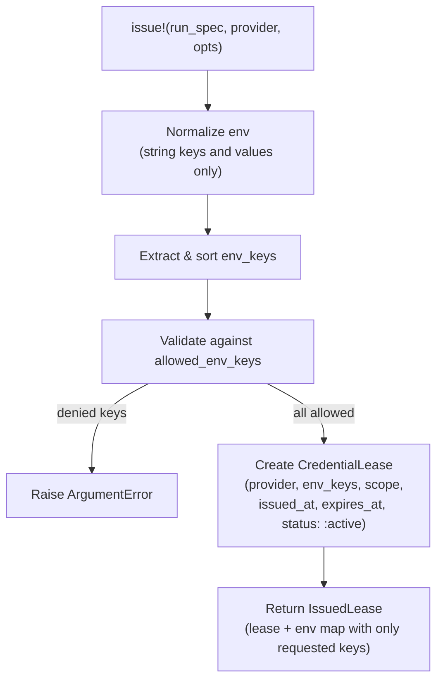

# Credential broker

The credential broker issues and revokes short-lived credential leases without
persisting secret values. It records the metadata of a credential exposure
(provider, env keys, scope, issue and expiry times, status) as a
`CredentialLease` row, but the secret values themselves are passed through as
an env map that the caller injects at execution time. This keeps the audit
trail complete while ensuring no secret material is stored in the database.

## Directory layout

```text
lib/conveyor/
├── credential_broker.ex              # Issues, revokes, and expires credential leases
└── factory/
    └── credential_lease.ex           # Ash resource: short-lived scoped credential exposure record
```

## Key abstractions

| Abstraction | Location | Role |
| --- | --- | --- |
| `Conveyor.CredentialBroker` | `lib/conveyor/credential_broker.ex` | The broker. Issues leases scoped to a RunSpec (and optionally a StationRun), revokes them individually or in bulk, and expires stale leases. |
| `Conveyor.CredentialBroker.IssuedLease` | `lib/conveyor/credential_broker.ex` | The issue result: the persisted `CredentialLease` record plus the `env` map containing only the allowlisted keys. |
| `CredentialLease` | `lib/conveyor/factory/credential_lease.ex` | Ash resource. Records the provider, env keys, scope, issued/expired/revoked timestamps, and status. Never stores secret values. |

## How it works

### Issuing a lease

`issue!/3` takes a RunSpec, a provider name, and options. It normalizes the env
map (requiring string keys and values), extracts and sorts the env keys,
validates them against an optional `allowed_env_keys` list (raising if any key
is not allowed by policy), and creates a `CredentialLease` row. The lease
carries a default TTL of 900 seconds (15 minutes), configurable via
`:ttl_seconds`. The returned `IssuedLease` struct contains the lease record and
an env map restricted to only the requested keys via `Map.take/2`.



### Revoking leases

Three revocation entry points cover different scopes:

- `revoke!/2` — revokes a single lease, setting `revoked_at` and `status: :revoked`.
- `revoke_for_run_spec!/2` — revokes all active or issued leases for a RunSpec.
- `revoke_for_station_run!/2` — revokes all active or issued leases for a
  StationRun.

Revocation is idempotent in effect: only leases with status `:issued` or
`:active` are selected for revocation.

### Expiring stale leases

`expire_stale!/1` finds all leases with status `:issued` or `:active` whose
`expires_at` is not after the current time and revokes them with
`status: :expired`. This is the periodic sweep that cleans up leases that were
never explicitly revoked (for example, if a run crashed before cleanup).

### Lease lifecycle

The `CredentialLease` status transitions are:

| Status | Meaning |
| --- | --- |
| `:issued` | Initial status on creation. |
| `:active` | Set during issue (the broker creates with `:active`). |
| `:revoked` | Explicitly revoked by `revoke!/2` or the bulk revoke functions. |
| `:expired` | TTL elapsed, caught by `expire_stale!/1`. |
| `:invalidated` | Available for future invalidation flows (policy-driven). |

### What is not persisted

The broker never stores secret values. The `CredentialLease` resource has
attributes for `provider`, `env_keys` (the key names only), `scope`, and
timestamps. The secret values live in the `IssuedLease.env` map, which is
returned to the caller and injected at execution time. The audit trail records
which provider's credentials were exposed, which env keys were used, when they
were issued, and when they were revoked or expired, without recording the
secrets themselves.

## Integration points

- **[Sandbox isolation](sandbox-isolation.md)** — credential env keys flow
  through `NormalizedCommand.env_keys` and become `--env` flags on
  `docker exec`. The sandbox runner passes only the allowlisted environment
  into the container.
- **[Station pipeline](station-pipeline.md)** — leases can be scoped to a
  StationRun via the `:station_run` option, and `revoke_for_station_run!/2`
  cleans up credentials when a station completes or fails.
- **`Conveyor.ToolExecutor`** — the policy boundary that normalizes commands
  and checks env keys against the allowlist before the sandbox runner executes
  them.
- **[Run attempt](../primitives/run-attempt.md)** — every lease is scoped to a
  RunSpec, tying credential exposure to a specific execution attempt.

## Entry points for modification

- **Change the default TTL** — `:ttl_seconds` default (900) in
  `lib/conveyor/credential_broker.ex` (`issue!/3`).
- **Change env key validation** — `validate_env_keys!/2` and the
  `:allowed_env_keys` option in `lib/conveyor/credential_broker.ex`.
- **Change the lease lifecycle or status set** —
  `lib/conveyor/factory/credential_lease.ex` (the `:status` enum constraint).
- **Change revocation scope** — `revoke_for_run_spec!/2` and
  `revoke_for_station_run!/2` in `lib/conveyor/credential_broker.ex`.
- **Change stale-lease expiry** — `expire_stale!/1` in
  `lib/conveyor/credential_broker.ex`.

## Key source files

| File | Role |
| --- | --- |
| `lib/conveyor/credential_broker.ex` | Issues, revokes, and expires short-lived credential leases without persisting secrets. |
| `lib/conveyor/factory/credential_lease.ex` | Ash resource for the scoped credential exposure record. |

See also: [Sandbox isolation](sandbox-isolation.md),
[Station pipeline](station-pipeline.md),
[Run attempt](../primitives/run-attempt.md).
