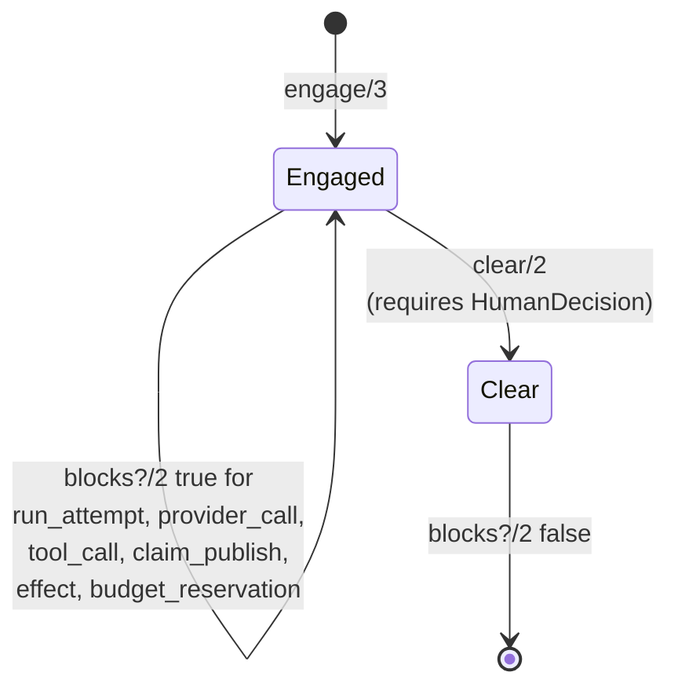

# Emergency stop

The emergency stop is the pure state machine that halts the factory when a human or policy decides work must stop. An engaged stop blocks new station starts, provider calls, tool calls, claim publication, and external effects. It is a kill switch, not a pause: while engaged, the blocked action set is consulted before every effect-bearing operation, and clearing a stop requires an explicit human decision.

## Key abstractions

| Abstraction | Location | Role |
| ----------- | -------- | ---- |
| `Conveyor.EmergencyStop` | `lib/conveyor/emergency_stop.ex` | Pure emergency-stop state transitions. `engage/3` creates an engaged stop, `blocks?/2` tests whether an action is blocked, `clear/2` clears an engaged stop with a `HumanDecision`, and `to_record/1` projects the in-memory state onto the `conveyor.emergency_stop_state@1` wire shape. |
| Blocked action set | `lib/conveyor/emergency_stop.ex` (`@blocked_actions`) | The fixed `MapSet` of actions an engaged stop blocks: `:run_attempt`, `:planning_run`, `:provider_call`, `:tool_call`, `:claim_publish`, `:effect`, `:budget_reservation`. |
| `conveyor.emergency_stop_state@1` | `lib/conveyor/emergency_stop.ex` (`to_record/1`) | The schema-conformant wire/persistence shape: string enums, `project_id` for project scope, single `actor` (the most recent operator), `engaged_at`, `cleared_at`, and `human_decision_id`. |

## How it works

The emergency stop is a pure module with no I/O. It works in three steps:

1. **Engage.** `engage/3` takes a `scope` atom (for example `:project`), a `scope_id`, and opts (`:actor`, `:reason`, `:trace_id`, optional `:now`). It returns an in-memory map with `status: :engaged` and the engagement metadata. The in-memory map keeps atoms (`status: :engaged`, `scope: :project`) for pattern matching in `blocks?/2` and `clear/2`.

2. **Block.** `blocks?/2` takes the stop state and an action atom. It returns `true` only when the status is `:engaged` and the action is in `@blocked_actions`. Any other state (including `:clear`) returns `false`. Callers consult `blocks?/2` before every effect-bearing operation: a new station start, a provider call, a tool call, a claim publication, an external effect, or a budget reservation.

3. **Clear.** `clear/2` takes an engaged stop and opts. It requires a `human_decision_id` and raises `ArgumentError` without one. Clearing transitions the status to `:clear`, records `cleared_by` (the actor) and `cleared_at`, and links the `HumanDecision` that authorized the clear. A cleared stop blocks nothing.

### Scope

The stop carries a `scope` and `scope_id`. Project scope stores the `project_id` in the wire record via `to_record/1`. The scope is the boundary the stop applies to: a project-scoped stop blocks all work under that project.

### Wire shape

`to_record/1` projects the in-memory state onto the `conveyor.emergency_stop_state@1` record. The in-memory map uses atoms for pattern matching; the wire shape uses string enums, a `project_id` for project scope, and a single `actor` (the most recent operator, which is `cleared_by` after a clear or the original engager before). `engaged_at` and `cleared_at` are serialized to ISO 8601. Absent fields are omitted rather than emitted as null.

## Integration points

- **Station pipeline** — the station wrapper consults `EmergencyStop.blocks?/2` before starting a new station and before executing effects. An engaged stop prevents new station starts. See [Station pipeline](station-pipeline.md).
- **Agent runner** — provider calls and tool calls check `blocks?/2` before invoking the adapter or running a tool. See [Agent runner](../systems/planning-compiler.md).
- **Claim publication** — the evidence and review systems check `blocks?/2` before publishing a claim. An engaged stop holds claims.
- **Budget reservation** — the budget system checks `blocks?/2` before reserving budget. An engaged stop prevents new reservations.
- **External effects** — `Conveyor.Effects` checks `blocks?/2` before attempting any external effect. See [Event sourcing](event-sourcing.md) for the ledger that records the stop state.
- **Human decision** — clearing a stop requires a `HumanDecision`, the same human-decision record used by the gate and policy systems. See [Trust gate](../systems/gate.md).

## Entry points for modification

| Change | Where to start |
| ------ | -------------- |
| Add a new blocked action | Add the atom to `@blocked_actions` in `lib/conveyor/emergency_stop.ex`. |
| Add a new scope | Extend `engage/3` to accept the scope, and extend `project_id/1` (or add a sibling) in `to_record/1`. |
| Change the clear requirements | `clear/2` in `lib/conveyor/emergency_stop.ex`. |
| Change the wire shape | `to_record/1` in `lib/conveyor/emergency_stop.ex` and the matching schema. |
| Change where the stop is consulted | Add a `blocks?/2` check in the effect-bearing module before the operation. |

## Key source files

| File | Role |
| ---- | ---- |
| `lib/conveyor/emergency_stop.ex` | Pure emergency-stop state transitions and wire projection. |

See also: [Station pipeline](station-pipeline.md), [Event sourcing](event-sourcing.md), [Trust gate](../systems/gate.md), [CLI tools](cli-tools.md), [Slice](../primitives/slice.md), [Run attempt](../primitives/run-attempt.md).
