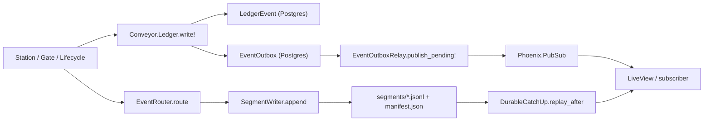

# Event sourcing

Conveyor records every state-changing action in an append-only, idempotent ledger. The ledger is the authority for what happened; Postgres projections and disk artifacts are derived from it. Events flow from the ledger through a transactional outbox to PubSub subscribers, and a segment writer provides bounded immutable JSONL files for durable catch-up replay.

## Ledger

`Conveyor.Ledger` (`lib/conveyor/ledger.ex`) is the idempotent append-only writer. `write!/2` and `write/2` accept an attrs map and create a `LedgerEvent` row, keyed by a domain `idempotency_key`. If an event with that key already exists, the writer returns it instead of creating a duplicate. This makes every station, gate, and lifecycle transition safe to retry.

The writer runs inside a `Repo.transaction`. It creates the `LedgerEvent` and an `EventOutbox` row in the same transaction, so the outbox entry is committed atomically with the event. If the transaction fails, neither the event nor the outbox entry exists. The writer rescues `Ash.Error.Invalid` and rechecks for an existing event by idempotency key, handling races where a concurrent writer created the event first.

`tombstone!/2` writes an `artifact.deleted` event recording the actor, artifact id, prior digest, and reason. This is how artifact deletion is recorded as an event rather than a silent row removal.

## LedgerEvent resource

`Conveyor.Factory.LedgerEvent` (`lib/conveyor/factory/ledger_event.ex`) is the append-only timeline entry. Its attributes:

- `trace_id`, `span_id` — distributed tracing context
- `idempotency_key` — the domain key, unique per identity
- `type` — the event type string (e.g. `station.succeeded`, `station.failed`, `artifact.deleted`)
- `payload` — the event-specific payload map
- `occurred_at` — the timestamp

It belongs to a `Project` (required) and optionally to a `Slice`, `RunAttempt`, `AgentSession`, and `StationRun`. The `unique_idempotency_key` identity enforces exactly-once writes at the database level.

## EventOutbox

`Conveyor.Factory.EventOutbox` (`lib/conveyor/factory/event_outbox.ex`) is the transactional publication queue. Each row carries a `topic` (default `ledger_events`), a `message` map, a `status` (`:pending`, `:published`, `:failed`), an `attempts` counter, and a `published_at` timestamp. It belongs to a `LedgerEvent` with a unique identity so each event is published exactly once.

`Conveyor.EventOutboxRelay` (`lib/conveyor/event_outbox_relay.ex`) publishes committed events. `publish_pending!/1` reads all `:pending` outbox rows sorted by insertion time, broadcasts each message to its PubSub topic, and marks the row `:published` with an incremented attempt count. This is the transactional outbox pattern: the event and the outbox entry commit together, and the relay publishes asynchronously with at-least-once delivery.

## Event router

`Conveyor.Events.EventRouter` (`lib/conveyor/events/event_router.ex`) assigns deterministic routing metadata to a batch of events. `route/2` stamps each event with a monotonically increasing `sequence`, a `correlation_id` (shared across the batch), a `trace_context` with the `trace_id`, and a `causation_id` pointing at the previous event's id. This builds a causally linked chain within a batch, which the durable catch-up layer uses for ordering.

## Segment writer

`Conveyor.Events.SegmentWriter` (`lib/conveyor/events/segment_writer.ex`) is the bounded immutable JSONL segment writer. It buffers events in memory and flushes a segment when it crosses a byte threshold (default 1 MiB) or an age threshold (default 30 seconds). Each segment is written to `segments/000001.jsonl` with a SHA-256 digest, byte size, and sequence range. `close/1` flushes the final segment and writes a `manifest.json` listing all segments with their digests and sequence ranges.

The manifest schema is `conveyor.event_segment_manifest@1`. Segments are immutable once written; the manifest is the index. This gives Conveyor a durable, content-addressed event log on disk alongside the Postgres ledger.

## Durable catch-up

`Conveyor.Events.DurableCatchUp` (`lib/conveyor/events/durable_catch_up.ex`) combines segment replay with live-message sequence filtering. `replay_after/3` reads all segments from a manifest, filters events whose sequence is greater than the caller's last seen sequence, and returns them sorted by sequence. `accept_live/2` takes a live event and accepts it only if its sequence is greater than the state's `last_sequence`, updating the state. This lets a subscriber catch up from disk segments and then switch to live PubSub messages without gaps or duplicates.

## Event flow

## Key source files

| File | Purpose |
| --- | --- |
| `lib/conveyor/ledger.ex` | Idempotent append-only ledger writer |
| `lib/conveyor/factory/ledger_event.ex` | Append-only event timeline resource |
| `lib/conveyor/factory/event_outbox.ex` | Transactional publication queue resource |
| `lib/conveyor/event_outbox_relay.ex` | Publishes committed events to PubSub |
| `lib/conveyor/events/event_router.ex` | Assigns deterministic routing metadata to event batches |
| `lib/conveyor/events/segment_writer.ex` | Bounded immutable JSONL segment writer |
| `lib/conveyor/events/durable_catch_up.ex` | Segment replay plus live-message sequence filtering |

## Related pages

- [Station pipeline](station-pipeline.md) — stations write ledger events on success and failure
- [Architecture](../overview/architecture.md) — ledger in the OTP supervision tree
- [Evidence recording and verification rerunner](../systems/evidence-recording.md) — evidence and ledger interaction
- [Gate stage composition](../systems/gate.md) — gate writes ledger events for verdicts
