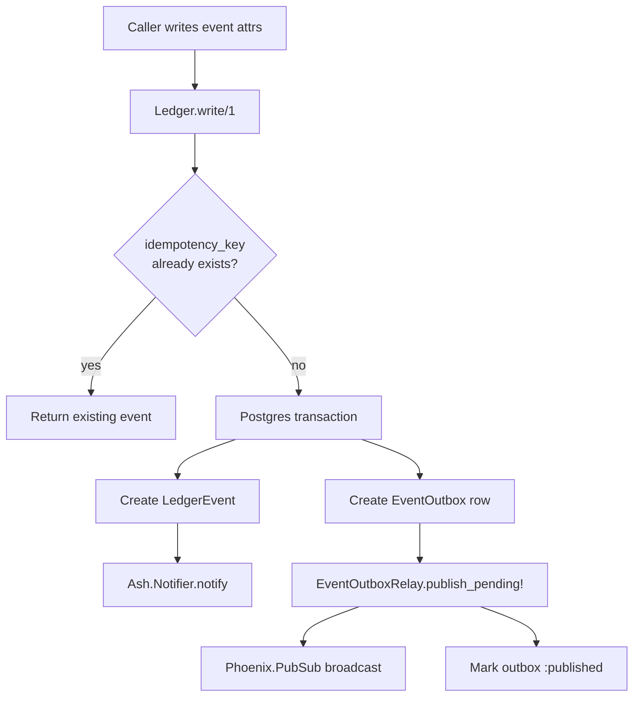

# Event sourcing

Conveyor persists every state-changing decision to an append-only audit ledger before any external effect, so the full history of a run is durable, replayable, and crash-survivable. The ledger is the source of truth: read models, run reconstruction, crash recovery, and reproducible review are all deterministic folds over the committed event stream. This design gives time-travel debugging, reproducible AI review, and runs that survive a process crash without re-executing passed slices.

## Directory layout

```text
lib/conveyor/
├── ledger.ex                          # idempotent append-only writer
├── event_outbox.ex                    # transactional outbox skeleton
├── event_outbox_relay.ex              # publishes committed events via PubSub
├── run_read_model.ex                  # U1: read-only run story folded from the ledger
├── events/
│   ├── durable_catch_up.ex            # segment replay + live sequence filtering
│   ├── event_router.ex                # deterministic routing metadata assignment
│   └── segment_writer.ex              # bounded immutable JSONL segment writer
└── planning/
    ├── run_reconstruction.ex          # U3: rebuild loop state from ledger stream
    └── run_reconciler.ex              # U6: detect interrupted runs, route resume/park
```

```text
lib/conveyor/factory/
├── ledger_event.ex                    # Ash resource: append-only timeline entry
├── event_outbox.ex                    # Ash resource: transactional publication queue
└── authority_event.ex                 # Ash resource: canonical causal authority event
```

## Key abstractions

| Abstraction | Location | Role |
| ----------- | -------- | ---- |
| `Conveyor.Ledger` | `lib/conveyor/ledger.ex` | Idempotent append-only writer. Each event carries a domain idempotency key; duplicate writes return the existing row instead of creating a second. |
| `LedgerEvent` | `lib/conveyor/factory/ledger_event.ex` | Ash resource for the append-only timeline. UUID primary key, `idempotency_key` identity, `type`, `payload`, `occurred_at`, and belongs-to links to project, slice, run attempt, agent session, and station run. |
| `EventOutbox` | `lib/conveyor/factory/event_outbox.ex` | Ash resource for the transactional publication queue. Each row references a `LedgerEvent` and carries a `status` of `:pending`, `:published`, or `:failed`. |
| `Conveyor.EventOutboxRelay` | `lib/conveyor/event_outbox_relay.ex` | Publishes committed ledger events to Phoenix PubSub in `inserted_at` order and marks each outbox row `:published`. |
| `AuthorityEvent` | `lib/conveyor/factory/authority_event.ex` | Canonical causal authority event for audit, recovery, and replay. Carries `event_id`, `stream_id`, `stream_version`, `causation_id`, `correlation_id`, `trace_context`, `payload_ref`, `fencing_token`, and `policy_decision_id`. Identities enforce unique event id and unique `(stream_id, stream_version)`. |
| `Conveyor.Events.SegmentWriter` | `lib/conveyor/events/segment_writer.ex` | Bounded immutable JSONL segment writer. Flushes a segment when it exceeds `max_bytes` (default 1 MiB) or `max_age_ms` (default 30 s), records per-segment `digest` and `sequence_start`/`sequence_end`, and writes a `conveyor.event_segment_manifest@1` manifest on close. |
| `Conveyor.Events.DurableCatchUp` | `lib/conveyor/events/durable_catch_up.ex` | Durable segment replay plus live-message sequence filtering. `replay_after/3` replays segment events after a `last_sequence`, and `accept_live/2` filters live messages so a subscriber only sees events newer than its watermark. |
| `Conveyor.Events.EventRouter` | `lib/conveyor/events/event_router.ex` | Assigns deterministic routing metadata to a batch of events: `event_id`, monotonic `sequence`, `causation_id` (previous event), `correlation_id`, and `trace_context`. |
| `Conveyor.RunReadModel` | `lib/conveyor/run_read_model.ex` | U1: a read-only run story folded from a run's committed ledger stream plus DB enrichment. Returns the terminal status, ordered slices with outcomes and gate verdicts, and the stop point. |
| `Conveyor.Planning.RunReconstruction` | `lib/conveyor/planning/run_reconstruction.ex` | U3: rebuilds a run's loop state purely from its committed `run.slice_outcome` events into a `ResumeState`. Passed slices are the durable boundary and are never re-run. |
| `Conveyor.Planning.RunReconciler` | `lib/conveyor/planning/run_reconciler.ex` | U6: detects interrupted runs from the ledger and routes each to resume or park, bounded by a resume-attempt cap. Runs as a maintenance job at application start. |

## How it works

The ledger enforces commit-first ordering: an event is persisted before any external effect is taken. Each write is idempotent on a domain `idempotency_key`, so retries after a crash cannot create duplicate history. A write happens inside a single Postgres transaction that creates both the `LedgerEvent` and its companion `EventOutbox` row, so the event and its publication intent are atomic. The `EventOutboxRelay` then publishes committed events to Phoenix PubSub and marks each outbox row `:published`.



### Run lifecycle events

The serial driver (`lib/conveyor/planning/serial_driver.ex`) writes the run lifecycle to the ledger. The lifecycle event types `RunReconciler` and `RunReadModel` read are:

- `run.started` — records the run id, the deterministic slice order (`slice_ids`), and the work graph.
- `run.slice_outcome` — one per slice, carrying the `slice_id`, `sequence`, `status` (`passed` / `parked` / `reaped_wall_clock`), `run_attempt_outcome`, `gate_result`, and `findings`. Written after the accept-commit, so a committed outcome always means the side effect landed.
- `run.finished` — terminal: the run completed every slice.
- `run.reaped` — terminal: the run-budget deadline halted the run.
- `run.parked` — terminal: the run parked for human judgment (for example, resume cap exceeded).
- `run.resumed` — one per resume attempt, used to bound the resume-attempt cap.

### Crash recovery

If the process crashes, `RunReconciler.reconcile!/1` reads the bounded set of lifecycle events, groups them by run id, and routes each run:

- A run with `run.finished` is complete.
- A run with `run.reaped` or `run.parked` is already terminal and parked.
- A run with `run.started` and no terminal is interrupted. If its `run.resumed` count is below the cap, it resumes; otherwise it parks.

`RunReconstruction.reconstruct/3` folds the committed `run.slice_outcome` events against the run's deterministic slice order into a `ResumeState`: `passed_slice_ids`, `blocked`, `start_index`, and `in_flight_slice`. The resume point is the first ordered slice with no committed outcome. Passed slices are the durable boundary and are never re-executed. Exactly-once workspace side-effect reconciliation (`lib/conveyor/planning/run_reconciliation.ex`) checks the live workspace before re-running the in-flight slice: if HEAD already holds that slice's accept-commit, the side effect already landed and the slice is recorded as passed rather than re-executed.

### Read model

`RunReadModel.summarize/1` builds the run story from the ledger plus per-slice DB enrichment. It splits into a pure part (`project/4`, building the skeleton from an injected order, outcomes map, and terminal status, with no DB) and a DB enrichment (`enrich/1`, joining `RunAttempt`, `GateResult`, `AgentSession`, and `Slice` in memory). This split keeps the fold unit-testable without Postgres. The pure projection mirrors `RunReconstruction.reconstruct/3`'s `in_flight_slice` for the stop point, and `RunReconciler`'s terminal classification for the run status. The DB enrichment only fills a slice from the DB when its stable key resolves to exactly one slice row, so gate and rework numbers never blend separate runs.

### Bounded segments

`SegmentWriter` is the bounded immutable JSONL segment writer for larger event streams. It buffers events in memory and flushes a segment when the buffer exceeds `max_bytes` or `max_age_ms`, writing each segment to `segments/NNNNNN.jsonl` under a root directory with a `sha256` digest and sequence range. On close it writes a `conveyor.event_segment_manifest@1` manifest listing every segment. `DurableCatchUp.replay_after/3` reads the manifest, replays segment events after a `last_sequence` watermark in sequence order, and `accept_live/2` filters live PubSub messages so a subscriber only sees events newer than its watermark, giving at-least-once delivery with deterministic dedup.

### Authority events

`AuthorityEvent` is the canonical causal authority event resource for audit, recovery, and replay. It carries full causal metadata: `event_id`, `stream_id`, `stream_version` (unique per stream), `causation_id` (the previous event in the stream), `correlation_id`, `trace_context`, `payload_ref`, `fencing_token`, and `policy_decision_id`. `EventRouter.route/2` assigns the deterministic routing metadata (`event_id`, monotonic `sequence`, `causation_id`, `correlation_id`, `trace_context`) to a batch of events before they are committed.

## Integration points

- **Serial driver** — `lib/conveyor/planning/serial_driver.ex` owns the run ledger writes: `run.started`, `run.slice_outcome` after each accept-commit, and `run.finished` / `run.reaped` terminals. See [Planning compiler](../systems/planning-compiler.md).
- **Run view CLI** — `mix conveyor.run_view` calls `RunReadModel.summarize/1` and renders the run story as human text or a `conveyor.run_view@1` JSON envelope. See [CLI tools](cli-tools.md).
- **Parked queue** — `mix conveyor.parked` surfaces runs that abstained (passed the gate but the calibrated trust score was not confident), least-trusted first. See [Trust gate](../systems/gate.md).
- **Station pipeline** — each station writes a ledger event via `Conveyor.Station` for idempotency and audit. See [Station pipeline](station-pipeline.md).
- **Trust gate finalizer** — `Conveyor.Gate.Finalizer` persists the `GateResult` and the slice outcome is then committed to the ledger. See [Trust gate](../systems/gate.md).
- **Phoenix PubSub** — `EventOutboxRelay` broadcasts `{:ledger_event, message}` on the `ledger_events` topic so LiveView and other subscribers see committed events in real time.

## Entry points for modification

| Change | Where to start |
| ------ | -------------- |
| Add a new ledger event type | Write it through `Conveyor.Ledger.write!/2` from the producing module; add the type to `@lifecycle_types` in `RunReconciler` and `RunReadModel` if it is a run-lifecycle event. |
| Change idempotency or write semantics | `lib/conveyor/ledger.ex` (`write/2`, `create_event/2`, `existing_event/2`). |
| Change the outbox publication path | `lib/conveyor/event_outbox_relay.ex` (`publish_pending!/1`) and `lib/conveyor/factory/event_outbox.ex`. |
| Change the run read model | `lib/conveyor/run_read_model.ex` (`summarize/1`, `project/4`, `enrich/1`). Keep the pure/DB split so the fold stays unit-testable. |
| Change crash recovery routing | `lib/conveyor/planning/run_reconciler.ex` (`route/5`, `@default_cap`). |
| Change resume reconstruction | `lib/conveyor/planning/run_reconstruction.ex` (`reconstruct/3`, `ResumeState`). |
| Change segment writing or replay | `lib/conveyor/events/segment_writer.ex` and `lib/conveyor/events/durable_catch_up.ex`. |
| Change authority event shape | `lib/conveyor/factory/authority_event.ex` and `lib/conveyor/events/event_router.ex`. |
| Change the `LedgerEvent` resource schema | `lib/conveyor/factory/ledger_event.ex` and the matching migration in `priv/repo/migrations/`. |

## Key source files

| File | Role |
| ---- | ---- |
| `lib/conveyor/ledger.ex` | Idempotent append-only writer with transactional outbox. |
| `lib/conveyor/factory/ledger_event.ex` | Ash resource for the append-only timeline entry. |
| `lib/conveyor/factory/event_outbox.ex` | Ash resource for the transactional publication queue. |
| `lib/conveyor/factory/authority_event.ex` | Ash resource for canonical causal authority events. |
| `lib/conveyor/event_outbox.ex` | Transactional outbox skeleton (child module). |
| `lib/conveyor/event_outbox_relay.ex` | Publishes committed events via Phoenix PubSub. |
| `lib/conveyor/events/segment_writer.ex` | Bounded immutable JSONL segment writer. |
| `lib/conveyor/events/durable_catch_up.ex` | Segment replay plus live sequence filtering. |
| `lib/conveyor/events/event_router.ex` | Deterministic routing metadata assignment. |
| `lib/conveyor/run_read_model.ex` | U1: read-only run story folded from the ledger. |
| `lib/conveyor/planning/run_reconstruction.ex` | U3: rebuild loop state from ledger stream. |
| `lib/conveyor/planning/run_reconciler.ex` | U6: detect interrupted runs, route resume/park. |

See also: [Planning compiler](../systems/planning-compiler.md), [Trust gate](../systems/gate.md), [Station pipeline](station-pipeline.md), [Emergency stop](emergency-stop.md), [CLI tools](cli-tools.md), [Slice](../primitives/slice.md), [Run attempt](../primitives/run-attempt.md).
