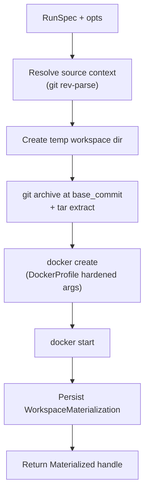

# Sandbox isolation

Sandbox isolation runs agent and verification commands inside hardened Docker
containers with no network, dropped capabilities, a read-only filesystem, and
resource limits. Each station gets a materialized workspace that is a clean
git archive checkout at the run spec's base commit, mounted into a container
that is created, used for command execution, and destroyed on cleanup. The
policy boundary lives in `Conveyor.ToolExecutor`; the sandbox runner only
executes commands that have already been normalized and allowed.

## Directory layout

```text
lib/conveyor/
├── sandbox/
│   ├── runner.ex               # Runner behaviour + minimal host command runner
│   ├── docker_runner.ex        # Docker-backed sandbox runner
│   ├── docker_profile.ex       # Hardened Docker create args (user, caps, limits)
│   ├── materialized.ex         # Runtime handle for a materialized workspace
│   ├── network_policy.ex       # Network mode helpers and egress allowlist validation
│   ├── policy_executor.ex      # Runs policy-checked commands inside a sandbox
│   ├── reaper.ex               # Reaps workspaces with pending cleanup status
│   └── workspace_cleanup.ex    # Cleanup policy enforcement + tree digest
└── factory/
    └── workspace_materialization.ex  # Ash resource: tracked workspace lifecycle
```

## Key abstractions

| Abstraction | Location | Role |
| --- | --- | --- |
| `Conveyor.Sandbox.Runner` | `lib/conveyor/sandbox/runner.ex` | The behaviour all sandbox runners implement: `materialize/2`, `exec/3`, `destroy/2`. Also provides a minimal host command runner for non-Docker execution. |
| `Conveyor.Sandbox.Runner.Result` | `lib/conveyor/sandbox/runner.ex` | Command execution result: `exit_code`, `stdout`, `stderr`, `duration_ms`. |
| `Conveyor.Sandbox.DockerRunner` | `lib/conveyor/sandbox/docker_runner.ex` | Docker-backed runner. Archives a git checkout at base commit, creates a hardened container, execs commands via `docker exec`, and destroys via cleanup. |
| `Conveyor.Sandbox.DockerProfile` | `lib/conveyor/sandbox/docker_profile.ex` | Builds the `docker create` arguments for hardened defaults: non-root user, no network, no-new-privileges, all caps dropped, read-only filesystem, tmpfs `/tmp`, PID/CPU/memory limits. |
| `Conveyor.Sandbox.Materialized` | `lib/conveyor/sandbox/materialized.ex` | Runtime handle: `workspace` (the persisted record), `path` (project path inside the mount), `root_path` (deletable temp root), `container_id`, `image_ref`. |
| `Conveyor.Sandbox.NetworkPolicy` | `lib/conveyor/sandbox/network_policy.ex` | Network mode helpers. Station defaults are all `:none`. Validates egress allowlists against internal/private hosts. |
| `Conveyor.Sandbox.PolicyExecutor` | `lib/conveyor/sandbox/policy_executor.ex` | Bridges `ToolExecutor` and `DockerRunner`. Runs a normalized command through policy, then execs the allowed command inside the container. |
| `Conveyor.Sandbox.WorkspaceCleanup` | `lib/conveyor/sandbox/workspace_cleanup.ex` | Enforces cleanup policy (`:delete`, `:preserve_on_failure`, `:preserve_always`). Removes the container, deletes the filesystem path, computes a tree SHA-256 digest. |
| `Conveyor.Sandbox.Reaper` | `lib/conveyor/sandbox/reaper.ex` | Scans for `WorkspaceMaterialization` rows with `:pending` cleanup status and runs cleanup on each. Returns counts of deleted, preserved, and failed. |
| `WorkspaceMaterialization` | `lib/conveyor/factory/workspace_materialization.ex` | Ash resource. Tracks each materialized workspace: purpose, base commit, paths, container ID, mount mode, head tree digest, cleanup policy and status. |

## How it works

### Materialization

`DockerRunner.materialize/2` takes a RunSpec and options, then produces a
`Materialized` handle through five steps:

1. **Source context** — resolves the project, its repo root, and project
   prefix via `git rev-parse`.
2. **Workspace paths** — creates a unique temp directory under the configured
   workspace root (default `System.tmp_dir!/conveyor-workspaces`).
3. **Archive checkout** — runs `git archive` at the RunSpec's `base_commit`,
   extracts the tar into the temp directory, and resolves the project path
   (handling subdir projects via the project prefix).
4. **Container creation** — runs `docker create` with `DockerProfile.create_args/1`
   (hardened defaults), a read-write workspace mount at `/workspace`, and a
   read-only `.conveyor` mount if present. Then `docker start`.
5. **Workspace record** — persists a `WorkspaceMaterialization` row with the
   base commit, paths, container ID, mount mode, head tree digest, and
   cleanup policy.



### Docker profile

`DockerProfile.create_args/1` assembles the security flags for every sandbox
container:

| Flag | Default | Purpose |
| --- | --- | --- |
| `--user` | `65532:65532` | Non-root user (no user namespace). |
| `--network` | `none` | No network access. Station defaults are all `:none`. |
| `--security-opt` | `no-new-privileges:true` | Prevents privilege escalation. |
| `--cap-drop` | `ALL` | Drops all Linux capabilities. |
| `--read-only` | (flag) | Read-only root filesystem. |
| `--tmpfs` | `/tmp:rw,noexec,nosuid,size=64m` | Writable temp with noexec. |
| `--pids-limit` | `256` | Process count limit. |
| `--cpus` | `1.0` | CPU limit. |
| `--memory` | `512m` | Memory limit. |

### Network policy

`NetworkPolicy` defines the network mode for each station. All station
defaults (`scout`, `implement`, `verify`, `gate`, `canary`) are `:none`, which
maps to `--network none`. The `:egress` mode raises unless an explicit external
proxy network is configured, and `validate_egress_allowlist!/1` blocks any
internal or private host (localhost, conductor, db, host.docker.internal,
private IP ranges) from appearing on an egress allowlist.

### Command execution

`DockerRunner.exec/3` runs a `NormalizedCommand` inside the container via
`docker exec -w {container_cwd} {env_args} {container_id} {executable} {argv}`.
The working directory is translated from the host project path to the
container's `/workspace` mount. Environment variables are passed as `--env`
flags for each key in the command's `env_keys`. The result carries the exit
code, combined stdout (stderr is merged via `stderr_to_stdout`), and duration.

`PolicyExecutor.execute!/4` is the integration point: it wraps `DockerRunner.exec`
as the runner function inside `ToolExecutor.execute!/3`, so the command is
normalized and policy-checked before it reaches the container.

### Workspace cleanup

`WorkspaceCleanup.cleanup/2` handles teardown. It removes the Docker container
(`docker rm -f`), then applies the cleanup policy:

- `:delete` — removes the filesystem path and marks `:deleted`.
- `:preserve_on_failure` — preserves the path if the `:failed?` option is set,
  otherwise deletes.
- `:preserve_always` — always preserves the path.

The `head_tree_sha256` is computed by walking all regular files in the
workspace, sorting them, and hashing each file's relative path and content.

### Reaping

`Reaper.reap!/1` scans all `WorkspaceMaterialization` rows with `:pending`
cleanup status and runs `WorkspaceCleanup.cleanup/2` on each. This catches
workspaces left behind by crashed runs. The `Conveyor.Jobs.ReapSandboxes` Oban
worker is the periodic trigger for this.

## Integration points

- **[Station pipeline](station-pipeline.md)** — the implementer and verify
  stations can opt into the Docker backend via station input keys (`backend`,
  `network`, `docker_image`, `source_root`). The `Conveyor.Jobs.ReapSandboxes`
  worker is the periodic cleanup trigger.
- **`Conveyor.ToolExecutor`** — owns the policy boundary. `PolicyExecutor`
  bridges it to the Docker runner; the runner only executes commands that
  have been normalized and allowed.
- **[Credential broker](credential-broker.md)** — credential env keys are
  passed through the `NormalizedCommand.env_keys` and become `--env` flags on
  `docker exec`. Leases are scoped to RunSpec or StationRun.
- **`Conveyor.Eval.ToolchainRunner`** — the verify station uses
  `ToolchainRunner` which can run verification commands inside a materialized
  sandbox when the backend is `:docker`.
- **`WorkspaceMaterialization` resource** — persisted in Postgres, tracks
  cleanup status, and is the source of truth for the reaper.

## Entry points for modification

- **Change Docker hardening defaults** — `lib/conveyor/sandbox/docker_profile.ex`
  owns the `create_args/1` flag list (user, caps, limits, tmpfs).
- **Change network policy** — `lib/conveyor/sandbox/network_policy.ex` owns
  `@station_defaults`, `@internal_hosts`, `@private_prefixes`, and the egress
  allowlist validation.
- **Change workspace materialization** —
  `lib/conveyor/sandbox/docker_runner.ex` (`materialize/2`) owns the checkout
  and container creation sequence.
- **Change command execution** — `lib/conveyor/sandbox/docker_runner.ex`
  (`exec/3`) and `lib/conveyor/sandbox/policy_executor.ex` (the policy bridge).
- **Change cleanup or reaping** — `lib/conveyor/sandbox/workspace_cleanup.ex`
  (cleanup policy enforcement) and `lib/conveyor/sandbox/reaper.ex` (the
  periodic scan).
- **Change the persisted workspace model** —
  `lib/conveyor/factory/workspace_materialization.ex` (the Ash resource:
  purpose enum, mount mode, cleanup policy/status).

## Key source files

| File | Role |
| --- | --- |
| `lib/conveyor/sandbox/runner.ex` | Runner behaviour and minimal host command runner. |
| `lib/conveyor/sandbox/docker_runner.ex` | Docker-backed sandbox runner. |
| `lib/conveyor/sandbox/docker_profile.ex` | Hardened Docker create args. |
| `lib/conveyor/sandbox/materialized.ex` | Runtime handle for a materialized workspace. |
| `lib/conveyor/sandbox/network_policy.ex` | Network mode helpers and egress validation. |
| `lib/conveyor/sandbox/policy_executor.ex` | Policy-checked command execution inside a sandbox. |
| `lib/conveyor/sandbox/workspace_cleanup.ex` | Cleanup policy enforcement and tree digest. |
| `lib/conveyor/sandbox/reaper.ex` | Reaps workspaces with pending cleanup. |
| `lib/conveyor/factory/workspace_materialization.ex` | Ash resource for tracked workspace lifecycle. |

See also: [Station pipeline](station-pipeline.md),
[Credential broker](credential-broker.md),
[Trust gate](../systems/gate.md), [Planning compiler](../systems/planning-compiler.md),
[Run attempt](../primitives/run-attempt.md).
