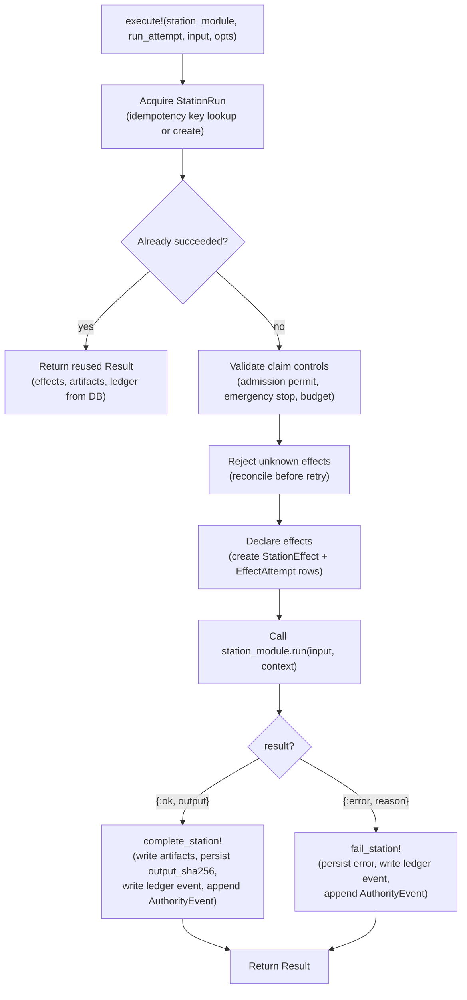

# Station pipeline

The station pipeline is the execution abstraction that wraps each discrete step
in a [Run attempt](../primitives/run-attempt.md). Station modules own their
domain logic in `run/2`; the `Conveyor.Station` wrapper owns the common
mechanics around idempotency, leases, declared effects, artifact rows, and
station ledger events. Every station that runs inside a [Slice](../primitives/slice.md)
goes through this wrapper, so the mechanics are centralized and each station
implementation stays small.

## Directory layout

The station pipeline spans three layers: the wrapper, the station
implementations, and the Oban workers that drive them.

```text
lib/conveyor/
├── station.ex                         # Execution wrapper: idempotency, leases, effects, artifacts, ledger
├── stations/                          # Station implementations (domain logic only)
│   ├── context_scout.ex               # Builds a cited implementation context pack
│   ├── implementer.ex                 # Production implementer backed by an AgentRunner adapter
│   ├── verify.ex                      # Runs locked verification commands
│   ├── record_evidence.ex             # Records machine evidence from agent and verification output
│   ├── baseline_health.ex             # Baseline regression health checks
│   └── acceptance_calibration.ex      # Locked acceptance-test calibration at base
├── station_worker/                    # Generic worker skeletons (input/output/cache/trace envelope)
│   ├── context.ex                     # Worker execution context
│   ├── result.ex                      # Persistable worker lifecycle envelope
│   ├── execute_station.ex             # Generic ExecuteStation skeleton
│   ├── execute_agent_role.ex          # Generic ExecuteAgentRole skeleton
│   └── evaluate_gate.ex               # Generic EvaluateGate skeleton
├── jobs/                              # Oban workers that orchestrate station and gate runs
│   ├── run_slice.ex                   # Advances one RunAttempt through its station plan
│   ├── run_implementer.ex             # Agent implementer session worker skeleton
│   ├── run_reviewer.ex                # Independent reviewer over the recorded run dossier
│   ├── run_gate.ex                    # Deterministic gate composition worker + facade
│   ├── run_gate_canary.ex             # Runs the gate-canary fixture suite
│   ├── run_battery.ex                 # Pure battery runner/scorer for qualification cases
│   ├── run_slice.ex                   # Oban worker for RunSlice orchestration
│   ├── record_evidence.ex             # Evidence recording worker skeleton
│   ├── acceptance_calibration.ex      # Calibration worker skeleton
│   ├── baseline_health.ex             # Baseline health worker skeleton
│   ├── context_scout.ex               # Context scout worker skeleton
│   ├── reconcile_interrupted_runs.ex  # Resumes or parks runs interrupted by a crash
│   ├── reconcile_stale_effects.ex     # Periodic stale side-effect reconciliation
│   ├── reap_sandboxes.ex              # Periodic sandbox cleanup worker skeleton
│   ├── project_artifacts.ex           # Artifact manifest projection worker skeleton
│   └── worker_stub.ex                 # Shared Oban worker stub macro
├── run_slice.ex                       # Happy-path station-plan orchestrator for one RunAttempt
├── ledger.ex                          # Idempotent append-only audit ledger writer
└── effects/
    ├── attempts.ex                    # Effect attempt/receipt retry-safety helpers
    └── reconciler.ex                  # Reconciles stale station effects against external state
```

## Key abstractions

| Abstraction | Location | Role |
| --- | --- | --- |
| `Conveyor.Station` | `lib/conveyor/station.ex` | The behaviour and `__using__` macro. Station modules declare `station_key`, `station_spec`, `input_sha256`, `effects`, and `run`. The wrapper owns `execute!/4`. |
| `Conveyor.Station.Context` | `lib/conveyor/station.ex` | The execution context passed to station logic: `run_attempt`, `station_run`, `input`, `lease_owner`. |
| `Conveyor.Station.Result` | `lib/conveyor/station.ex` | The wrapper result: `station_run`, `effects`, `artifacts`, `ledger_event`, `output`, `reused?`. |
| `Conveyor.RunSlice` | `lib/conveyor/run_slice.ex` | The thin conductor loop. Loads the immutable RunSpec, advances the RunAttempt to running, executes station definitions in order, and threads prior station output into later station input. |
| `Conveyor.RunSlice.Result` | `lib/conveyor/run_slice.ex` | Aggregate result for one RunSlice pass: `run_attempt`, `status`, `station_results`, `station_runs`, `output`. |
| `StationRun` | `lib/conveyor/factory/station_run.ex` | Ash resource for a single station execution. Carries status, lease state, spec digests, and timing. |
| `StationEffect` | `lib/conveyor/factory/station_effect.ex` | Ash resource for a declared side effect (e.g. `:file_write`). Tracks status and cleanup. |
| `EffectAttempt` | `lib/conveyor/factory/effect_attempt.ex` | Ash resource for one attempt at an effect. Carries the fencing token and request digest. |
| `EffectReceipt` | `lib/conveyor/factory/effect_receipt.ex` | Ash resource for the external observation of an effect's outcome. Its `reconciliation_status` gates retries. |
| `Conveyor.Effects.Attempts` | `lib/conveyor/effects/attempts.ex` | Retry-safety helpers. `ensure_retry_allowed!/1` blocks retries when receipts are pending or ambiguous. |
| `Conveyor.Effects.Reconciler` | `lib/conveyor/effects/reconciler.ex` | Reconciles stale effects against externally observed state via an inspector function. |
| `Conveyor.Ledger` | `lib/conveyor/ledger.ex` | Idempotent append-only writer for the audit ledger. Station success and failure both write a ledger event. |

## How it works

### Station execution

A station is a module that calls `use Conveyor.Station, station: "key"`. The
`__using__` macro injects the behaviour callbacks, default digest functions,
and an `execute!/3` shortcut. The station's own logic lives in `run/2`, which
receives an input map and a `Context` struct and returns `{:ok, output}` or
`{:error, reason}`.

`Conveyor.Station.execute!/4` is the single entry point for all station
execution. It performs five phases:



### Idempotency

Every StationRun has an idempotency key composed of
`{run_attempt_id}:{station_key}:{station_spec_sha256}:{attempt_no}`. On
`execute!/4`, the wrapper looks up an existing StationRun by this key. If one
exists and has already succeeded, the wrapper returns a reused `Result` with
the persisted effects, artifacts, and ledger event fetched from the database.
No domain logic re-runs. If the StationRun exists but has not succeeded, the
wrapper rejects any unknown effects (see below) before reacquiring the lease.

### Leases and fencing

Each StationRun carries a `lease_epoch` that increments on every lease
acquisition. The wrapper computes a fencing token as `"{id}:{lease_epoch}"`,
which is stamped onto every EffectAttempt. `ensure_current_lease!/2` compares a
caller's epoch against the current DB epoch and raises on mismatch, preventing
a stale worker from writing after a newer lease has been acquired.
`heartbeat!/2` extends the lease expiry for long-running stations.

### Claim controls

Before acquiring a lease, `execute!/4` calls `validate_claim_controls!/1` on
the `:claim_controls` option. This checks that the admission permit is active,
the emergency stop is clear, the grant is active, the budget is reserved, and
prerequisites are satisfied. It also verifies that the control generation on
the permit matches the requested generation. Any control failure raises before
the station runs.

### Declared effects

A station declares its side effects via `effects/1`, returning a list of effect
kinds (e.g. `[:file_write]`) or effect maps. The wrapper creates
`StationEffect` rows (idempotent by key) and `EffectAttempt` rows for each. The
fencing token and admission permit ID are stamped on each attempt. If a
StationRun is retried, `reject_unknown_effects!/1` first checks for any
StationEffect in `:unknown` status and raises, forcing reconciliation before
retry.

### Artifacts and ledger

On success, `complete_station!/3` writes artifact rows in a transaction. Each
artifact's content is resolved from inline `content` or a `content_ref` blob,
written through `Conveyor.Artifacts.BlobStore`, and persisted as an `Artifact`
row with `blob_ref`, `sha256`, `size_bytes`, and `projection_path`. The
station's `output_sha256` is computed over the output payload and artifact
refs. A `station.succeeded` ledger event and an `AuthorityEvent` are appended.
On failure, `fail_station!/3` persists the error and writes a
`station.failed` ledger event and AuthorityEvent instead.

### Station-plan orchestration

`Conveyor.RunSlice.run!/2` is the conductor loop for one RunAttempt. It loads
the immutable RunSpec, transitions the RunAttempt to running, then reduces over
the station plan. Each station definition's input is merged with the output of
prior stations. If any station fails, the loop halts and the RunSlice result is
`:failed`. The station modules are resolved from a registry (passed via opts or
application env) or from the station definition's `module` field, with
validation that the module implements `Conveyor.Station` and its `station_key`
matches.

### Reconciliation

Two maintenance workers handle crash recovery:

- `Conveyor.Jobs.ReconcileInterruptedRuns` enqueues at application start and
  calls `Conveyor.Planning.RunReconciler.reconcile!/1` to resume or park runs
  that died (deploy, OOM, host reboot).
- `Conveyor.Jobs.ReconcileStaleEffects` periodically calls
  `Conveyor.Effects.Reconciler.reconcile!/1`, which finds StationRuns with
  expired leases, inspects their declared effects via a caller-supplied
  inspector function, and reconciles or fails them.

## Integration points

- **[Planning compiler](../systems/planning-compiler.md)** —
  `Conveyor.Planning.WorkGraphToStationPlan` lowers each slice into a station
  plan, and `RunSpecAssembler` embeds the station plan in the immutable RunSpec.
  `RunSlice` reads `station_plan.stations` from the RunSpec.
- **[Trust gate](../systems/gate.md)** — the gate runs after the station
  pipeline completes. `Conveyor.Jobs.RunGate` is the Oban worker that drives
  gate composition, and the gate's `finalizer` drives post-gate slice and
  run-attempt transitions.
- **[Contract management](contract-management.md)** — the ContractLock digests
  on the RunSpec tie each station run to the approved contract. The
  `contract_lock` gate stage verifies the run still matches.
- **[Sandbox isolation](sandbox-isolation.md)** — the implementer and verify
  stations can opt into the hermetic Docker backend via station input
  (`backend`, `network`, `docker_image`).
- **[Prompt building](prompt-building.md)** — the implementer station calls
  `Conveyor.PromptBuilder.build!/2` to create the RunPrompt when no
  AgentSession exists yet.
- **[Credential broker](credential-broker.md)** — short-lived credential leases
  are scoped to a RunSpec or StationRun, and the broker can revoke all leases
  for a station run on cleanup.
- **Audit ledger** — `Conveyor.Ledger` writes idempotent append-only events for
  every station success and failure, with an `EventOutbox` relay for
  downstream subscribers.

## Entry points for modification

- **Add a new station** — create a module under `lib/conveyor/stations/` that
  calls `use Conveyor.Station, station: "key"` and implements `run/2` (and
  optionally `effects/1`). Register it in the station module registry (the
  `:station_modules` application env or the opts passed to `RunSlice`).
- **Change idempotency or lease mechanics** — `lib/conveyor/station.ex` is the
  single owner of `acquire_station_run!/5`, `heartbeat!/2`, `fencing_token/1`,
  and `ensure_current_lease!/2`.
- **Change effect declaration or reconciliation** —
  `lib/conveyor/station.ex` (`declare_effects!/4`, `reject_unknown_effects!/1`)
  and `lib/conveyor/effects/` (`attempts.ex`, `reconciler.ex`).
- **Change artifact persistence** — `complete_station!/3` in
  `lib/conveyor/station.ex` and `Conveyor.Artifacts.BlobStore`.
- **Change the station-plan orchestration loop** —
  `lib/conveyor/run_slice.ex` is the thin conductor. The Oban entry point is
  `lib/conveyor/jobs/run_slice.ex`.
- **Change crash recovery** — `lib/conveyor/jobs/reconcile_interrupted_runs.ex`
  and `lib/conveyor/jobs/reconcile_stale_effects.ex`.

## Key source files

| File | Role |
| --- | --- |
| `lib/conveyor/station.ex` | Execution wrapper: idempotency, leases, effects, artifacts, ledger, AuthorityEvent. |
| `lib/conveyor/run_slice.ex` | Station-plan orchestrator for one RunAttempt. |
| `lib/conveyor/stations/implementer.ex` | Production implementer station (AgentRunner adapter). |
| `lib/conveyor/stations/verify.ex` | Locked verification commands + IntegritySentinel observations. |
| `lib/conveyor/stations/record_evidence.ex` | Machine evidence recording from agent and verification output. |
| `lib/conveyor/stations/context_scout.ex` | Cited implementation context pack builder. |
| `lib/conveyor/stations/baseline_health.ex` | Baseline regression health checks. |
| `lib/conveyor/stations/acceptance_calibration.ex` | Locked acceptance-test calibration at base in an isolated worktree. |
| `lib/conveyor/jobs/run_slice.ex` | Oban worker that drives `RunSlice.run!/2`. |
| `lib/conveyor/jobs/run_reviewer.ex` | Independent reviewer over the recorded run dossier. |
| `lib/conveyor/jobs/run_gate.ex` | Gate composition worker and gate-only facade. |
| `lib/conveyor/jobs/run_gate_canary.ex` | Gate-canary fixture suite runner. |
| `lib/conveyor/jobs/reconcile_interrupted_runs.ex` | Crash-recovery worker for interrupted runs. |
| `lib/conveyor/jobs/reconcile_stale_effects.ex` | Periodic stale-effect reconciliation worker. |
| `lib/conveyor/effects/attempts.ex` | Effect attempt/receipt retry-safety helpers. |
| `lib/conveyor/effects/reconciler.ex` | Stale-effect reconciler against external state. |
| `lib/conveyor/ledger.ex` | Idempotent append-only audit ledger writer. |
| `lib/conveyor/factory/station_run.ex` | Ash resource for a station execution. |
| `lib/conveyor/factory/station_effect.ex` | Ash resource for a declared side effect. |
| `lib/conveyor/factory/effect_attempt.ex` | Ash resource for an effect attempt. |
| `lib/conveyor/factory/effect_receipt.ex` | Ash resource for an effect's external observation. |

See also: [Planning compiler](../systems/planning-compiler.md),
[Trust gate](../systems/gate.md), [Contract management](contract-management.md),
[Sandbox isolation](sandbox-isolation.md), [Prompt building](prompt-building.md),
[Credential broker](credential-broker.md),
[Run attempt](../primitives/run-attempt.md), [Slice](../primitives/slice.md),
[Evidence](../primitives/evidence.md).
