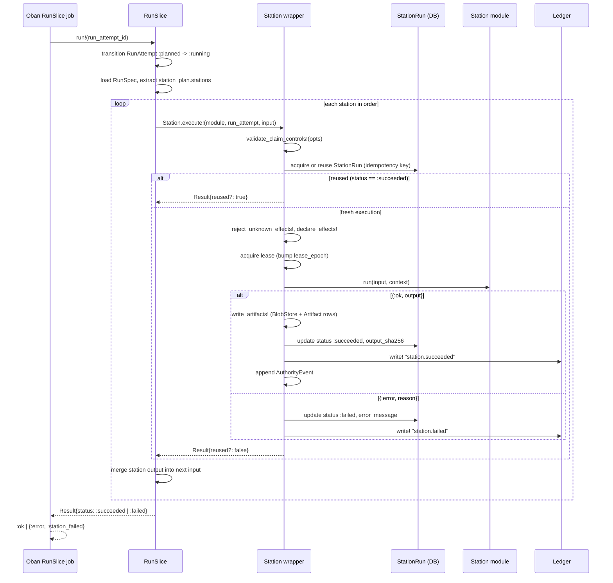

# Station pipeline

The station pipeline is Conveyor's core execution flow. A `RunAttempt` advances
through an ordered station plan, where each station is a module that owns domain
logic while a shared wrapper owns idempotency, leases, declared effects,
artifacts, and ledger events. The pipeline is intentionally linear in Phase 0/1:
one plan, one slice, one attempt path.

## The `Conveyor.Station` behaviour and wrapper

Every station implements the `Conveyor.Station` behaviour declared in
`lib/conveyor/station.ex`. The behaviour defines six callbacks:

- `station_key/0` — a stable string key used in the station registry and station
  plan.
- `station_spec/1` — a map describing the station, its module, and input digest.
- `station_spec_sha256/1` — the content-addressed digest of the station spec.
- `input_sha256/1` — the digest of the station input.
- `effects/1` — the declared side effects the station may perform.
- `run/2` — the station's domain logic, receiving input and a `Context`.

Stations opt in with `use Conveyor.Station, station: "key"`, which injects
default implementations for the spec and digest callbacks and an `execute!/3`
delegate. The `execute!/4` function on the wrapper module is the real entry
point. It does not call `run/2` directly without first acquiring a `StationRun`,
validating claim controls, declaring effects, and fencing the lease.

The wrapper enforces the determinism boundary: the BEAM conductor owns the
mechanics around execution, while the station module owns only its domain logic.

## Station registration and execution

Stations are registered through a station module map keyed by station key. The
registry is supplied via the `:station_modules` option or read from
`Application.get_env(:conveyor, :station_modules, %{})`. The canonical station
sequence is defined in the `RunSpec.station_plan` as an ordered list of station
definitions, each carrying a `key`, optional `module`, `input`, and `output`.

`Conveyor.RunSlice` (`lib/conveyor/run_slice.ex`) is the thin conductor loop. It
loads the immutable `RunSpec`, transitions the `RunAttempt` to `running` via
`RunAttemptLifecycle`, then folds over the station definitions in order. Each
station's output is merged into the next station's input, threading context
through the pipeline. If any station returns `:failed`, the loop halts and the
slice result is `:failed`.

Station modules are resolved by key from the registry, falling back to the
module name embedded in the station definition. The resolver validates that the
module is loaded, implements `Conveyor.Station`, and reports a `station_key/0`
matching the requested key.

## The station_worker modules

`lib/conveyor/station_worker/` holds small skeleton modules that normalize
worker role results into a persistable envelope. They are intentionally thin:

- `context.ex` — `Conveyor.StationWorker.Context`, a struct carrying `cache` and
  `trace_context` passed to generic role modules.
- `execute_station.ex` — `ExecuteStation.from_result!/2` wraps a station result
  map into a `Result`.
- `execute_agent_role.ex` — `ExecuteAgentRole.call!/3` invokes a role module's
  `run/2` and normalizes the return into a `Result`.
- `evaluate_gate.ex` — `EvaluateGate.call!/3` invokes a gate module's
  `evaluate/2` and normalizes the return into a `Result`.
- `result.ex` — `Conveyor.StationWorker.Result`, the envelope struct with
  `input`, `output`, `diagnostics`, `cache`, and `trace_context`.

These modules keep the role invocation boundary explicit. A gate evaluator, for
example, never approves or locks anything through this path; it only returns a
structured result that the conductor records.

## Oban job orchestration

Oban jobs are orchestration edges, not business-rule storage. The top-level
orchestrator is `Conveyor.Jobs.RunSlice` (`lib/conveyor/jobs/run_slice.ex`), an
Oban worker on the `:conductor` queue with `max_attempts: 1`. It reads
`run_attempt_id` from the job args, calls `RunSlice.run!/2`, and maps the
aggregate result to Oban's expected return: `:ok` on success,
`{:error, :station_failed}` on failure.

Specialized stations have their own Oban workers in `lib/conveyor/jobs/`:
`baseline_health.ex`, `acceptance_calibration.ex`, `context_scout.ex`,
`run_implementer.ex`, `record_evidence.ex`, `run_reviewer.ex`, `run_gate.ex`,
`run_gate_canary.ex`, `reconcile_stale_effects.ex`, `reap_sandboxes.ex`,
`project_artifacts.ex`, and `run_battery.ex`. Each job carries idempotent inputs
and the conductor owns the state transitions around them.

## The run slice lifecycle

`Conveyor.RunSlice.run!/2` owns the happy-path orchestration for one attempt.
The lifecycle is:

1. Load the `RunAttempt` and transition `:planned` to `:running` through
   `RunAttemptLifecycle.transition!/3`.
2. Load the immutable `RunSpec` and extract its `station_plan.stations`.
3. Fold over stations in order, merging each station's output into the next
   station's input.
4. On a failed station, halt the fold and return `status: :failed`.
5. Return a `RunSlice.Result` with the refreshed `RunAttempt`, station results,
   station runs, and accumulated output.

The orchestrator is deliberately stateless between stations. State lives in the
database (StationRun, EffectAttempt, artifacts, ledger events), not in process
memory, so a retry or replay sees the same records.

## Station effects and receipts

Stations declare their side effects through `effects/1`, which returns a list of
effect kinds or effect maps. The wrapper materializes each as a `StationEffect`
record with an idempotency key, then records an `EffectAttempt` carrying the
fencing token and admission permit id. This makes every external side effect
inspectable and retry-safe before it runs.

Effect reconciliation is handled by `Conveyor.Effects.Reconciler`
(`lib/conveyor/effects/reconciler.ex`). A periodic Oban job
(`reconcile_stale_effects.ex`) calls it with an inspector function that reports
externally observed status (`:missing`, `:succeeded`, `:failed`) for each stale
effect. `Conveyor.Effects.Attempts` (`lib/conveyor/effects/attempts.ex`)
enforces that pending or ambiguous `EffectReceipt` records are reconciled before
a station can be retried.

## Lease management

Each station execution acquires a lease on its `StationRun`. The wrapper bumps
`lease_epoch`, sets `lease_owner` and `lease_owner_instance_id`, and records
`lease_acquired_at` and `lease_expires_at`. `heartbeat!/2` refreshes the lease
by extending `lease_expires_at`.

Lease fencing is enforced through two functions:

- `fencing_token/1` returns `"<station_run_id>:<lease_epoch>"`, stamped onto
  `EffectAttempt` and `AuthorityEvent` records so external operations can be
  checked for staleness.
- `ensure_current_lease!/2` raises if a candidate `StationRun` has a stale
  `lease_epoch` or a different id than the current record.

`validate_claim_controls!/1` gates execution before the lease is acquired. It
rejects runs when the admission permit is not active, when the control
generation mismatches, when emergency stop is engaged, when the grant is not
active, when the budget is not reserved, or when prerequisites are not
satisfied.

## Station execution sequence

## Key source files

| File                                                | Purpose                                                                         |
| --------------------------------------------------- | ------------------------------------------------------------------------------- |
| `lib/conveyor/station.ex`                           | Station behaviour, execution wrapper, leases, effects, artifacts, ledger writes |
| `lib/conveyor/run_slice.ex`                         | Happy-path station-plan orchestrator for one RunAttempt                         |
| `lib/conveyor/jobs/run_slice.ex`                    | Oban worker that drives RunSlice and maps results                               |
| `lib/conveyor/station_worker/context.ex`            | Context struct for generic worker role modules                                  |
| `lib/conveyor/station_worker/execute_station.ex`    | Normalizes a station result into a Result envelope                              |
| `lib/conveyor/station_worker/execute_agent_role.ex` | Invokes a role module's `run/2` and normalizes the return                       |
| `lib/conveyor/station_worker/evaluate_gate.ex`      | Invokes a gate module's `evaluate/2` and normalizes the return                  |
| `lib/conveyor/station_worker/result.ex`             | Persistable worker lifecycle envelope struct                                    |
| `lib/conveyor/effects/attempts.ex`                  | Effect attempt/receipt retry-safety helpers                                     |
| `lib/conveyor/effects/reconciler.ex`                | Reconciles stale station effects against external state                         |
| `lib/conveyor/readiness.ex`                         | Readiness station validating locked brief and contract                          |

## Related pages

- [Architecture](../overview/architecture.md) — station pipeline topology and
  OTP supervision
- [Gate stage composition](../systems/gate.md) — how the gate station composes
  stage results
- [Agent runner and Pi adapter](../systems/agent-runner.md) — the agent session
  station
- [Evidence recording and verification rerunner](../systems/evidence-recording.md)
  — the evidence recorder station
- [Sandbox Docker container lifecycle](../systems/sandbox.md) — sandbox station
  backing
- [Slice domain model](../primitives/slice.md) — the slice primitive
