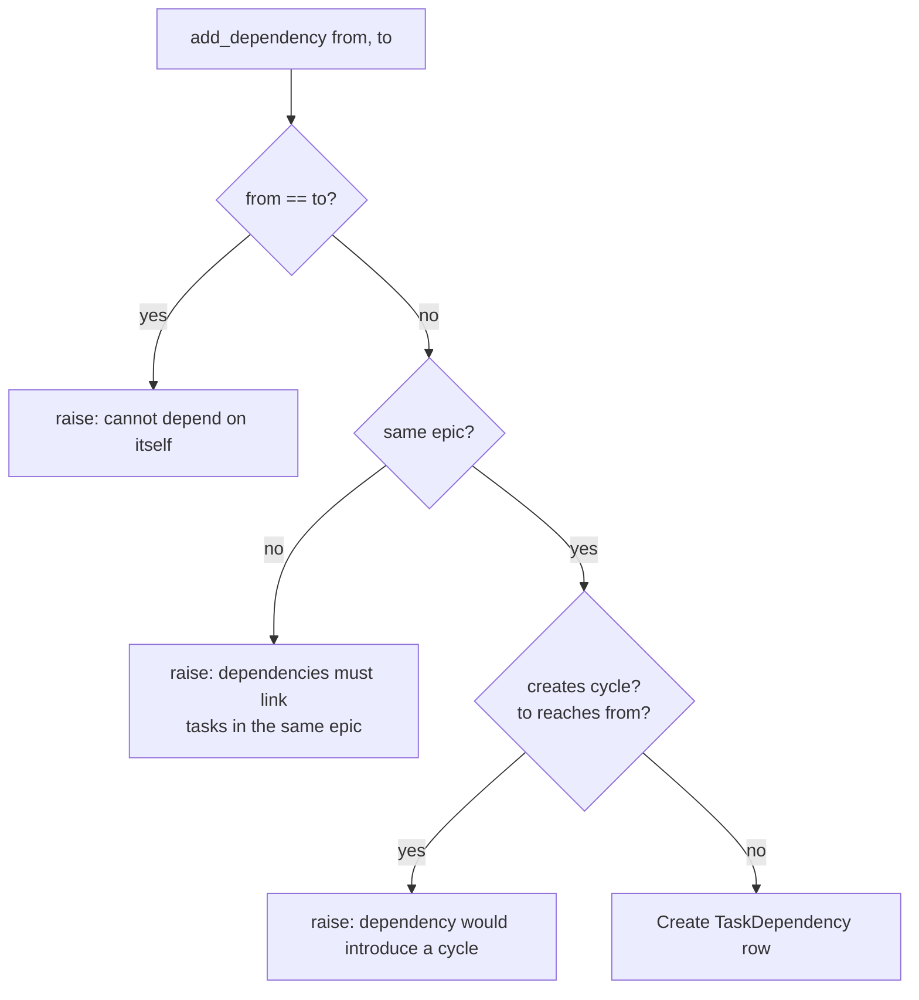
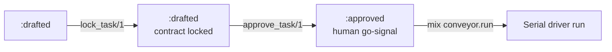

# Task graph

The task graph is the DB-native authoring surface for Conveyor plans. Tasks (slices) and their `execution_hard` dependency edges live as rows in Postgres, authored through a br-style mix CLI. The graph is the source of truth: the work graph map and the normalized contract are deterministic projections of the rows, regenerated at lock time and never hand-edited. The core module covers task CRUD, dependency edges with cycle rejection, readiness queries, acceptance authoring, contract locking, and approval.

## Directory layout

```text
lib/conveyor/
├── task_graph.ex                      # Ash-backed core: CRUD, deps, readiness, lock, approve
└── cli/
    └── task_command.ex                # shared output/exit/error helpers for conveyor.task.*

lib/mix/tasks/
├── conveyor.task.create.ex            # create a task under an epic
├── conveyor.task.list.ex              # list tasks in position order
├── conveyor.task.show.ex              # show one task by stable key
├── conveyor.task.update.ex            # update a task's authoring attributes
├── conveyor.task.dep.ex               # add/remove an execution_hard edge
├── conveyor.task.ready.ex             # list ready tasks
├── conveyor.task.acceptance.ex        # author an acceptance criterion
├── conveyor.task.lock.ex              # lock a task's vetted contract
└── conveyor.task.approve.ex           # approve a task (human go-signal)
```

## Key abstractions

| Abstraction | Location | Role |
| ----------- | -------- | ---- |
| `Conveyor.TaskGraph` | `lib/conveyor/task_graph.ex` | Ash-backed core for authoring and querying the DB-native task graph. Plain functions over `Ash.{create!,read!,update!}` (no Ash code interface, per KTD4). |
| `Slice` | `lib/conveyor/factory/slice.ex` | The Ash resource for a task. Carries `stable_key` (`SLICE-NNN`), `position`, `title`, `state`, `likely_files`, `conflict_domains`, `source_refs`, `autonomy_level`, and `acceptance_criteria`. See [Slice](../primitives/slice.md). |
| `TaskDependency` | `lib/conveyor/factory/task_dependency.ex` | The Ash resource for an `execution_hard` edge: `from_slice_id` and `to_slice_id`. `to` depends on `from`. |
| `stable_key` | `lib/conveyor/task_graph.ex` (`stable_key/1`) | The CLI-facing key (`SLICE-NNN`, 1-based per-epic position zero-padded to 3 digits, starting `SLICE-001`). Unique per epic via the `:unique_epic_stable_key` identity. |
| `Conveyor.CLI.TaskCommand` | `lib/conveyor/cli/task_command.ex` | Shared output/exit/error helpers. `guard/1` maps user/validation errors to a clean non-zero exit, `emit!/1` emits JSON on stdout, `fail!/2` prints on stderr, `csv/1` splits comma-separated options. |
| `Conveyor.Readiness` | `lib/conveyor/readiness.ex` | Gate-readiness check. `Readiness.check/2` returns `%{status: :ready}` or `%{findings: [...]}`. `lock_task/1` asserts `:ready` without advancing state. |
| `Conveyor.Planning.ContractBuilder` | `lib/conveyor/planning/contract_builder.ex` | Compiles DB-native rows into `Plan.normalized_contract`. Called on the first locked task of a plan. |
| `Conveyor.Planning.RunSpecAssembler` | `lib/conveyor/planning/run_spec_assembler.ex` | `materialize_contract_for_slice!/1` materializes the `AgentBrief`, `TestPack`, and `ContractLock` for a slice. Called by `lock_task/1`. |

## How it works

### Task creation

`create_task/1` takes a map with `epic_id`, `title`, and optional `likely_files`, `conflict_domains`, `source_refs`, `autonomy_level`. It computes `position` (max existing position + 1) and `stable_key` (`SLICE-NNN`) inside a transaction. The `:unique_epic_stable_key` and `:unique_epic_position` identities are the backstop, so concurrent creates fail loudly rather than colliding. Notifications are emitted after commit so subscribers fire.

### Dependency edges

`add_dependency/2` adds an `execution_hard` edge `from -> to` (meaning `to` depends on `from`). It validates both tasks exist and share an epic, rejects self-loops, and rejects cycles before the insert. The cycle check is a reachability test: adding `from -> to` creates a cycle iff `to` can already reach `from` via existing edges. The DB unique-edge identity and self-loop check constraint are the backstop. `remove_dependency/2` removes the edge if present and returns `:ok`.



### Readiness

`ready_tasks/1` lists the tasks in an epic that are ready to run: every incoming `execution_hard` predecessor is satisfied (the predecessor slice has reached a terminal-success state, `:done` or `:integrated`). Roots and independent tasks are always ready. Already-finished tasks are excluded.

### Acceptance authoring

`set_acceptance/2` writes acceptance criteria onto a slice. The criteria are a list of maps in the `conveyor.plan@1` acceptance shape (`id`/`key`, `text`, `requirement_refs`, `required_test_refs`, plus optional `falsifying_conditions`). The slice is the source; `ContractBuilder` aggregates these into `Plan.normalized_contract` at lock time. Acceptance is written on the source, never on the `AgentBrief` (the materialized view).

### Locking

`lock_task/1` is the vetted/locked step (KTD3). On the first locked task of a plan it compiles the plan's `normalized_contract` from rows via `ContractBuilder.compile_contract/1`, records a ready `PlanAudit`, and advances the plan `:draft -> :handoff_ready` (after which the contract is frozen). For every task it then materializes the `AgentBrief`, `TestPack`, and `ContractLock` via `RunSpecAssembler.materialize_contract_for_slice!/1` and asserts `Readiness.check == :ready`, raising with the readiness findings otherwise. Authoring must be complete before the first lock, because compile snapshots all tasks' acceptance. Lock leaves the task `:drafted`; `:approved` (KTD6) stays the final human transition before a run.

### Approval

`approve_task/1` runs the slice's `:drafted -> :approved` transition via the `:approve` Ash action. This is the human go-signal: `mix conveyor.run` refuses unless every task is approved.



### CLI verbs

The `conveyor.task.*` verbs are thin wrappers over `TaskGraph`. Each verb resolves a task by its `stable_key` within an epic via `task_by_stable_key!/2`, calls the corresponding `TaskGraph` function inside `TaskCommand.guard/1`, and emits JSON via `TaskCommand.emit!/1`. User and validation errors (`ArgumentError`, `Ash.Error.Invalid`) are mapped to a clean non-zero exit with the message on stderr.

## Integration points

- **Planning compiler** — the task graph is one of two entry paths to the planning compiler. `ContractBuilder.compile_contract/1` compiles rows into `Plan.normalized_contract`, and `WorkGraphBuilder.build/1` compiles rows into the `conveyor.work_graph@2` map. See [Planning compiler](../systems/planning-compiler.md).
- **Run spec assembler** — `lock_task/1` delegates contract materialization to `RunSpecAssembler.materialize_contract_for_slice!/1`, which builds the `AgentBrief`, `TestPack`, and `ContractLock`. See [Run spec](../primitives/run-spec.md).
- **Readiness** — `lock_task/1` asserts `Readiness.check/2` returns `:ready` without advancing state, so gate-readiness is verified before a run. See [Trust gate](../systems/gate.md).
- **Factory domain** — all persistence goes through the `Conveyor.Factory` Ash domain: `Slice`, `TaskDependency`, `Epic`, `Plan`, `PlanAudit`. See [Slice](../primitives/slice.md).
- **CLI tools** — the `conveyor.task.*` verbs are the operator surface. See [CLI tools](cli-tools.md).
- **Plan runner** — `mix conveyor.run` enforces the approval gate before handing the work graph to the serial driver. Every task must be `:approved`.

## Entry points for modification

| Change | Where to start |
| ------ | -------------- |
| Add a new graph operation | Add a function to `lib/conveyor/task_graph.ex`. Use plain `Ash.{create!,read!,update!}` (no code interface, per KTD4). |
| Add a new CLI verb | Add a Mix task in `lib/mix/tasks/conveyor.task.<verb>.ex`, call `TaskGraph` through `TaskCommand.guard/1`, emit JSON via `TaskCommand.emit!/1`. |
| Change cycle detection | `creates_cycle?/2` and `reachable?/4` in `lib/conveyor/task_graph.ex`. |
| Change readiness logic | `ready_tasks/1` in `lib/conveyor/task_graph.ex` and `@done_states`. |
| Change contract locking | `lock_task/1` in `lib/conveyor/task_graph.ex` and `materialize_contract_for_slice!/1` in `lib/conveyor/planning/run_spec_assembler.ex`. |
| Change the stable key format | `stable_key/1` in `lib/conveyor/task_graph.ex` and the `:unique_epic_stable_key` identity on `Slice`. |
| Change acceptance authoring | `set_acceptance/2` in `lib/conveyor/task_graph.ex` and the acceptance shape in `docs/schemas/conveyor.plan@1.json`. |
| Change shared CLI helpers | `lib/conveyor/cli/task_command.ex`. |

## Key source files

| File | Role |
| ---- | ---- |
| `lib/conveyor/task_graph.ex` | Ash-backed core: task CRUD, dependency edges, readiness, acceptance, lock, approve. |
| `lib/conveyor/cli/task_command.ex` | Shared output/exit/error helpers for `conveyor.task.*`. |
| `lib/conveyor/factory/slice.ex` | Ash resource for a task (slice). |
| `lib/conveyor/factory/task_dependency.ex` | Ash resource for an `execution_hard` edge. |
| `lib/conveyor/planning/contract_builder.ex` | Compiles rows into `Plan.normalized_contract`. |
| `lib/conveyor/planning/run_spec_assembler.ex` | Materializes the locked contract for a slice. |
| `lib/conveyor/readiness.ex` | Gate-readiness check. |
| `lib/mix/tasks/conveyor.task.create.ex` | Create a task. |
| `lib/mix/tasks/conveyor.task.list.ex` | List tasks in an epic. |
| `lib/mix/tasks/conveyor.task.show.ex` | Show one task by stable key. |
| `lib/mix/tasks/conveyor.task.update.ex` | Update a task's attributes. |
| `lib/mix/tasks/conveyor.task.dep.ex` | Add/remove a dependency edge. |
| `lib/mix/tasks/conveyor.task.ready.ex` | List ready tasks. |
| `lib/mix/tasks/conveyor.task.acceptance.ex` | Author an acceptance criterion. |
| `lib/mix/tasks/conveyor.task.lock.ex` | Lock a task's vetted contract. |
| `lib/mix/tasks/conveyor.task.approve.ex` | Approve a task (human go-signal). |

See also: [CLI tools](cli-tools.md), [Planning compiler](../systems/planning-compiler.md), [Trust gate](../systems/gate.md), [Event sourcing](event-sourcing.md), [Slice](../primitives/slice.md), [Run spec](../primitives/run-spec.md), [Contract lock](../primitives/contract-lock.md).
