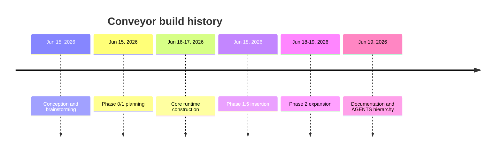

# Lore

The entire Conveyor codebase was built in four days, from Jun 15 to Jun 19,
2026, by a single developer, Robert Guss. 580 commits landed in that window,
growing the project from an empty repo into a 382-module, 45-plus-resource
software factory runtime with 22 ADRs and 273 JSON schemas. This page traces the
eras of that build.

## Timeline

### Era 1: Conception and brainstorming (Jun 15, 2026)

The initial commit landed on Jun 15, 2026. Work began with a brainstorming
document and the decision to build on Elixir and the BEAM, leveraging OTP
supervision, Oban, and Phoenix LiveView for an autonomous software factory. The
core principle was set early: a deterministic core owns validation and recorded
runs, while agents own drafting, implementation, and judgment.

### Era 2: Phase 0/1 planning (Jun 15, 2026)

Also on Jun 15, 2026, implementation plans were added. This included plans for
integrating other models and GPT Pro revisions, establishing the multi-runner
direction (Codex, Claude Code, Gemini CLI) from the start. The planning
established the phase structure that would govern the rest of the build.

### Era 3: Core runtime construction (Jun 16-17, 2026)

Over Jun 16-17, 2026, the core runtime took shape. Ash resources and the factory
domain were built out, along with the station pipeline, the gate, the policy
engine, the agent runner, the sandbox, and evidence recording. This is when the
`Conveyor.Factory` domain (registered in `lib/conveyor/factory.ex`) and the
station coordinator (`lib/conveyor/station.ex`) became the most actively changed
files in the repo. By the end of this era the determinism boundary was in place:
the BEAM conductor owned state, policy, evidence, and gate verdicts.

### Era 4: Phase 1.5 insertion (Jun 18, 2026)

On Jun 18, 2026, a four-increment insertion landed, bringing gate semantics that
distinguished live statistical quality from deterministic hard invariants. The
schema registry was introduced, along with attestation envelopes for evidence.
This era refined the gate so that statistical signals (batteries) could inform
quality judgments without overriding hard invariants that must always pass.

### Era 5: Phase 2 expansion (Jun 18-19, 2026)

From Jun 18 into Jun 19, 2026, Phase 2 expanded the runtime substantially. The
planning compiler gained a large layer of roughly 50 modules under
`lib/conveyor/planning/`, implementing passes for workbench, pilot selection,
amendment enforcement, selective recompilation, the battery system, the contract
forge and critic, and qualification gates. This was the biggest single addition
to the codebase and the source of most of the commit volume on Jun 18 (272
commits) and Jun 19 (227 commits).

### Era 6: Documentation and AGENTS hierarchy (Jun 19, 2026)

On Jun 19, 2026, the documentation layer was consolidated. 22 ADRs were in
place, the schema registry held 273 JSON schemas, and the AGENTS.md hierarchy
was initialized to give agents consistent project instructions. Eval plans were
added, closing out the initial build with a verification and evaluation surface.

## Longest-standing features

The factory domain model (`lib/conveyor/factory.ex`, 26 changes over four days),
the station pipeline (`lib/conveyor/station.ex`), and the gate
(`lib/conveyor/gate.ex`) have been the most actively changed files since the
core runtime era. They predate everything else that depends on them and have
absorbed the most refinement as the runtime grew around them.

## Deprecated features

None yet. The project is four days old, so nothing has had time to deprecate.
Features are added, not retired.

## Major rewrites

Phase 2 added a large planning compiler layer with roughly 50 modules in
`lib/conveyor/planning/`. This was the closest thing to a major rewrite,
introducing a compiler-style architecture for plan transformations (lowering,
audits, graph analysis, selective recompilation) that did not exist in the
earlier eras.

## Growth trajectory

580 commits in 4 days. 382 modules. 45-plus Ash resources registered in
`lib/conveyor/factory.ex`. 31 database migrations. 22 ADRs. 273 JSON schemas.
All from a single contributor, with no bot commits and no tags or releases yet.

## Related pages

- [By the numbers](by-the-numbers.md) — codebase statistics snapshot
- [Fun facts](fun-facts.md) — quirky details about the project
- [Architecture](overview/architecture.md) — system topology
- [Primitives](primitives/index.md) — foundational domain objects
