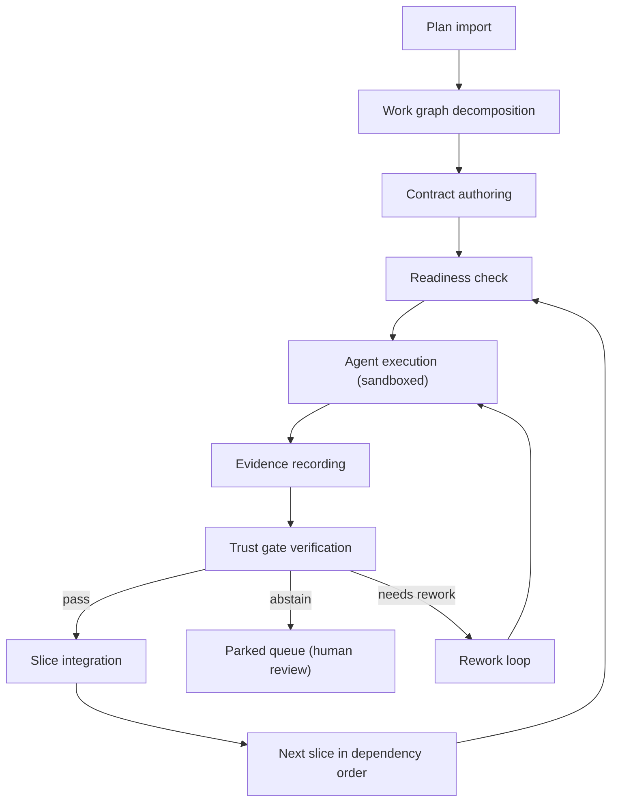
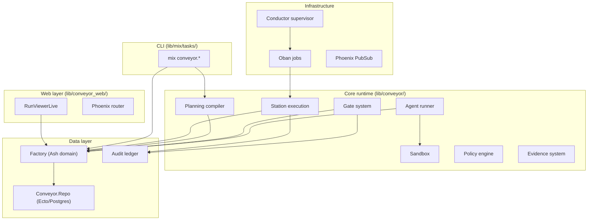
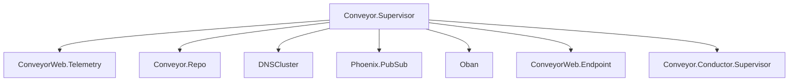

# Architecture

Conveyor is an Elixir/OTP application that orchestrates autonomous code generation through a pipeline of planning, execution, verification, and integration. The architecture follows the BEAM philosophy of supervision trees, message passing, and fault tolerance, layered on top of Ash resources backed by Postgres.

## High-level architecture

## Component map

## OTP supervision tree

The application starts under `Conveyor.Application` with a `:one_for_one` strategy:

On boot, the supervisor enqueues a `ReconcileInterruptedRuns` job to resume any runs interrupted by a crash (deploy, OOM, host reboot). This is disabled in test via the `:enqueue_boot_reconcile` config flag.

## Key architectural decisions

The codebase has 27 ADRs in `docs/adrs/` documenting durable decisions. The most architecturally significant:

- **ADR-14**: Pure compiler-pass architecture and memoization. Planning transformations are deterministic compiler-style passes, not stateful operations.
- **ADR-23**: Ternary gate verdict with calibrated abstention. The gate can accept, reject, or abstain (withhold judgment when confidence is low).
- **ADR-08**: Station leases, fencing, and effect receipts. Stations own idempotent execution with lease-based fencing.
- **ADR-11**: Emergency stop and global budget reservation. An engaged stop blocks new station starts, provider calls, tool calls, claim publication, and external effects.
- **ADR-27**: In-factory plan authoring. The `mix conveyor.author` task is the factory's plan-authoring front door.

## Data flow: the factory loop

The serial driver (`lib/conveyor/planning/serial_driver.ex`) is the width-1 execution engine. For each slice in dependency order:

1. **RunSpec assembly** - `RunSpecAssembler` builds an immutable spec from the slice's locked contract, work graph, and workspace context
2. **Agent execution** - The agent runner (Codex, Claude, or fake) executes the implementation prompt in a Docker sandbox
3. **Evidence recording** - Patches, tool invocations, and test results are captured as evidence
4. **Gate evaluation** - The gate runs staged checks (workspace integrity, contract lock, diff scope, secret safety, policy compliance, test execution, acceptance mapping)
5. **Trust scoring** - `TrustScore` fuses signals (integrity, calibration, baseline, replay, corpus) into a calibrated estimate
6. **Finalization** - `Finalizer` persists the gate result and applies the slice/run-attempt state transition (accept, reject, abstain, or rework)

## The station pattern

Stations are the execution abstraction. Each station module implements the `Conveyor.Station` behaviour with `station_key/0`, `station_spec/1`, `input_sha256/1`, `effects/1`, and `run/2`. The `Conveyor.Station` wrapper in `lib/conveyor/station.ex` owns idempotency, leases, declared effects, artifact rows, and station ledger events. Station types include implementer, evidence recorder, context scout, baseline health, acceptance calibration, and verify.

## The factory domain model

All persisted state goes through the `Conveyor.Factory` Ash domain (`lib/conveyor/factory.ex`), which manages 48 resources including Project, Plan, Epic, Slice, RunAttempt, RunSpec, StationRun, Evidence, GateResult, ContractLock, AgentBrief, TestPack, and more. Resources use `AshStateMachine` for explicit state transitions with database constraints.

## Event sourcing

Every state change is recorded as a `LedgerEvent` through the append-only `Conveyor.Ledger` module. This gives time-travel debugging, reproducible AI review, and an eval dataset the factory learns from. The `RunReadModel` folds the ledger stream into a read-only "run story" for the CLI and LiveView.

## Design laws

Ten executable design laws (`lib/conveyor/design_laws.ex`) govern the system:

1. No task without acceptance criteria
2. No implementation without a locked contract
3. No completion without evidence
4. No authority without measured trust
5. No hidden state
6. No shared-trunk chaos
7. No source mutation by context tools
8. No dangerous commands by default
9. No orphan requirements and no orphan slices
10. No bespoke tool empire

Each law has an invariant test and is enforced by specific modules.

## Tech stack

| Layer | Technology |
| ----- | ---------- |
| Language | Elixir 1.20, Erlang/OTP 29 |
| Web framework | Phoenix 1.8 with LiveView |
| Data layer | Ash 3.29 with AshPostgres 2.10 |
| Database | PostgreSQL 16 |
| Job queue | Oban 2.23 |
| Validation | jsv 0.19 |
| Static analysis | Credo (strict), Dialyzer |
| Test framework | ExUnit with StreamData |
| Sandboxing | Docker containers |
| Server | Bandit 1.12 |
| Config | TOML (toml_elixir) |
