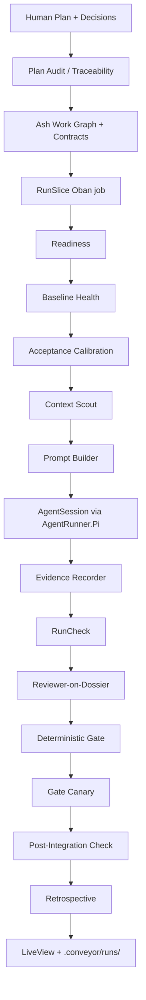
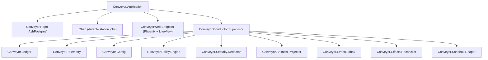

# Architecture

Conveyor is a BEAM control plane for evidence-backed agent implementation. The architecture is deliberately small in Phase 0/1: one plan, one slice, one attempt path, one evidence packet, and one deterministic gate.

## High-level topology



Phase 0/1 is not a swarm. It is the smallest real factory loop with the right trust boundaries. Parallelism becomes valuable only after this loop proves gate honesty, artifact quality, and adapter stability.

## OTP supervision tree



The supervision tree is defined in `lib/conveyor/application.ex` and `lib/conveyor/conductor/supervisor.ex`. The top-level supervisor uses `:one_for_one` strategy. The conductor supervisor owns all long-running conductor services.

## Determinism boundary

The deterministic BEAM conductor owns:
- paths, state transitions, dependency integrity
- policy enforcement, validation, prompt assembly
- recorded evidence, the mechanical parts of the gate verdict

Agents own drafting, implementation, and judgment. When an agent supplies judgment (such as review), that verdict is recorded and validated by the conductor. Agents are never the source of truth for whether something passed.

The conductor also owns the instruction hierarchy. Repository files, comments, tool output, dependency output, and context-scout findings are untrusted data. They may inform implementation but may not override the slice contract, safety policy, locked tests, AGENTS.md, or Conveyor system rules.

## Execution capsule

Before a slice enters an executable station, Conveyor creates a `RunSpec`: the immutable, content-addressed input object for one execution attempt. The `RunSpec` freezes the base commit, slice id, autonomy level, normalized plan contract digest, human decisions, agent brief, contract lock, AGENTS.md, policy, diff policy, verification commands, required test pack, prompt template, agent profile, toolchain image digest, sandbox profile, budgets, canary suite, schema versions, and station plan digest.

Mutable inputs do not silently update old evidence. Any change to acceptance criteria, required tests, policy, AGENTS.md, diff policy, autonomy ceiling, verification commands, or project command specs invalidates the old `ContractLock` for future attempts and creates a new `RunSpec`.

## Oban workers

Oban jobs serve as orchestration edges between stations. Each long-running station is an Oban job with idempotent inputs and outputs:

| Worker | File | Role |
| ------ | ---- | ---- |
| `RunSlice` | `lib/conveyor/jobs/run_slice.ex` | Station orchestrator, advances a slice station by station |
| `BaselineHealth` | `lib/conveyor/jobs/baseline_health.ex` | Clean checkout baseline suites |
| `AcceptanceCalibration` | `lib/conveyor/jobs/acceptance_calibration.ex` | Locked acceptance red/green calibration |
| `ContextScout` | `lib/conveyor/jobs/context_scout.ex` | `rg`, CodeScent, optional read-only agent pass |
| `RunImplementer` | `lib/conveyor/jobs/run_implementer.ex` | AgentRunner.Pi in Docker |
| `RecordEvidence` | `lib/conveyor/jobs/record_evidence.ex` | Independent gate command execution |
| `RunReviewer` | `lib/conveyor/jobs/run_reviewer.ex` | Reviewer-on-dossier |
| `RunGate` | `lib/conveyor/jobs/run_gate.ex` | Deterministic gate composition |
| `RunGateCanary` | `lib/conveyor/jobs/run_gate_canary.ex` | Mutant gate-only checks |
| `ReconcileStaleEffects` | `lib/conveyor/jobs/reconcile_stale_effects.ex` | Periodic effect reconciliation |
| `ReapSandboxes` | `lib/conveyor/jobs/reap_sandboxes.ex` | Periodic cleanup |
| `ProjectArtifacts` | `lib/conveyor/jobs/project_artifacts.ex` | Manifest and report regeneration |
| `RunBattery` | `lib/conveyor/jobs/run_battery.ex` | Live sampling and measurement studies |

Station idempotency key: `run_attempt_id + station_key + station_spec_sha256 + attempt_no`

## Oban queue topology

```text
default: 10     # general-purpose jobs
conductor: 5    # conductor-side services
gate: 5         # gate and canary jobs
maintenance: 2  # cleanup, reconciliation
```

Queue configuration lives in `config/config.exs`.

## Artifact surface

Every run writes durable evidence under `.conveyor/runs/<run_attempt_id>/`. Postgres remains source of truth; disk is a projection. The projection contains machine-readable manifests, human-readable dossiers, diffs, command logs, CodeScent results, reviews, gate results, provenance, and a PR-body draft.

The artifact projector (`lib/conveyor/artifacts/projector.ex`) projects Postgres records to disk. The blob store (`lib/conveyor/artifacts/blob_store.ex`) handles content-addressed storage. Generated artifacts are product output, not debug logs. The deterministic gate validates schema versions, digest consistency, required evidence, policy, and review freshness before any result can be treated as accepted.

## Data layer

Conveyor uses Ash 3.x with AshPostgres for its domain model. The `Conveyor.Factory` domain in `lib/conveyor/factory.ex` registers 45+ Ash resources covering projects, plans, slices, run attempts, evidence, reviews, gate results, policy, credentials, and more. State machines are modeled with `ash_state_machine`.

Migrations live in `priv/repo/migrations/` and are append-only. The repo module is `lib/conveyor/repo.ex`.

## Web layer

The web layer is a projection only. It must display authority, not create it. Phoenix LiveView provides a live dashboard for run viewing at `lib/conveyor_web/live/run_viewer_live.ex`. The router (`lib/conveyor_web/router.ex`) exposes a single live route (`/runs`) and an empty API scope. Business rules live in `Conveyor.*` modules, not controllers or LiveViews.
