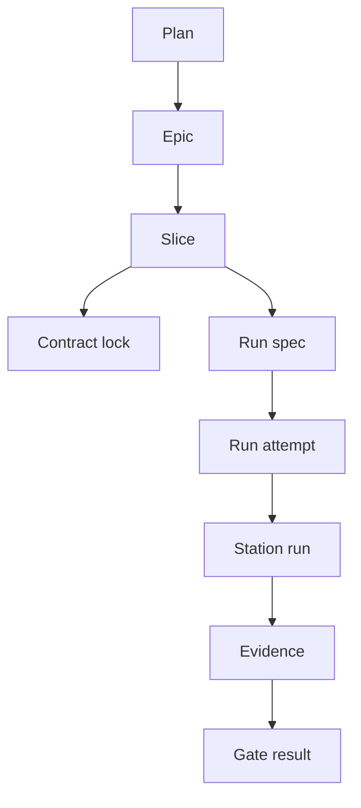

# Primitives

Conveyor's runtime is built on a small set of foundational domain objects that
the BEAM conductor owns and persists through Ash. Each primitive is a
Postgres-backed Ash resource with an explicit state machine, content-addressed
digests where inputs must be frozen, and ledger events for every guarded
transition. This page lists them with one-line descriptions and links to the
individual pages.

## Primitives

| Primitive                         | Description                                                                                          |
| --------------------------------- | ---------------------------------------------------------------------------------------------------- |
| [Plan](plan.md)                   | A human-authored work decomposition imported as a normalized, content-addressed contract.            |
| [Slice](slice.md)                 | The atomic unit of work, carrying a locked contract and moving through a guarded lifecycle.          |
| [Run attempt](run-attempt.md)     | One execution attempt of a slice through the station pipeline.                                       |
| [Run spec](run-spec.md)           | The immutable, content-addressed input capsule that freezes everything one attempt will run against. |
| [Contract lock](contract-lock.md) | An immutable digest set that freezes a slice's acceptance contract before evidence is recorded.      |
| [Evidence](evidence.md)           | Independent, machine-checkable proof that a slice met its acceptance criteria.                       |
| [Station run](station-run.md)     | A recorded execution of one station for one run attempt, with effects, attempts, and receipts.       |

## How they relate

The primitives form a layered chain: a [Plan](plan.md) is imported and audited,
then lowered into [Slices](slice.md). Each slice acquires a
[Contract lock](contract-lock.md) and a [Run spec](run-spec.md), which together
freeze every input that affects evidence validity. A
[Run attempt](run-attempt.md) consumes a run spec and records
[Station runs](station-run.md), which produce [Evidence](evidence.md) that the
gate evaluates.

## Related pages

- [Architecture](../overview/architecture.md) — system topology and station
  pipeline
- [Glossary](../overview/glossary.md) — project-specific terms
- [Station pipeline](../features/station-pipeline.md) — execution flow across
  stations
- [Gate](../systems/gate.md) — gate stage composition
- [Evidence recording](../systems/evidence-recording.md) — how evidence is
  captured
- [Contract management](../features/contract-management.md) — contract lock
  lifecycle
