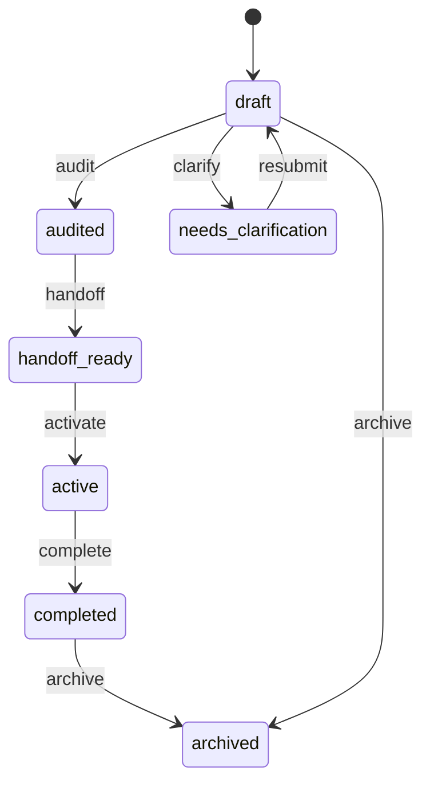

# Plan

A plan is a human-authored work decomposition imported into Conveyor as a
normalized, content-addressed contract. The human-readable plan explains intent,
but the normalized `conveyor.plan@1` contract is the execution surface: it is
what Conveyor validates, digests, and lowers into requirements, epics, and
slices. The plan is the entry point for all work in the factory.

The resource lives in `lib/conveyor/factory/plan.ex` (table `plans`). Loading
and validation happen in `lib/conveyor/plan_contract.ex`, record import in
`lib/conveyor/plan_import.ex`, and guarded lifecycle transitions in
`lib/conveyor/plan_lifecycle.ex`.

## Fields

| Field                 | Type              | Notes                                                                        |
| --------------------- | ----------------- | ---------------------------------------------------------------------------- |
| `id`                  | UUID              | Primary key.                                                                 |
| `title`               | string            | Required. Human-readable plan title.                                         |
| `intent`              | string            | Required. The plan's stated intent.                                          |
| `source_document`     | string            | Required. Path or reference to the source plan document.                     |
| `normalized_contract` | map               | Required. The validated `conveyor.plan@1` contract object.                   |
| `schema_version`      | string            | Required, default `conveyor.plan@1`. The contract schema version.            |
| `contract_sha256`     | string            | Required. SHA-256 of the canonicalized contract, computed by `PlanContract`. |
| `status`              | atom              | Required, default `draft`. Constrained to the lifecycle states below.        |
| `readiness_score`     | integer           | Optional. Computed readiness score from plan audits.                         |
| `imported_at`         | utc_datetime_usec | Create timestamp.                                                            |
| `project_id`          | UUID              | Required. The project the plan belongs to.                                   |

## Loading and validation

`Conveyor.PlanContract` loads a plan contract from a source path. It accepts
three forms:

1. A standalone `.json`, `.yml`, or `.yaml` contract file.
2. A sidecar `conveyor.plan.yml` / `.yaml` / `.json` next to a markdown plan.
3. A fenced `conveyor-plan@1` code block embedded in a markdown file.

The loader checks that the contract decodes to an object, that `schema_version`
is `conveyor.plan@1`, and that the contract validates against
`docs/schemas/conveyor.plan@1.json` using JSV. On success it returns a
`PlanContract.Result` with the source path, the validated contract, and the
`contract_sha256` computed over the canonical JSON (keys sorted, values
recursively canonicalized). Errors are typed (`file_error`, `decode_error`,
`missing_normalized_contract`, `unsupported_schema_version`,
`schema_validation_failed`) so callers can distinguish missing contracts from
malformed ones.

## Importing records

`Conveyor.PlanImport.import_requirements_and_decisions!/2` takes a created
`Plan` and a `PlanContract.Result` and upserts the child records using stable
keys:

- **Requirements** — each `requirements` entry is upserted into
  `Conveyor.Factory.Requirement` keyed by `stable_key`, carrying the text,
  source ref, source span, risk, and a status (`covered`, `deferred`,
  `out_of_scope`, `open`). Open requirements are surfaced in the import result
  for clarification.
- **Human decisions** — each `decisions` entry is upserted into
  `Conveyor.Factory.HumanDecision` keyed by `stable_key`, carrying the decision,
  rationale, source ref, and span.

Upserts use the `unique_plan_stable_key` identity and update a bounded set of
fields, so re-importing the same contract is idempotent and does not clobber
unrelated fields.

## Requirements, epics, and slices

A plan owns the hierarchy that becomes the work graph:

| Relationship      | Resource                         | Notes                                                                    |
| ----------------- | -------------------------------- | ------------------------------------------------------------------------ |
| `project`         | `Conveyor.Factory.Project`       | belongs_to (required). The project the plan belongs to.                  |
| `requirements`    | `Conveyor.Factory.Requirement`   | has_many. Stable-keyed requirements imported from the contract.          |
| `human_decisions` | `Conveyor.Factory.HumanDecision` | has_many. Stable-keyed human decisions.                                  |
| `audits`          | `Conveyor.Factory.PlanAudit`     | has_many. Structural and traceability audits.                            |
| `epics`           | `Conveyor.Factory.Epic`          | has_many. Plan-level work groupings that own ordered [slices](slice.md). |

Epics (`lib/conveyor/factory/epic.ex`) group related slices and carry their own
`approval_status` and `status` state machines. Slices are the atomic units that
flow through the station pipeline; see [slice](slice.md) for their lifecycle.

## Lifecycle states

The plan `status` is constrained to `draft`, `audited`, `handoff_ready`,
`active`, `completed`, `needs_clarification`, and `archived`. A
`PlanStatusTransition` validation runs on update to guard illegal transitions.

Transitions are performed through `Conveyor.PlanLifecycle.transition!/3`, which
wraps the update in a transaction and writes a `plan.transitioned` ledger event
keyed by an idempotency key built from the plan id, previous status, target
status, and timestamp. The `handoff_ready` state is significant:
`Conveyor.SliceLifecycle` requires the plan to be `handoff_ready` before any of
its slices can transition to `ready`, so no slice starts executing until the
plan has been audited and handed off.

## Key source files

| File                                  | Purpose                                                                            |
| ------------------------------------- | ---------------------------------------------------------------------------------- |
| `lib/conveyor/factory/plan.ex`        | Ash resource: fields, status, relationships.                                       |
| `lib/conveyor/plan_contract.ex`       | Loads, decodes, and validates the normalized contract; computes `contract_sha256`. |
| `lib/conveyor/plan_import.ex`         | Upserts requirements and human decisions from a validated contract.                |
| `lib/conveyor/plan_lifecycle.ex`      | Guarded status transitions with ledger events.                                     |
| `lib/conveyor/factory/epic.ex`        | Epic resource that owns ordered slices.                                            |
| `lib/conveyor/factory/requirement.ex` | Stable-keyed requirement records.                                                  |

## Related pages

- [Primitives](index.md) — all foundational domain objects
- [Slice](slice.md) — the atomic work unit lowered from a plan
- [Contract lock](contract-lock.md) — freezes a slice's acceptance contract
- [Run spec](run-spec.md) — freezes an attempt's inputs
- [Architecture](../overview/architecture.md) — where the plan sits in the
  pipeline
- [Glossary](../overview/glossary.md) — plan, epic, and slice definitions
