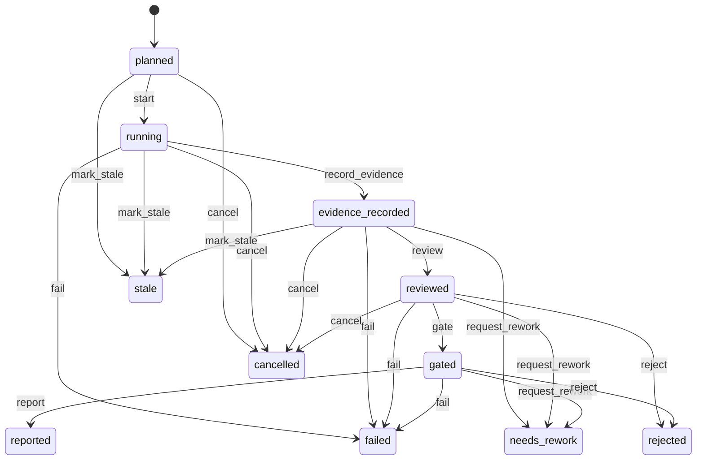

# Run attempt

A run attempt is one execution attempt of a slice through the station pipeline. It is the parent identity for everything that happens during a single try: the agent session, station runs, patch sets, evidence, reviews, and gate results all hang off it. When an attempt fails, a fresh run spec and a new run attempt are created for the retry, each with an incrementing `attempt_no`.

The resource lives in `lib/conveyor/factory/run_attempt.ex` (table `run_attempts`) and its guarded transitions and retry creation live in `lib/conveyor/run_attempt_lifecycle.ex`.

## Fields

| Field | Type | Notes |
| ---- | ---- | ---- |
| `id` | UUID | Primary key. |
| `attempt_no` | integer | Required. Monotonic per slice; unique via the `unique_slice_attempt_no` identity. |
| `base_commit` | string | Required. The git commit the attempt started from. |
| `head_tree_sha256` | string | Optional. SHA-256 of the resulting head tree, set after the agent session. |
| `patch_set_id` | UUID | Optional. Link to the patch set produced by the attempt. |
| `status` | atom | Required, default `planned`. The lifecycle state (see below). |
| `outcome` | atom | Required, default `none`. One of `none`, `needs_rework`, `accepted`, `rejected`, `policy_blocked`. |
| `failure_category` | string | Optional. Categorized failure reason for retrospectives. |
| `started_at` | utc_datetime_usec | Optional. When execution began. |
| `completed_at` | utc_datetime_usec | Optional. When the attempt finished. |
| `orchestrator_version` | string | Required. Version of the conductor that ran the attempt, for reproducibility. |
| `trace_id` | string | Required. Trace identifier propagated across station runs and ledger events. |
| `slice_id` | UUID | Required. The slice being attempted. |
| `run_spec_id` | UUID | Required. The frozen run spec (see [run spec](run-spec.md)) this attempt consumes. |

The `outcome` field is separate from `status`: `status` tracks pipeline progress, while `outcome` records the terminal judgment (`accepted`, `rejected`, `needs_rework`, `policy_blocked`) that the gate and reviewer produce.

## States and transitions

The run attempt uses `AshStateMachine` with `status` as the state attribute, starting at `planned`. Transitions are exposed as update actions (`start`, `record_evidence`, `review`, `gate`, `report`, `fail`, `cancel`, `mark_stale`, `request_rework`, `reject`).

The happy path mirrors the station pipeline: `planned` -> `running` -> `evidence_recorded` -> `reviewed` -> `gated` -> `reported`. Rework, rejection, cancellation, staleness, and failure are terminal or loop-back states.

## RunSpec association

Every run attempt belongs to exactly one [run spec](run-spec.md), which freezes the base commit, contract lock digest, policy digest, test pack digest, station plan, container image, sandbox profile, and budgets for that attempt. The run spec is content-addressed by `run_spec_sha256`, so two attempts with the same run spec are reproducible. Because the run spec is immutable, a retry always requires a fresh run spec; the lifecycle module enforces this.

## Station runs, evidence, and gate results

A run attempt owns the records produced as it moves through stations:

| Relationship | Resource | Notes |
| ---- | ---- | ---- |
| `agent_sessions` | `Conveyor.Factory.AgentSession` | Recorded agent sessions inside the sandbox. |
| `station_runs` | `Conveyor.Factory.StationRun` | Per-station execution records (see [station run](station-run.md)). |
| `patch_sets` | `Conveyor.Factory.PatchSet` | Diffs produced by the attempt. |
| `risk_assessments` | `Conveyor.Factory.RiskAssessment` | Risk assessments recorded during the attempt. |
| `evidence_records` | `Conveyor.Factory.Evidence` | Aggregated machine evidence (see [evidence](evidence.md)). |
| `tool_invocations` | `Conveyor.Factory.ToolInvocation` | Recorded tool calls with policy decisions. |
| `reviews` | `Conveyor.Factory.Review` | Reviewer verdicts. |
| `gate_results` | `Conveyor.Factory.GateResult` | Gate verdicts composed from stage results. |
| `artifacts` | `Conveyor.Factory.Artifact` | Content-addressed artifacts. |
| `run_bundles` | `Conveyor.Factory.RunBundle` | Projected run directories with dossier and PR-body draft. |
| `code_quality_runs` | `Conveyor.Factory.CodeQualityRun` | Code quality analyses on the diff. |
| `run_budgets` | `Conveyor.Factory.RunBudget` | Budget consumption for the attempt. |
| `incidents` | `Conveyor.Factory.Incident` | Incidents raised during the attempt. |
| `human_approvals` | `Conveyor.Factory.HumanApproval` | Human approval records. |
| `external_changes` | `Conveyor.Factory.ExternalChange` | External changes detected during the attempt. |
| `ledger_events` | `Conveyor.Factory.LedgerEvent` | Append-only ledger events. |

## Retries

`Conveyor.RunAttemptLifecycle.create_retry_attempt!/3` creates a new run attempt from a failed one and a fresh run spec. It guards that the original attempt is `failed`, that the new run spec belongs to the same slice, that the run spec is not the same as the failed attempt's run spec, and that `attempt_no` is exactly one greater than the failed attempt's. It then writes a `run_attempt.retry_created` ledger event linking the previous and new attempt ids. The retry's `trace_id` is derived as `{failed_trace_id}:retry:{attempt_no}` so traces chain across retries.

## Key source files

| File | Purpose |
| ---- | ---- |
| `lib/conveyor/factory/run_attempt.ex` | Ash resource: fields, state machine, relationships. |
| `lib/conveyor/run_attempt_lifecycle.ex` | Guarded transitions, retry creation, ledger events. |
| `lib/conveyor/factory/run_spec.ex` | The frozen input capsule each attempt consumes. |
| `lib/conveyor/factory/station_run.ex` | Per-station execution records owned by the attempt. |
| `lib/conveyor/factory/evidence.ex` | Evidence records owned by the attempt. |

## Related pages

- [Primitives](index.md) — all foundational domain objects
- [Slice](slice.md) — the work unit an attempt executes
- [Run spec](run-spec.md) — the frozen input for an attempt
- [Station run](station-run.md) — per-station execution
- [Evidence](evidence.md) — proof recorded during the attempt
- [Gate](../systems/gate.md) — gate stage composition
- [Station pipeline](../features/station-pipeline.md) — execution flow
