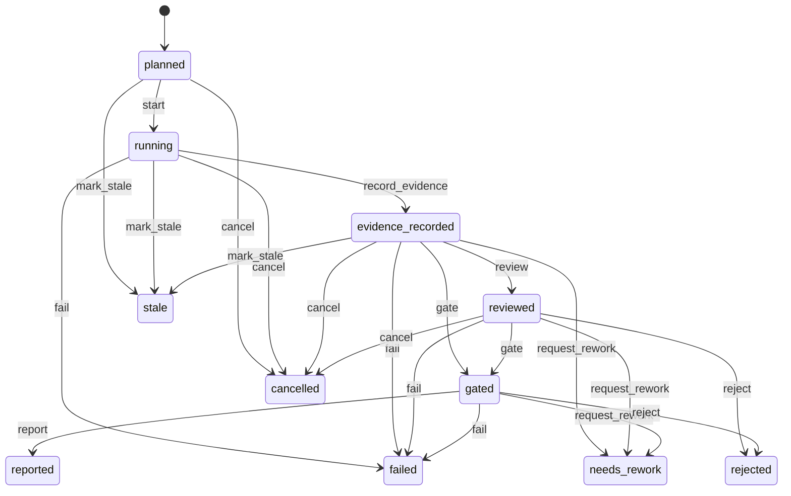

# Run attempt

A run attempt is the parent identity for one execution attempt of a slice. It
tracks status through a state machine from planned to reported, records a
terminal outcome (none, needs_rework, accepted, rejected, policy_blocked, or
abstained), and anchors the base commit and trace id for that attempt.
Multiple attempts (reworks) share the same slice but each gets its own
incrementing attempt number. The gate finalizer drives the post-gate
transitions that set the attempt's outcome.

## Key attributes

| Attribute | Type | Description |
| --------- | ---- | ----------- |
| `id` | `:uuid` | Primary key. |
| `attempt_no` | `:integer` | Attempt sequence number within the slice. Required; unique per slice. |
| `base_commit` | `:string` | The git commit the attempt started from. Required. |
| `head_tree_sha256` | `:string` | Hash of the working tree HEAD after the attempt. |
| `patch_set_id` | `:uuid` | Reference to the PatchSet produced by this attempt. |
| `status` | `:atom` | State machine attribute. One of `planned`, `running`, `evidence_recorded`, `reviewed`, `gated`, `reported`, `failed`, `cancelled`, `stale`, `needs_rework`, `rejected`. Default `planned`. |
| `outcome` | `:atom` | Terminal verdict. One of `none`, `needs_rework`, `accepted`, `rejected`, `policy_blocked`, `abstained`. Default `none`. Required. |
| `failure_category` | `:string` | Classification of a failure (set on fail or request_rework). |
| `started_at` | `:utc_datetime_usec` | When the attempt started running. |
| `completed_at` | `:utc_datetime_usec` | When the attempt reached a terminal state. |
| `orchestrator_version` | `:string` | Version of the orchestrator that drove the attempt. Required. |
| `trace_id` | `:string` | Distributed trace id for the attempt. Required. |

## State machine

The state machine uses `AshStateMachine` with `status` as the state attribute
and `planned` as the initial state. The `gate` transition is valid directly
from `evidence_recorded` because the production station sequence has no
separate reviewer station; the finalizer reviews and gates the recorded dossier
in one step. Each transition is an explicit `update` action (`start`,
`record_evidence`, `review`, `gate`, `report`, `fail`, `cancel`, `mark_stale`,
`request_rework`, `reject`).

## Relationships

| Relationship | Type | Target |
| ------------ | ---- | ------ |
| `slice` | belongs_to (required) | `Conveyor.Factory.Slice` |
| `run_spec` | belongs_to (required) | `Conveyor.Factory.RunSpec` |
| `agent_sessions` | has_many | `Conveyor.Factory.AgentSession` |
| `station_runs` | has_many | `Conveyor.Factory.StationRun` |
| `patch_sets` | has_many | `Conveyor.Factory.PatchSet` |
| `risk_assessments` | has_many | `Conveyor.Factory.RiskAssessment` |
| `evidence_records` | has_many | `Conveyor.Factory.Evidence` |
| `tool_invocations` | has_many | `Conveyor.Factory.ToolInvocation` |
| `reviews` | has_many | `Conveyor.Factory.Review` |
| `gate_results` | has_many | `Conveyor.Factory.GateResult` |
| `artifacts` | has_many | `Conveyor.Factory.Artifact` |
| `run_bundles` | has_many | `Conveyor.Factory.RunBundle` |
| `code_quality_runs` | has_many | `Conveyor.Factory.CodeQualityRun` |
| `run_budgets` | has_many | `Conveyor.Factory.RunBudget` |
| `incidents` | has_many | `Conveyor.Factory.Incident` |
| `human_approvals` | has_many | `Conveyor.Factory.HumanApproval` |
| `external_changes` | has_many | `Conveyor.Factory.ExternalChange` |
| `ledger_events` | has_many | `Conveyor.Factory.LedgerEvent` |

## Identities

| Identity | Fields | Notes |
| -------- | ------ | ----- |
| `unique_slice_attempt_no` | `slice_id`, `attempt_no` | Attempt numbers are unique within a slice. |

## Key source files

| File | Role |
| ---- | ---- |
| `lib/conveyor/factory/run_attempt.ex` | Ash resource definition with state machine. |
| `lib/conveyor/gate/finalizer.ex` | Applies post-gate transitions (accept, abstain, reject, rework) and sets the outcome. |
| `lib/conveyor/planning/serial_driver.ex` | Creates run attempts and drives the execution loop. |

See also: [Slice](slice.md), [Run spec](run-spec.md), [Evidence](evidence.md),
[Station run](station-run.md), [Gate](../systems/gate.md),
[Planning compiler](../systems/planning-compiler.md).
