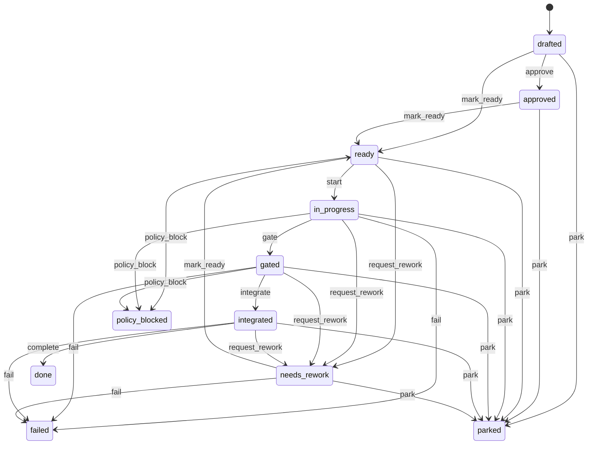

# Slice

A slice is the atomic unit of work in Conveyor. It is an ordered implementation step inside an epic, carrying its own contract, autonomy level, and guarded lifecycle. Nothing advances until its slice passes the stations and gate that verify it, which is where the project gets its name: work moves down the conveyor through stations and gates, and a slice only proceeds when its checks pass.

The slice resource lives in `lib/conveyor/factory/slice.ex` and is persisted in the `slices` Postgres table. Its transitions are guarded by `lib/conveyor/slice_lifecycle.ex`, which checks plan readiness, locked briefs, autonomy policy, and required artifacts before allowing state changes, and writes a ledger event for every transition.

## Fields

| Field | Type | Notes |
| ---- | ---- | ---- |
| `id` | UUID | Primary key. |
| `title` | string | Required. Human-readable slice name. |
| `position` | integer | Required. Order within the epic; unique per epic via the `unique_epic_position` identity. |
| `risk` | string | Required, default `medium`. Risk classification used by planning and review. |
| `state` | atom | Required, default `drafted`. Constrained to the lifecycle states below. |
| `autonomy_level` | string | Required, default `L1`. Must not exceed the project's `default_autonomy_level`; enforced on `mark_ready`. |
| `source_refs` | array of strings | Required, default `[]`. Plan source references for traceability. |
| `likely_files` | array of strings | Required, default `[]`. Files the slice is expected to touch, used for conflict-domain analysis. |
| `conflict_domains` | array of strings | Required, default `[]`. Domains the slice may conflict with, for work-graph scheduling. |
| `diff_policy_id` | UUID | Optional. Diff policy applied to the slice. |
| `epic_id` | UUID | Required. The epic that owns the slice. |

## States and transitions

The slice uses `AshStateMachine` with `state` as the state attribute, starting at `drafted`. Transitions are exposed as Ash update actions (`approve`, `mark_ready`, `start`, `gate`, `integrate`, `complete`, `request_rework`, `park`, `fail`, `policy_block`).

The happy path is `drafted` -> `approved` -> `ready` -> `in_progress` -> `gated` -> `integrated` -> `done`. Rework, parking, failure, and policy blocking are escape hanches off any active state.

## Guarded transitions

`Conveyor.SliceLifecycle.transition!/3` wraps each transition in a database transaction and applies guards before the state change, then writes a `slice.transitioned` ledger event keyed by an idempotency key built from the slice id, previous state, new state, and timestamp.

| Transition | Guard |
| ---- | ---- |
| `mark_ready` | Plan must be `handoff_ready`; slice must have a locked `AgentBrief`; slice autonomy level must not exceed the project's default autonomy level. |
| `start` | Requires a locked `AgentBrief`; an implementation `actor` must be supplied; the actor must differ from the brief's `locked_by` (the contract author cannot implement it). |
| `gate` | Requires `required_artifacts?: true` and `gate_stage_complete?: true` options. |
| `integrate` | Requires `required_artifacts?: true`. |
| `complete` | Requires `gate_stage_complete?: true`. |

The actor-separation guard on `start` is the runtime enforcement of the contract lock's separation of concerns: whoever locks the acceptance contract cannot be the same actor that implements against it.

## Relationships

A slice sits inside an epic and owns the artifacts that flow through the station pipeline:

| Relationship | Resource | Cardinality | Notes |
| ---- | ---- | ---- |
| `epic` | `Conveyor.Factory.Epic` | belongs_to (required) | The epic that owns the slice. |
| `diff_policies` | `Conveyor.Factory.DiffPolicy` | has_many | Diff policies scoped to the slice. |
| `agent_briefs` | `Conveyor.Factory.AgentBrief` | has_many | Briefs authored for the slice; the latest locked brief gates readiness. |
| `contract_locks` | `Conveyor.Factory.ContractLock` | has_many | Immutable acceptance contract digests (see [contract lock](contract-lock.md)). |
| `test_packs` | `Conveyor.Factory.TestPack` | has_many | Locked, read-only acceptance test bundles. |
| `verification_suites` | `Conveyor.Factory.VerificationSuite` | has_many | Verification suites for the slice. |
| `run_specs` | `Conveyor.Factory.RunSpec` | has_many | Frozen execution capsules (see [run spec](run-spec.md)). |
| `run_attempts` | `Conveyor.Factory.RunAttempt` | has_many | Execution attempts (see [run attempt](run-attempt.md)). |
| `station_runs` | `Conveyor.Factory.StationRun` | has_many | Per-station execution records (see [station run](station-run.md)). |
| `context_packs` | `Conveyor.Factory.ContextPack` | has_many | Context gathered by the context scout. |
| `run_prompts` | `Conveyor.Factory.RunPrompt` | has_many | Assembled implementation prompts. |
| `incidents` | `Conveyor.Factory.Incident` | has_many | Incidents raised during slice work. |
| `human_approvals` | `Conveyor.Factory.HumanApproval` | has_many | Human approval records. |
| `ledger_events` | `Conveyor.Factory.LedgerEvent` | has_many | Append-only ledger events for the slice. |

## Contract lock, test pack, and run attempts

A slice is not executable until it has a locked [contract lock](contract-lock.md) and a locked `AgentBrief`. The contract lock freezes the acceptance criteria, required tests, test pack, verification commands, AGENTS.md digest, and policy digest as SHA-256 digests, so later evidence can be checked against a fixed target. The [test pack](#) (`Conveyor.Factory.TestPack`) is the locked, read-only acceptance test bundle mounted into the sandbox during implementation; it carries its own `test_pack_sha256` and `required_test_refs`.

Each execution of the slice creates a [run attempt](run-attempt.md), which consumes a [run spec](run-spec.md) that freezes all inputs for that attempt. A slice can have many run attempts (retries), each with an incrementing `attempt_no`, but only one attempt is active at a time.

## Key source files

| File | Purpose |
| ---- | ---- |
| `lib/conveyor/factory/slice.ex` | Ash resource: fields, state machine, relationships, actions. |
| `lib/conveyor/slice_lifecycle.ex` | Guarded transitions, ledger events, actor-separation and readiness checks. |
| `lib/conveyor/factory/epic.ex` | Epic resource that owns ordered slices. |
| `lib/conveyor/factory/contract_lock.ex` | Contract lock resource owned by the slice. |
| `lib/conveyor/factory/test_pack.ex` | Locked acceptance test bundle for the slice. |

## Related pages

- [Primitives](index.md) — all foundational domain objects
- [Contract lock](contract-lock.md) — immutable acceptance contract
- [Run attempt](run-attempt.md) — one execution attempt of a slice
- [Run spec](run-spec.md) — frozen input for an attempt
- [Plan](plan.md) — where slices originate
- [Station pipeline](../features/station-pipeline.md) — execution flow
- [Contract management](../features/contract-management.md) — contract lock lifecycle
