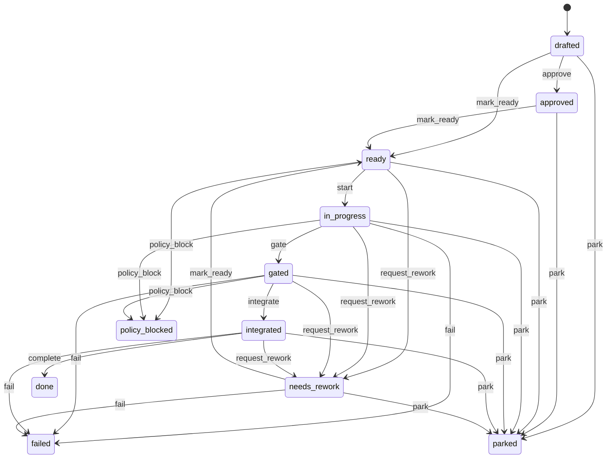

# Slice

A slice is the contract-bearing unit of work: the atomic thing the factory
builds and the gate judges. Slices carry a stable plan-authored key, an ordered
position within an epic, acceptance criteria, and an autonomy level. Each slice
moves through an explicit state machine from drafting to done, with side paths
for rework, parking, failure, and policy blocks. The serial driver executes
slices in dependency order and accepts committed slices so the next slice builds
on the accepted base.

## Key attributes

| Attribute | Type | Description |
| --------- | ---- | ----------- |
| `id` | `:uuid` | Primary key. |
| `title` | `:string` | Human-readable slice title. Required. |
| `stable_key` | `:string` | Plan-authored stable key (for example `SLICE-005`). Unique per epic; NULL for legacy rows. The ledger run-story joins on this key. |
| `position` | `:integer` | Zero-based ordering within the epic. Required; unique per epic. |
| `risk` | `:string` | Risk tier, default `medium`. Required. |
| `state` | `:atom` | State machine attribute. One of `drafted`, `approved`, `ready`, `in_progress`, `gated`, `integrated`, `done`, `needs_rework`, `parked`, `failed`, `policy_blocked`. Default `drafted`. |
| `autonomy_level` | `:string` | Autonomy tier, default `L1`. Required. |
| `source_refs` | `{:array, :string}` | References to source plan sections. Default `[]`. |
| `likely_files` | `{:array, :string}` | Files the slice is expected to touch. Default `[]`. |
| `conflict_domains` | `{:array, :string}` | Domains where this slice may conflict with others. Default `[]`. |
| `acceptance_criteria` | `{:array, :map}` | CLI-authored acceptance criteria compiled into the normalized contract. Each entry carries id/text plus requirement and test refs. Default `[]`. |
| `diff_policy_id` | `:uuid` | Optional diff policy reference. |

## State machine

The state machine uses `AshStateMachine` with `state` as the state attribute and
`drafted` as the initial state. Every transition is an explicit `update` action
(`approve`, `mark_ready`, `start`, `gate`, `integrate`, `complete`,
`request_rework`, `park`, `fail`, `policy_block`).

## Relationships

| Relationship | Type | Target |
| ------------ | ---- | ------ |
| `epic` | belongs_to (required) | `Conveyor.Factory.Epic` |
| `diff_policies` | has_many | `Conveyor.Factory.DiffPolicy` |
| `agent_briefs` | has_many | `Conveyor.Factory.AgentBrief` |
| `contract_locks` | has_many | `Conveyor.Factory.ContractLock` |
| `test_packs` | has_many | `Conveyor.Factory.TestPack` |
| `verification_suites` | has_many | `Conveyor.Factory.VerificationSuite` |
| `run_specs` | has_many | `Conveyor.Factory.RunSpec` |
| `run_attempts` | has_many | `Conveyor.Factory.RunAttempt` |
| `station_runs` | has_many | `Conveyor.Factory.StationRun` |
| `context_packs` | has_many | `Conveyor.Factory.ContextPack` |
| `run_prompts` | has_many | `Conveyor.Factory.RunPrompt` |
| `incidents` | has_many | `Conveyor.Factory.Incident` |
| `human_approvals` | has_many | `Conveyor.Factory.HumanApproval` |
| `ledger_events` | has_many | `Conveyor.Factory.LedgerEvent` |

## Identities

| Identity | Fields | Notes |
| -------- | ------ | ----- |
| `unique_epic_position` | `epic_id`, `position` | Slices are ordered within an epic. |
| `unique_epic_stable_key` | `epic_id`, `stable_key` | CLI-assigned stable keys must be unique per epic; NULL stable_keys remain distinct. |

## Key source files

| File | Role |
| ---- | ---- |
| `lib/conveyor/factory/slice.ex` | Ash resource definition with state machine. |
| `lib/conveyor/planning/serial_driver.ex` | Width-1 execution loop that drives slice transitions. |
| `lib/conveyor/planning/run_spec_assembler.ex` | Assembles the RunSpec and locks the contract for a slice. |
| `lib/conveyor/gate/finalizer.ex` | Applies post-gate slice transitions (accept, abstain, reject, rework). |

See also: [Run attempt](run-attempt.md), [Contract lock](contract-lock.md),
[Run spec](run-spec.md), [Plan](plan.md), [Station run](station-run.md),
[Planning compiler](../systems/planning-compiler.md), [Gate](../systems/gate.md).
