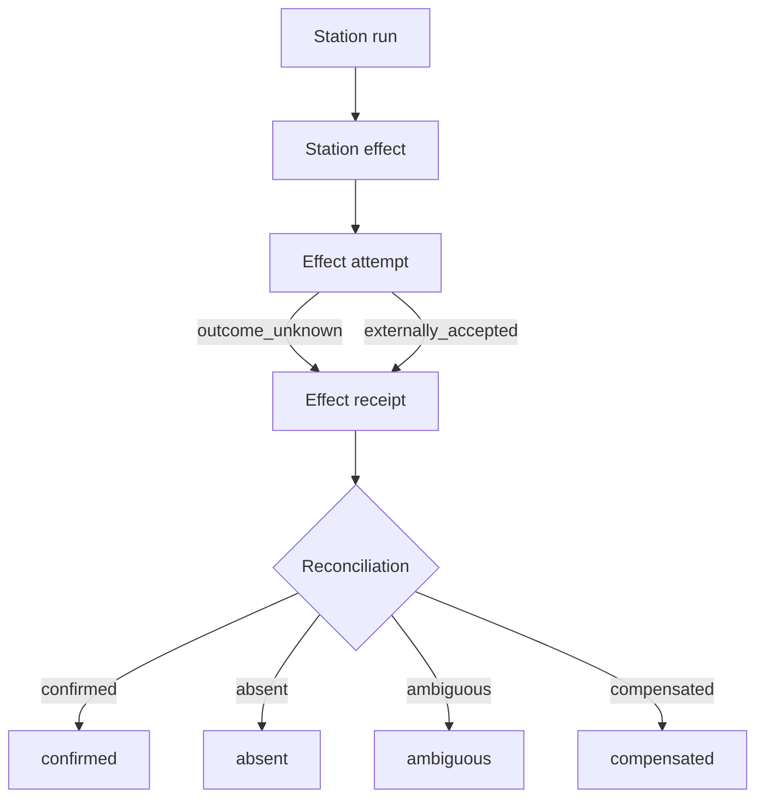

# Station run

A station run is the recorded execution of one station for one run attempt. Each station in the pipeline (readiness, baseline health, acceptance calibration, context scout, prompt builder, agent session, evidence recorder, run check, reviewer, gate, canary, post-integration, retrospective) produces a station run record that carries its lease, idempotency metadata, inputs, outputs, and any declared side effects. Station runs are how Conveyor makes pipeline execution crash-safe and replayable.

The resource lives in `lib/conveyor/factory/station_run.ex` (table `station_runs`). Side effects are modeled by three companion resources: `StationEffect`, `EffectAttempt`, and `EffectReceipt`.

## Fields

| Field | Type | Notes |
| ---- | ---- | ---- |
| `id` | UUID | Primary key. |
| `station` | string | Required. The station name. |
| `attempt_no` | integer | Required. The run attempt number. |
| `station_spec_sha256` | string | Required. Digest of the station spec being executed. |
| `idempotency_key` | string | Required. Unique via `unique_idempotency_key`; prevents duplicate station executions. |
| `input_sha256` | string | Required. Digest of the station's inputs, so re-runs with changed inputs are detected. |
| `output_sha256` | string | Optional. Digest of the station's outputs. |
| `status` | atom | Required, default `queued`. One of `queued`, `running`, `succeeded`, `failed`, `cancelled`, `stale`. |
| `lease_owner` | string | Optional. Identifier of the process holding the execution lease. |
| `lease_owner_instance_id` | string | Optional. Instance id of the lease owner, for multi-node safety. |
| `lease_epoch` | integer | Required, default `0`. Lease epoch for fencing. |
| `lease_acquired_at` | utc_datetime_usec | Optional. When the lease was acquired. |
| `lease_expires_at` | utc_datetime_usec | Optional. When the lease expires, for stale-lease recovery. |
| `heartbeat_at` | utc_datetime_usec | Optional. Last heartbeat from the lease owner. |
| `trace_id` | string | Optional. Trace identifier propagated from the run attempt. |
| `started_at` | utc_datetime_usec | Optional. When the station started executing. |
| `completed_at` | utc_datetime_usec | Optional. When the station finished. |
| `error_category` | string | Optional. Categorized error reason on failure. |
| `error_message` | string | Optional. Human-readable error message on failure. |
| `artifact_refs` | array of strings | Required, default `[]`. Content-addressed references to artifacts produced. |
| `run_attempt_id` | UUID | Required. The run attempt this station run belongs to. |
| `agent_session_id` | UUID | Optional. The agent session, if the station ran an agent. |
| `slice_id` | UUID | Required. The slice this station run is for. |

## States

Station run `status` is constrained to `queued`, `running`, `succeeded`, `failed`, `cancelled`, and `stale`. A station starts `queued`, moves to `running` when a worker picks it up, and ends in `succeeded` or `failed`. `cancelled` covers operator-initiated stops, and `stale` covers lease expiry without completion, allowing recovery.

## Lease and idempotency

Each station run carries an `idempotency_key` that is unique across the table, so the same station cannot be executed twice for the same attempt. The `input_sha256` pins the inputs: if the inputs change, a new station run with a new idempotency key is required. The lease fields (`lease_owner`, `lease_owner_instance_id`, `lease_epoch`, `lease_acquired_at`, `lease_expires_at`, `heartbeat_at`) implement distributed lease ownership so that on a crash or node loss, another worker can detect the expired lease and recover or retry the station. The `lease_epoch` acts as a fencing token to prevent a stalled owner from writing after its lease has been reclaimed.

## Effects, attempts, and receipts

Stations that produce external side effects (container starts, process execs, file writes, provider calls, artifact projections) declare them as `StationEffect` records. This declaration-before-execution model is what makes station reconciliation crash-safe: the conductor knows what effects a station intended to produce, so after a crash it can check whether each effect actually happened.

### Station effect

`lib/conveyor/factory/station_effect.ex` (table `station_effects`) declares an intended side effect.

| Field | Type | Notes |
| ---- | ---- | ---- |
| `effect_kind` | atom | Required. One of `container_start`, `process_exec`, `file_write`, `provider_call`, `artifact_project`. |
| `idempotency_key` | string | Required. Unique per effect. |
| `declared_at` | utc_datetime_usec | Create timestamp. |
| `started_at` / `completed_at` | utc_datetime_usec | Optional. Execution window. |
| `observed_ref` | string | Optional. Reference to the observed result of the effect. |
| `status` | atom | Required, default `declared`. One of `declared`, `running`, `succeeded`, `failed`, `unknown`, `reconciled`. |
| `cleanup_required` | boolean | Required, default `false`. Whether the effect needs cleanup on failure. |
| `cleanup_status` | atom | Required, default `not_required`. One of `not_required`, `pending`, `completed`, `failed`. |

### Effect attempt

`lib/conveyor/factory/effect_attempt.ex` (table `effect_attempts`) records one attempt to perform an effect. Attempts are separate from receipts so that `outcome_unknown` is represented explicitly instead of being collapsed into success or failure.

| Field | Type | Notes |
| ---- | ---- | ---- |
| `fencing_token` | string | Required. Fencing token preventing stale writes. |
| `admission_permit_id` | string | Required. Admission permit that authorized the attempt. |
| `idempotency_key` | string | Required. Unique per attempt. |
| `request_digest` | string | Required. Digest of the request payload. |
| `started_at` | utc_datetime_usec | Required. When the attempt started. |
| `completed_at` | utc_datetime_usec | Optional. When the attempt completed. |
| `status` | atom | Required, default `started`. One of `started`, `externally_accepted`, `failed`, `outcome_unknown`. |

The `outcome_unknown` status is the key design choice: when a crash leaves the conductor unsure whether an external system accepted the effect, it records `outcome_unknown` rather than guessing. Reconciliation then resolves it.

### Effect receipt

`lib/conveyor/factory/effect_receipt.ex` (table `effect_receipts`) is the durable receipt and reconciliation state for an attempt.

| Field | Type | Notes |
| ---- | ---- | ---- |
| `fencing_token` | string | Required. Fencing token matching the attempt. |
| `idempotency_key` | string | Required. Unique per receipt. |
| `external_correlation_id` | string | Optional. Correlation id from the external system. |
| `request_digest` | string | Required. Digest of the request, for matching. |
| `result_digest` | string | Required. Digest of the observed result. |
| `reconciliation_status` | atom | Required, default `pending`. One of `pending`, `confirmed`, `absent`, `ambiguous`, `compensated`. |
| `trace_id` | string | Required. Trace identifier. |
| `observed_at` | utc_datetime_usec | Required. When the receipt was observed. |

The `reconciliation_status` field captures the outcome of crash recovery: `confirmed` means the external system acknowledges the effect, `absent` means it never happened, `ambiguous` means it cannot be determined, and `compensated` means a compensating action was taken.

## Relationships

| Relationship | Resource | Cardinality | Notes |
| ---- | ---- | ---- |
| `run_attempt` | `Conveyor.Factory.RunAttempt` | belongs_to (required) | The attempt this station run belongs to. |
| `agent_session` | `Conveyor.Factory.AgentSession` | belongs_to (optional) | The agent session, if any. |
| `slice` | `Conveyor.Factory.Slice` | belongs_to (required) | The slice this station run is for. |
| `effects` | `Conveyor.Factory.StationEffect` | has_many | Declared side effects. |
| `workspace_materializations` | `Conveyor.Factory.WorkspaceMaterialization` | has_many | Workspace materializations. |
| `tool_invocations` | `Conveyor.Factory.ToolInvocation` | has_many | Recorded tool calls. |
| `artifacts` | `Conveyor.Factory.Artifact` | has_many | Content-addressed artifacts. |
| `credential_leases` | `Conveyor.Factory.CredentialLease` | has_many | Credential leases issued. |
| `ledger_events` | `Conveyor.Factory.LedgerEvent` | has_many | Ledger events. |

## Key source files

| File | Purpose |
| ---- | ---- | ---- |
| `lib/conveyor/factory/station_run.ex` | Ash resource: lease, idempotency, status, relationships. |
| `lib/conveyor/factory/station_effect.ex` | Declared side effect with cleanup tracking. |
| `lib/conveyor/factory/effect_attempt.ex` | Recorded attempt with explicit `outcome_unknown`. |
| `lib/conveyor/factory/effect_receipt.ex` | Durable receipt and reconciliation state. |
| `lib/conveyor/station.ex` | Station execution coordinator. |

## Related pages

- [Primitives](index.md) — all foundational domain objects
- [Run attempt](run-attempt.md) — the attempt that owns station runs
- [Run spec](run-spec.md) — freezes the station plan station runs execute
- [Slice](slice.md) — the work unit station runs advance
- [Station pipeline](../features/station-pipeline.md) — execution flow across stations
- [Architecture](../overview/architecture.md) — station pipeline topology
