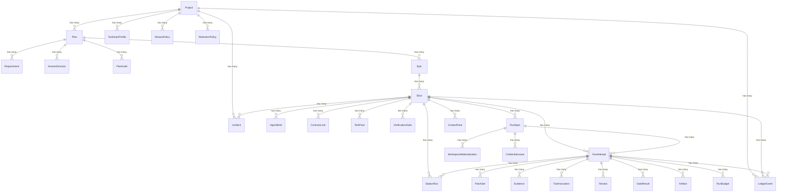
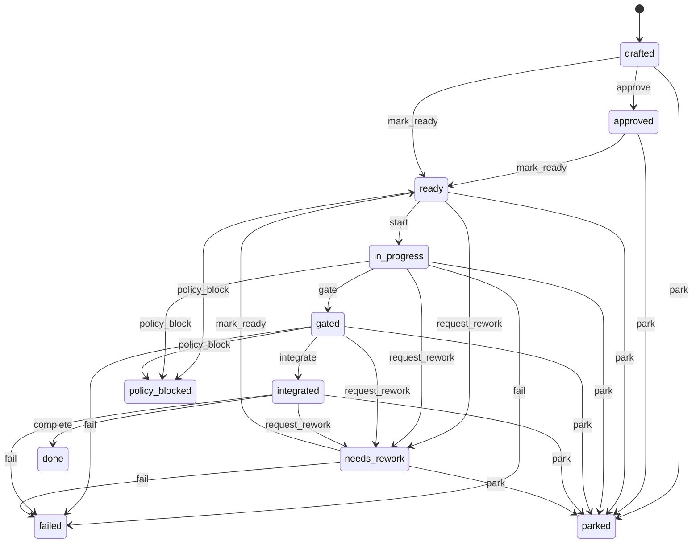
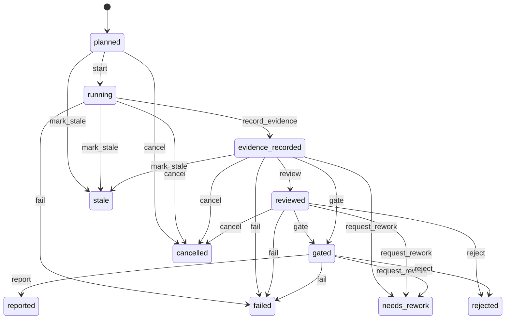

# Data models

Conveyor's data model is built on Ash resources backed by Postgres through
AshPostgres. All resources belong to the `Conveyor.Factory` domain
(`lib/conveyor/factory.ex`) and are managed through Ash actions. State
transitions are modeled with `ash_state_machine`.

## Factory domain

`lib/conveyor/factory.ex` registers 51 resources in the `Conveyor.Factory`
domain. Every resource uses `AshPostgres.DataLayer` and maps to a table in
Postgres.

The resources fall into five clusters:

1. **Project and planning:** `Project`, `ToolchainProfile`, `CacheMount`,
   `Plan`, `Requirement`, `HumanDecision`, `PlanAudit`
2. **Work graph:** `Epic`, `Slice`, `TaskDependency`, `DiffPolicy`,
   `ReviewPolicy`, `AgentBrief`, `ContractLock`, `TestPack`,
   `VerificationSuite`, `TestPackCalibration`
3. **Execution:** `RunSpec`, `RunAttempt`, `AgentSession`, `StationRun`,
   `StationEffect`, `EffectAttempt`, `EffectReceipt`, `AuthorityEvent`,
   `PatchSet`, `RiskAssessment`, `WorkspaceMaterialization`
4. **Evidence and gate:** `Evidence`, `ToolInvocation`, `Review`,
   `GateResult`, `CodeProvenanceEdge`, `Artifact`, `RunBundle`,
   `ReviewerHealth`, `GateHealth`, `ContextPack`, `InstructionSource`,
   `CodeQualityRun`, `RunPrompt`, `PatchEquivalence`
5. **Safety and control:** `Policy`, `RetentionPolicy`, `RunBudget`,
   `Incident`, `CredentialLease`, `HumanApproval`, `ExternalChange`,
   `LedgerEvent`, `EventOutbox`

## Plan / epic / slice hierarchy

The work graph is hierarchical: a `Project` owns `Plan`s, a `Plan` owns
`Epic`s, an `Epic` owns `Slice`s. A `Slice` is the unit of work that gets a
locked contract, a run spec, and one or more run attempts.

### Key resources

#### Project (`lib/conveyor/factory/project.ex`)

A repository registered with Conveyor. Attributes: `name`, `repo_url`,
`local_path`, `default_branch`, `dev_branch`, `command_specs` (embedded map
array), `toolchain_profile_id`, `code_quality_profile`, `default_autonomy_level`
(integer, default 1), `status` (`:active` or `:archived`).

#### Plan (`lib/conveyor/factory/plan.ex`)

A normalized implementation plan. Attributes: `title`, `intent`,
`source_document`, `normalized_contract` (map), `schema_version`
(`conveyor.plan@1`), `contract_sha256`, `status`, `readiness_score`. Status
states: `:draft`, `:audited`, `:handoff_ready`, `:active`, `:completed`,
`:needs_clarification`, `:archived`. Status transitions are validated by
`Conveyor.Factory.Validations.PlanStatusTransition`.

#### Slice (`lib/conveyor/factory/slice.ex`)

An ordered implementation slice. This is the primary unit of work. Attributes:
`title`, `stable_key` (plan-authored key like `SLICE-005`), `position`,
`risk`, `state`, `autonomy_level`, `source_refs`, `likely_files`,
`conflict_domains`, `acceptance_criteria` (array of maps), `diff_policy_id`.
Identities: unique per `(epic_id, position)` and `(epic_id, stable_key)`.

#### RunSpec (`lib/conveyor/factory/run_spec.ex`)

An immutable execution capsule describing exactly what one attempt will run.
Carries content-addressed digests for the contract lock, policy, diff policy,
test pack, station plan, and budget. Attributes include `base_commit`,
`container_image_ref`, `container_image_digest`, `sandbox_profile`,
`agent_profile_snapshot`, `canary_suite_version`. Identity: unique
`run_spec_sha256`.

#### RunAttempt (`lib/conveyor/factory/run_attempt.ex`)

Parent identity for one execution attempt of a slice. Attributes: `attempt_no`,
`base_commit`, `head_tree_sha256`, `patch_set_id`, `status`, `outcome`,
`failure_category`, `started_at`, `completed_at`, `orchestrator_version`,
`trace_id`. Identity: unique `(slice_id, attempt_no)`.

#### ContractLock (`lib/conveyor/factory/contract_lock.ex`)

An immutable digest set that freezes a slice contract for future evidence.
Carries SHA-256 digests for the plan contract, agent brief, acceptance
criteria, required tests, test pack, verification commands, AGENTS.md, and
policy. Also carries `protected_path_globs`. This is the resource that
enforces design law 2: no implementation without a locked contract.

#### GateResult (`lib/conveyor/factory/gate_result.ex`)

A deterministic gate verdict. Attributes: `level` (`:slice`), `passed`
(boolean), `stages` (array of maps), `false_negative`, `gate_version`,
`gate_code_sha256`, `policy_sha256`, `contract_lock_sha256`,
`canary_suite_version`, `trust_score` (map, from ADR-23). The `trust_score`
field records the calibrated trust verdict: score, band, components,
thresholds, and policy digest.

#### Evidence (`lib/conveyor/factory/evidence.ex`)

Aggregated machine evidence for a run attempt and patch. Attributes:
`changed_files`, `diff_ref`, `tool_invocation_refs`, `acceptance_results`,
`code_quality_result_ref`, `risks`, `summary`, `pr_body_ref`. Belongs to
`RunAttempt` and `PatchSet`.

#### Policy (`lib/conveyor/factory/policy.ex`)

A named policy profile with command, environment, network, budget, and
autonomy limits. Attributes: `name`, `profile` (atom), `allowlist`,
`denylist`, `env_policy` (map), `network_policy` (map), `budget_policy` (map),
`autonomy_ceiling` (integer). See [security](../security.md) for how the
policy engine uses these fields.

#### CredentialLease (`lib/conveyor/factory/credential_lease.ex`)

A short-lived scoped provider credential exposure record. Attributes:
`provider`, `env_keys`, `scope`, `issued_at`, `expires_at`, `revoked_at`,
`status` (`:issued`, `:active`, `:revoked`, `:expired`, `:invalidated`).
Belongs to `RunSpec` (required) and `StationRun` (optional).

## State machines

Two resources use `ash_state_machine` for explicit state transitions.

### Slice state machine

The `Slice` state machine in `lib/conveyor/factory/slice.ex`:

States: `drafted`, `approved`, `ready`, `in_progress`, `gated`, `integrated`,
`done`, `needs_rework`, `parked`, `failed`, `policy_blocked`. Initial state:
`drafted`.

### RunAttempt state machine

The `RunAttempt` state machine in `lib/conveyor/factory/run_attempt.ex`:

States: `planned`, `running`, `evidence_recorded`, `reviewed`, `gated`,
`reported`, `failed`, `cancelled`, `stale`, `needs_rework`, `rejected`.
Initial state: `planned`. The `outcome` field tracks: `none`, `needs_rework`,
`accepted`, `rejected`, `policy_blocked`, `abstained` (from ADR-23).

## Migrations

41 migrations live in `priv/repo/migrations/`. They are append-only: each
migration adds tables, columns, or indexes without modifying prior schema. The
first migration creates Oban jobs
(`20260617180000_add_oban_jobs.exs`). Factory foundation resources start at
`20260617201000_create_factory_foundation_resources.exs`. The most recent
migrations add task dependencies, slice stable key unique indexes, slice
acceptance criteria, and plan contract freezing.

Resources and migrations are kept aligned: Ash resource changes usually imply
a new migration and focused tests (per `lib/conveyor/AGENTS.md`).

## JSON schemas

100 JSON schemas live in `docs/schemas/`. They define the wire formats for
plans, run views, evidence, gate results, cassettes, trust bundles, and other
authoritative records. Schemas are versioned with a `@1` or `@2` suffix
(e.g. `conveyor.plan@1.json`, `conveyor.work_graph@2.json`).

Key schemas include:

| Schema | Description |
| --- | --- |
| `conveyor.plan@1` | Normalized implementation plan |
| `conveyor.run_view@1` | Projected run view |
| `conveyor.eval_scorecard@1` | Evaluation scorecard |
| `conveyor.tool_contract@1` | Tool contract (ADR-07) |
| `conveyor.trust_bundle@1` | DSSE trust bundle for gate verdicts |
| `conveyor.emergency_stop_state@1` | Emergency stop state record |
| `conveyor.effective_capability_set@1` | Derived adapter capabilities |
| `conveyor.work_graph@2` | Work graph IR |
| `conveyor.verification_obligation@1` | Verification obligation |
| `conveyor.verification_evidence@1` | Verification evidence |

The schema registry is in `docs/schemas/registry.json`. Supporting docs in
`docs/schemas/` cover attestation, canonicalization, compatibility, and
migration conventions.
