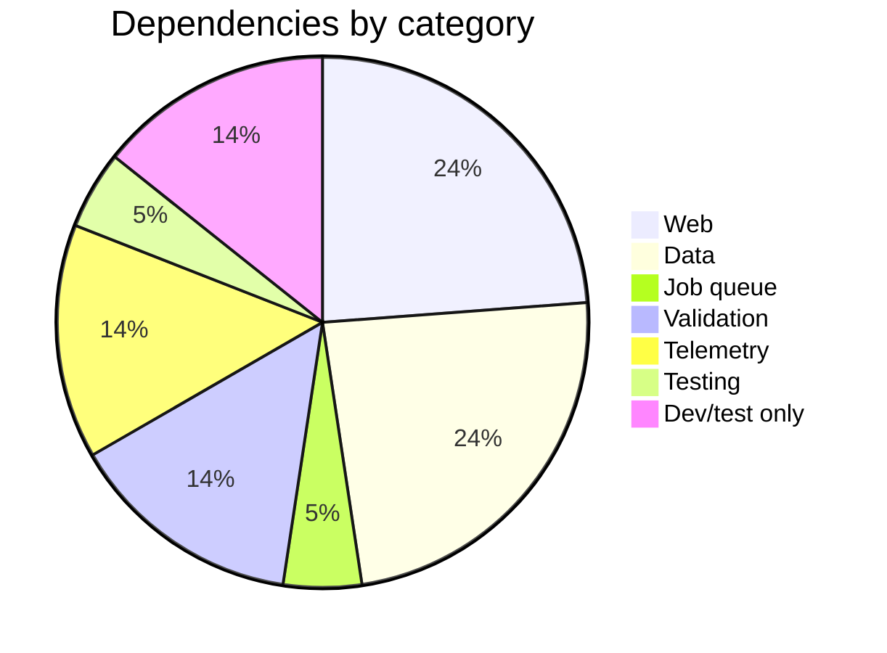

# Dependencies

All dependencies are declared in `mix.exs` under `deps/0`. Versions are locked
in `mix.lock`. The project targets Elixir `~> 1.20` and OTP 29.

## Web

| Dependency | Version | Purpose |
| --- | --- | --- |
| `phoenix` | `~> 1.8.8` | Web framework. Provides endpoint, routing, PubSub, LiveView host. |
| `phoenix_live_view` | `~> 1.2` | LiveView for real-time UI projections (e.g. `RunViewerLive`). |
| `phoenix_html` | `~> 4.1` | HTML rendering helpers for Phoenix views. |
| `phoenix_ecto` | `~> 4.7` | Ecto integration for Phoenix (changeset validation, form helpers). |
| `bandit` | `~> 1.12` | Pure-Elixir HTTP server. Used as the Phoenix adapter instead of Cowboy. |

## Data

| Dependency | Version | Purpose |
| --- | --- | --- |
| `ecto_sql` | `~> 3.14` | SQL query builder and migration runner for Ecto. |
| `postgrex` | `~> 0.22` | PostgreSQL driver for Elixir. Underlies Ecto's Postgres adapter. |
| `ash` | `~> 3.29` | Resource-oriented domain framework. All 51 factory resources are Ash resources. |
| `ash_postgres` | `~> 2.10` | Postgres data layer for Ash. Maps resources to tables and compiles queries. |
| `ash_state_machine` | `~> 0.2.13` | State machine extension for Ash. Used by `Slice` and `RunAttempt` for explicit transitions. |

## Job queue

| Dependency | Version | Purpose |
| --- | --- | --- |
| `oban` | `~> 2.23` | Background job queue backed by Postgres. Queues: `default`, `conductor`, `gate`, `maintenance`. Used for orchestration edges, not semantic business rules. |

## Validation and serialization

| Dependency | Version | Purpose |
| --- | --- | --- |
| `jason` | `~> 1.2` | JSON encoding and decoding. Used as Phoenix's JSON library and for all JSON serialization. |
| `toml_elixir` | `~> 3.1` | TOML parser. Decodes `.conveyor/config.toml` and policy profile TOML files. |
| `jsv` | `~> 0.19.5` | JSON Schema validation. Validates plan, run view, and evidence documents against `docs/schemas/`. |

## Telemetry and clustering

| Dependency | Version | Purpose |
| --- | --- | --- |
| `telemetry_metrics` | `~> 1.0` | Telemetry metrics reporting. |
| `telemetry_poller` | `~> 1.0` | Periodic telemetry polling for VM and process metrics. |
| `dns_cluster` | `~> 0.1.1` | DNS-based cluster formation. Reads `DNS_CLUSTER_QUERY` for node discovery. |

## Property-based testing

| Dependency | Version | Purpose |
| --- | --- | --- |
| `stream_data` | `~> 1.0` | Property-based testing. Used in eval tests. Declared as a direct dependency (not transitive via Ash) so env scoping does not diverge from Ash's unconditional dependency. Available in all environments. |

## Dev and test only

| Dependency | Version | Env | Purpose |
| --- | --- | --- | --- |
| `lazy_html` | `>= 0.1.0` | test only | Lazy HTML parser for LiveView testing. Used in tests that render and assert on HTML. |
| `credo` | `~> 1.7` | dev, test | Static analysis linter. CI runs `mix credo --strict`. `runtime: false`. |
| `dialyxir` | `~> 1.4` | dev, test | Type checker for Erlang/Elixir. CI runs `mix dialyzer`. `runtime: false`. |

## Summary

21 dependencies total: 18 runtime (available in all environments or
production), 1 test-only, 2 dev/test-only. The web layer (Phoenix, Bandit) is
a projection on top of the core runtime; the data layer (Ash, AshPostgres,
Ecto, Postgrex) is the foundation for all 51 resources; Oban provides
orchestration edges; and the validation stack (Jason, toml_elixir, JSV) handles
TOML config parsing and JSON schema validation.
