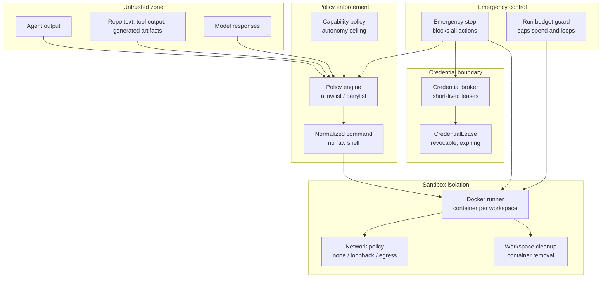

# Security

Conveyor runs AI coding agents that produce code, execute commands, and publish
effects. Security is not a perimeter added on top; it is woven through the
trust spine: every command is policy-checked before execution, every credential
is leased and revocable, every artifact is scanned for secrets, and a single
emergency stop can halt all work across the system.

## Trust boundaries

Conveyor separates untrusted agent output from host-enforced safety. The
boundaries are defense-in-depth layers, not advisory labels.



The key principle: repository text, issue content, test output, exemplars,
prior model prose, and generated content are **untrusted data** (ADR-07). They
never become policy, commands, or authority merely because they appear in a
prompt, transcript, or model response. Enforcement happens through host
controls: sandbox, mount, network, credential, process, and syscall policy.

## Command policy

The policy engine in `lib/conveyor/policy/engine.ex` evaluates every command
before execution. It produces a `Decision` struct with status `:allowed` or
`:blocked` and a stable reason code.

### Normalized commands

`lib/conveyor/policy/normalized_command.ex` enforces a canonical command shape.
Raw shell strings are rejected outright:

```elixir
def normalize!(command, _opts) when is_binary(command) do
  raise ArgumentError, "raw shell commands are not normalized"
end
```

A `NormalizedCommand` carries `executable`, `argv`, `cwd`, `env_keys`,
`network`, `write_roots`, `read_roots`, and `timeout_ms`. The normalizer
resolves symlinks and rejects paths that escape the workspace root. This
prevents shell injection and path traversal at the structural level.

### Allowlist and denylist

The engine checks four conditions in order:

1. **Env keys** must all appear in the policy's env allowlist
   (`lib/conveyor/policy/engine.ex` `env_allowed?/2`).
2. **Network mode** must be within the policy's network default
   (`network_allowed?/2`). A `none` policy only permits `:none`; a `loopback`
   policy permits `:none` or `:loopback`; an `egress` policy permits all three.
3. **Allowlist** must contain a matching command prefix
   (`allowlisted?/2`). Matching is exact or prefix-based: `git diff` matches
   `git diff --stat`.
4. **Denylist** must not contain a matching command prefix
   (`denylisted?/2`).

If any check fails, the command is blocked with a stable reason:
`:env_not_allowed`, `:network_not_allowed`, `:not_allowlisted`, or
`:denylisted`.

### Policy profiles

`lib/conveyor/policy/profiles.ex` loads TOML profile files from the policies
directory. Five profiles are required and validated as a complete set:

| Profile | Autonomy ceiling | Network | Purpose |
| --- | --- | --- | --- |
| `explore` | L0 | none | Read-only exploration, no writes |
| `implement` | L1 | none | Code generation and test execution |
| `verify` | L0 | none | Gate and verification checks |
| `release` | L0 | none | Release gating, future-gated by default |
| `maintenance` | L0 | none | Retention, GC, compaction |

Profile files live in `priv/conveyor/templates/policies/` as templates. Each
profile specifies `allowlist`, `denylist`, `env` policy, `network` default,
`budget` limits, and `autonomy_ceiling`.

The default denylist across all profiles blocks destructive commands: `rm -rf`,
`sudo`, `git reset --hard`, `git clean -fd`, `git push --force`,
`curl | sh`, `wget | sh`, `deploy`, `kubectl apply`, `terraform apply`. This
enforces design law 8: no dangerous commands by default.

### Env keys

Each profile declares an env allowlist under `[policy.env]`. The `explore`
profile allows no env keys. The `implement` profile allows `MIX_ENV` and
`PYTHONPATH`. All profiles set `deny_production_secrets = true`. The engine
checks that every env key requested by a command appears in the profile's
allowlist before execution.

### Network modes

`lib/conveyor/sandbox/network_policy.ex` defines three network modes:

- `none`: container runs with `--network none`, no network access at all
- `loopback`: container can reach localhost only
- `egress`: container can reach external hosts through an explicit proxy

All station types default to `:none`. Egress requires an explicit external
proxy network and raises if requested without one. The egress allowlist
validator (`validate_egress_allowlist!/1`) rejects any conductor or internal
host, including `localhost`, `host.docker.internal`, `db`, `postgres`,
`conductor`, and all private IP ranges (`10.`, `172.16.` through `172.31.`,
`192.168.`).

### Violation handling

When the policy engine blocks a command,
`lib/conveyor/policy/violation_handler.ex` records the violation as an
`Incident` resource, stops the affected `RunAttempt` (status `:failed`,
outcome `:policy_blocked`), transitions the `Slice` to `:policy_blocked` (or
`:failed` for critical severity), and writes a `policy.blocked` ledger event.
The violation is durable and queryable, not swallowed as operational noise.

### Run budget guard

`lib/conveyor/policy/run_budget_guard.ex` enforces per-run budget caps. It
tracks ten caps:

- `max_tool_calls`, `max_command_count`, `max_output_bytes`
- `max_repeated_command_count`, `max_same_file_rewrites`
- `max_no_diff_progress_ms`, `max_idle_ms`, `max_wall_clock_ms`
- `max_tokens`, `max_cost_cents`

When a cap is exceeded, the guard marks the budget `:exhausted`, fails the run
attempt with `failure_category: "budget_exhausted"`, transitions the slice to
`:needs_rework`, and writes a `budget.exhausted` ledger event. Budget
exhaustion is a fail-closed outcome.

## Credential handling

`lib/conveyor/credential_broker.ex` issues and revokes short-lived credential
leases. The broker never persists secret values.

### Lease lifecycle

A `CredentialLease` resource (`lib/conveyor/factory/credential_lease.ex`)
records the provider, env keys, scope, issued-at, expires-at, and status. The
status machine is: `:issued` -> `:active` -> `:revoked` | `:expired` |
`:invalidated`.

The broker's `issue!/3` function:

- Validates that all requested env keys are in the allowed set
  (`validate_env_keys!/2`).
- Creates a lease with a default TTL of 900 seconds (15 minutes).
- Returns an `IssuedLease` struct containing the lease record and a map of env
  values (taken from the provided env map, filtered to the requested keys).

Secret values are **not** stored in the `CredentialLease` record. The lease
records which keys were exposed and when, not their values.

### Revocation

Three revocation paths exist:

- `revoke!/2`: revokes a single lease by setting `status: :revoked` and
  recording `revoked_at`.
- `revoke_for_run_spec!/2`: revokes all active or issued leases for a run spec.
- `revoke_for_station_run!/2`: revokes all active or issued leases for a
  station run.
- `expire_stale!/1`: revokes any lease whose `expires_at` has passed, setting
  status to `:expired`.

Revocation is immediate and durable. A revoked lease cannot be reactivated.

## Sandbox isolation

`lib/conveyor/sandbox/docker_runner.ex` creates and manages Docker containers
for each workspace. The isolation model is one container per materialized
workspace.

### Container creation

The `materialize/2` function:

1. Archives the repo at the run spec's `base_commit` using `git archive`.
2. Extracts the archive into a workspace directory under the system temp dir.
3. Creates a Docker container with the workspace mounted at `/workspace`
   (read-write) and `.conveyor/` mounted read-only.
4. Records the workspace as a `WorkspaceMaterialization` resource with
   `head_tree_sha256`, `cleanup_policy`, and `cleanup_status`.

The read-only `.conveyor/` mount prevents agents from modifying their own
policy configuration or contract files at runtime.

### Command execution

`exec/3` runs a `NormalizedCommand` inside the container using
`docker exec`. It passes only the env keys declared in the command through
`--env` flags. The working directory is resolved relative to the workspace
mount and validated to stay inside it.

### Workspace cleanup

`lib/conveyor/sandbox/workspace_cleanup.ex` enforces cleanup policies after a
run completes:

- `:delete` (default): removes the container and deletes the workspace
  directory.
- `:preserve_on_failure`: preserves the workspace if the run failed.
- `:preserve_always`: preserves the workspace for debugging.

Cleanup removes the Docker container with `docker rm -f` and deletes the
workspace path with `File.rm_rf/1`. The cleanup status (`:deleted`,
`:preserved`, `:failed`) is recorded on the `WorkspaceMaterialization` record.

### Network policy enforcement

`lib/conveyor/sandbox/policy_executor.ex` ties the policy engine to the Docker
runner. It calls `ToolExecutor.execute!/3` with a runner closure that delegates
to `DockerRunner.exec/3`. The policy engine's decision is enforced before the
command reaches the container.

## Evidence redaction

`lib/conveyor/security/redactor.ex` scans and redacts secrets from evidence
artifacts before they are sealed or projected. The redactor records digest
provenance, not matched secret values. Findings identify the source,
classifier, and match digest; raw bytes are never copied into findings.

### Secret patterns

Five pattern classifiers are built in:

| Classifier | Pattern |
| --- | --- |
| `openai_api_key` | `sk-[A-Za-z0-9][A-Za-z0-9_-]{8,}` |
| `github_token` | `gh[pousr]_[A-Za-z0-9_]{16,}` |
| `aws_access_key_id` | `(AKIA\|ASIA)[0-9A-Z]{16}` |
| `private_key` | PEM private key blocks |
| `secret_assignment` | `KEY=...`, `TOKEN=...`, `SECRET=...`, `PASSWORD=...` |

### Redaction policies

Two policies are supported:

- `:redact` (default): replaces matched secrets with
  `[REDACTED:<kind>:<sha256-prefix>]` tokens. Findings are severity `warning`.
  The redacted content is returned with sensitivity `:redacted`.
- `:block`: does not redact; instead quarantines the content with sensitivity
  `:quarantined` and `blocked?: true`. Findings are severity `blocking`.

The `redact!/2` function computes both `raw_sha256` and `redacted_sha256` so
the original and redacted artifacts are content-addressed. Overlapping matches
are resolved by preferring the earliest, longest match.

### Pre-seal scanning

ADR-10 requires redaction and sensitivity scanning to run before event or
cassette sealing. This prevents raw provider output, secrets,
restricted-evaluation data, or sensitive internal identifiers from entering
reusable archives. The redactor is invoked at the gate stage level by
`lib/conveyor/gate/stages/secret_safety.ex`.

## Emergency stop

`lib/conveyor/emergency_stop.ex` implements the emergency stop mechanism from
ADR-11. An engaged stop blocks seven action types:

```elixir
@blocked_actions MapSet.new([
  :run_attempt,
  :planning_run,
  :provider_call,
  :tool_call,
  :claim_publish,
  :effect,
  :budget_reservation
])
```

### Engage

`engage/3` creates a stop state with `scope` (`:system` or `:project`),
`scope_id`, `status: :engaged`, `actor`, `reason`, `trace_id`, and
`engaged_at`. A system-level stop blocks all projects; a project-level stop
blocks one project.

### Block check

`blocks?/2` returns `true` if the stop is engaged and the requested action is
in the blocked set. This check runs before queue start, before provider or tool
invocation, and before claim or effect publication.

### Clear

`clear/2` requires a `human_decision_id`. A `HumanDecision` is mandatory to
resume; no automated process can clear an emergency stop. The cleared state
records `cleared_by`, `human_decision_id`, and `cleared_at`.

### Record projection

`to_record/1` projects the in-memory stop state onto a
`conveyor.emergency_stop_state@1` schema-conformant record with string enums
and ISO 8601 timestamps for persistence and wire transmission.

## Capability policy

`lib/conveyor/agent_runner/capability_policy.ex` derives effective capabilities
from claims and policy inputs. The adapter name is recorded as evidence context
only; capability decisions come from declared, probed, and observed claim
agreement, health, policy, and a valid admission permit.

### Autonomy levels

Autonomy levels range from L0 to L4:

| Level | Meaning |
| --- | --- |
| L0 | No autonomy, human-in-the-loop required |
| L1 | Supervised execution within locked contract |
| L2 | Autonomous within a single slice |
| L3 | Autonomous across slices in an epic |
| L4 | Fully autonomous plan execution |

### Capability derivation

The `derive!/3` function groups claims by capability key and evaluates each
candidate against three sources: `declared`, `probed`, and `observed`. A
capability is effective only if:

- All three sources are present.
- The policy allows the capability.
- All sources agree on the value.

Missing sources, policy exclusion, or value mismatch exclude the capability
with an explicit reason (`missing_declared_claim`, `policy_excluded`,
`claim_value_mismatch`).

### Autonomy ceiling

`max_autonomy/2` computes the effective autonomy level as the minimum of three
inputs: the adapter's capability ceiling, the policy's `max_autonomy`, and the
admission permit's `max_autonomy`. If the permit is invalid, the result is
`L0`. This is a fail-closed design: any invalid permit drops the agent to
manual.

If adapter health is open (degraded), all effective capabilities are cleared
and `adapter_health:open` is recorded as an exclusion.

## The 10 design laws as safety invariants

`lib/conveyor/design_laws.ex` registers ten executable design laws. Each law is
tied to the modules that enforce it and has an invariant test.

| Law | Statement | Enforced by |
| --- | --- | --- |
| 1 | No task without acceptance criteria | `Conveyor.PlanAuditor`, `Conveyor.Readiness` |
| 2 | No implementation without a locked contract | `Conveyor.Readiness`, `Conveyor.Factory.ContractLock` |
| 3 | No completion without evidence | `Conveyor.ToolExecutor`, `Conveyor.EvidenceRecorder` |
| 4 | No authority without measured trust | `Conveyor.AgentRunner`, `Conveyor.AgentRunner.AgentProfile` |
| 5 | No hidden state | `Conveyor.SliceLifecycle`, `Conveyor.Ledger` |
| 6 | No shared-trunk chaos | `Conveyor.Sandbox.DockerRunner`, `Conveyor.Factory.WorkspaceMaterialization` |
| 7 | No source mutation by context tools | `Conveyor.ContextScout`, `Conveyor.Factory.ContextPack` |
| 8 | No dangerous commands by default | `Conveyor.Policy.Engine`, `Conveyor.ToolExecutor` |
| 9 | No orphan requirements and no orphan slices | `Conveyor.Traceability`, `Conveyor.PlanAuditor` |
| 10 | No bespoke tool empire | `Conveyor.ToolMatrix`, `Conveyor.Sandbox.DockerRunner`, `Conveyor.AgentRunner` |

These laws are not prose guidelines. Each has an invariant test
(`Conveyor.DesignLawsInvariantTest`) that must pass for qualification. Law 8
(dangerous commands) is the one most directly visible in the policy engine's
denylist and the normalized command's rejection of raw shell strings.

## Gate safety stages

The gate runs a sequence of stages, each producing a `StageResult` with
`status`, `findings`, and `evidence_refs`. Three stages are safety-critical.

### workspace_integrity (stage 1)

`lib/conveyor/gate/stages/workspace_integrity.ex` verifies the workspace before
semantic checks. It blocks on:

- `base_commit_mismatch`: PatchSet base commit differs from RunSpec or
  RunAttempt.
- `patch_apply_failed`: PatchSet does not apply cleanly to a fresh checkout.
- `locked_path_touched`: PatchSet weakens or edits locked or protected paths.
- `missing_head_tree_sha256`: No head tree digest was recorded.

The output digest is the `head_tree_sha256`, anchoring all downstream stages to
a specific workspace tree.

### policy_compliance (stage 4)

`lib/conveyor/gate/stages/policy_compliance.ex` verifies that command-policy
records are clean and protected policy files were not modified. It blocks on:

- `missing_patch_set`: No PatchSet provided for compliance checking.
- `policy_file_change`: The patch touches files matching policy path globs:
  `policies/**`, `.conveyor/policies/**`, `config/policies/**`,
  `priv/conveyor/templates/policies/**`, `lib/conveyor/policy/**`,
  `lib/conveyor/factory/policy.ex`.
- `policy_invocation_blocked`: A `ToolInvocation` records a blocked or denied
  policy decision.

This stage prevents an agent from silently editing the policy engine or policy
profiles to weaken its own constraints.

### secret_safety (stage 5)

`lib/conveyor/gate/stages/secret_safety.ex` verifies that gate-visible
artifacts contain no unredacted secrets. It aggregates findings from:

- Pre-existing security findings and evidence risks.
- Artifact redaction findings (sensitivity `:quarantined` is blocking).
- Live content scans via `Redactor.scan/2`.

Findings are normalized to category `unredacted_secret`. A finding is blocking
if its severity is `blocking`, its policy is `:block`, or redacted
continuation is not allowed. The stage fails if any finding is blocking.

## Trust bundles

`lib/conveyor/trust_bundle.ex` builds DSSE-shaped trust bundles for gate
verdicts. A trust bundle wraps the gate result, run spec digest, provenance
edges, and verdict in a DSSE envelope with a `signature_status` field. In local
development, the signature status is `unsigned_local`; team-server and
release-grant profiles require stronger authentication (ADR-05).

The bundle is stored as an `Artifact` with `kind: "trust-bundle"` and media
type `application/vnd.dsse.envelope+json`. The `bundle_sha256` provides
content-addressed integrity for the entire envelope.
