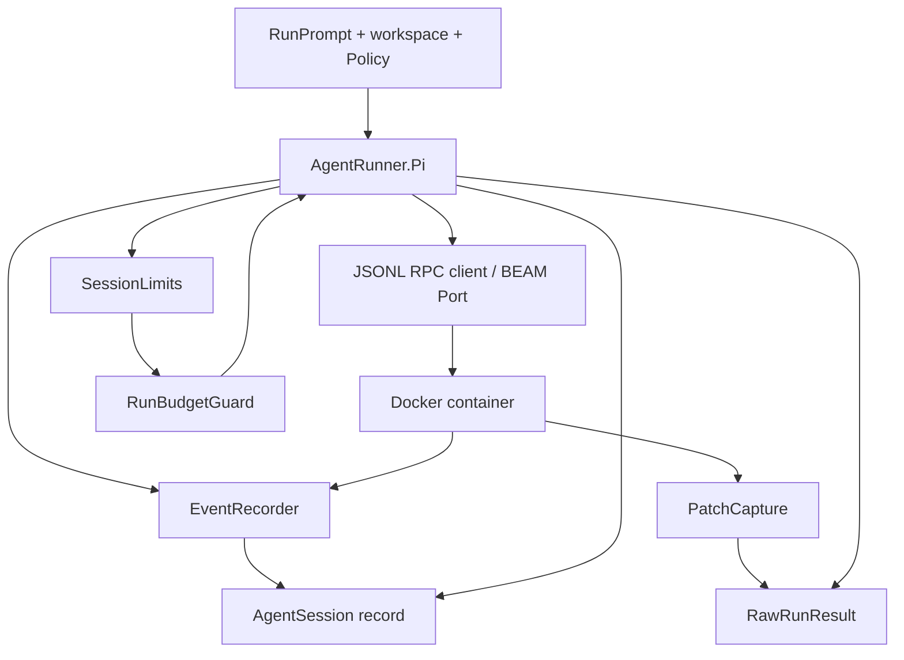

# Agent runner

The agent runner system in `lib/conveyor/agent_runner/` is how Conveyor
launches, monitors, captures, and cancels coding agents in isolated containers.
Every adapter implements the `Conveyor.AgentRunner` behaviour, which defines a
strict contract for capabilities, execution, and cancellation. The default
production adapter is Pi, which drives agents through Docker, JSONL RPC,
heartbeats, and streaming events. Tests and hermetic demos use deterministic
Fake and MockDegraded adapters.

## AgentRunner behaviour

`lib/conveyor/agent_runner.ex` defines the behaviour every coding-agent backend
implements. Three callbacks are required:

- **`capabilities/0`** — returns a `Capabilities` struct declaring what the
  adapter can and cannot do.
- **`run/4`** — takes a `RunPrompt`, workspace, `Policy`, and opts, returns
  `{:ok, RawRunResult.t()}` or `{:error, term()}`.
- **`cancel/1`** — cancels a session by id.

The facade `run/5` validates that adapter results are properly typed
`RawRunResult` structs, and `agent_profile_snapshot/2` builds an `AgentProfile`
snapshot from an adapter's declared capabilities.

## Agent execution flow

## Pi adapter

`lib/conveyor/agent_runner/pi.ex` is the default runtime adapter. It opens Pi's
JSONL RPC mode through a BEAM Port, though tests can inject an `:rpc_client`
function with the same event callback contract. The adapter supports two
profiles:

- **`pi_host_controlled_tools`** — the host enforces pre-exec command policy.
- **`pi_in_container_observe_only`** — the adapter observes commands inside the
  container.

The `run/4` function creates a session, builds an RPC request, streams events
through the recorder, captures the patch set on completion, records terminal
events, and updates the `AgentSession` record. If a session limit is exceeded
(wall clock, idle, output bytes), the adapter catches the
`agent_session_stopped` throw, records budget exhaustion, cancels the session,
and returns an error finding.

Cancellation is profile-aware: the adapter checks the profile's cancellation
capability (`none`, `best_effort`, `hard`) and records cancellation events. The
`cancel/2` function also handles terminal event recording and session cleanup.

## Capabilities

`lib/conveyor/agent_runner/capabilities.ex` declares adapter capabilities used
to cap autonomy explicitly. A `Capabilities` struct covers streaming events,
pre-exec command policy, cancellation mode, diff capture mode, cost reporting,
MCP support, slash commands, structured output, session resume, and known
limitations.

The `autonomy_ceiling/1` function derives the maximum autonomy level from
capabilities: L1 if no pre-exec policy, L2 if streaming events and structured
output and git diff capture, L3 if additionally hard cancellation and session
resume. Known limitations are inferred from missing capabilities and merged with
declared ones.

## CapabilityPolicy

`lib/conveyor/agent_runner/capability_policy.ex` derives effective adapter
capabilities from declared, probed, and observed claims. The adapter name is
recorded as evidence context only; capability decisions come from claim
agreement, health state, policy, and a valid admission permit. When health is
open (degraded), no capabilities are effective. The `max_autonomy/2` function
takes the minimum of the adapter capability ceiling, policy level, and permit
level, returning L0 if no valid admission permit exists.

## EventRecorder

`lib/conveyor/agent_runner/event_recorder.ex` records normalized AgentRunner
events into the append-only ledger. It supports 14 event types: session started,
message delta/completed, command requested/policy decision/started/completed,
file change observed, heartbeat, final response, cancel requested/acknowledged,
adapter error, and session completed. Events are keyed by an idempotency key
derived from the agent session id and sequence number, with monotonic sequence
enforcement.

## PatchCapture

`lib/conveyor/agent_runner/patch_capture.ex` captures an agent-produced git diff
as a Conveyor `PatchSet`. It includes untracked files, runs
`git diff --binary --find-renames` against the base commit, writes the diff to
the blob store, parses name-status and numstat for changed/added/deleted/renamed
files and line counts, checks whether locked paths were touched, and verifies
the patch applies cleanly to a fresh checkout.

## SessionLimits

`lib/conveyor/agent_runner/session_limits.ex` tracks live agent session
wall-clock, idle, and output-size limits. The `observe/2` function takes each
event and returns `{:ok, updated_limits}` or `{:halt, finding, measurements}`
when a limit is exceeded. Findings carry the exceeded cap, limit value, and
measurements, which the Pi adapter uses to trigger budget exhaustion handling.

## AgentProfile

`lib/conveyor/agent_runner/agent_profile.ex` is a snapshot of an agent adapter
and its capability-derived autonomy ceiling. It carries the adapter name,
optional model, `Capabilities` struct, autonomy ceiling string, and known
limitations. The `to_map/1` function produces a JSON-serializable map used in
run specs and evidence.

## Fake and MockDegraded adapters

`lib/conveyor/agent_runner/fake.ex` is the deterministic adapter used by default
tests and hermetic demos. It declares full capabilities (streaming events,
pre-exec policy, hard cancellation, git diff, structured output, session resume)
and writes a workspace change based on the run prompt, recording session events
and capturing a real patch set.

`lib/conveyor/agent_runner/mock_degraded.ex` is a deterministic degraded adapter
for adapter-qualification tests. It never calls a provider. Each scenario
represents a capability mismatch or bad event stream (observe-only without
pre-exec policy, absent cancellation, delayed cancellation, no diff capture, no
cost reporting, malformed events, out-of-order events, duplicate events) that
the conductor must classify predictably as `degraded_ok` or `fail_closed`.

## Key source files

| File                                             | Purpose                                                                   |
| ------------------------------------------------ | ------------------------------------------------------------------------- |
| `lib/conveyor/agent_runner.ex`                   | `AgentRunner` behaviour with capabilities, run, and cancel callbacks.     |
| `lib/conveyor/agent_runner/pi.ex`                | Pi adapter: Docker, JSONL RPC, heartbeat, events, cancellation.           |
| `lib/conveyor/agent_runner/capabilities.ex`      | Declared adapter capabilities and autonomy ceiling derivation.            |
| `lib/conveyor/agent_runner/capability_policy.ex` | Effective capability derivation from claims, health, policy, and permits. |
| `lib/conveyor/agent_runner/event_recorder.ex`    | Records normalized agent events into the append-only ledger.              |
| `lib/conveyor/agent_runner/patch_capture.ex`     | Captures agent-produced git diffs as PatchSet records.                    |
| `lib/conveyor/agent_runner/session_limits.ex`    | Tracks wall-clock, idle, and output-size session limits.                  |
| `lib/conveyor/agent_runner/agent_profile.ex`     | Snapshot of adapter and capability-derived autonomy ceiling.              |
| `lib/conveyor/agent_runner/fake.ex`              | Deterministic adapter for tests and hermetic demos.                       |
| `lib/conveyor/agent_runner/mock_degraded.ex`     | Deterministic degraded adapter for adapter-qualification tests.           |
| `lib/conveyor/agent_runner/raw_run_result.ex`    | Raw run result struct returned by adapter `run/4`.                        |

## Related pages

- [Sandbox](sandbox.md) — Docker container lifecycle and network isolation
- [Policy engine](policy-engine.md) — command normalization and budget
  enforcement
- [Evidence recording](evidence-recording.md) — how agent patches become
  evidence
- [Architecture](../overview/architecture.md) — station pipeline and Oban
  workers
