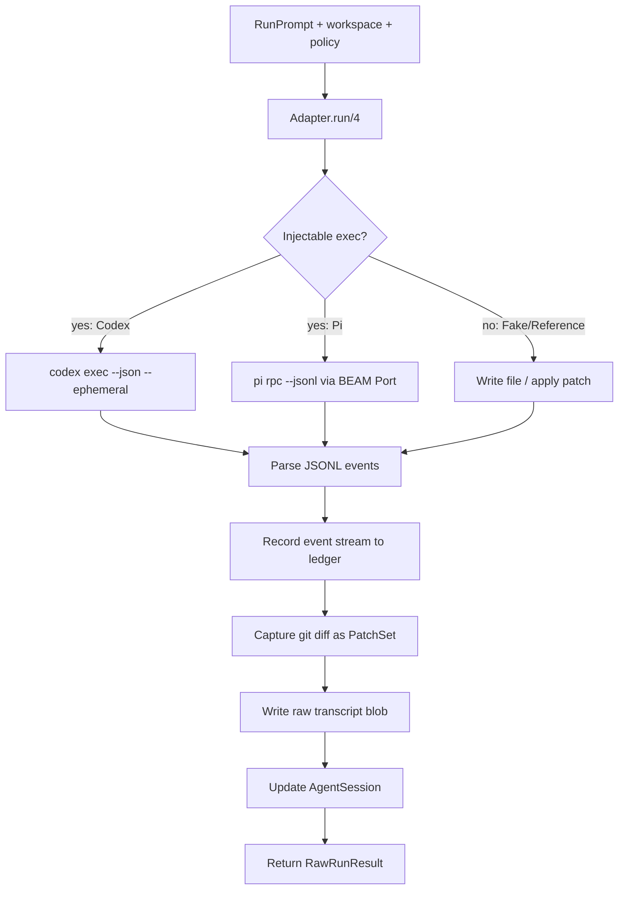

# Agent runner

The agent runner abstracts coding-agent backends behind a single behaviour so
the conductor can drive Codex, Pi, a deterministic fake, a reference solution,
or a degraded mock through one interface. Each adapter declares its capabilities
(streaming events, pre-exec policy, cancellation, diff capture, cost reporting,
session resume), which the system uses to cap the adapter's autonomy ceiling.
Shared scaffolding records a monotonic event stream into the ledger, captures
the agent's git diff as a `PatchSet`, and persists a raw transcript blob. Live
runs are bounded by a watchdog timeout and per-session resource limits.

## Directory layout

The agent runner lives under `lib/conveyor/agent_runner/` with the behaviour in
`lib/conveyor/agent_runner.ex`:

```
lib/conveyor/
├── agent_runner.ex                    # Behaviour and facade
└── agent_runner/
    ├── codex.ex                       # OpenAI Codex CLI adapter
    ├── pi.ex                          # Pi RPC adapter (two profiles)
    ├── fake.ex                        # Deterministic fake for tests and demos
    ├── mock_degraded.ex               # Degraded adapter for qualification tests
    ├── reference_solution.ex          # $0-LLM agent that applies a fixed patch
    ├── capabilities.ex                # Declared adapter capabilities struct
    ├── capability_policy.ex           # Derives effective capabilities from claims
    ├── agent_profile.ex               # Snapshot of adapter + autonomy ceiling
    ├── event_recorder.ex              # Monotonic event stream into the ledger
    ├── patch_capture.ex               # Captures agent diff as a PatchSet
    ├── session_limits.ex              # Live wall-clock, idle, and output limits
    └── raw_run_result.ex              # Adapter-reported run output struct
```

## Key abstractions

| Abstraction | Location | Role |
| --- | --- | --- |
| `Conveyor.AgentRunner` | `lib/conveyor/agent_runner.ex` | Behaviour every backend implements: `capabilities/0`, `run/4`, `cancel/1`. Facade delegates and validates result shape. |
| `Conveyor.AgentRunner.RawRunResult` | `lib/conveyor/agent_runner/raw_run_result.ex` | Adapter-reported output: summary, messages, tool calls, attempted commands, diff ref, metadata. Before independent verification. |
| `Conveyor.AgentRunner.Capabilities` | `lib/conveyor/agent_runner/capabilities.ex` | Declared capability struct: streaming events, pre-exec policy, cancellation, diff capture, cost reporting, MCP, slash commands, structured output, session resume, known limitations. Derives autonomy ceiling (L1/L2/L3). |
| `Conveyor.AgentRunner.CapabilityPolicy` | `lib/conveyor/agent_runner/capability_policy.ex` | Derives effective capabilities from declared/probed/observed claim agreement, health, policy, and an admission permit. Computes max autonomy as the minimum of adapter ceiling, policy level, and permit level. |
| `Conveyor.AgentRunner.AgentProfile` | `lib/conveyor/agent_runner/agent_profile.ex` | Snapshot of an adapter and its capability-derived autonomy ceiling. Serializable to a map for persistence. |
| `Conveyor.AgentRunner.EventRecorder` | `lib/conveyor/agent_runner/event_recorder.ex` | Records normalized agent events into the append-only ledger with monotonic sequence numbers and idempotency keys. |
| `Conveyor.AgentRunner.PatchCapture` | `lib/conveyor/agent_runner/patch_capture.ex` | Captures an agent-produced git diff as a `PatchSet` with changed files, line counts, rename detection, locked-path checks, and clean-apply verification. |
| `Conveyor.AgentRunner.SessionLimits` | `lib/conveyor/agent_runner/session_limits.ex` | Tracks live wall-clock, idle, and output-size limits. Returns `{:halt, finding, measurements}` when a limit is exceeded. |
| `Conveyor.AgentRunner.Codex` | `lib/conveyor/agent_runner/codex.ex` | Real adapter driving the OpenAI Codex CLI in non-interactive `codex exec` mode. Parses JSONL for usage, final message, and commands. Watchdog-bounded. |
| `Conveyor.AgentRunner.Pi` | `lib/conveyor/agent_runner/pi.ex` | Pi adapter with two profiles: `pi_host_controlled_tools` and `pi_in_container_observe_only`. Drives Pi's JSONL RPC mode through a BEAM Port. Budget-aware. |
| `Conveyor.AgentRunner.Fake` | `lib/conveyor/agent_runner/fake.ex` | Deterministic adapter for tests and hermetic demos. Writes a file, emits the standard event stream, captures the diff. |
| `Conveyor.AgentRunner.MockDegraded` | `lib/conveyor/agent_runner/mock_degraded.ex` | Degraded adapter for adapter-qualification tests. 12 scenarios covering capability mismatches, event integrity, capture degradation, and runtime failures. |
| `Conveyor.AgentRunner.ReferenceSolution` | `lib/conveyor/agent_runner/reference_solution.ex` | $0-LLM agent that applies a fixed reference patch (known-good or mutant) to the workspace. Lets the full pipeline run with zero spend. |

## How it works

### Behaviour and facade

Every adapter implements three callbacks: `capabilities/0`, `run/4`, and
`cancel/1` (or `cancel/2`). The facade `Conveyor.AgentRunner.run/5` validates
that the adapter returns `{:ok, %RawRunResult{}}` or `{:error, reason}` and
rejects any other shape. `cancel/3` handles adapters that export either arity.



### Capabilities and autonomy

`Capabilities` is the struct every adapter returns from `capabilities/0`. It
carries booleans (streaming events, pre-exec policy, structured output, session
resume, MCP, slash commands) and enums (cancellation: `:none` / `:best_effort`
/ `:hard`, diff capture: `:git_diff` / `:patch_file` / `:adapter_reported`,
cost reporting: `:none` / `:estimated` / `:provider_reported`). The
`autonomy_ceiling/1` function derives L1 (no pre-exec policy), L2 (streaming +
structured + git diff), or L3 (L2 plus hard cancellation and session resume).
Inferred limitations are added automatically from missing capabilities.

`CapabilityPolicy.derive!/3` goes further: it groups claims by capability key
across three sources (declared, probed, observed), requires all three to agree
on the value, checks policy allowlists and adapter health, and produces an
effective capability set with a content-addressed digest. `max_autonomy/2` takes
the minimum of the adapter ceiling, the policy level, and the admission permit
level, returning `"L0"` if the permit is invalid.

### Event recording

`EventRecorder.record!/2` writes each agent event as a `LedgerEvent` with type
`"agent.event"`. Events carry a monotonically increasing `sequence_no` scoped to
the agent session. The idempotency key is
`agent-event:<agent_session_id>:<sequence_no>`, so replays are safe. The
recorder validates that the sequence is strictly greater than the previous max,
rejecting non-monotonic or duplicate events. Raw event payloads are written to
`BlobStore` and the ref is stored in the envelope. The 14 event types range
from `session_started` through `command_requested`, `command_policy_decision`,
`heartbeat`, `cancel_requested`, `adapter_error`, to `session_completed`.

### Patch capture

`PatchCapture.capture!/2` runs after the agent finishes. It stages untracked
files with `git add --intent-to-add` so newly created files appear in the diff,
then runs `git diff --binary --find-renames` against the base commit. The diff
is written to `BlobStore` and a `PatchSet` record is created with changed
files, added/deleted/renamed file lists, line counts, a
`touches_locked_paths` flag (checked against glob, directory, and exact-path
locked-path patterns), and an `applies_cleanly` flag (verified by creating a
temporary git worktree at the base commit and running `git apply --check`).

### Session limits

`SessionLimits.observe/2` is called on each event during a Pi session. It
tracks wall-clock time since session start, idle time since last activity, and
cumulative output bytes. When any limit is exceeded it returns
`{:halt, finding, measurements}` with a blocking finding naming the exceeded
cap. The Pi adapter catches this, records budget exhaustion via
`RunBudgetGuard.record!/3`, fails the agent session, and cancels the session.

### Codex adapter

`Codex` drives the OpenAI Codex CLI via `codex exec --cd <ws> --sandbox
workspace-write --json --ephemeral --skip-git-repo-check`. Auth is the user's
ChatGPT/Codex subscription (no API key). The JSONL stream is parsed for
`turn.completed.usage` (token counts) and `agent_message` (final text). Cost is
estimated from configurable per-million-token rates. A watchdog `Task` bounds
the blocking shell-out (default 15 minutes); on timeout the task is brutally
killed and the run reports exit code 124 so the slice fails and parks rather
than hanging the plan. The `codex_exec` function is injectable so tests stay
deterministic and $0.

### Pi adapter

`Pi` drives Pi's JSONL RPC mode through a BEAM Port. It supports two profiles:
`pi_host_controlled_tools` (pre-exec policy enabled, best-effort cancellation)
and `pi_in_container_observe_only` (no pre-exec policy, observe-only). The RPC
client is injectable (`:rpc_client`) so tests can exercise the full adapter
logic without live provider calls. The adapter passes a policy snapshot to the
RPC request, records events through a shared recorder callback, and integrates
with `SessionLimits` and `RunBudgetGuard` for live budget enforcement.

### Deterministic adapters

`Fake` writes a file to the workspace and emits the standard event stream.
`ReferenceSolution` applies a fixed reference patch (with `-p3`) instead,
optionally in reverse (`-R`) to model an agent undoing a mutation. Both produce
the identical event sequence and `RawRunResult` shape so they pass adapter
conformance checks. `MockDegraded` never calls a provider; its 12 scenarios
represent capability mismatches and bad event streams that the conductor must
classify predictably, returning either `:degraded_ok` or `:fail_closed`.

## Integration points

- **Station pipeline** — the attempt loop and Oban workers call
  `AgentRunner.run/5` with the selected adapter module. See
  [Station pipeline](../features/station-pipeline.md).
- **Policy engine** — adapters receive a `Policy` struct and pass a snapshot to
  the provider. `CapabilityPolicy` checks policy allowlists when deriving
  effective capabilities. See [Policy engine](policy-engine.md).
- **Run budget guard** — the Pi adapter calls `RunBudgetGuard.record!/3` when
  `SessionLimits` halts a session, recording the exceeded cap and stopping the
  run. See [Policy engine](policy-engine.md).
- **Evidence recording** — the `diff_ref` in `RawRunResult` feeds the
  `PatchSet` that `Recorder.record!/5` reads to produce the evidence packet.
  See [Evidence recording](evidence-recording.md).
- **Artifact projection** — raw transcripts and diffs are written to `BlobStore`
  and their refs are stored in `AgentSession` and `RawRunResult` metadata. See
  [Artifact projection](artifact-projection.md).
- **Ledger** — `EventRecorder` writes all agent events as `LedgerEvent` records
  with type `"agent.event"`, making the full agent session part of the durable
  run story.
- **AgentSession resource** (`lib/conveyor/factory/agent_session.ex`) — each
  adapter updates the session with status, adapter session id, completion time,
  raw result ref, token count, and cost estimate.
- **Sandbox** — the workspace the agent runs in is materialized by the sandbox
  runner. See [Sandbox](sandbox.md).

## Entry points for modification

- **Add a new adapter** — implement the `Conveyor.AgentRunner` behaviour in a
  new module under `lib/conveyor/agent_runner/`. Return a `Capabilities` struct
  from `capabilities/0`, a `RawRunResult` from `run/4`, and handle `cancel/1`.
  Use the shared `EventRecorder`, `PatchCapture`, and `BlobStore` scaffolding
  that the existing adapters use.
- **Change autonomy ceiling rules** — `autonomy_ceiling/1` and `l2_ready?/1` /
  `l3_ready?/1` in `lib/conveyor/agent_runner/capabilities.ex` are the
  thresholds. `CapabilityPolicy.max_autonomy/2` takes the minimum across adapter,
  policy, and permit.
- **Add an event type** — add the atom to `@event_types` in
  `lib/conveyor/agent_runner/event_recorder.ex`. The recorder validates against
  this list.
- **Change patch capture** — `capture!/2` in
  `lib/conveyor/agent_runner/patch_capture.ex` is the single capture path.
  Locked-path matching (`path_matches?/2`) and clean-apply verification
  (`applies_cleanly?/3`) are the policy-relevant pieces.
- **Change session limits** — `observe/2` in
  `lib/conveyor/agent_runner/session_limits.ex` is where wall-clock, idle, and
  output limits are checked. Add a new cap field to the struct and a new clause
  to the `cond`.
- **Change Codex exec args** — `default_exec/3` and `model_args/1` /
  `reasoning_args/1` in `lib/conveyor/agent_runner/codex.ex`. The watchdog
  timeout is `@default_agent_timeout_ms` and the timeout exit code is
  `@agent_timeout_exit_code`.
- **Add a degraded scenario** — add a map to `@cases` in
  `lib/conveyor/agent_runner/mock_degraded.ex` with a `branch`, `category`,
  `expected` (`:fail_closed` or `:degraded_ok`), and `reason`.

## Key source files

| File | Role |
| --- | --- |
| `lib/conveyor/agent_runner.ex` | Behaviour and facade. |
| `lib/conveyor/agent_runner/raw_run_result.ex` | Adapter-reported run output struct. |
| `lib/conveyor/agent_runner/capabilities.ex` | Capability struct and autonomy ceiling derivation. |
| `lib/conveyor/agent_runner/capability_policy.ex` | Effective capability derivation from claims, health, policy, permit. |
| `lib/conveyor/agent_runner/agent_profile.ex` | Adapter + autonomy ceiling snapshot. |
| `lib/conveyor/agent_runner/event_recorder.ex` | Monotonic event stream into the ledger. |
| `lib/conveyor/agent_runner/patch_capture.ex` | Git diff capture as a PatchSet. |
| `lib/conveyor/agent_runner/session_limits.ex` | Live wall-clock, idle, output limits. |
| `lib/conveyor/agent_runner/codex.ex` | OpenAI Codex CLI adapter. |
| `lib/conveyor/agent_runner/pi.ex` | Pi RPC adapter (two profiles). |
| `lib/conveyor/agent_runner/fake.ex` | Deterministic fake adapter. |
| `lib/conveyor/agent_runner/mock_degraded.ex` | Degraded adapter for qualification tests. |
| `lib/conveyor/agent_runner/reference_solution.ex` | $0-LLM reference patch adapter. |

See also: [Policy engine](policy-engine.md), [Evidence recording](evidence-recording.md),
[Artifact projection](artifact-projection.md), [Sandbox](sandbox.md),
[Trust gate](gate.md), [Station pipeline](../features/station-pipeline.md).
