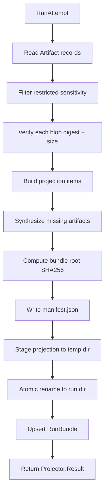

# Artifact projection

The artifact system stores generated artifacts in content-addressed blob storage
and projects read-only artifact trees from database metadata. Postgres remains
the source of truth; projector backends regenerate on-disk artifact trees from
`Artifact` records and blob refs so projection paths never become identity. A
separate `ArtifactStore` backend contract provides trust-domain-isolated
content-addressed storage with pluggable local and S3-compatible backends. Code
provenance edges link gate-verified code symbols to acceptance decisions so
invalidation can trace which claims a change affects.

## Directory layout

The artifact system lives under `lib/conveyor/artifacts/` with Ash resources in
`lib/conveyor/factory/`:

```
lib/conveyor/
├── artifacts/
│   ├── blob_store.ex                       # Local content-addressed blob storage
│   ├── projector.ex                        # Projector behaviour and facade
│   ├── projector/
│   │   └── local_disk.ex                   # Local-disk projector backend
│   ├── artifact_store.ex                   # ArtifactStore backend contract
│   └── artifact_store/
│       ├── address.ex                      # Trust-domain scoped address struct
│       ├── local_cas.ex                    # Local content-addressed store backend
│       └── s3_compatible.ex                # S3-compatible store backend
└── factory/
    ├── artifact.ex                         # Ash resource: artifact metadata
    └── code_provenance_edge.ex             # Ash resource: code symbol to claim provenance
```

## Key abstractions

| Abstraction | Location | Role |
| --- | --- | --- |
| `Conveyor.Artifacts.BlobStore` | `lib/conveyor/artifacts/blob_store.ex` | Local content-addressed blob storage. Writes, reads, and verifies SHA256-addressed blobs under `.conveyor/blobs/sha256/<shard>/<digest>`. |
| `Conveyor.Artifacts.BlobStore.Blob` | `lib/conveyor/artifacts/blob_store.ex` | Blob handle: ref (relative path), sha256, size, optional content. |
| `Conveyor.Artifacts.Projector` | `lib/conveyor/artifacts/projector.ex` | Behaviour and facade for regenerating run artifact projections from DB metadata and blobs. |
| `Conveyor.Artifacts.Projector.Result` | `lib/conveyor/artifacts/projector.ex` | Projection outcome: run attempt id, path, artifact count, manifest SHA256, bundle root SHA256. |
| `Conveyor.Artifacts.Projector.LocalDisk` | `lib/conveyor/artifacts/projector/local_disk.ex` | Local-disk backend. Verifies blob digests, synthesizes missing artifacts, writes a staged projection, and upserts a `RunBundle`. |
| `Conveyor.Artifacts.ArtifactStore` | `lib/conveyor/artifacts/artifact_store.ex` | Backend contract: `new`, `put!`, `get!`, `head!`, `copy!`, `secure_delete!`, `list_segments!`. |
| `Conveyor.Artifacts.ArtifactStore.Address` | `lib/conveyor/artifacts/artifact_store/address.ex` | Trust-domain scoped address: trust domain id, content digest, ciphertext digest, opaque storage key, encryption key ref, storage backend. |
| `Conveyor.Artifacts.ArtifactStore.LocalCAS` | `lib/conveyor/artifacts/artifact_store/local_cas.ex` | Local content-addressed store backend. Enforces trust-domain isolation on every read and write. |
| `Conveyor.Artifacts.ArtifactStore.S3Compatible` | `lib/conveyor/artifacts/artifact_store/s3_compatible.ex` | S3-compatible store backend. Uses S3 locator-shaped storage keys while content identity remains the digest. |
| `Conveyor.Factory.Artifact` | `lib/conveyor/factory/artifact.ex` | Ash resource: artifact metadata (kind, media type, projection path, blob ref, digests, sensitivity). |
| `Conveyor.Factory.CodeProvenanceEdge` | `lib/conveyor/factory/code_provenance_edge.ex` | Ash resource: gate-verified code symbol to claim to acceptance-decision provenance edge. |

## How it works

### Blob storage

`BlobStore` is the foundational content-addressed store. The on-disk layout is
`.conveyor/blobs/sha256/<2-char-shard>/<64-hex-digest>`. Blob refs are relative
paths under the blob root, so they can be persisted in database rows without
trusting projection paths as identity. Every `read!/2` re-computes the SHA256
and raises on mismatch, so corruption or tampering is detected on every read.
`verify!/4` also checks the expected size. The ref parser accepts three
shapes: `sha256/<shard>/<digest>`, `cas/<digest>`, and a bare digest, and
validates that the shard matches the first two hex characters of the digest.

### Artifact records

`Factory.Artifact` is the Postgres-backed metadata record. Each artifact has a
`kind` (evidence, manifest, diff, log, review, gate, pr_body, provenance,
retrospective), `media_type`, `projection_path`, `blob_ref`, `sha256`,
`raw_sha256`, `redacted_sha256`, `redaction_findings`, `size_bytes`,
`subject_kind`, `producer`, `schema_version`, and a `sensitivity` atom
(`:public`, `:internal`, `:sensitive`, `:redacted`, `:quarantined`). Two
identities enforce uniqueness: `(run_attempt_id, projection_path)` and
`(station_run_id, projection_path)`. The artifact record is the bridge between
the blob (content) and the projection (layout).

### Projection

`Projector.project_run!/2` is the facade. It resolves the configured backend
(default `LocalDisk`) and delegates. The backend reads all `Artifact` records
for the run attempt, filters out restricted-sensitivity artifacts (`:sensitive`
and `:quarantined`), verifies each blob's digest and size against the stored
values, then builds projection items.



`LocalDisk` synthesizes missing artifacts when a DB-stored artifact is absent:
`diff.patch`, `dossier.md`, `evidence.json`, `gate.json`, `review.json`,
`retrospective.json`, and `pr_body.md`. The synthesized evidence JSON includes
runtime versions (Elixir, OTP, Phoenix, Ash, Oban, sandbox runner, agent
adapter) so the projection is self-describing. The projection is written to a
staged temp directory and atomically renamed into place, so a partial write is
never visible. The `RunBundle` is upserted with the manifest SHA256 and bundle
root SHA256; if an existing bundle's checksums do not match the regenerated
projection, it raises rather than silently overwriting.

### ArtifactStore backends

`ArtifactStore` is a separate, more general backend contract than `BlobStore`.
It is trust-domain scoped: every `Address` carries a `trust_domain_id`, and
backends refuse to resolve an address whose trust domain does not match the
backend's. `LocalCAS` lays out blobs under
`<root>/<trust_domain_id>/sha256/<shard>/<digest>` and checks both the address
trust domain and the storage key prefix on every read. `S3Compatible` uses
S3 locator-shaped storage keys (`s3://<bucket>/<key>`) while content identity
remains the SHA256 digest. Both backends re-verify the digest on every `get!`
and `head!` call. `assert_backend!/1` validates that a module exports all seven
required callbacks before it is used.

### Code provenance edges

`CodeProvenanceEdge` links a gate-verified code symbol to a claim and
acceptance decision. Each edge records the `code_symbol`, `claim_pointer`,
`claim_origin`, `acceptance_criterion_id`, `decision` (`:passed` or `:failed`),
`patch_sha256`, `contract_lock_sha256`, `claim_set_digest`, and a content-
addressed `edge_sha256`. The `invalidation_policy` defaults to
`invalidate_on_change`. These edges are what the invalidation preview reducer
traverses to decide which claims must be regenerated when a code symbol changes
(see [Evidence recording](evidence-recording.md)).

## Integration points

- **Evidence recorder** (`lib/conveyor/evidence/recorder.ex`) — reads the patch
  diff from `BlobStore`, writes redacted artifacts through `BlobStore`, creates
  `Artifact` records, and calls `Projector.project_run!/2` to regenerate the
  run bundle. See [Evidence recording](evidence-recording.md).
- **Agent runner adapters** (`lib/conveyor/agent_runner/*.ex`) — write raw
  transcripts and captured diffs to `BlobStore`, storing the blob ref in the
  `RawRunResult` metadata and the `AgentSession` record. See
  [Agent runner](agent-runner.md).
- **PatchSetApplicator** (`lib/conveyor/evidence/patch_set_applicator.ex`) —
  reads the patch blob from `BlobStore` to replay a patch on a clean gate
  workspace.
- **RunBundle resource** (`lib/conveyor/factory/run_bundle.ex`) — the persisted
  projection manifest. The `LocalDisk` projector upserts it with checksums so
  projections are verifiable and idempotent.
- **Trust gate** (`lib/conveyor/gate/`) — the `run_check` stage validates
  artifact schemas, digests, and consistency. The `provenance_attestation`
  stage produces an in-toto/SLSA-shaped provenance artifact. See
  [Trust gate](gate.md).
- **Configuration** — `Application.get_env(:conveyor, :artifact_projector_backend)`
  selects the projector backend. The `ArtifactStore` backend is instantiated
  per use site with explicit `:root` and `:trust_domain_id` options.

## Entry points for modification

- **Add a projector backend** — implement the `@callback project_run!/2` from
  `Conveyor.Artifacts.Projector` in a new module, then set
  `artifact_projector_backend` in config or pass `:backend` in opts. The facade
  validates the callback is exported before delegating.
- **Change projected artifact kinds** — the `@manifest_entry_kinds` list and
  `manifest_kind/1` fallback in `lib/conveyor/artifacts/projector/local_disk.ex`
  control which kinds the manifest recognizes. The synthesized artifact set is
  built in `missing_synthesized_items/2` and `missing_pr_body_item/3`.
- **Add an ArtifactStore backend** — implement all seven callbacks from
  `Conveyor.Artifacts.ArtifactStore` in a new module. `assert_backend!/1` will
  validate it. The `Address` struct is shared across backends.
- **Change trust-domain isolation** — `ensure_trust_domain!/2` in
  `lib/conveyor/artifacts/artifact_store/local_cas.ex` and the bucket check in
  `s3_compatible.ex` are the enforcement points. Both must refuse cross-domain
  addresses.
- **Change blob layout** — `relative_path_for!/1` and `path_for!/2` in
  `lib/conveyor/artifacts/blob_store.ex` control the on-disk layout. The ref
  shape and shard validation must stay consistent with `digest_from_ref!/1`.
- **Add a provenance edge field** — `lib/conveyor/factory/code_provenance_edge.ex`
  and the corresponding migration. The `edge_sha256` identity ensures
  uniqueness; update the builder that creates edges to include the new field in
  the digest.

## Key source files

| File | Role |
| --- | --- |
| `lib/conveyor/artifacts/blob_store.ex` | Content-addressed blob storage with digest verification. |
| `lib/conveyor/artifacts/projector.ex` | Projector behaviour, facade, and `Result` struct. |
| `lib/conveyor/artifacts/projector/local_disk.ex` | Local-disk backend with staged atomic writes and synthesized artifacts. |
| `lib/conveyor/artifacts/artifact_store.ex` | ArtifactStore backend contract and validation. |
| `lib/conveyor/artifacts/artifact_store/address.ex` | Trust-domain scoped address struct. |
| `lib/conveyor/artifacts/artifact_store/local_cas.ex` | Local content-addressed store backend. |
| `lib/conveyor/artifacts/artifact_store/s3_compatible.ex` | S3-compatible store backend. |
| `lib/conveyor/factory/artifact.ex` | Ash resource for artifact metadata. |
| `lib/conveyor/factory/code_provenance_edge.ex` | Ash resource for code symbol to claim provenance edges. |

See also: [Evidence recording](evidence-recording.md), [Trust gate](gate.md),
[Agent runner](agent-runner.md).
