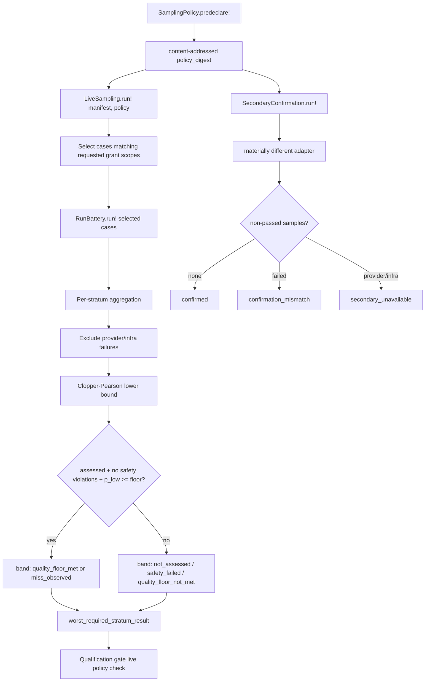

# Battery system

The battery system provides live sampling, measurement studies, and secondary
confirmation for trust calibration. It runs predeclared, content-addressed
sampling policies against live agent runs, gates stratum results on the
Beta-Binomial (Clopper-Pearson) lower confidence bound rather than the point
estimate, and keeps role-visible fixture data separate from scorer-only
material. The battery never decides grant issuance by itself; it records
observed misses as measurement data that the qualification gate reads.

## Directory layout

All battery modules live under `lib/conveyor/battery/`:

```text
lib/conveyor/battery/
├── sampling_policy.ex        # predeclared, content-addressed sampling policies
├── live_sampling.ex          # executes predeclared live samples for grant-scope strata
├── secondary_confirmation.ex # optional secondary live-adapter confirmation
├── measurement_study.ex      # controlled measurement-study reporter for ablations
├── fixture_boundary.ex       # separates role-visible fixture data from scorer-only material
├── trace_assertions.ex       # evaluates trace assertions against events and effect receipts
└── release_report.ex         # canonical P15-B5 release report projection
```

## Key abstractions

| Abstraction | Location | Role |
| --- | --- | --- |
| `Conveyor.Battery.SamplingPolicy` | `lib/conveyor/battery/sampling_policy.ex` | Builds predeclared, content-addressed `conveyor.sampling_policy@1` artifacts. Validates required fields and invariants (min <= max, sampling unit must be `repository_case_cluster`). |
| `Conveyor.Battery.LiveSampling` | `lib/conveyor/battery/live_sampling.ex` | Executes predeclared live samples for requested grant-scope strata. Preserves the frozen sampling policy digest, runs selected cases through `RunBattery`, and records observed misses as measurement data. |
| `Conveyor.Battery.SecondaryConfirmation` | `lib/conveyor/battery/secondary_confirmation.ex` | Optional secondary live-adapter confirmation. Non-gating: outages and mismatches are recorded without replacing the deterministic primary oracle. |
| `Conveyor.Battery.MeasurementStudy` | `lib/conveyor/battery/measurement_study.ex` | Controlled measurement-study reporter for ablations. Negative and null results are first-class retained evidence so ablations cannot be quietly cherry-picked. |
| `Conveyor.Battery.FixtureBoundary` | `lib/conveyor/battery/fixture_boundary.ex` | Splits a fixture into a role-safe case and a scorer-only sidecar. Scans role-visible data for scorer-only material (`secure-eval://` refs, restricted labels). |
| `Conveyor.Battery.TraceAssertions` | `lib/conveyor/battery/trace_assertions.ex` | Evaluates trace assertions (`never`, `eventually`, `always`, `bounded_count`) against canonical events and effect receipts. |
| `Conveyor.Battery.ReleaseReport` | `lib/conveyor/battery/release_report.ex` | Canonical `conveyor.battery_release_report@1` projection. Failed and excluded cases remain structured fields so summaries cannot hide canonical blockers. |

## How it works

The battery is a measurement surface that runs predeclared cases against live
agents and records the results as structured data. A sampling policy is
predeclared and content-addressed before any run. Live sampling selects the
cases matching the requested grant scopes, runs them through the existing
`RunBattery` job, and aggregates the results into stratum-level band statuses
gated on the Clopper-Pearson lower confidence bound. Secondary confirmation
adds an optional cross-adapter check. Measurement studies report ablation
results with negative and null results retained.



### Sampling policy

`SamplingPolicy.predeclare!/1` builds a `conveyor.sampling_policy@1` artifact.
It requires eleven fields: `method`, `min_samples`, `max_samples`,
`confidence`, `floor_p0`, `stopping_rule`, `sampling_unit`, `cluster_key`,
`max_samples_per_cluster`, `strata`, and `sequential_validity`. It enforces
that `sampling_unit` is `repository_case_cluster` and that `min_samples` does
not exceed `max_samples`. The policy is content-addressed with a
`policy_digest` computed over canonical JSON (sorted keys), so any change to
the policy is auditable.

### Live sampling

`LiveSampling.run!/3` selects the cases whose `grant_scope` matches the
requested grant scopes, runs them through `RunBattery.run!/2`, and aggregates
the results per stratum. For each stratum it computes:

- **sample_count** and **provider_or_infra_failure_count** — raw counts.
- **valid_sample_count** — excludes provider and infra failures, which are
  infrastructure noise, not quality verdicts (ADR-02).
- **safety_violation_count** — counts results with `:safety_invariant` or
  `:fixture` failure classes.
- **point_estimate** — `pass_count / valid_sample_count` when assessed.
- **p_low, p_high** — Clopper-Pearson interval at the policy's confidence level,
  computed via `Conveyor.Statistics.clopper_pearson_interval/3`.
- **quality_floor_met** — true only when assessed, no safety violations, and
  `p_low >= floor_p0`. The gate is on the lower confidence bound, not the point
  estimate, so the recorded confidence constrains the verdict and a small
  sample cannot overstate quality.
- **band_status** — one of `not_assessed`, `safety_failed`,
  `quality_floor_met`, `miss_observed`, `quality_floor_not_met`.

The run's `worst_required_stratum_result` is the most severe band status across
all strata, ordered by severity: `safety_failed` (4) > `not_assessed` (3) >
`quality_floor_not_met` (2) > `miss_observed` (1) > `quality_floor_met` (0).

### Secondary confirmation

`SecondaryConfirmation.run!/3` runs a materially different adapter against
representative cases. It validates that the secondary adapter differs from the
primary, reports any declared representative cases that are missing from the
manifest (never silently dropping them, per ADR-02), and classifies the result:

- **confirmed** — all samples passed.
- **confirmation_mismatch** — at least one sample failed.
- **secondary_unavailable** — all non-passed samples are provider/infra
  failures; the secondary path is degraded, not behaviorally mismatched.

The result is explicitly non-gating: `invalidates_core_build: false` and
`core_build_oracle: "deterministic_primary_unchanged"`. The secondary adapter
adds confidence that the abstraction behaves across a materially different
provider path, but it never replaces the deterministic primary oracle.

### Measurement study

`MeasurementStudy.run!/1` reports controlled ablation results against a frozen
input digest. Variants are measured along allowed dimensions (`adapter`,
`agents_md`, `prompt`, `scout`, `tutor`). Negative and null results are
first-class: `negative_result_count` and `null_result_count` are reported, and
every result carries `retention: "retained"` so ablations cannot be quietly
cherry-picked. The study is content-addressed with a `study_digest`.

### Fixture boundary

`FixtureBoundary.split!/1` splits a fixture into a role-safe case and a
scorer-only sidecar. The scorer-only sidecar gets a `secure_evaluation` storage
scope and a `restricted_evaluation` information label. `scan_role_visible/2`
walks the role-visible data and flags any `secure-eval://` references or
`restricted_evaluation` labels as findings. If the role-safe side contains
scorer-only material, `split!` raises.

### Trace assertions

`TraceAssertions.evaluate/2` evaluates assertions against a trace of events and
effect receipts. Each assertion specifies a source (`event` or
`effect_receipt`), a match (field path + expected value), and an operator:

| Operator | Passes when |
| --- | --- |
| `never` | No matching records exist. |
| `eventually` | At least one matching record exists. |
| `always` | All records match. |
| `bounded_count` | Match count is within `[min_count, max_count]`. |

An unknown operator fails that assertion cleanly rather than crashing the
evaluation. Each result carries the assertion id, result, observed count,
matching record ids, and a failure reason.

### Release report

`ReleaseReport.build/1` builds the canonical `conveyor.battery_release_report@1`
from a list of sources. Each source carries a summary (advisory text), failed
cases, and excluded cases. Failed and excluded cases are flattened into
structured top-level fields (`canonical_blockers`, `excluded_cases`) so a
prose summary cannot hide them.

## Integration points

- **Qualification** — the live sampling run's `worst_required_stratum_result`
  and `stratum_results` are read by the [Qualification system](qualification.md)
  gate as the live-policy finding source. The gate requires the worst result to
  be `quality_floor_met` or `miss_observed` for a grant candidate.
- **Cassettes** — the battery provides the deterministic primary oracle that
  the [Cassettes system](cassettes.md) replay engine builds on. Replay
  divergence is a trust signal in the [Trust gate](gate.md).
- **Trust gate** — the battery's live sampling feeds the live-sample component
  of the [Trust gate](gate.md) trust score. The deterministic primary oracle is
  unchanged by secondary confirmation.
- **Contract critic** — the battery's fixture boundary and trace assertions
  support the [Contract critic](contract-critic.md) challenge cases by keeping
  scorer-only material out of role-visible data.
- **Jobs** — `Conveyor.Jobs.RunBattery` is the Oban worker that executes the
  selected cases; both `LiveSampling` and `SecondaryConfirmation` delegate to
  it.

## Entry points for modification

- **Change sampling policy fields** — `@required_fields` and `validate!/1` in
  `lib/conveyor/battery/sampling_policy.ex`.
- **Change stratum aggregation or band status** — `stratum_results/4` and
  `band_status/5` in `lib/conveyor/battery/live_sampling.ex`.
- **Change the confidence interval method** — the call to
  `Conveyor.Statistics.clopper_pearson_interval/3` in
  `lib/conveyor/battery/live_sampling.ex`.
- **Change secondary confirmation classification** — `confirmation_status/1`
  in `lib/conveyor/battery/secondary_confirmation.ex`.
- **Add a measurement dimension** — `@allowed_dimensions` in
  `lib/conveyor/battery/measurement_study.ex`.
- **Change fixture boundary scanning** — `scan/3` and the
  `maybe_add_secure_eval` / `maybe_add_restricted_label` helpers in
  `lib/conveyor/battery/fixture_boundary.ex`.
- **Add a trace assertion operator** — the `case` in `evaluate_one/2` in
  `lib/conveyor/battery/trace_assertions.ex`.
- **Change the release report shape** — `normalize_source/1` and
  `flatten_cases/2` in `lib/conveyor/battery/release_report.ex`.

## Key source files

| File | Role |
| --- | --- |
| `lib/conveyor/battery/sampling_policy.ex` | Predeclared, content-addressed sampling policy builder. |
| `lib/conveyor/battery/live_sampling.ex` | Live sample execution, stratum aggregation, Clopper-Pearson gating. |
| `lib/conveyor/battery/secondary_confirmation.ex` | Non-gating secondary adapter confirmation. |
| `lib/conveyor/battery/measurement_study.ex` | Controlled ablation reporter with retained negative/null results. |
| `lib/conveyor/battery/fixture_boundary.ex` | Role-safe vs scorer-only fixture split and scanning. |
| `lib/conveyor/battery/trace_assertions.ex` | Trace assertion evaluation over events and effect receipts. |
| `lib/conveyor/battery/release_report.ex` | Canonical release report with structured blockers. |

See also: [Qualification system](qualification.md), [Cassettes system](cassettes.md),
[Trust gate](gate.md), [Contract critic](contract-critic.md),
[Evaluation framework](eval-framework.md), [Planning compiler](planning-compiler.md).
