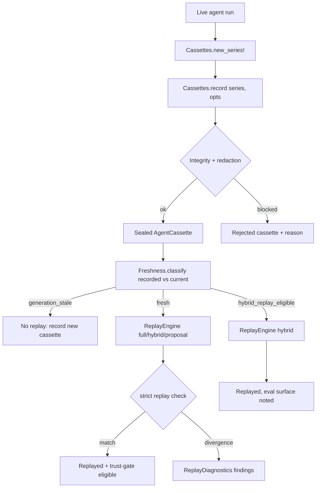

# Cassettes

The cassettes subsystem records and replays agent interactions so that
deterministic verification can re-run an agent's observable behavior without
paying for live model calls. A cassette captures the causal event stream, tool
transcript, nondeterminism ledger, and generation/evaluation freshness digests
of one recording, then a replay engine decides whether the cassette is still
fresh enough to replay in a given mode (full, hybrid, proposal, or compatible).
The goal is zero-cost, hermetic, deterministic testing of agent work graphs.

## Directory layout

The cassette builders live in `lib/conveyor/cassettes.ex`, with the replay and
normalization machinery in `lib/conveyor/cassettes/`:

```text
lib/conveyor/
├── cassettes.ex                       # CassetteSeries + AgentCassette artifact builders
└── cassettes/
    ├── causal_transcript.ex           # normalizes event streams and tool records
    ├── freshness.ex                   # separates generation vs evaluation surfaces
    ├── nondeterminism.ex              # virtual clock, id allocator, ndet ledger
    ├── replay_anchor_set.ex           # selects representative replay anchors
    ├── replay_diagnostics.ex          # strict-replay divergence diagnostics
    └── replay_engine.ex               # mode-specific replay decisions
```

## Key abstractions

| Abstraction | Location | Role |
| --- | --- | --- |
| `Conveyor.Cassettes` | `lib/conveyor/cassettes.ex` | Builds `CassetteSeries` and `AgentCassette` artifact maps. `new_series!/1` mints a series; `record/2` seals a cassette with redaction. |
| `CassetteSeries` | `lib/conveyor/cassettes.ex` | The `conveyor.cassette_series@1` artifact tying a spec kind, role, adapter, and environment/snapshot digests together. One series holds many cassettes. |
| `AgentCassette` | `lib/conveyor/cassettes.ex` | The `conveyor.agent_cassette@1` artifact for one recording: provider identity, agent event stream, tool transcript, redacted primary outputs, patch-set digest, retention, expiry. |
| `CausalTranscript` | `lib/conveyor/cassettes/causal_transcript.ex` | Normalizes raw event streams into `conveyor.causal_event@1` entries (per-stream sequence numbers, `happens_after` edges, scrubbed hidden reasoning) and `conveyor.tool_record@1` tool records with idempotency keys. |
| `Freshness` | `lib/conveyor/cassettes/freshness.ex` | Splits a surface into generation freshness digest (prompt/role view/context/adapter/tool-contract digests) and evaluation surface digest (gate/verification/obligation digests), then classifies a cassette as `:fresh`, `:hybrid_replay_eligible`, or `:generation_stale`. |
| `Nondeterminism` | `lib/conveyor/cassettes/nondeterminism.ex` | Deterministic virtual clock, id allocator, and nondeterminism ledger (`conveyor.nondeterminism_ledger@1`). Records clock reads, id allocations, env reads, external reads, and tool equivalence policies. |
| `ReplayAnchorSet` | `lib/conveyor/cassettes/replay_anchor_set.ex` | Selects one representative recording per category (`successful`, `failed`, `disputed`, `safety_sensitive`) into a `conveyor.replay_anchor_set@1` before an evaluated change. |
| `ReplayDiagnostics` | `lib/conveyor/cassettes/replay_diagnostics.ex` | Compares recorded vs requested causal events and tool records, emitting blocking findings (`strict_replay.causal_sequence_changed`, `strict_replay.tool_contract_changed`, `strict_replay.normalized_args_changed`). |
| `ReplayEngine` | `lib/conveyor/cassettes/replay_engine.ex` | Mode-specific replay (`:full`, `:hybrid`, `:proposal`, `:compatible`). Checks generation freshness, runs strict replay checks for full mode, and returns trust-gate eligibility. |

## How it works

A cassette is recorded once against a live agent run and replayed many times.
The recording path builds a `CassetteSeries` from the spec kind, role, adapter,
and a set of snapshot/environment/freshness digests. Each `record/2` call then
seals an `AgentCassette` against that series: it requires a non-empty agent
event stream and a valid tool transcript, redacts the primary outputs through
`Conveyor.Security.Redactor`, and sets the `seal_status` to `sealed` (or
`rejected` with an `invalidation_reason` if redaction blocks or integrity
fails).

Before replay, the freshness layer classifies whether the cassette is still
usable. The generation surface (prompt, role view, context, adapter, tool
contract digests) must match for any replay. The evaluation surface (gate,
verification, obligation digests) may differ and still allow a hybrid replay.
The replay engine then applies mode-specific checks.



### Causal transcripts and hidden reasoning

`CausalTranscript.normalize_events/1` renumbers events per stream, assigns
`event_id` as `stream:sequence_no`, preserves `happens_after` edges, and scrubs
hidden reasoning keys (`chain_of_thought`, `hidden_chain_of_thought`,
`reasoning`, `private_reasoning`) from payloads. `tool_record!/1` builds a
`conveyor.tool_record@1` with a deterministic idempotency key derived from the
record's canonical digest, so identical tool calls are content-addressed rather
than positionally identified.

### Nondeterminism ledger

The `Nondeterminism` struct is a deterministic virtual environment. `tick/2`
advances an ISO-8601 virtual clock by read index (rejecting malformed
`clock_start` at the contract boundary per ADR-12). `allocate_id/2` mints
namespaced, zero-padded ids. Env reads, external reads, and tool equivalence
policies are recorded into the ledger. `require_complete/2` checks that all
required ledger sections are present before replay, returning a
`replay_incomplete` error with the missing keys otherwise.

### Replay modes

`ReplayEngine.replay/3` supports four modes:

| Mode | Strict check | Trust-gate eligible | Notes |
| --- | --- | --- | --- |
| `:full` | Tool signatures and event signatures must match exactly | yes | Returns primary outputs. |
| `:hybrid` | No strict check (generation must still be fresh) | yes | Notes whether the evaluation surface changed; carries gate results. |
| `:proposal` | No strict check | yes | Carries a proposal result. |
| `:compatible` | No strict check | no | Status is `:compatible_only`; not eligible for the trust gate. |

`:full` mode compares recorded vs requested tool records (contract key +
canonical normalized args) and causal events (event id + happens-after edges).
Any divergence returns a `strict_replay_divergence` miss. `ReplayDiagnostics`
provides the structured comparison that produces the blocking findings a caller
can surface to the operator.

### Replay anchor selection

`ReplayAnchorSet.build!/2` selects one recording per category
(`successful`, `failed`, `disputed`, `safety_sensitive`) before an evaluated
change. Each anchor carries the cassette ref, whether the failure was valuable,
and the expected replay assertions. The anchor set is content-addressed so the
selection policy is auditable.

## Integration points

- **Security redaction** — `Cassettes.record/2` delegates output redaction to
  `Conveyor.Security.Redactor`. A blocked redaction rejects the cassette with
  `invalidation_reason: "redaction_blocked"`.
- **Trust gate** — `ReplayEngine` sets `trust_gate_eligible?` on replay results.
  The [Trust gate](gate.md) reads replay divergence as one trust signal (the
  replay component, weight 0.15) via `Conveyor.Gate.TrustEvidence`.
- **Evidence model** — cassettes are part of the
  `lib/conveyor/evidence/`, `lib/conveyor/artifacts/`, `lib/conveyor/cassettes/`
  evidence-capture surface. Recorded diagnostics refs and patch-set digests link
  cassettes back to the artifact store.
- **Qualification** — replay anchors feed the
  [Qualification system](qualification.md) gate, which requires `strict`, `full`,
  and `hybrid` replay modes to pass before a grant candidate is produced.
- **Battery** — cassette replay provides the deterministic primary oracle that
  the [Battery system](battery.md) live sampling and secondary confirmation
  build on.

## Entry points for modification

- **Add a cassette field** — `cassette_base/2` in
  `lib/conveyor/cassettes.ex` is where the `conveyor.agent_cassette@1` map is
  assembled. Keep the schema version bumped if the field is structural.
- **Change freshness classification** — `@generation_keys` and
  `@evaluation_keys` in `lib/conveyor/cassettes/freshness.ex` define which
  digests gate replay. `classify/2` is the pure decision function.
- **Add a replay mode** — add the atom to `@modes` in
  `lib/conveyor/replay_engine.ex` and implement `strict_replay_check/3` and
  `replay_result/3` clauses for it.
- **Change strict replay diagnostics** — `compare/2` in
  `lib/conveyor/cassettes/replay_diagnostics.ex` is the comparison surface. New
  rule keys must use the `strict_replay.*` prefix.
- **Change hidden-reasoning scrubbing** — `@hidden_keys` in
  `lib/conveyor/cassettes/causal_transcript.ex`.
- **Change anchor categories** — `@categories` in
  `lib/conveyor/cassettes/replay_anchor_set.ex`.

## Key source files

| File | Role |
| --- | --- |
| `lib/conveyor/cassettes.ex` | `CassetteSeries` and `AgentCassette` artifact builders, redaction integration. |
| `lib/conveyor/cassettes/causal_transcript.ex` | Event stream normalization, tool record building, hidden-reasoning scrubbing. |
| `lib/conveyor/cassettes/freshness.ex` | Generation vs evaluation surface digests and freshness classification. |
| `lib/conveyor/cassettes/nondeterminism.ex` | Virtual clock, id allocator, nondeterminism ledger. |
| `lib/conveyor/cassettes/replay_anchor_set.ex` | Representative anchor selection before an evaluated change. |
| `lib/conveyor/cassettes/replay_diagnostics.ex` | Strict-replay divergence findings. |
| `lib/conveyor/cassettes/replay_engine.ex` | Mode-specific replay decisions and trust-gate eligibility. |

See also: [Trust gate](gate.md), [Qualification system](qualification.md),
[Battery system](battery.md), [Planning compiler](planning-compiler.md),
[Evaluation framework](eval-framework.md).
