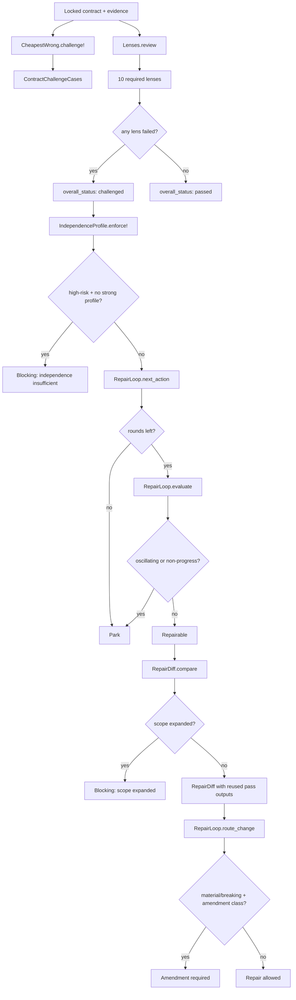

# Contract critic

The contract critic is the adversarial review layer that challenges contracts
and profiles test independence without ever approving, locking, or granting
implementation authority. It finds the cheapest wrong answer that satisfies the
written contract but violates approved intent, runs a multi-lens review across
ten required lenses, records and enforces independence profiles for challenge
roles, and governs a bounded automatic repair loop that can park oscillating or
non-progressing repairs. The critic preserves disagreement rather than
suppressing it.

## Directory layout

All contract critic modules live under `lib/conveyor/contract_critic/`:

```text
lib/conveyor/contract_critic/
├── cheapest_wrong.ex         # projects cheapest-wrong attacks into challenge cases
├── lenses.ex                 # pure multi-lens Contract Critic projection
├── independence_profile.ex   # records and enforces independence profiles
├── repair_diff.ex            # typed repair comparison with partial pass-output reuse
└── repair_loop.ex            # bounded automatic repair policy
```

## Key abstractions

| Abstraction | Location | Role |
| --- | --- | --- |
| `Conveyor.ContractCritic.CheapestWrong` | `lib/conveyor/contract_critic/cheapest_wrong.ex` | Projects cheapest-wrong implementation attacks into `conveyor.contract_challenge_case@1` artifacts. Each case records what satisfies the written contract, what violates approved intent, the materiality, and a repair proposal. |
| `Conveyor.ContractCritic.Lenses` | `lib/conveyor/contract_critic/lenses.ex` | Pure multi-lens review. Runs ten required lenses, preserves disagreements, and sets an overall status of `:passed` or `:challenged`. Never approves or locks. |
| `Conveyor.ContractCritic.IndependenceProfile` | `lib/conveyor/contract_critic/independence_profile.ex` | Records `conveyor.independence_profile@1` artifacts for challenge roles and enforces that high-risk changes require a strong profile (`model_diverse` or `human_or_deterministic`). |
| `Conveyor.ContractCritic.RepairDiff` | `lib/conveyor/contract_critic/repair_diff.ex` | Typed repair comparison (`conveyor.repair_diff@1`). Enforces that only rejected-artifact scope may change during repair, with partial pass-output reuse. |
| `Conveyor.ContractCritic.RepairLoop` | `lib/conveyor/contract_critic/repair_loop.ex` | Bounded automatic repair policy. Decides `:repair` vs `:park`, evaluates progress, and routes changes that require amendments. |

## How it works

The critic operates in three phases. First, the cheapest-wrong projection finds
implementation attacks that satisfy the letter of the contract but violate its
intent. Second, the multi-lens review runs ten required lenses and preserves
disagreements. Third, if the critic challenges the contract, the repair loop
governs whether an automatic repair is allowed, must be parked, or requires a
formal amendment.



### Cheapest wrong

`CheapestWrong.challenge!/1` takes a contract id, evidence refs, and a list of
attacks. Each attack becomes a `conveyor.contract_challenge_case@1` with a
content-addressed id and digest. The case records:

- **written_contract_satisfied_by** — how the implementation satisfies the
  letter of the contract.
- **approved_intent_violated** — which approved intent the implementation
  breaks.
- **materiality** — one of `nonmaterial`, `review_only`, `material`, `breaking`.
- **repair_proposal** — the proposed fix.
- **evidence_refs** — the union of the contract-level refs and the attack's
  evidence gap refs.

The result carries `authority_effect: :none`; the critic never issues
authority.

### Multi-lens review

`Lenses.review/1` runs ten required lenses:

| Lens | Focus |
| --- | --- |
| `intent_fidelity` | Does the implementation match approved intent, not just the written contract? |
| `scope_delta` | Did the implementation expand or shift scope? |
| `principal_engineering` | Is the engineering sound from the principal's perspective? |
| `interface_compatibility` | Are public and cross-slice interfaces compatible? |
| `test_loopholes` | Do the tests have loopholes that pass without proving the property? |
| `reliability_observability` | Is the system reliable and observable? |
| `security` | Are there security issues? |
| `cost_simplification` | Is the implementation needlessly complex or costly? |
| `hidden_decision` | Are there hidden decisions that bypass authority? |
| `approval_cognitive_load` | Is the approval surface too complex for a human to evaluate? |

Each lens returns a status (`pass` or `fail`) and findings. Disagreements (lens
inputs with differing statuses) are preserved as structured records with the
status set and the lenses involved. The overall status is `:challenged` if any
lens failed, otherwise `:passed`. The result carries `can_approve?: false` and
`can_lock?: false`.

### Independence profile

`IndependenceProfile.record!/1` builds a
`conveyor.independence_profile@1` for a challenge role, recording the profile
(`logical`, `context_separated`, `model_diverse`, or
`human_or_deterministic`) and evidence refs. `enforce!/1` checks that
high-risk change classes (`security`, `irreversible_migration`,
`public_compat`, `autonomy_increasing`) have at least one strong profile
(`model_diverse` or `human_or_deterministic`). If not, it returns a blocking
`critic.independence_insufficient` finding.

### Repair diff

`RepairDiff.compare/1` enforces that only rejected-artifact scope may change
during repair. It checks that the after-state's `changed_artifact_refs` are a
subset of the `rejected_artifact_refs`; any expansion produces a blocking
`repair.scope_expanded` finding. When the scope is valid, it builds a
`conveyor.repair_diff@1` with the before and after digests, comparison type,
authority effect, changed refs, reused pass outputs, and invalidated passes.
The reuse plan checks whether each pass's input refs still match; matching
passes are reused, mismatched passes are invalidated.

### Repair loop

`RepairLoop` governs the bounded automatic repair policy:

- `next_action/1` — returns `:repair` if `completed_rounds` is below
  `max_rounds` (default 2), otherwise `:park`.
- `evaluate/1` — parks if the artifact digests oscillate (duplicates across
  rounds) or if finding counts show non-progress (each subsequent count is
  greater than or equal to the first). Otherwise returns `:repairable`.
- `route_change/1` — returns `:repair_allowed` for normal changes, or
  `{:amendment_required, ...}` when the materiality is `material` or `breaking`
  and the change class is one of `plan`, `constraint`, `interface`, or
  `acceptance`. It returns a blocking error if the change weakens policy or
  acceptance without a normal authority ref.

## Integration points

- **Contract forge** — the critic challenges contracts produced by the
  [Contract forge](contract-forge.md). The forge's archetype templates declare
  the `required_review_lenses` that the critic's lenses must cover.
- **Qualification** — the independence profile gates high-risk change classes,
  which affects the [Qualification system](qualification.md) grant's `risk_class`
  and `max_autonomy`.
- **Trust gate** — the critic's repair diff and repair loop feed the
  [Trust gate](gate.md) rework classification. A non-critical gate failure that
  the critic marks repairable routes to rework; an oscillating or
  non-progressing repair parks the slice.
- **Cassettes** — the critic's challenge cases carry evidence refs that may
  point to [Cassettes system](cassettes.md) recordings, linking challenges back
  to the deterministic replay surface.

## Entry points for modification

- **Add a challenge case field** — `challenge_case!/3` in
  `lib/conveyor/contract_critic/cheapest_wrong.ex` is where the
  `conveyor.contract_challenge_case@1` map is assembled.
- **Add or change a lens** — `@required_lenses` in
  `lib/conveyor/contract_critic/lenses.ex`. The `lens_result/2` function reads
  each lens's status and findings from the input map.
- **Change independence enforcement** — `@profiles`, `@strong_profiles`, and
  `@high_risk_classes` in `lib/conveyor/contract_critic/independence_profile.ex`.
- **Change repair scope enforcement** — `compare/1` in
  `lib/conveyor/contract_critic/repair_diff.ex` is where the rejected-artifact
  subset check lives.
- **Change repair loop bounds** — `@default_max_rounds` and
  `@amendment_classes` in `lib/conveyor/contract_critic/repair_loop.ex`.
- **Change progress detection** — `oscillating?/1` and `non_progress?/1` in
  `lib/conveyor/contract_critic/repair_loop.ex`.

## Key source files

| File | Role |
| --- | --- |
| `lib/conveyor/contract_critic/cheapest_wrong.ex` | Cheapest-wrong implementation attack projection into challenge cases. |
| `lib/conveyor/contract_critic/lenses.ex` | Pure multi-lens review with disagreement preservation. |
| `lib/conveyor/contract_critic/independence_profile.ex` | Independence profile recording and high-risk enforcement. |
| `lib/conveyor/contract_critic/repair_diff.ex` | Typed repair comparison with scope enforcement and pass-output reuse. |
| `lib/conveyor/contract_critic/repair_loop.ex` | Bounded repair policy: rounds, progress, amendment routing. |

See also: [Contract forge](contract-forge.md), [Qualification system](qualification.md),
[Trust gate](gate.md), [Cassettes system](cassettes.md),
[Planning compiler](planning-compiler.md).
