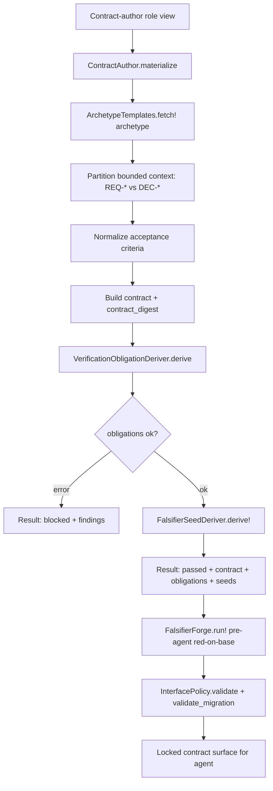

# Contract forge

The contract forge authors agent brief contracts, derives falsifier seeds and
verification obligations from them, and sets interface policies that lock public
and cross-slice boundaries. It is the subsystem that turns a contract-author
role view into a materialized, content-addressed `conveyor.agent_brief_contract@1`
with archetype-driven minimum obligation floors, compiler-derived falsifier
seeds, and deterministic interface and migration safety checks. The forge runs
before the agent is unlocked, so the contract it produces is the locked surface
the agent works against.

## Directory layout

All contract forge modules live under `lib/conveyor/contract_forge/`:

```text
lib/conveyor/contract_forge/
├── archetype_templates.ex              # deterministic contract archetype templates
├── contract_author.ex                  # materializes draft AgentBrief contracts
├── falsifier_seed_deriver.ex           # derives compiler-owned falsifier seeds
├── falsifier_forge.ex                  # pre-agent red-on-base falsifier report
├── interface_policy.ex                 # interface lock, compatibility, rollout, migration checks
└── verification_obligation_deriver.ex  # derives VerificationObligation projections
```

## Key abstractions

| Abstraction | Location | Role |
| --- | --- | --- |
| `Conveyor.ContractForge.ArchetypeTemplates` | `lib/conveyor/contract_forge/archetype_templates.ex` | Ten deterministic archetype templates (`bugfix_regression`, `crud_endpoint`, `pure_refactor`, `schema_migration`, `dependency_update`, `public_interface_change`, `security_hardening`, `performance`, `configuration`, `custom`). Each carries minimum obligations, required review lenses, and falsifier seed families. |
| `Conveyor.ContractForge.ContractAuthor` | `lib/conveyor/contract_forge/contract_author.ex` | Materializes a draft `conveyor.agent_brief_contract@1` from a contract-author role view. Partitions bounded context into requirements (REQ-\*) and decisions (DEC-\*), normalizes acceptance criteria, and derives obligations and falsifier seeds. |
| `Conveyor.ContractForge.FalsifierSeedDeriver` | `lib/conveyor/contract_forge/falsifier_seed_deriver.ex` | Derives compiler-owned falsifier seeds from six acceptance-criterion fields (falsifying conditions, boundary examples, forbidden predicates, property counterexamples, metamorphic relations, interface incompatibility cases). Verifies that seeds are preserved through translation. |
| `Conveyor.ContractForge.FalsifierForge` | `lib/conveyor/contract_forge/falsifier_forge.ex` | Builds the pre-agent `conveyor.falsifier_forge@1` red-on-base report. Requires every acceptance criterion to have both seed ids and required test refs, raising if coverage is missing. |
| `Conveyor.ContractForge.InterfacePolicy` | `lib/conveyor/contract_forge/interface_policy.ex` | Validates interface locks (strong lock levels for public/cross-slice), compatibility policies, rollout fields, and migration safety profiles (reversibility, backfill, data validation, compatibility window, rollback restore). |
| `Conveyor.ContractForge.VerificationObligationDeriver` | `lib/conveyor/contract_forge/verification_obligation_deriver.ex` | Derives `conveyor.verification_obligation@1` projections from acceptance criteria. Blocks machine-checkable criteria that lack falsifying conditions. |

## How it works

The forge is a pure compiler pipeline. `ContractAuthor.materialize/1` takes a
normalized input map (role view, archetype, slice id, acceptance criteria,
authorized scope, risk, rollout, recovery, out-of-scope) and produces a
structured result. It fetches the archetype template, partitions the bounded
context, normalizes the acceptance criteria, builds the contract with a
content-addressed digest, then derives verification obligations and falsifier
seeds. If obligation derivation fails (a machine-checkable criterion lacks
falsifying conditions), the result is `:blocked` with findings; otherwise it is
`:passed` with the contract, obligations, and seeds.



### Archetype templates

The ten archetypes are minimum obligation floors, not prompt folklore. Contract
authors may add stricter obligations, but downstream tools can rely on the
stable keys. Each template carries:

- **minimum_obligations** — required obligation ids (for example,
  `regression_reproduced`, `fix_verifies_regression`, `no_neighbor_regression`
  for `bugfix_regression`).
- **required_review_lenses** — the lenses the
  [Contract critic](contract-critic.md) must run (for example,
  `bug_reproduction`, `test_integrity`).
- **falsifier_seed_families** — the seed families the falsifier deriver should
  expect (for example, `known_bad_input`, `neighbor_case`).
- **approval_scrutiny** — `standard` by default, `heightened` for `custom`.

The `custom` archetype requires `custom_scope_justification`,
`explicit_oracle_path`, and `human_approval`, with heightened approval scrutiny
and extra review lenses (`critic:extra_lens`, `approval:scope_owner`).

### Contract materialization

`ContractAuthor.contract/2` builds the `conveyor.agent_brief_contract@1` map.
The bounded context is partitioned by ref class so requirements and decisions
arrays are not cross-contaminated. Acceptance criteria are normalized to carry
default empty example lists (`positive_examples`, `negative_examples`,
`boundary_examples`, `abuse_examples`, `non_goal_examples`,
`falsifying_conditions`). The contract carries the authorized scope, risk level
and required review lenses, assumptions, challenge cases, rollout, recovery,
out-of-scope, and claim coverage. The `contract_digest` is a canonical JSON
SHA-256 over the sorted-key map.

### Verification obligation derivation

`VerificationObligationDeriver.derive/1` walks each acceptance criterion and
builds a `conveyor.verification_obligation@1` with the slice id, acceptance ref,
obligation kind (default `unit`), evidence requirement ref (first required test
ref, or a `falsifier:` ref), and `status: "pending"`. If a machine-checkable
criterion (default `true`) has no falsifying conditions, it emits a blocking
`acceptance_criterion_missing_falsifier` finding and the whole derivation fails.

### Falsifier seed derivation

`FalsifierSeedDeriver.derive!/1` walks six acceptance-criterion fields and
produces a seed per entry, content-addressed as
`falsifier:{ac_id}:{family}:{index}` with `preservation_required: true`. The
six fields and their families:

| Field | Family |
| --- | --- |
| `falsifying_conditions` | `table_negative_row` |
| `boundary_examples` | `boundary_transform` |
| `forbidden_predicates` | `forbidden_predicate` |
| `property_counterexamples` | `property_counterexample` |
| `metamorphic_relations` | `metamorphic_relation` |
| `interface_incompatibility_cases` | `interface_incompatibility` |

`verify_preserved/2` checks that every original seed id appears in the
translated set, emitting a blocking `falsifier_seed_dropped` finding for any
missing seed. This prevents a translator from quietly dropping compiler-derived
falsifiers.

### Falsifier forge

`FalsifierForge.run!/2` builds the pre-agent red-on-base report. For each
acceptance criterion it records the expected base behavior (`fail`), the
required test refs, and the seed ids. If any criterion has no seeds or no
required test refs, it raises with the missing ids, ensuring red-on-base
coverage before the agent is unlocked.

### Interface policy

`InterfacePolicy.validate/1` checks three things for public or cross-slice
interfaces: the lock level must be strong (`strict`, `compatible_superset`, or
`review_required`), the compatibility policy must not be weak (`none` or
`informational`), and the rollout must carry both an environment and an intent.
Each missing field produces its own finding rather than stopping at the first
gap. `validate_migration/1` checks five required migration fields:
reversibility, backfill, data validation, compatibility window, and rollback
restore.

## Integration points

- **Contract critic** — the archetype's `required_review_lenses` drive the
  [Contract critic](contract-critic.md) multi-lens review. The critic can
  challenge the contract but never approves, locks, or grants authority.
- **Qualification** — the verification obligations and falsifier seeds feed the
  [Qualification system](qualification.md) scope lattice's evidence strata and
  the qualification gate's hard blockers.
- **Trust gate** — the contract lock stage of the [Trust gate](gate.md) ties a
  gate result to the exact approved contract digest produced by the forge.
- **Planning compiler** — the [Planning compiler](planning-compiler.md)
  run-spec assembler materializes and locks contracts; the forge is the
  authoring surface that produces them.

## Entry points for modification

- **Add an archetype** — add an entry to `@templates` in
  `lib/conveyor/contract_forge/archetype_templates.ex` with minimum obligations,
  required review lenses, and falsifier seed families.
- **Change contract fields** — `contract/2` in
  `lib/conveyor/contract_forge/contract_author.ex` is where the
  `conveyor.agent_brief_contract@1` map is assembled. Bump the schema version if
  the field is structural.
- **Add a falsifier seed family** — add a `{field, family}` tuple to
  `@seed_fields` in `lib/conveyor/contract_forge/falsifier_seed_deriver.ex`.
- **Change red-on-base requirements** — `run!/2` in
  `lib/conveyor/contract_forge/falsifier_forge.ex` is where coverage gaps raise.
- **Change interface lock levels** — `@strong_lock_levels` and
  `@weak_compatibility_policies` in
  `lib/conveyor/contract_forge/interface_policy.ex`.
- **Change migration safety fields** — `migration_findings/1` in
  `lib/conveyor/contract_forge/interface_policy.ex`.
- **Change obligation derivation** — `derive/1` and `acceptance_findings/1` in
  `lib/conveyor/contract_forge/verification_obligation_deriver.ex`.

## Key source files

| File | Role |
| --- | --- |
| `lib/conveyor/contract_forge/archetype_templates.ex` | Ten deterministic archetype templates with obligation floors, review lenses, and seed families. |
| `lib/conveyor/contract_forge/contract_author.ex` | Materializes draft AgentBrief contracts from role views. |
| `lib/conveyor/contract_forge/falsifier_seed_deriver.ex` | Derives and verifies preservation of compiler-owned falsifier seeds. |
| `lib/conveyor/contract_forge/falsifier_forge.ex` | Pre-agent red-on-base falsifier report builder. |
| `lib/conveyor/contract_forge/interface_policy.ex` | Interface lock, compatibility, rollout, and migration safety validation. |
| `lib/conveyor/contract_forge/verification_obligation_deriver.ex` | VerificationObligation projection deriver. |

See also: [Contract critic](contract-critic.md), [Qualification system](qualification.md),
[Trust gate](gate.md), [Planning compiler](planning-compiler.md),
[Cassettes system](cassettes.md).
