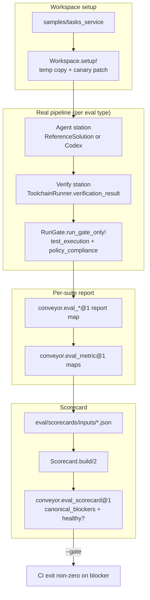

# Eval framework

The eval framework measures whether Conveyor itself is worth using. It runs the factory's own pipeline against a canary corpus of known-good and deliberately broken sample projects, grades the results through the real gate, and aggregates blocking metrics into a deterministic scorecard that can gate CI. Every eval is deterministic, content-addressed, and replayable for $0 after the first run.

## Directory layout

```
lib/conveyor/eval/              # the eval program (Rungs 0-1)
  eval.ex                        # shared conventions: canonical digests, schema delegation
  schema.ex                      # jsv schema validation helper
  scorecard.ex                   # aggregate metric report (conveyor.eval_scorecard@1)
  toolchain_runner.ex            # real pytest in venvs/Docker -> verification_result
  workspace.ex                   # throwaway temp copies of the sample project
  cassette_bridge.ex             # cassette record/replay wrapper over AgentRunner
  lift_duel.ex                   # R5: factory vs vanilla agent lift comparison
  mutant_gauntlet.ex             # E1: mutation testing with real execution
  golden_thread.ex               # B2: human plan drives the whole pipeline
  sentinel_tournament.ex         # E8: IntegritySentinel evasion tournament
  sentinel_fixtures.ex           # fixtures for the sentinel tournament
  compiler_properties.ex         # E7: planning compiler invariant checks
  gate_context.ex                # assembles a rich gate context from a slice result
  agent_station.ex               # agent-invoking station for the golden thread
  verify_station.ex              # verification station for the golden thread
  work_graph_to_station_plan.ex  # provisional lowering for the golden thread bridge

lib/conveyor/eval_suites.ex      # legacy Phase-1 eval-suite report runner

lib/mix/tasks/
  conveyor.eval.rung0.ex         # mix conveyor.eval.rung0
  conveyor.eval.replay.ex        # mix conveyor.eval.replay
  conveyor.eval.lift.ex          # mix conveyor.eval.lift
  conveyor.eval.scorecard.ex     # mix conveyor.eval.scorecard [--gate]

eval/                            # committed eval datasets and generated outputs
  corpora/                       # committed datasets (currently empty seed)
  cassettes/                     # sealed agent cassettes (record once, replay forever)
  lift/                          # conveyor.eval_lift@1 reports + usage.json
  scorecards/inputs/             # per-suite conveyor.eval_metric@1 metric files

docs/schemas/
  conveyor.eval_metric@1.json
  conveyor.eval_scorecard@1.json
  conveyor.eval_lift@1.json
  conveyor.agent_usage@1.json
```

The eval program lives under `lib/conveyor/eval/` (15 modules plus the top-level `lib/conveyor/eval.ex`). Generated artifacts and committed datasets live under `eval/`. Versioned JSON schemas live under `docs/schemas/` and are resolved by `lib/conveyor/eval/schema.ex`.

## Key abstractions

| Abstraction | What it is | Where |
| --- | --- | --- |
| Eval suite | A module that runs one eval type, produces a report map, and emits `conveyor.eval_metric@1` metrics to the scorecard inputs dir. | `lib/conveyor/eval/*.ex` |
| Scorecard | The deterministic aggregation of every suite's metrics into one `conveyor.eval_scorecard@1` doc with a `canonical_blockers` list. | `lib/conveyor/eval/scorecard.ex` |
| Metric | A single `conveyor.eval_metric@1` map: key, suite, value, target, blocking flag, status, optional detail and CI. | `lib/conveyor/eval/scorecard.ex` (`metric/5`) |
| Toolchain runner | Runs the sample's real pytest (local venv or Docker) and builds the `verification_result` map the gate's `test_execution` stage consumes. | `lib/conveyor/eval/toolchain_runner.ex` |
| Workspace | Copies `samples/tasks_service` into a throwaway temp dir and applies canary patches, never mutating the source tree. | `lib/conveyor/eval/workspace.ex` |
| Cassette bridge | An opt-in wrapper over `Conveyor.AgentRunner.run/5` that records a live run once and replays it deterministically for $0 forever. | `lib/conveyor/eval/cassette_bridge.ex` |
| Gate context assembler | Threads the data a completed `RunSlice` already produces (patch set, tree hash, build/install, provenance) into the richest honest gate context. | `lib/conveyor/eval/gate_context.ex` |
| Schema helper | Resolves a schema id to `docs/schemas/<id>.json`, builds a cached jsv validator, and validates a decoded map. | `lib/conveyor/eval/schema.ex` |

## How it works

Every eval suite follows the same shape: set up a workspace, run the factory's real pipeline (agent station, verify station, gate), measure a quantity, and emit `conveyor.eval_metric@1` maps to `eval/scorecards/inputs/`. A separate mix task then aggregates those inputs into one scorecard. The shared methodological anchor is that the gate is byte-identical across arms: the same `RunGate.run_gate_only!/3` call with the same stages and opts grades every cell, so differences in the measured quantity come from the independent variable, not from the judge.



The Rung-0 suites (`mix conveyor.eval.rung0`) are DB-free and deterministic: compiler properties, the sentinel tournament, and the mutant gauntlet all run without a database and write their metric inputs directly. The Rung-1 suites (the golden thread and the lift duel) need the DB-backed fixture chain (`RunSlice`, `RunSpec`, `RunAttempt`) and are driven by their tests. The lift duel records cassettes per cell so its committed `eval/lift/seed.json` report can be re-projected into scorecard metrics for $0 in CI by `mix conveyor.eval.lift`. `mix conveyor.eval.replay` re-runs every sealed cassette under `eval/cassettes/` and emits `replay_fidelity`. Finally `mix conveyor.eval.scorecard` ingests all inputs, builds the scorecard, and (with `--gate`) exits non-zero when any blocking metric is present.

## Eval types

### Lift duel

The lift duel (`lib/conveyor/eval/lift_duel.ex`) is the "is the factory worth it?" eval. The same broken-to-fix task is run through two arms and graded by the identical gate:

- `conveyor` (treatment) - the full Conveyor loop: a real agent driven by the rich Conveyor brief (AgentBrief, acceptance criteria, ContextPack assembled into the `RunPrompt`).
- `vanilla` (baseline) - the same agent one-shot with a naive prompt and none of the brief or context.

Both arms share the same outcome path (`CassetteBridge.run` to `ToolchainRunner.verification_result` to `RunGate.run_gate_only!`), so the gate is byte-identical across arms. The independent variable is the prompt and brief. The report is the lift: the delta in pass@1, false-pass count, and verified ACs, plus the cost multiple (dollars per verified AC) per arm, each with an exact Clopper-Pearson confidence interval. The committed seed (`eval/lift/seed.json`) records the real Codex run; `mix conveyor.eval.lift` projects it into scorecard metrics for $0 in CI. See [Agent runner](agent-runner.md) for the adapter boundary the duel exercises.

### Mutant gauntlet

The mutant gauntlet (`lib/conveyor/eval/mutant_gauntlet.ex`) turns the canary corpus into a measured classifier with a real false-PASS rate. For each mutant it copies the sample, applies the patch, runs pytest via the toolchain runner, and feeds the real `verification_result` (plus a valid calibration) through the gate's `test_execution` stage. This is the difference between "the gate decides correctly given results" and "the gate catches a real behavioral bug."

The gauntlet exercises two discrimination sets: behavioral mutants (`expected_catch.stage == "test_execution"`, real pytest) and path-based policy static-stage mutants (`category == "policy_file_change"`), which the `policy_compliance` stage discriminates from the patch's changed files alone. The remaining static mutants (contract lock, code quality, run check, injection content) stay `deferred_static_stage` until their gate stages are wired with richer contexts. `false_pass_rate` is exact over the set the eval actually exercises and is a blocking metric. See [Gate](gate.md) for the staged verification the gauntlet drives.

### Golden thread

The golden thread (`lib/conveyor/eval/golden_thread.ex`) makes a human plan drive the whole pipeline to a real verdict. `run_pipeline/1` takes a prepared bridge fixture (a lowered and augmented `station_plan` on a real `RunAttempt`, a sample git workspace) and runs `RunSlice` over the `agent` and `verify` stations, then `run_gate_only!` on the real evidence. No injected fixtures. The `agent` station uses the deterministic `ReferenceSolution` adapter (or a real one), and the `verify` station runs real pytest via the toolchain runner.

The `bridge_end_to_end` metric is blocking: known-good must PASS, all mutants must FAIL, and traceability must be preserved. The golden thread needs the DB-backed fixture chain, so it is driven by `test/conveyor/eval/golden_thread_test.exs` rather than a standalone mix task. See [Planning compiler](planning-compiler.md) for the lowering the golden thread exercises.

### Sentinel tournament

The sentinel tournament (`lib/conveyor/eval/sentinel_tournament.ex`) measures how hard it is to sneak a vacuous-but-passing test suite past the `IntegritySentinel`. For every distinct `rule_key` it plants a vacuity (a single perturbation of the all-pass `clean_observations/0` baseline from `lib/conveyor/eval/sentinel_fixtures.ex`) that the sentinel should catch, and confirms it does. Any planted vacuity that yields `trustworthy` is an evasion, a verifier false-negative, and flips `sentinel_evasion_rate` red. The tournament also checks `falsifier_seed.dropped` at the obligation level via `Verification.evaluate_falsifier_preservation/2`.

Pure and DB-free. Emits `sentinel_evasion_rate` (target 0, blocking) and `sentinel_probe_coverage` (target 1) to the scorecard. The fixtures mirror `test/conveyor/test_integrity_sentinel_test.exs`.

### Compiler properties

The compiler property engine (`lib/conveyor/eval/compiler_properties.ex`) checks five invariants over the pure heart of the planning compiler: intent preserved, intent falsifiable, lowering deterministic, work graph validates against `conveyor.work_graph@2`, and injection safe (a `StaticDecisionPackage` built from prompt-injection text must stay data, with `authority_effect == :none`). The exhaustive generated coverage lives in `test/conveyor/eval/compiler_property_test.exs` (StreamData); `run/0` is a fixed-sample check the scorecard shares.

Emits `compiler_invariant_violations` (target 0, blocking) and `work_graph_schema_present` (target true). Pure and DB-free. See [Planning compiler](planning-compiler.md) for the passes these invariants protect.

## Rungs

The eval program is organized into two rungs that trade cost for realism.

### Rung 0: DB-free property tests

Rung 0 suites are deterministic, DB-free, and cost $0 in LLM tokens. They run in CI without a database and write their metric inputs directly. `mix conveyor.eval.rung0` runs all three:

- **Compiler properties** (`lib/conveyor/eval/compiler_properties.ex`) - planning compiler invariants.
- **Sentinel tournament** (`lib/conveyor/eval/sentinel_tournament.ex`) - IntegritySentinel evasion coverage.
- **Mutant gauntlet** (`lib/conveyor/eval/mutant_gauntlet.ex`) - real-execution mutation testing. Needs Python and pytest but no database.

Rung 0 is the CI gate. If any blocking metric in these suites regresses, `mix conveyor.eval.scorecard --gate` exits non-zero.

### Rung 1: DB-backed integration

Rung 1 suites need the DB-backed fixture chain (`RunSlice`, `RunSpec`, `RunAttempt`, `AgentSession`, `RunPrompt`) and are driven by their tests rather than a standalone mix task. They exercise the real pipeline end to end:

- **Golden thread** (`lib/conveyor/eval/golden_thread.ex`) - a human plan drives the whole pipeline to a real verdict. Driven by `test/conveyor/eval/golden_thread_test.exs`.
- **Lift duel** (`lib/conveyor/eval/lift_duel.ex`) - factory vs vanilla agent, recorded once against live Codex and re-projected from the committed seed for $0 in CI. The live seed run is `test/conveyor/eval/lift_duel_live_test.exs` (excluded from CI via the `:live_agent` tag).

Rung 1 produces the committed seed artifacts (`eval/lift/seed.json`, `eval/cassettes/*.json`) that Rung 0 and the projection tasks consume in CI.

## The scorecard system

The scorecard (`lib/conveyor/eval/scorecard.ex`) is a versioned, deterministic projection that aggregates every eval suite's metrics into one glanceable, CI-gating report. It mirrors `Conveyor.Battery.ReleaseReport`: a map carrying a `schema_version` token plus a structured `canonical_blockers` list, so a prose summary can never hide a blocker.

Each suite writes its `conveyor.eval_metric@1` maps to `eval/scorecards/inputs/<suite>.json` (canonical JSON) via `Scorecard.write_input!/2`. `Scorecard.build/2` ingests them, sorts by key, collects the blocking metrics into `canonical_blockers`, and sets `healthy?` to whether that list is empty. The scorecard is content-addressed via `Conveyor.CanonicalJson.digest/1`: same inputs plus same git revision produce a byte-identical `scorecard_digest`. `Scorecard.healthy?/1` is the `--gate` predicate.

A metric is blocking when its suite sets `blocking: true` and its value does not equal its target. Blocking metrics drive the CI exit code. The key blocking metrics across the suites are:

| Metric | Suite | Target | Meaning |
| --- | --- | --- | --- |
| `false_pass_rate` | `mutant_gauntlet` | 0 | Fraction of mutants the gate let through. Any non-zero value means the gate green-lit a real bug. |
| `sentinel_evasion_rate` | `sentinel_tournament` | 0 | Fraction of planted vacuities the IntegritySentinel missed. |
| `compiler_invariant_violations` | `compiler_properties` | 0 | Count of violated planning compiler invariants. |
| `bridge_end_to_end` | `golden_thread` | true | known-good PASS, all mutants FAIL, traceability preserved. |
| `replay_fidelity` | `cassette_flywheel` | 1 | Fraction of sealed cassettes that replay to their recorded digest. |

`mix conveyor.eval.scorecard --gate` loads the inputs, builds the scorecard, validates it against `conveyor.eval_scorecard@1`, and exits with the eval false-negative exit code when any blocking metric is present. See [Cassettes](cassettes.md) for the record/replay machinery behind `replay_fidelity`.

## Integration points

- **Gate** - Every eval suite grades through `Conveyor.Jobs.RunGate.run_gate_only!/3` with the same stages and opts, so the judge is identical across arms and cells. The `test_execution` and `policy_compliance` stages are the ones the Rung-0 suites exercise today; the remaining static stages stay fail-closed until their contexts are wired. See [Gate](gate.md).
- **Agent runner** - The lift duel and golden thread run agents through `Conveyor.AgentRunner.run/5`, wrapped by the cassette bridge for record/replay. The deterministic `ReferenceSolution` adapter is the default; live runs use `Codex`. See [Agent runner](agent-runner.md).
- **Planning compiler** - The compiler property engine checks invariants over `Conveyor.Planning.GraphAnalyses`, `WorkGraphLowering`, `StaticDecisionPackage`, and `CompilerStructureGate`. The golden thread lowers a work graph to a `station_plan` via `lib/conveyor/eval/work_graph_to_station_plan.ex`. See [Planning compiler](planning-compiler.md).
- **Cassettes** - The cassette bridge wraps `Conveyor.AgentRunner.run/5` with `Conveyor.Cassettes` record/replay, sealed under `eval/cassettes/`. `mix conveyor.eval.replay` re-runs the corpus and emits `replay_fidelity`. See [Cassettes](cassettes.md).
- **Canonical JSON** - All eval artifacts use `Conveyor.CanonicalJson.encode/1` and `Conveyor.CanonicalJson.digest/1` for deterministic encoding and content addressing. The top-level `lib/conveyor/eval.ex` delegates to these and forbids private re-rolls.
- **Schema registry** - Eval schemas live under `docs/schemas/conveyor.eval_*@1.json` and are validated by `lib/conveyor/eval/schema.ex`, which mirrors the jsv usage in `Conveyor.PlanContract` so the eval namespace does not re-roll its own validation.
- **Sample project** - `samples/tasks_service` is the canary corpus: a correct, green Python service with committed canary mutants under `.conveyor/canary/`. The mutant gauntlet, golden thread, and lift duel all operate on throwaway temp copies of it via `lib/conveyor/eval/workspace.ex`.

## Entry points for modification

- **Add a new eval type** - Create a module under `lib/conveyor/eval/` that produces a report map and emits `conveyor.eval_metric@1` maps via `Scorecard.write_input!/2`. Add a `metrics/1` function and an `emit!/1` (or `emit!/2`) entry point. If it is DB-free and deterministic, wire it into `lib/mix/tasks/conveyor.eval.rung0.ex`. If it needs the DB, drive it from a test and commit its seed artifact under `eval/`.
- **Add a blocking metric** - Call `Scorecard.metric/5` with `blocking: true` and a target. The scorecard's `--gate` predicate picks it up automatically.
- **Change the canary corpus** - Edit `samples/tasks_service/.conveyor/canary/mutants.json` (the manifest the gauntlet loads) and the patch files it references. The mutant gauntlet, golden thread, and lift duel all read from this manifest.
- **Change the scorecard aggregation** - Edit `lib/conveyor/eval/scorecard.ex` (`build/2`, `metric/5`). The scorecard schema is `docs/schemas/conveyor.eval_scorecard@1.json`; the metric schema is `docs/schemas/conveyor.eval_metric@1.json`.
- **Change the toolchain execution** - Edit `lib/conveyor/eval/toolchain_runner.ex`. The two backends are `:local` (venv built and cached by `requirements.lock` digest) and `:docker` (pinned image with `--network=none`). The `verification_result` shape it produces must stay compatible with the gate's `test_execution` stage.
- **Change the gate grading** - Edit the `@gate_stages` and `@gate_opts` module attributes in each eval suite. Keep the gate identical across arms where the methodological requirement applies (lift duel, golden thread).

## Key source files

| File | Role |
| --- | --- |
| `lib/conveyor/eval.ex` | Shared conventions: canonical digests and encoding, schema validation delegation. |
| `lib/conveyor/eval/schema.ex` | jsv schema validation helper; resolves and caches `docs/schemas/<id>.json`. |
| `lib/conveyor/eval/scorecard.ex` | Aggregates metrics into `conveyor.eval_scorecard@1`; the `--gate` predicate. |
| `lib/conveyor/eval/toolchain_runner.ex` | Real pytest (local venv or Docker) to `verification_result`; hermeticity observations. |
| `lib/conveyor/eval/workspace.ex` | Throwaway temp copies of `samples/tasks_service`; canary patch application. |
| `lib/conveyor/eval/cassette_bridge.ex` | Opt-in record/replay wrapper over `AgentRunner.run/5`. |
| `lib/conveyor/eval/lift_duel.ex` | R5 lift duel: factory vs vanilla, Clopper-Pearson CIs, cost per verified AC. |
| `lib/conveyor/eval/mutant_gauntlet.ex` | E1 mutation testing: real-execution false-PASS rate. |
| `lib/conveyor/eval/golden_thread.ex` | B2 golden thread: human plan drives the whole pipeline. |
| `lib/conveyor/eval/sentinel_tournament.ex` | E8 sentinel evasion tournament. |
| `lib/conveyor/eval/sentinel_fixtures.ex` | All-pass baseline and planted-vacuity trip cases for the sentinel tournament. |
| `lib/conveyor/eval/compiler_properties.ex` | E7 compiler invariant checks (intent, determinism, schema, injection safety). |
| `lib/conveyor/eval/gate_context.ex` | Assembles the richest honest gate context from a completed `RunSlice`. |
| `lib/conveyor/eval/agent_station.ex` | Agent-invoking station for the golden thread. |
| `lib/conveyor/eval/verify_station.ex` | Verification station for the golden thread. |
| `lib/conveyor/eval/work_graph_to_station_plan.ex` | Provisional lowering of a work graph slice to a `station_plan`. |
| `lib/conveyor/eval_suites.ex` | Legacy Phase-1 eval-suite report runner. |
| `lib/mix/tasks/conveyor.eval.rung0.ex` | `mix conveyor.eval.rung0` - runs the DB-free Rung-0 suites. |
| `lib/mix/tasks/conveyor.eval.replay.ex` | `mix conveyor.eval.replay` - replays cassettes, emits `replay_fidelity`. |
| `lib/mix/tasks/conveyor.eval.lift.ex` | `mix conveyor.eval.lift` - projects lift-duel reports to scorecard metrics. |
| `lib/mix/tasks/conveyor.eval.scorecard.ex` | `mix conveyor.eval.scorecard [--gate]` - aggregates metrics, gates CI. |
| `docs/schemas/conveyor.eval_scorecard@1.json` | Scorecard schema. |
| `docs/schemas/conveyor.eval_metric@1.json` | Single-metric schema. |
| `docs/schemas/conveyor.eval_lift@1.json` | Lift-duel report schema. |
| `docs/schemas/conveyor.agent_usage@1.json` | Per-run agent cost record schema. |
