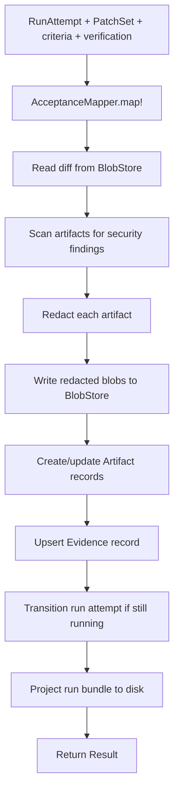

# Evidence recording

Evidence recording captures the machine-readable proof of a run attempt: the
patch, the verification test results, the acceptance mapping, and the
security-redacted artifact set. The recorder writes content-addressed blobs for
each artifact, upserts an `Evidence` record, projects a run bundle to disk, and
emits a structured evidence packet. A family of pure modules handles acceptance
mapping, evidence comparison, patch replay, invalidation preview, and
independent verification reruns so the gate and CLI can reason about evidence
without coupling to the recording path.

## Directory layout

The evidence subsystem lives under `lib/conveyor/evidence/` with the shared
verification builder in `lib/conveyor/verification.ex`:

```
lib/conveyor/
├── evidence/
│   ├── recorder.ex              # Writes artifacts, Evidence record, run projection
│   ├── acceptance_mapper.ex     # Maps acceptance criteria to verification test results
│   ├── comparator.ex            # Canonical multi-label evidence comparator
│   ├── patch_set_applicator.ex  # Replays a PatchSet onto a clean gate workspace
│   ├── time_machine.ex          # DB-free diff and why-stale projections for CLI
│   ├── invalidation_preview.ex  # Pure invalidation and impact-preview reducer
│   └── verification_rerunner.ex # Independently reruns verification suites
├── verification.ex              # VerificationObligation, evidence, waiver, quarantine builders
└── factory/
    └── evidence.ex              # Ash resource: aggregated evidence record
```

## Key abstractions

| Abstraction | Location | Role |
| --- | --- | --- |
| `Conveyor.Evidence.Recorder` | `lib/conveyor/evidence/recorder.ex` | Writes the evidence packet, dossier, diff, logs, and redacted artifacts; upserts the `Evidence` record; projects the run bundle. |
| `Conveyor.Evidence.Recorder.Result` | `lib/conveyor/evidence/recorder.ex` | Recording outcome: evidence record, projection result, artifacts, security findings. |
| `Conveyor.Evidence.AcceptanceMapper` | `lib/conveyor/evidence/acceptance_mapper.ex` | Maps acceptance criteria to structured verification test results; derives pass/fail and blocking findings. |
| `Conveyor.Evidence.AcceptanceMapper.Result` | `lib/conveyor/evidence/acceptance_mapper.ex` | Mapped acceptance: status, per-criterion results, findings. |
| `Conveyor.Evidence.Comparator` | `lib/conveyor/evidence/comparator.ex` | DB-free multi-label comparator. Preserves all materiality labels and derives a dominant label. |
| `Conveyor.Evidence.PatchSetApplicator` | `lib/conveyor/evidence/patch_set_applicator.ex` | Applies a recorded PatchSet to a clean gate workspace; validates base commit and patch integrity. |
| `Conveyor.Evidence.TimeMachine` | `lib/conveyor/evidence/time_machine.ex` | DB-free diff and why-stale projections for CLI commands. |
| `Conveyor.Evidence.InvalidationPreview` | `lib/conveyor/evidence/invalidation_preview.ex` | Pure reducer that projects affected subjects and their required actions from a change set. |
| `Conveyor.Evidence.VerificationRerunner` | `lib/conveyor/evidence/verification_rerunner.ex` | Independently reruns verification suites; parses structured test results; supports reproducible dual-runner runs. |
| `Conveyor.Evidence.VerificationRerunner.Result` | `lib/conveyor/evidence/verification_rerunner.ex` | Rerun outcome: status, suites, optional reproducibility report. |
| `Conveyor.Verification` | `lib/conveyor/verification.ex` | Builder for `VerificationObligation`, `VerificationEvidence`, `EvidenceRequirement`, `ObligationSatisfaction`, `Quarantine`, `Waiver`, and falsifier records. |
| `Conveyor.Factory.Evidence` | `lib/conveyor/factory/evidence.ex` | Ash resource: aggregated evidence for a run attempt and patch set. |

## How it works

### Recording

`Recorder.record!/5` is the entry point. It takes a `RunAttempt`, a `PatchSet`,
acceptance criteria, a verification result, and opts. The flow:



The recorder builds four artifact specs: `evidence.json` (the canonical evidence
packet), `dossier.md` (human-readable summary), `diff.patch` (the patch bytes
read from the patch set's blob ref), and `logs/verification.json` (normalized
verification log). Each artifact is scanned with `Redactor.scan/3` for
pre-redaction findings, then redacted with `Redactor.redact!/3`. The redacted
content is written to `BlobStore` and an `Artifact` record is created or updated
with both the raw and redacted SHA256 plus the redaction findings. If any
finding is blocking, the evidence status is set to `"blocked"`; non-blocking
findings set it to `"redacted"`.

The evidence packet (`evidence.json`) uses schema version
`conveyor.evidence_packet@1` and carries the acceptance results, findings,
security summary, and normalized verification output. JSON is emitted in
canonical form (keys sorted alphabetically) so digests are stable.

### Acceptance mapping

`AcceptanceMapper.map!/2` takes acceptance criteria (each with
`required_test_refs`) and a verification result. It indexes the verification
result's test suites by test id, then for each criterion looks up the required
test results. The per-criterion evidence status is `"missing"` if any required
test is absent, `"failed"` if any failed, `"skipped"` if any skipped, and
`"passed"` otherwise. Missing and skipped tests produce blocking findings
(`missing_required_test`, `skipped_required_test`) so the gate can act on them.

### Evidence comparison

`Comparator.compare/3` is intentionally DB-free. It takes two subject
descriptors (left and right) and compares them across a fixed set of 17
materiality labels (`identical`, `cosmetic`, `context_only`,
`evidence_changing`, `scope_added`, `scope_removed`, `scope_reinterpreted`,
`contract_changing`, `acceptance_weakened`, `acceptance_strengthened`,
`policy_weakened`, `policy_strengthened`, `environment_changing`,
`capability_changing`, `approval_changing`, `grant_changing`, `incomparable`).
Labels are sorted by precedence and the last (highest-precedence) label becomes
the dominant label. If either subject is unavailable, unauthorized, erased, or
has a digest mismatch, the comparison is `incomparable` with a reason. The
caller can supply explicit labels or let the comparator infer them from digest
equality (`identical` if digests match, `evidence_changing` otherwise).

### Patch replay

`PatchSetApplicator.apply_patch_set/2` materializes a clean workspace from the
run spec's base commit (via `git archive`) and applies the recorded patch with
`git apply`. It validates that the patch set's `base_commit` matches the run
attempt's `base_commit`, computes a head tree SHA256, creates a
`WorkspaceMaterialization` with `purpose: :gate`, and links the patch set to the
run attempt. This is the mechanism the gate uses to reproduce a run's file state
independently of the agent's original workspace.

### Invalidation preview

`InvalidationPreview.preview_invalidation/1` is a pure reducer. Callers pass the
already-resolved derivation and authority indexes (artifact inputs, interface
bindings, decision blocks, verification obligations, approval roots) plus a
change set. The kernel projects which subjects are affected and what action each
needs (`regenerate_contract`, `revalidate_only`, `recompile_prompt`,
`regenerate_claims`, `reapprove_shared_root`, etc.). When
`impact_confidence` is below 0.8, the preview fails wide and marks all subjects
for regeneration with reason `impact_confidence_low`.

### Verification reruns

`VerificationRerunner.run!/2` loads the `baseline_regression` and
`acceptance_locked` suites for a run spec's slice, then runs each command
through an injectable runner function. It parses structured test results via
`TestResultAdapter`, handles infra-retry policies, flake detection, and a
zero-test guard for acceptance-locked suites (a suite that enumerated tests but
selected zero fails). `run_reproducible!/2` runs the suites twice, once with the
agent runner and once with the gate runner, then compares SHA256 digests of the
canonical suite JSON. Divergence produces a `clean_container_divergence`
blocking finding.

### Verification builders

`Conveyor.Verification` is the authority-bearing verification primitive builder.
It constructs content-addressed records for obligations, evidence, evidence
requirements, satisfaction evaluations, quarantines, waivers, and falsifier
seeds/preservations. Each record gets a SHA256-derived id. The satisfaction
evaluation (`evaluate_requirement/3`) checks each required evidence dimension
against provided evidence, respects quarantines, and applies waivers to produce
a `satisfied` / `waived` / `blocked` / `not_assessed` result.

## Integration points

- **Trust gate** (`lib/conveyor/gate/`) — the gate's `test_execution` stage uses
  `VerificationRerunner` to rerun suites, and the `acceptance_mapping` stage
  uses `AcceptanceMapper` to check every criterion has passing evidence. See
  [Trust gate](gate.md).
- **BlobStore** (`lib/conveyor/artifacts/blob_store.ex`) — the recorder reads
  the patch diff and writes all redacted artifacts through the content-addressed
  blob store. See [Artifact projection](artifact-projection.md).
- **Projector** (`lib/conveyor/artifacts/projector.ex`) — the recorder calls
  `Projector.project_run!/2` to regenerate the on-disk run bundle after
  recording. See [Artifact projection](artifact-projection.md).
- **Security redactor** (`lib/conveyor/security/redactor.ex`) — scans and
  redacts every artifact before it is persisted. Blocking secrets set the
  evidence status to `"blocked"`.
- **RunAttemptLifecycle** (`lib/conveyor/run_attempt_lifecycle.ex`) — the
  recorder transitions a still-running run attempt through the `:record_evidence`
  event.
- **PatchSet resource** (`lib/conveyor/factory/patch_set.ex`) — the source of
  the diff blob ref and changed-files list that the recorder and applicator use.
- **CLI** — `TimeMachine` and `Comparator` feed CLI diff and why-stale commands
  with already-resolved subjects, so CLI output shape stays stable as backing
  stores evolve.

## Entry points for modification

- **Add a new artifact kind** — add a new `artifact_spec/4` entry to the
  `artifact_specs` list in `Recorder.record!/5`. The redaction, blob write, and
  `Artifact` record creation are generic and will pick it up.
- **Change the evidence packet schema** — `evidence_json/6` and
  `@schema_version` in `lib/conveyor/evidence/recorder.ex`. The canonical JSON
  builder ensures stable digests.
- **Add a materiality label** — add the atom to `@materiality_labels` in
  `lib/conveyor/evidence/comparator.ex` and update `@precedence`. The label
  must be in the list or `normalize_label!/1` will raise.
- **Change invalidation actions** — `artifact_action/1` and `approval_action/1`
  in `lib/conveyor/evidence/invalidation_preview.ex` map roles and root kinds to
  actions. The fail-wide path in `wide_affected_subjects/1` must stay consistent.
- **Change verification rerun semantics** — `run_suite/2`, `command_status/2`,
  and `suite_status/2` in `lib/conveyor/evidence/verification_rerunner.ex`. The
  zero-test guard for `acceptance_locked` suites lives in
  `acceptance_ran_zero_tests?/1`.
- **Add a verification obligation kind or evidence dimension** — add to the
  module attributes in `lib/conveyor/verification.ex` and update
  `@dimension_evidence_kinds` so `evaluate_requirement/3` can map the dimension
  to an evidence kind.

## Key source files

| File | Role |
| --- | --- |
| `lib/conveyor/evidence/recorder.ex` | Evidence packet, artifact, and projection writer. |
| `lib/conveyor/evidence/acceptance_mapper.ex` | Acceptance criteria to test result mapping. |
| `lib/conveyor/evidence/comparator.ex` | DB-free multi-label evidence comparator. |
| `lib/conveyor/evidence/patch_set_applicator.ex` | Clean-workspace patch replay for the gate. |
| `lib/conveyor/evidence/time_machine.ex` | CLI diff and why-stale projections. |
| `lib/conveyor/evidence/invalidation_preview.ex` | Pure invalidation and impact-preview reducer. |
| `lib/conveyor/evidence/verification_rerunner.ex` | Independent verification suite reruns. |
| `lib/conveyor/verification.ex` | Verification obligation, evidence, waiver, quarantine builders. |
| `lib/conveyor/factory/evidence.ex` | Ash resource for the aggregated evidence record. |

See also: [Artifact projection](artifact-projection.md), [Trust gate](gate.md),
[Agent runner](agent-runner.md), [Sandbox](sandbox.md),
[Evidence](../primitives/evidence.md).
