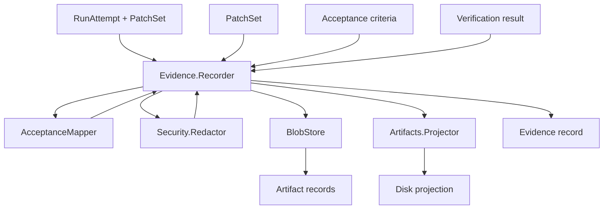

# Evidence recording

The evidence system in `lib/conveyor/evidence/` is how Conveyor captures independent, machine-checkable proof that a slice met its acceptance criteria. Agent claims are input, not proof. The recorder writes evidence packets, dossiers, diffs, and logs as content-addressed artifacts, then the verification rerunner re-executes gate commands in a clean container to confirm the result is reproducible. The gate consumes this evidence to decide whether a run attempt passes.

## Evidence recording flow

## Recorder

`lib/conveyor/evidence/recorder.ex` writes machine evidence, dossier, diff, logs, and projected run artifacts. Given a `RunAttempt`, `PatchSet`, acceptance criteria, and a verification result, it:

1. Maps acceptance criteria to verification results via `AcceptanceMapper`.
2. Reads the diff from the blob store.
3. Scans all artifact contents (dossier, diff, logs) through `Security.Redactor` for secret exposure.
4. Builds an `evidence.json` packet with schema version `conveyor.evidence_packet@1`, acceptance results, findings, security summary, and verification data.
5. Redacts each artifact, writes it to the blob store, and creates/updates `Artifact` records with both raw and redacted SHA-256 digests.
6. Upserts the `Evidence` record with changed files, diff ref, acceptance results, risks, and summary.
7. Transitions the run attempt to `record_evidence` if it was running.
8. Projects the run to disk via `Artifacts.Projector`.

The `Result` struct carries the evidence record, projection result, artifacts, and security findings. Evidence status is `blocked` if any security finding is blocking, `redacted` if findings exist but acceptance passed, or the acceptance status otherwise.

## VerificationRerunner

`lib/conveyor/evidence/verification_rerunner.ex` independently reruns verification suites and parses structured test results. It loads `VerificationSuite` records for the slice (baseline regression and acceptance locked kinds), runs each suite's commands through an injectable runner, and parses output through `TestResultAdapter`.

Each command supports repeat counts, flake policy (`fail_closed`, `quarantine`, `allow_with_warning`), and infrastructure retry policies. A command is classified as `stable` or `flake` based on whether attempts produced consistent statuses. The suite passes only when all commands pass or pass with warning.

`run_reproducible!/2` runs the same suites through both an agent runner and a gate runner, then compares the resulting suite digests. If they diverge, it produces a `clean_container_divergence` blocking finding, ensuring agent-reported results match independently re-run results.

## PatchSetApplicator

`lib/conveyor/evidence/patch_set_applicator.ex` applies a recorded PatchSet to a clean gate workspace. It validates that the patch base commit matches the run attempt, materializes a clean checkout from `git archive` at the run spec's base commit, applies the patch with `git apply`, records the head tree SHA-256, and creates a `WorkspaceMaterialization` record. This is what the gate uses to verify that the agent's patch applies cleanly to a fresh checkout, not just the agent's own workspace.

## AcceptanceMapper

`lib/conveyor/evidence/acceptance_mapper.ex` maps acceptance criteria to structured verification test results. For each criterion, it looks up the required test refs in the verification result's test index, classifies the evidence status (`passed`, `failed`, `skipped`, `missing`), and produces findings for missing or skipped required tests. The overall status is `passed` only when all criteria have passing evidence and no findings.

## Comparator

`lib/conveyor/evidence/comparator.ex` is a canonical multi-label evidence comparator. It preserves all materiality labels and derives a deterministic dominant label for summaries. The comparator is DB-free so CLI and diagnostic callers can compare already-resolved subjects. It detects invalid subjects (unavailable, unauthorized, erased, digest mismatch) and classifies them as `incomparable`. Labels range from `identical` and `cosmetic` through `evidence_changing`, `scope_added`/`scope_removed`, `contract_changing`, `policy_weakened`/`policy_strengthened`, to `incomparable`, with a defined precedence order.

## InvalidationPreview

`lib/conveyor/evidence/invalidation_preview.ex` is a pure invalidation and impact-preview reducer. Callers pass already-resolved derivation and authority indexes; the kernel does not read from the database. It projects affected subjects and why each must be regenerated, revalidated, or reapproved. When impact confidence is low (below 0.8), it fails wide and invalidates all subjects. Otherwise it selectively computes impacts across artifact inputs, interface bindings, decision blocks, verification obligations, and approval roots, choosing actions like `regenerate_contract`, `recompile_prompt`, `regenerate_claims`, `regenerate_verification_obligations`, and `reapprove_shared_root` based on the subject's role.

## TimeMachine

`lib/conveyor/evidence/time_machine.ex` provides DB-free Evidence Time Machine projections for CLI commands. Inputs are already-resolved subject descriptors. The `diff` function compares two subjects using `Comparator` and emits a machine-readable report with optional markdown. The `why_stale` function reports whether a subject is stale and why.

## Key source files

| File | Purpose |
| ---- | ---- |
| `lib/conveyor/evidence/recorder.ex` | Writes evidence packets, dossier, diff, logs, and projected run artifacts. |
| `lib/conveyor/evidence/verification_rerunner.ex` | Independently reruns verification suites and parses structured test results. |
| `lib/conveyor/evidence/patch_set_applicator.ex` | Applies a recorded PatchSet to a clean gate workspace. |
| `lib/conveyor/evidence/acceptance_mapper.ex` | Maps acceptance criteria to structured verification test results. |
| `lib/conveyor/evidence/comparator.ex` | Canonical multi-label evidence comparator with deterministic dominant label. |
| `lib/conveyor/evidence/invalidation_preview.ex` | Pure invalidation and impact-preview reducer. |
| `lib/conveyor/evidence/time_machine.ex` | DB-free Evidence Time Machine projections for CLI commands. |

## Related pages

- [Gate](gate.md) — gate stages that consume evidence (`test_execution`, `acceptance_mapping`, `run_check`)
- [Artifact projection](artifact-projection.md) — how artifacts are stored and projected
- [Agent runner](agent-runner.md) — how agent patches are captured
- [Evidence](../primitives/evidence.md) — evidence resource model
- [Run attempt](../primitives/run-attempt.md) — run attempt lifecycle
