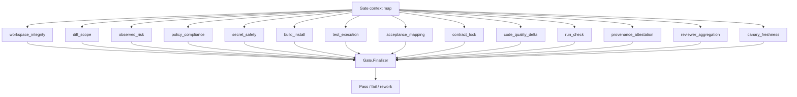

# Gate

The gate is Conveyor's deterministic verifier. It composes a set of stage
results into a single pass/fail verdict and is the human's stand-in for deciding
whether a run attempt's output is accepted. The gate lives in
`lib/conveyor/gate.ex` with stages in `lib/conveyor/gate/stages/` and
persistence in `lib/conveyor/gate/finalizer.ex`. Every stage implements the
`Conveyor.Gate.Stage` behaviour and receives a plain context map, so the same
gate path can run against real implementer output or an injected canary fixture.

## Core types

The gate defines three structs in `lib/conveyor/gate.ex`:

- **`StageSpec`** — declares a stage's key, module, whether it is required, and
  opts. Stages can be passed as modules or maps and are normalized internally.
- **`StageResult`** — the result of one stage: key, status (`:passed`,
  `:failed`, `:skipped`), required flag, findings, evidence refs, input digests,
  output digest, and duration in milliseconds.
- **`Result`** — the composite gate result: status, passed flag, all stage
  results, flattened findings, and gate result attributes.

## Stage composition

`Gate.run!/3` takes a context map, a list of stage specs, and opts. It
normalizes each spec, runs every stage, and computes the verdict: the gate
passes only when every required stage passes. Optional stages (where
`required?: false`) never block the gate. Stage exceptions are rescued and
converted to failed `StageResult` structs with a `gate_stage_exception` finding,
so a stage crash never crashes the gate.

The `gate_result_attrs` function assembles the persisted `GateResult`
attributes: run attempt id, passed flag, per-stage result maps, gate version,
gate code SHA-256, policy SHA-256, contract lock SHA-256, and canary suite
version. These digests are required and raise if missing.

## Gate stage composition

## Gate stages

Each stage in `lib/conveyor/gate/stages/` implements `Conveyor.Gate.Stage` and
returns a `StageResult`:

- **`workspace_integrity`** (stage 1) — verifies base/workspace integrity before
  semantic checks. Checks that the PatchSet base commit matches the
  RunSpec/RunAttempt base commit, that the patch applies cleanly, that locked
  paths are not touched, and that the head tree SHA-256 was recorded.
- **`diff_scope`** (stage 2) — checks the PatchSet against the slice DiffPolicy:
  allowed path globs, protected path globs, max files/lines changed, and
  category restrictions (dependency, migration, generated, public API changes).
- **`observed_risk`** (stage 3) — classifies observed patch risk and applies
  escalation policy. Matches risk rules against patch facts (dependency changes,
  migrations, generated files, public API, locked paths), computes observed vs
  planned risk, and enforces escalation policy (fail closed, allow with warning,
  or require human approval).
- **`policy_compliance`** (stage 4) — verifies command-policy records and
  protected policy files. Detects changes to policy definition paths and
  blocked/denied tool invocations.
- **`secret_safety`** (stage 5) — verifies that gate-visible artifacts contain
  no unredacted secrets. Scans artifact contents through
  `Conveyor.Security.Redactor` and normalizes findings by redaction policy.
- **`build_install`** (stage 6) — verifies the target environment can build,
  install, or import the app. Runs build commands through an injectable runner
  and requires all to exit zero.
- **`test_execution`** (stage 7) — reruns baseline and locked acceptance suites.
  Uses `VerificationRerunner` to run suites in a clean container, requires both
  `baseline_regression` and `acceptance_locked` suites, validates acceptance
  calibration (red calibration on base), and detects unapproved flake
  quarantines.
- **`acceptance_mapping`** (stage 8) — verifies every acceptance criterion has
  passing evidence. Uses `AcceptanceMapper` to map criteria to verification
  results and flags missing, skipped, failed, or unknown evidence.
- **`contract_lock`** (stage 9) — verifies the run still matches the approved
  contract lock. Checks brief, test pack, run spec, acceptance criteria,
  required tests, and verification command digests against the lock. Checks that
  protected paths are not changed and that locked test packs are mounted
  read-only.
- **`code_quality_delta`** (stage 10) — evaluates code-quality delta thresholds.
  Quality signals are advisory unless project policy selects the adapter as
  gate-blocking and the adapter declares a deterministic contract. Enforces new
  high-risk findings thresholds.
- **`run_check`** (stage 11) — validates run artifact schemas, digests, and
  consistency. Checks required artifact paths, supported schema versions,
  artifact content hash matches, RunBundle manifest and bundle root digests, and
  scans for prompt-injection markers in artifact output.
- **`provenance_attestation`** (stage 12) — generates and validates a local
  in-toto/SLSA-shaped provenance artifact. Requires subjects with SHA-256
  digests, materials (source, container image, test pack), and invocation
  digests (run spec, policy, prompt). Persists the statement as a
  content-addressed blob.
- **`reviewer_aggregation`** (stage 13) — aggregates required independent
  reviews and reviewer health. Checks that each required review kind is present,
  schema-valid, evaluated against the gate dossier digest, meets the decision
  threshold, and has fresh reviewer health calibration.
- **`canary_freshness`** (stage 14) — requires a fresh green gate-canary health
  record. Computes a freshness key from gate code, policy, test pack, container
  image, code quality profile, and canary suite version digests, then checks for
  a matching, passing, non-stale health record with no false negatives.

## Finalizer

`lib/conveyor/gate/finalizer.ex` persists gate results and applies post-gate
Slice/RunAttempt transitions. On pass, it transitions the run attempt to `gated`
with outcome `accepted` and transitions the slice through `SliceLifecycle`. On
fail, it classifies the failure:

- **Critical failure** (critical severity or stale/false-negative canary) — run
  attempt fails, slice fails, and a `stop_the_line` incident is created blocking
  further sample-project runs.
- **Policy violation** (policy file change, blocked invocation, unredacted
  secret, locked/protected path change) — run attempt fails with outcome
  `policy_blocked`, slice transitions to `policy_blocked`.
- **Gate failed** (default) — run attempt requests rework with outcome
  `needs_rework`, slice transitions to `needs_rework`.

## Key source files

| File                                                 | Purpose                                                                                |
| ---------------------------------------------------- | -------------------------------------------------------------------------------------- |
| `lib/conveyor/gate.ex`                               | Gate stage composition, `StageSpec`/`StageResult`/`Result` structs, `Stage` behaviour. |
| `lib/conveyor/gate/finalizer.ex`                     | Persists gate results and applies post-gate Slice/RunAttempt transitions.              |
| `lib/conveyor/gate/stages/workspace_integrity.ex`    | Stage 1: base/workspace integrity before semantic checks.                              |
| `lib/conveyor/gate/stages/diff_scope.ex`             | Stage 2: PatchSet scope against the slice DiffPolicy.                                  |
| `lib/conveyor/gate/stages/observed_risk.ex`          | Stage 3: observed patch risk classification and escalation.                            |
| `lib/conveyor/gate/stages/policy_compliance.ex`      | Stage 4: command-policy records and protected policy files.                            |
| `lib/conveyor/gate/stages/secret_safety.ex`          | Stage 5: unredacted secret detection in gate-visible artifacts.                        |
| `lib/conveyor/gate/stages/build_install.ex`          | Stage 6: build/install/import verification.                                            |
| `lib/conveyor/gate/stages/test_execution.ex`         | Stage 7: baseline and locked acceptance suite reruns.                                  |
| `lib/conveyor/gate/stages/acceptance_mapping.ex`     | Stage 8: acceptance criterion to evidence mapping.                                     |
| `lib/conveyor/gate/stages/contract_lock.ex`          | Stage 9: contract lock digest and protected path verification.                         |
| `lib/conveyor/gate/stages/code_quality_delta.ex`     | Stage 10: code-quality delta threshold evaluation.                                     |
| `lib/conveyor/gate/stages/run_check.ex`              | Stage 11: run artifact schema, digest, and consistency validation.                     |
| `lib/conveyor/gate/stages/provenance_attestation.ex` | Stage 12: in-toto/SLSA provenance generation and validation.                           |
| `lib/conveyor/gate/stages/reviewer_aggregation.ex`   | Stage 13: required review aggregation and reviewer health.                             |
| `lib/conveyor/gate/stages/canary_freshness.ex`       | Stage 14: fresh green gate-canary health record requirement.                           |

## Related pages

- [Architecture](../overview/architecture.md) — system topology and station
  pipeline
- [Evidence recording](evidence-recording.md) — how evidence is captured and
  rerun
- [Policy engine](policy-engine.md) — command policy enforcement
- [Contract management](../features/contract-management.md) — contract lock
  lifecycle
- [Run attempt](../primitives/run-attempt.md) — run attempt lifecycle
- [Evidence](../primitives/evidence.md) — evidence resource model
