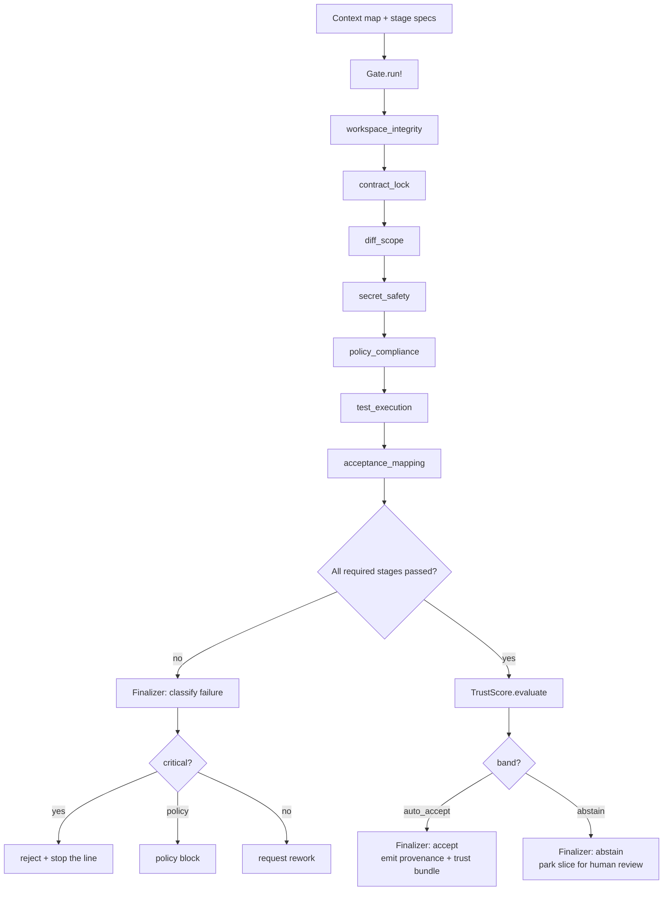

# Trust gate

The trust gate is the staged verification boundary that decides whether a slice's
work may merge without a human. It runs progressively stronger deterministic
checks over a run attempt's recorded evidence, fuses them into a calibrated
trust score, and can abstain (withhold judgment) when confidence is low. A passed
gate is necessary but not sufficient for auto-accept; the calibration layer on
top decides whether the pass is trustworthy enough to act on.

## Directory layout

The gate lives under `lib/conveyor/gate/` with the composition root in
`lib/conveyor/gate.ex`:

```
lib/conveyor/
├── gate.ex                         # Stage composition root: StageSpec, StageResult, Result
├── gate/
│   ├── finalizer.ex                # Persists GateResult, applies state transitions
│   ├── trust_score.ex              # ADR-23 calibrated fusion of trust signals
│   ├── trust_evidence.ex           # Assembles trust signals from run output
│   ├── integrity_evidence.ex       # Produces the IntegritySentinel verdict
│   ├── midflight_check.ex          # ADR-24 advisory in-loop check (read-only)
│   └── stages/
│       ├── workspace_integrity.ex  # 1: base/workspace integrity
│       ├── contract_lock.ex        # 9: run matches approved ContractLock
│       ├── diff_scope.ex           # 2: PatchSet scope vs DiffPolicy
│       ├── secret_safety.ex        # 5: no unredacted secrets in artifacts
│       ├── policy_compliance.ex    # 4: command-policy + protected policy files
│       ├── test_execution.ex       # 7: reruns baseline + locked acceptance suites
│       ├── acceptance_mapping.ex   # 8: every acceptance criterion has passing evidence
│       ├── observed_risk.ex        # 3: observed patch risk + escalation policy
│       ├── code_quality_delta.ex   # 10: code-quality delta thresholds
│       ├── run_check.ex            # 11: run artifact schemas/digests/consistency
│       ├── provenance_attestation.ex # 12: in-toto/SLSA-shaped provenance artifact
│       ├── reviewer_aggregation.ex # 13: required reviews + reviewer health
│       ├── build_install.ex        # 6: target environment builds/installs
│       └── canary_freshness.ex     # 14: fresh green gate-canary health record
└── jobs/
    └── run_gate.ex                 # Oban worker + gate-only facade
```

## Key abstractions

| Abstraction | Location | Role |
| --- | --- | --- |
| `Conveyor.Gate` | `lib/conveyor/gate.ex` | Composition root. Runs a list of stage specs against a context map and folds results into a `Result`. |
| `Conveyor.Gate.StageSpec` | `lib/conveyor/gate.ex` | A stage declaration: `key`, `module`, `required?`, `opts`. |
| `Conveyor.Gate.StageResult` | `lib/conveyor/gate.ex` | One stage's outcome: `:passed` / `:failed` / `:skipped`, findings, evidence refs, input/output digests, duration. |
| `Conveyor.Gate.Result` | `lib/conveyor/gate.ex` | The folded gate outcome: `status`, `passed?`, all `StageResult`s, findings, and the attrs to persist as a `GateResult`. |
| `Conveyor.Gate.Stage` | `lib/conveyor/gate.ex` | The behaviour every stage implements: `run(map(), keyword())`. |
| `Conveyor.Gate.Finalizer` | `lib/conveyor/gate/finalizer.ex` | Persists the `GateResult` and applies the post-gate slice and run-attempt state transitions (accept, abstain, reject, rework). |
| `Conveyor.Gate.TrustScore` | `lib/conveyor/gate/trust_score.ex` | Pure fusion of trust signals into a calibrated score and band (`:auto_accept` / `:abstain`). ADR-23. |
| `Conveyor.Gate.TrustEvidence` | `lib/conveyor/gate/trust_evidence.ex` | Assembles the `TrustScore` evidence map from a slice run's output under a fail-closed taxonomy. |
| `Conveyor.Gate.IntegrityEvidence` | `lib/conveyor/gate/integrity_evidence.ex` | Thin wrapper over `IntegritySentinel` that produces the `integrity_verdict` the trust score reads. |
| `Conveyor.Gate.MidflightCheck` | `lib/conveyor/gate/midflight_check.ex` | ADR-24 advisory in-loop check. Read-only, allowlisted to the cheap static stages, never persists or transitions. |
| Stage modules | `lib/conveyor/gate/stages/*.ex` | Each implements `Conveyor.Gate.Stage` and returns a `StageResult` from a context map. |

## How it works

The gate is a deterministic pipeline. The caller assembles a plain context map
(patch set, run spec, contract lock, evidence, verification results) plus the
list of stage specs to run. `Conveyor.Gate.run!/3` normalizes the specs, runs
each stage in sequence, and folds the results: the gate passes only if every
required stage passed. The `Result` carries the digest inputs needed to persist
a `GateResult` (gate code, policy, contract lock, canary suite version).

`Conveyor.Gate.Finalizer.finalize!/3` is the authoritative close. It persists
the `GateResult`, computes the calibrated `TrustScore` (only when the conductor
supplied `:trust_evidence`), then branches on the outcome: a passed gate that
the trust score is confident about accepts; a passed gate the score does not
trust abstains (parks the slice); a failed gate is classified into reject,
policy block, or rework. Pass outputs (provenance back edges, trust bundle) are
emitted only on a confident accept.



## Gate stages

The production path wires seven stages, declared as
`@default_gate_stages` in `lib/conveyor/planning/serial_driver.ex` and passed
through `Keyword.get(opts, :gate_stages, @default_gate_stages)`:

1. `workspace_integrity` (`lib/conveyor/gate/stages/workspace_integrity.ex`) —
   verifies the patch set's `base_commit` matches the run spec/attempt, applies
   cleanly, does not touch locked paths, and has a recorded head tree digest.
2. `contract_lock` (`lib/conveyor/gate/stages/contract_lock.ex`) — verifies the
   run still matches the approved [Contract lock](../primitives/contract-lock.md):
   brief, acceptance criteria, required tests, verification commands, test pack,
   and policy digests, plus protected-path and mount-mode checks.
3. `diff_scope` (`lib/conveyor/gate/stages/diff_scope.ex`) — checks the patch
   set against the slice `DiffPolicy`: allowed/protected globs, file and line
   limits, and category gates (dependencies, migrations, generated files,
   public API).
4. `secret_safety` (`lib/conveyor/gate/stages/secret_safety.ex`) — scans
   gate-visible artifacts and contents for unredacted secrets via
   `Conveyor.Security.Redactor`.
5. `policy_compliance` (`lib/conveyor/gate/stages/policy_compliance.ex`) — flags
   changes to policy files and blocked/denied tool invocations.
6. `test_execution` (`lib/conveyor/gate/stages/test_execution.ex`) — reruns the
   baseline regression and locked acceptance suites (via
   `Conveyor.Evidence.VerificationRerunner`), requires both, fails on empty
   acceptance suites and unapproved flake quarantines. Calibration status is not
   a stage pass/fail; it routes to the trust score.
7. `acceptance_mapping` (`lib/conveyor/gate/stages/acceptance_mapping.ex`) —
   verifies every acceptance criterion has passing [Evidence](../primitives/evidence.md)
   via `Conveyor.Evidence.AcceptanceMapper`.

The remaining stage modules exist but are unwired on the production path until
their producers exist: `observed_risk` (3), `build_install` (6),
`code_quality_delta` (10), `run_check` (11), `provenance_attestation` (12),
`reviewer_aggregation` (13), and `canary_freshness` (14). They are exercised by
the eval surface (for example `lib/conveyor/eval/golden_thread.ex` and
`lib/conveyor/eval/mutant_gauntlet.ex` run `test_execution` in isolation) and
remain available for callers that assemble a fuller stage list.

A stage fails the gate when it is required and returns `:failed` (or raises,
which `run_stage/2` traps into a blocking `gate_stage_exception` finding).
`required?: false` stages never fail the gate regardless of status.

## Trust scoring

ADR-23 adds a calibration layer on top of a passed gate.
`Conveyor.Gate.TrustScore.evaluate/2` is a pure fusion of signals Conveyor
already computes, with no I/O, clock, or RNG, and no agent input. It produces a
weighted `score` in `[0.0, 1.0]` and a `band`:

| Component | Weight | Source | Passing token |
| --- | --- | --- | --- |
| integrity | 0.30 | `IntegritySentinel` verdict | `"trustworthy"` |
| calibration | 0.20 | `TestPackCalibration` status | `:valid` |
| baseline | 0.20 | baseline health status | `:green` |
| replay | 0.15 | replay divergence | `:none` |
| corpus | 0.15 | Genome historical pass rate | `1.0` |

The default weights sum to 1.0; integrity carries the most because the
anti-vacuity oracle is the strongest single trust signal. Weights and the
`auto_accept` threshold (default `0.9`) are content-addressed in the
`policy_digest` so any policy change is auditable.

Auto-accept requires both: (a) no untrustworthy signal — integrity
`"trustworthy"`, calibration `:valid`, baseline `:green`, replay non-divergent
(`:none` or `:baseline_absent`) — and (b) the weighted score clearing the
`auto_accept` threshold. Anything less abstains. The corpus pass rate is a
positive boost only; it is excluded from the hard requirements so a cold start
(no corpus) cannot block the known-good reference (the `loop_integrity`
invariant).

`Conveyor.Gate.TrustEvidence` assembles the evidence map from a slice run's
output under a fail-closed taxonomy: an expected-but-absent always-assessable
signal routes to its abstaining token (`:not_assessed` / `:unknown`), not its
passing token. A signal a producer declares not-assessable (via
`trust_not_assessable`) routes to its neutral middle token. Replay with no
committed baseline routes to `:baseline_absent`, which `TrustScore` treats as
non-blocking by renormalizing replay's weight away (OD19) so a cold-start slice
is not penalized. `Conveyor.Gate.IntegrityEvidence` is the thin wrapper that
runs the `IntegritySentinel` probes and returns the verdict string
`TrustEvidence` reads.

The two bands:

- `:auto_accept` — confident enough to merge unattended; the finalizer accepts
  and emits provenance back edges plus a trust bundle.
- `:abstain` — passed the stages but not calibrated-confident; the finalizer
  parks the [Slice](../primitives/slice.md) for human review. Abstain is
  fail-closed; it never merges, and no verified-pass provenance is minted.

## The ternary verdict (ADR-23)

The gate produces a ternary verdict rather than a binary pass/fail. The
finalizer maps the gate result and trust band onto slice and run-attempt
transitions:

- **Accept** — gate passed and trust band is `:auto_accept`. The run attempt
  transitions to `outcome: :accepted`, the slice advances through the gate
  transition, and provenance plus a trust bundle are emitted.
- **Reject** — gate failed with a critical finding (`severity: "critical"` or a
  `stale_canary` / `canary_false_negative` category). The run attempt fails,
  the slice fails, and a stop-the-line `Incident` is opened.
- **Abstain** — gate passed but trust band is `:abstain`. The run attempt
  records `outcome: :abstained` and the slice is parked for human review. No
  provenance is minted.

A non-critical gate failure is further classified into either a **policy block**
(policy file change, blocked invocation, unredacted secret, locked/protected
path touched) or **rework** (everything else), which requests rework rather
than rejecting outright. The full decision record is captured in
[ADR-23](../../docs/adrs/adr-23-ternary-gate-verdict-calibrated-abstention.md).

## Integration points

- **Finalizer** (`lib/conveyor/gate/finalizer.ex`) — owns the authoritative
  close. It persists the `GateResult`, computes the trust score, and drives the
  slice and run-attempt state machines via `SliceLifecycle` and
  `RunAttemptLifecycle`. Called from the [Station pipeline](../features/station-pipeline.md)
  close (for example `lib/conveyor/attempt_loop.ex`) and the serial driver in
  `lib/conveyor/planning/serial_driver.ex`.
- **TrustScore** (`lib/conveyor/gate/trust_score.ex`) — the calibration layer.
  The finalizer only invokes it when the conductor supplied `:trust_evidence`;
  without it the legacy pass path is unchanged.
- **GateResult resource** (`lib/conveyor/factory/gate_result.ex`) — the
  persisted verdict. Stores `passed`, the per-stage results, the digest inputs
  (gate code, policy, contract lock, canary suite), and the `trust_score` map
  (score, band, components, thresholds, policy_digest) so abstentions are
  durable and queryable.
- **Contract lock** — `contract_lock` stage and the persisted
  `contract_lock_sha256` tie a gate result to the exact approved contract.
- **MidflightCheck** (`lib/conveyor/gate/midflight_check.ex`) — ADR-24 advisory
  channel. Runs only the cheap static stages (`diff_scope`, `contract_lock`,
  `secret_safety`, `acceptance_mapping`) against an allowlist, returns a
  read-only report, and never persists or transitions. The authoritative gate
  still runs in full at finalization.

## Entry points for modification

- **Add or rewire a stage** — implement `Conveyor.Gate.Stage` in
  `lib/conveyor/gate/stages/`, then add it to the stage list passed to
  `Gate.run!/3`. The production list is `@default_gate_stages` in
  `lib/conveyor/planning/serial_driver.ex`.
- **Change trust calibration** — weights, the `auto_accept` threshold, and the
  fail-closed taxonomy live in `lib/conveyor/gate/trust_score.ex` and
  `lib/conveyor/gate/trust_evidence.ex`. Both feed the content-addressed
  `policy_digest`.
- **Change the post-gate transitions** — `lib/conveyor/gate/finalizer.ex` is
  the single place that classifies failures, decides accept/abstain/reject, and
  drives the lifecycle transitions.
- **Change the advisory in-loop check** — `lib/conveyor/gate/midflight_check.ex`
  and its `@default_stages` allowlist.
- **Change the persisted verdict shape** — `lib/conveyor/factory/gate_result.ex`
  and the `gate_result_attrs/3` builder in `lib/conveyor/gate.ex`.

## Key source files

| File | Role |
| --- | --- |
| `lib/conveyor/gate.ex` | Stage composition root; `StageSpec`, `StageResult`, `Result`, `Stage` behaviour. |
| `lib/conveyor/gate/finalizer.ex` | Persists `GateResult`, applies accept/abstain/reject/rework transitions. |
| `lib/conveyor/gate/trust_score.ex` | ADR-23 calibrated fusion into `:auto_accept` / `:abstain`. |
| `lib/conveyor/gate/trust_evidence.ex` | Fail-closed assembly of the trust evidence map. |
| `lib/conveyor/gate/integrity_evidence.ex` | `IntegritySentinel` verdict producer. |
| `lib/conveyor/gate/midflight_check.ex` | ADR-24 advisory in-loop check. |
| `lib/conveyor/gate/stages/*.ex` | The 14 stage modules. |
| `lib/conveyor/factory/gate_result.ex` | Ash resource for the persisted gate verdict. |
| `lib/conveyor/jobs/run_gate.ex` | Oban worker and gate-only facade. |
| `lib/conveyor/planning/serial_driver.ex` | Production `@default_gate_stages` list. |
| `docs/adrs/adr-23-ternary-gate-verdict-calibrated-abstention.md` | The ternary verdict decision record. |

See also: [Planning compiler](planning-compiler.md), [Station pipeline](../features/station-pipeline.md),
[Slice](../primitives/slice.md), [Run attempt](../primitives/run-attempt.md),
[Evidence](../primitives/evidence.md), [Contract lock](../primitives/contract-lock.md).
