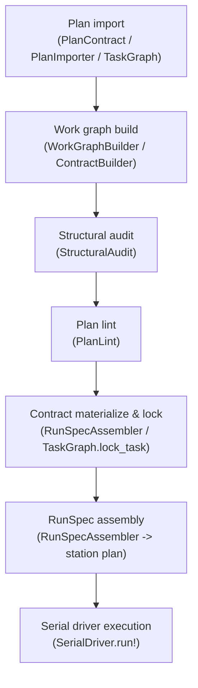

# Planning compiler

The planning compiler is the subsystem that lowers human-authored plans into executable, contract-bearing work graphs and then drives them through a width-1 serial execution loop. It is the bridge between intent (a `conveyor.plan@1` contract or a DB-native task graph) and execution (a sequence of gated, evidence-backed slice attempts). The compiler lives in `lib/conveyor/planning/`, with related contract-loading code in `lib/conveyor/plan_contract.ex` and DB-native graph operations in `lib/conveyor/task_graph.ex`.

## Directory layout

```text
lib/conveyor/
├── plan_contract.ex              # loads & validates conveyor.plan@1 contracts
├── task_graph.ex                 # DB-native task graph authoring & querying
└── planning/
    ├── author.ex                 # mix conveyor.author front door (ADR-27)
    ├── contract_builder.ex       # compiles rows -> Plan.normalized_contract
    ├── plan_foundry.ex           # in-factory plan drafting spine (ADR-27)
    ├── plan_importer.ex          # one-time YAML -> DB rows migration (U7)
    ├── plan_lint.ex              # deterministic, non-authorizing plan lint
    ├── plan_runner.ex            # runs a persisted plan via SerialDriver
    ├── pilot_execution.ex        # summarizes serial execution metrics
    ├── pilot_selection.ex        # freezes pilot slice selection
    ├── run_reconciler.ex         # detects interrupted runs, routes resume/park
    ├── run_reconciliation.ex     # exactly-once workspace reconciliation (U5)
    ├── run_reconstruction.ex     # rebuilds loop state from ledger (U3)
    ├── run_spec_assembler.ex     # builds immutable RunSpec for one attempt
    ├── serial_driver.ex          # width-1 execution driver (1177 lines)
    ├── structural_audit.ex       # pure front-end contract audit
    ├── work_graph_builder.ex     # compiles plan rows -> work_graph@2 map
    ├── work_graph_lowering.ex    # lowers decomposition -> work_graph@2 IR
    └── work_graph_to_station_plan.ex  # lowers one slice -> station plan
```

## Key abstractions

| Abstraction | Module | Role |
| ----------- | ------ | ---- |
| `serial_driver` | `lib/conveyor/planning/serial_driver.ex` | Width-1 execution loop. Topologically orders selected slices, runs each through assembly, agent execution, gate, and finalization, and carries on past parked slices via skip-and-continue. Owns workspace reset, accept-commit, wall-clock reaping, and the durable run ledger. |
| `run_spec_assembler` | `lib/conveyor/planning/run_spec_assembler.ex` | Builds the immutable `RunSpec` for one slice attempt. Materializes and locks the `AgentBrief`, `TestPack`, and `ContractLock` from the slice's contract, lowers the work graph to a station plan, and augments it with runtime workspace paths. |
| `structural_audit` | `lib/conveyor/planning/structural_audit.ex` | Pure, deterministic audit of a normalized plan contract. Detects missing acceptance, orphan criteria, undefined refs, contradictions, and source-map mismatches. Intentionally pure so it can run before any persistence. |
| `plan_lint` | `lib/conveyor/planning/plan_lint.ex` | Non-authorizing static lint that wraps `StructuralAudit` and adds hard-constraint, ambiguous-interface, human-decision, weak-oracle, and context-budget findings. Emits a `conveyor.plan_lint@1` result and renders as human, JSON, or SARIF. |
| `work_graph_builder` | `lib/conveyor/planning/work_graph_builder.ex` | Compiles a plan's persisted rows (`Slice`, `TaskDependency`) into the `conveyor.work_graph@2` map the serial driver consumes. A deterministic projection of the rows, never hand-edited. |
| `work_graph_lowering` | `lib/conveyor/planning/work_graph_lowering.ex` | Lowers a selected decomposition candidate to `conveyor.work_graph@2` IR. All-or-nothing: invalid shape or a stale `PlanningSpec` digest returns diagnostics and no graph. |
| `plan_importer` | `lib/conveyor/planning/plan_importer.ex` | One-time migration that reads a legacy `conveyor.plan@1` YAML contract and materializes it into DB-native rows (Project, Plan, Epic, Slice, TaskDependency). Dependencies are imported as declared, not fabricated. |
| `plan_foundry` | `lib/conveyor/planning/plan_foundry.ex` | ADR-27 in-factory plan authoring spine. Drives a drafter, runs `StructuralAudit`, and reduces blocking findings to operator questions. The deterministic `draft/2` exists; the critic and handoff composition are not yet wired. |
| `run_reconciler` | `lib/conveyor/planning/run_reconciler.ex` | Detects interrupted runs from the ledger and routes each to resume or park. Bounded by a resume-attempt cap so a crashing run does not resume forever. Runs as a maintenance job at application start. |
| `run_reconstruction` | `lib/conveyor/planning/run_reconstruction.ex` | Folds a run's committed `run.slice_outcome` ledger events into a `ResumeState`. Passed slices are the durable boundary and are never re-run. The resume point is the first slice with no committed outcome. |
| `contract_builder` | `lib/conveyor/planning/contract_builder.ex` | Compiles DB-native task-graph rows into the `conveyor.plan@1` `Plan.normalized_contract` map. Sibling of `WorkGraphBuilder`: rows are the source of truth, the map is a deterministic artifact. |
| `task_graph` | `lib/conveyor/task_graph.ex` | The Ash-backed core for authoring and querying the DB-native task graph. Task CRUD, dependency edges with cycle rejection, readiness queries, acceptance authoring, `lock_task`, and `approve_task`. |
| `author` | `lib/conveyor/planning/author.ex` | ADR-27 (M5) core of `mix conveyor.author`. Turns a paragraph of intent into a drafted plan via `PlanFoundry.draft/2` and optionally writes it to disk. |
| `plan_contract` | `lib/conveyor/plan_contract.ex` | Loads and validates normalized `conveyor.plan@1` contracts from a sidecar YAML/JSON file or a fenced markdown block. Schema-validates against `docs/schemas/conveyor.plan@1.json` and checks work dependencies for dangling refs, self-loops, and cycles. |

## How it works

A plan enters the compiler as either a `conveyor.plan@1` YAML/JSON contract (loaded by `PlanContract`, migrated to rows by `PlanImporter`) or a DB-native task graph authored through the `conveyor.task.*` CLI (backed by `TaskGraph`). Once the graph is in rows, the compiler produces two deterministic projections: a `conveyor.work_graph@2` map (via `WorkGraphBuilder`) and a `conveyor.plan@1` `normalized_contract` map (via `ContractBuilder`). The structural audit and plan lint check the contract for defects before any agent runs. At run time, `PlanRunner` enforces the approval gate, builds the work graph, and hands it to the serial driver, which topologically orders the slices and executes each through a full slice lifecycle: run-spec assembly, agent execution, evidence, gate, and finalization.



### Entry paths

There are two ways a plan reaches the compiler:

1. **Legacy YAML import.** `PlanImporter.import!/2` calls `PlanContract.load/1` to read and validate a `conveyor.plan@1` file, then creates `Project`, `Plan`, `Epic`, `Slice`, and `TaskDependency` rows. The plan carries the YAML's `normalized_contract` so the run path materializes acceptance from it.
2. **DB-native authoring.** The `conveyor.task.*` CLI (backed by `TaskGraph`) creates tasks and dependencies directly in the database. `ContractBuilder.compile_contract/1` compiles the rows into `Plan.normalized_contract`, and `TaskGraph.lock_task/1` materializes and locks each slice's contract and asserts gate readiness.

A third path, in-factory authoring (ADR-27), is partially wired. `Author.author/2` and `PlanFoundry.draft/2` turn a paragraph of intent into a structurally audited draft via an injectable drafter. The critic and handoff-ready composition are deferred.

### Validation before execution

Before any agent runs, two pure passes check the contract:

- `StructuralAudit.audit/1` is a pure function that returns blocking findings for missing requirement acceptance, orphan criteria, undefined refs, contradictions (requirements, enums, statuses, interfaces, hard constraints), source-map mismatches, and claim-subject mismatches. Each finding carries `next_actions` that classify the fix as `:edit_plan` or `:human_decision`.
- `PlanLint.lint/1` wraps the structural audit and adds its own findings: missing hard constraints, ambiguous interfaces, unresolved human decisions, weak oracle paths, and impossible context budgets. It applies typed suppressions (`human_decision`, `policy_waiver`) and flags untyped ones. The lint is non-authorizing: it sets `authority_effect: :none` and never creates a contract lock, approval, ready slice, or implementer launch.

### From rows to executable map

`WorkGraphBuilder.build/1` reads a plan's `Slice` and `TaskDependency` rows and emits a `conveyor.work_graph@2` map with `slices` and `work_dependencies` resolved to stable keys. It does not fabricate a linear chain: absent edges yield an empty dependency list, meaning the tasks are genuinely independent. `ContractBuilder.build/1` compiles the same rows into a `conveyor.plan@1` `normalized_contract` and persists it with a `contract_sha256` on the `Plan`. Both are deterministic projections of the rows, regenerated at lock time, and never hand-edited.

## The serial driver's width-1 execution loop

`SerialDriver.run!/2` is the width-1 execution engine. It takes a work graph and a list of selected slice ids, topologically orders the slices over `execution_hard` edges, and reduces through them one at a time. Each slice goes through a full lifecycle: interrogation preflight, run-spec assembly, optional workspace reset, run-attempt creation, agent execution, gate evaluation, and finalization. An accepted slice's changes are committed to the shared workspace (`git add -A; git commit -m "conveyor: accept <slice>"`), advancing HEAD so the next slice builds on the accepted base.

### Skip-and-continue

The run never halts early on a parked or failed slice. When a slice does not pass, it is added to a `blocked` set, and any slice whose `execution_hard` predecessors are blocked is skipped with a `skipped_upstream_parked` gate result. Independent slices that do not depend on the parked slice still run. A one-hop predecessor check is sufficient because topological order visits every `execution_hard` dependency before its dependents, so a transitively blocked slice always has a direct predecessor already in the blocked set. The final result is `:passed` when every slice passed, or `:partial` when at least one was parked or skipped but the run advanced.

### Workspace isolation

The driver resets the shared workspace tree to HEAD before a slice runs, but only after a prior slice's agent has actually run (`agent_ran?` gate). The first agent run is never preceded by a reset, so a user's pre-run working tree is never destroyed. A reset discards any uncommitted leftovers a prior parked slice left behind, so an independent slice never builds on a half-applied tree. The reset is `git reset --hard HEAD` followed by `git clean -fdq` (preserving ignored paths).

### Rework

Rework is on by default. A non-accepted slice reworks within a bounded budget via `AttemptLoop` instead of parking immediately. The driver injects its own `run_slice!` and `run_gate!` so the full gate context and wired stages are preserved across rework attempts. A rework-exhausted slice whose contract is structurally broken parks with a human-review amendment proposal attached (ADR-26), not a blind failure. Pass `rework: false` to force the legacy single-attempt-then-park path.

### Wall-clock reaper

A monotonic run-start anchors two wall-clock budgets: a per-slice budget (default 1 hour) and a whole-run budget (default 8 hours). A slice that exceeds its budget is killed via `Task.yield || Task.shutdown(:brutal_kill)` and reported as `parked` with `reaped_wall_clock`, so skip-and-continue blocks its dependents and the run advances instead of hanging. A run-budget reap makes the whole run terminal as `run.reaped`. Both budgets are configurable via opts or app config and can be disabled with an explicit `nil`.

### Durable run ledger and resume

Each slice outcome is committed to the append-only ledger after its accept-commit (commit-first ordering). A `run.started` event records the slice order and work graph, and a `run.finished` or `run.reaped` event marks the terminal state. If the process crashes, `RunReconciler` detects the interrupted run (a `run.started` with no terminal) and routes it to resume, bounded by a resume-attempt cap. `RunReconstruction.reconstruct/3` folds the committed `run.slice_outcome` events back into a `ResumeState`: passed slices are reused verbatim and never re-executed, and the first slice with no committed outcome is re-run from a clean base. `RunReconciliation.reconcile_in_flight/4` checks the live workspace before re-running the in-flight slice: if HEAD already holds that slice's accept-commit, the side effect already landed and the slice is recorded as passed rather than re-executed, preventing a second accept-commit.

## Integration points

The planning compiler connects to the rest of Conveyor at several seams:

- **Gate.** The serial driver calls `Conveyor.Jobs.RunGate.run_gate_only!/3` with seven wired stages (workspace integrity, contract lock, diff scope, secret safety, policy compliance, test execution, acceptance mapping) and the gate code, policy, and contract-lock digests from the `RunSpec`. The driver then calls `Conveyor.Gate.Finalizer.finalize!/3` to persist the result and apply the run-attempt state transition. See [Gate](gate.md).
- **Agent runner.** Slice execution delegates to `Conveyor.RunSlice.run!/2`, which drives the station pipeline including the implementer station that calls the agent adapter (Codex, Claude, fake, reference). The adapter is injected through `RunSpec` opts. See [Agent runner](agent-runner.md).
- **Station pipeline.** `WorkGraphToStationPlan.lower/2` lowers a single-slice work graph into a `conveyor.station_plan@1` with six stations: context scout, baseline health, acceptance calibration, implementer, verify, and record evidence. `RunSpecAssembler` augments each station's input with runtime workspace paths and blob roots. See [Station pipeline](../features/station-pipeline.md).
- **Factory domain.** The compiler reads and writes through the `Conveyor.Factory` Ash domain: `Slice`, `Epic`, `Plan`, `Project`, `RunSpec`, `RunAttempt`, `AgentBrief`, `TestPack`, `ContractLock`, `DiffPolicy`, `Artifact`, `Evidence`, `PatchSet`, `LedgerEvent`, and `TaskDependency`. All persistence goes through Ash, not raw SQL.
- **Slice and run spec.** The compiler consumes and produces the foundational domain objects. See [Slice](../primitives/slice.md) and [Run spec](../primitives/run-spec.md).

## Entry points for modification

| Change | Where to start |
| ------ | -------------- |
| Add a new structural audit rule | `lib/conveyor/planning/structural_audit.ex` (add a finding function and register the rule key in `@rule_keys`) |
| Add a new plan lint rule | `lib/conveyor/planning/plan_lint.ex` (add a findings function to `canonical_findings/1`) |
| Change the station pipeline shape | `lib/conveyor/planning/work_graph_to_station_plan.ex` (`@stations` list) and `lib/conveyor/planning/run_spec_assembler.ex` (`augment_station_plan/6`) |
| Change contract materialization | `lib/conveyor/planning/run_spec_assembler.ex` (`materialize_contract!/4` and `contract_spec/4`) |
| Change the execution loop behavior | `lib/conveyor/planning/serial_driver.ex` (`execute_order/8` and `run_one!/5`) |
| Change skip-and-continue logic | `lib/conveyor/planning/serial_driver.ex` (`blocking_predecessors/3` and `execute_order/8`) |
| Add a new DB-native task graph verb | `lib/conveyor/task_graph.ex` |
| Change plan contract loading or schema | `lib/conveyor/plan_contract.ex` and `docs/schemas/conveyor.plan@1.json` |
| Change in-factory plan authoring | `lib/conveyor/planning/plan_foundry.ex` and `lib/conveyor/planning/author.ex` |
| Change resume or reconciliation | `lib/conveyor/planning/run_reconciler.ex`, `run_reconstruction.ex`, and `run_reconciliation.ex` |

## Key source files

| File | Lines | Role |
| ---- | ----- | ---- |
| `lib/conveyor/planning/serial_driver.ex` | 1177 | Width-1 execution driver, skip-and-continue, reaper, run ledger |
| `lib/conveyor/planning/run_spec_assembler.ex` | 840 | Builds immutable `RunSpec`, materializes and locks contracts |
| `lib/conveyor/planning/structural_audit.ex` | 532 | Pure structural audit of normalized contracts |
| `lib/conveyor/planning/plan_lint.ex` | 400 | Non-authorizing plan lint with SARIF output |
| `lib/conveyor/plan_contract.ex` | 387 | Loads and validates `conveyor.plan@1` contracts |
| `lib/conveyor/task_graph.ex` | 371 | DB-native task graph CRUD, dependencies, lock, approve |
| `lib/conveyor/planning/work_graph_lowering.ex` | 261 | Lowers decomposition candidates to work graph IR |
| `lib/conveyor/planning/plan_runner.ex` | 366 | Runs a persisted plan through the serial driver |
| `lib/conveyor/planning/plan_importer.ex` | 542 | One-time YAML to DB rows migration |
| `lib/conveyor/planning/work_graph_builder.ex` | 249 | Compiles plan rows to work graph map |
| `lib/conveyor/planning/run_reconciler.ex` | 553 | Detects interrupted runs, routes resume or park |
| `lib/conveyor/planning/contract_builder.ex` | 304 | Compiles rows to `normalized_contract` |
| `lib/conveyor/planning/work_graph_to_station_plan.ex` | 207 | Lowers one slice to a station plan |
| `lib/conveyor/planning/run_reconstruction.ex` | 308 | Rebuilds loop state from ledger stream |
| `lib/conveyor/planning/run_reconciliation.ex` | 260 | Exactly-once workspace side-effect reconciliation |
| `lib/conveyor/planning/plan_foundry.ex` | 421 | In-factory plan drafting spine (ADR-27) |
| `lib/conveyor/planning/author.ex` | 253 | `mix conveyor.author` front door (ADR-27) |
| `lib/conveyor/planning/pilot_selection.ex` | 397 | Freezes pilot slice selection |
| `lib/conveyor/planning/pilot_execution.ex` | 333 | Summarizes serial execution metrics |
